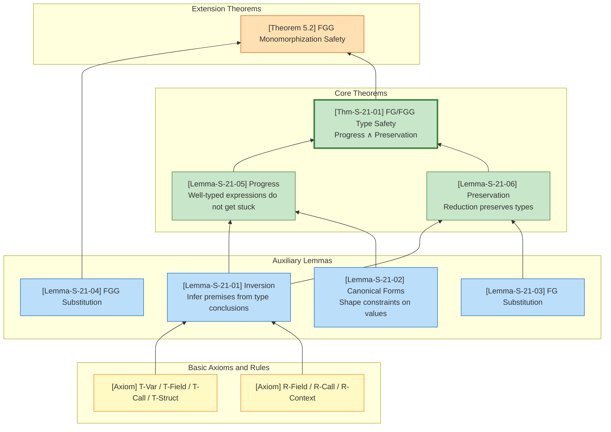
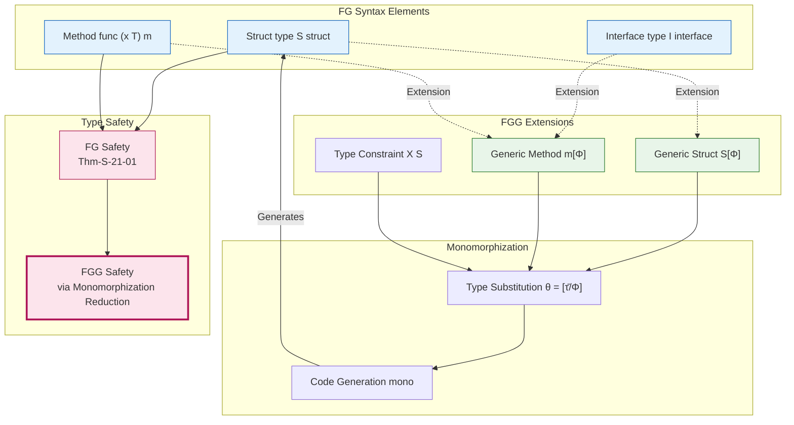

# FG/FGG Type Safety Proof

> Stage: Struct | Prerequisites: [Related Documents] | Formalization Level: L3

> **Chapter Position**: This chapter provides a formal proof of type safety for Featherweight Go (FG) and Featherweight Generic Go (FGG), establishing rigorous mathematical guarantees that well-typed programs cannot get stuck.
>
> **Prerequisites**: [`../02-properties/02.05-type-safety-derivation.md`](../02-properties/02.05-type-safety-derivation.md)

---

## Table of Contents

- [FG/FGG Type Safety Proof](#fgfgg-type-safety-proof)
  - [Table of Contents](#table-of-contents)
  - [1. Definitions](#1-definitions)
    - [1.1 FG Abstract Syntax](#11-fg-abstract-syntax)
    - [1.2 FGG Abstract Syntax](#12-fgg-abstract-syntax)
    - [1.3 Type Substitution](#13-type-substitution)
    - [1.4 Method Resolution](#14-method-resolution)
    - [1.5 FG/FGG Small-Step Operational Semantics (SOS)](#15-fgfgg-small-step-operational-semantics-sos)
  - [2. Properties](#2-properties)
    - [2.1 FG/FGG Typing Rules](#21-fgfgg-typing-rules)
  - [3. Relations](#3-relations)
    - [3.1 Relation between FG and FGG](#31-relation-between-fg-and-fgg)
    - [3.2 Monomorphization Semantic Relation](#32-monomorphization-semantic-relation)
  - [4. Argumentation](#4-argumentation)
    - [4.1 Inversion Lemma](#41-inversion-lemma)
    - [4.2 Canonical Forms Lemma](#42-canonical-forms-lemma)
    - [4.3 Substitution Lemma](#43-substitution-lemma)
  - [5. Proof / Engineering Argument](#5-proof--engineering-argument)
    - [5.1 Progress Theorem](#51-progress-theorem)
    - [5.2 Preservation Theorem](#52-preservation-theorem)
    - [5.3 FG/FGG Type Safety Theorem](#53-fgfgg-type-safety-theorem)
    - [5.4 FGG Monomorphization Correctness](#54-fgg-monomorphization-correctness)
  - [6. Examples](#6-examples)
    - [6.1 Positive Example: FG Type Derivation and Reduction](#61-positive-example-fg-type-derivation-and-reduction)
    - [6.2 Positive Example: FGG Generic Type Derivation](#62-positive-example-fgg-generic-type-derivation)
    - [6.3 Counterexample: Type Assertion Failure](#63-counterexample-type-assertion-failure)
    - [6.4 Counterexample: FGG Constraint Violation](#64-counterexample-fgg-constraint-violation)
  - [7. Visualization](#7-visualization)
    - [7.1 Type Safety Proof Structure Diagram](#71-type-safety-proof-structure-diagram)
    - [7.2 FG-FGG Syntax and Proof Dependency Diagram](#72-fg-fgg-syntax-and-proof-dependency-diagram)
  - [8. References](#8-references)
  - [9. Cross-references](#9-cross-references)
    - [9.1 Prerequisites](#91-prerequisites)
    - [9.2 Reference Mapping](#92-reference-mapping)

## 1. Definitions

### 1.1 FG Abstract Syntax

**Definition Def-S-21-01 (FG Abstract Syntax)**[^1][^2]:

FG is a minimal core subset of the Go language, stripped of pointers, slices, channels, goroutines, and other features, retaining only structs, interfaces, methods, field access, and type assertions:

$$
\begin{array}{llcl}
\text{Types} & t, u & ::= & t_S \mid t_I \\
\text{Expressions} & e & ::= & x \mid e.f \mid e.(t) \mid t_S\{f_1: e_1, ..., f_n: e_n\} \mid e.m(e_1, ..., e_n) \\
\text{Values} & v & ::= & t_S\{f_1: v_1, ..., f_n: v_n\} \\
\text{Declarations} & D & ::= & \text{type } t_S \text{ struct } \{f_1 \, u_1, ..., f_n \, u_n\} \\
  & & \mid & \text{type } t_I \text{ interface } \{m_1(M_1), ..., m_k(M_k)\} \\
  & & \mid & \text{func } (x \, t) \, m(x_1 \, u_1, ...) \, u_r \, \{ \text{return } e \}
\end{array}
$$

**Notation Conventions**:

- $t_S$ denotes struct types, defined by struct declarations
- $t_I$ denotes interface types, defined by interface declarations
- $x$ denotes variables, drawn from environment $\Gamma$
- $e.f$ denotes field selection, $e.(t)$ denotes type assertion
- $t_S\{\bar{f}: \bar{e}\}$ denotes struct literal construction
- $e.m(\bar{e})$ denotes method call

**Intuitive Explanation**: FG syntax is deliberately minimal, stripping away all advanced features of Go except structural subtyping. Struct type $t_S$ is the sole value constructor; interface type $t_I$ defines a set of method specifications; method calls achieve dynamic dispatch through structural subtyping matching.

---

### 1.2 FGG Abstract Syntax

**Definition Def-S-21-02 (FGG Generic Extension)**[^3]:

FGG introduces type parameters, type constraints, and monomorphization semantics on top of FG:

$$
\begin{array}{llcl}
\text{Type Formals} & \Phi & ::= & \epsilon \mid \Phi, X \, S \\
\text{Type Arguments} & \tau, \sigma & ::= & X \mid n[\bar{\tau}] \\
\text{Type Constraints} & S & ::= & \text{any} \mid \text{interface } \{M_1, ..., M_k\} \\
\text{Generic Structs} & & & \text{type } t_S[\Phi] \text{ struct } \{f_1 \, u_1, ...\} \\
\text{Generic Interfaces} & & & \text{type } t_I[\Phi] \text{ interface } \{...\} \\
\text{Generic Methods} & & & \text{func } (x \, t[\bar{\tau}]) \, m[\Phi]\left(\dots\right) \, u_r \, \{\text{return } e\}
\end{array}
$$

**Intuitive Explanation**: FGG's type parameters $\Phi$ allow structs, interfaces, and method declarations to be "parameterized" over types. Type constraints $S$ limit the set of types that can be instantiated. Monomorphization is a compile-time strategy that translates generic programs into non-generic FG programs, guaranteeing zero runtime overhead.

---

### 1.3 Type Substitution

**Definition Def-S-21-03 (Type Substitution)**:

Type substitution $\theta = [\bar{\tau}/\bar{X}]$ is a mapping from type variables to concrete types:

$$
\begin{array}{lcl}
\theta(X_i) & = & \tau_i \\
\theta(n[\tau_1, ..., \tau_k]) & = & n[\theta(\tau_1), ..., \theta(\tau_k)]
\end{array}
$$

**Expression Substitution**:

$$
\begin{array}{lcl}
\theta(x) & = & x \\
\theta(e.f) & = & \theta(e).f \\
\theta(e.(t)) & = & \theta(e).(\theta(t)) \\
\theta(n[\bar{\tau}]\{\bar{f}: \bar{e}\}) & = & n[\theta(\bar{\tau})]\{\bar{f}: \theta(\bar{e})\} \\
\theta(e.m\bar{\sigma})  & = & \theta(e).m\theta(\bar{\sigma}))
\end{array}
$$

---

### 1.4 Method Resolution

**Definition Def-S-21-04 (Method Resolution)**:

$$
method(n[\bar{\tau}], m) = func(x \, n[\bar{X}]) \, m[\Phi]\left(\dots\right) \, u_r \, \{e\}[\bar{\tau}/\bar{X}]
$$

**Method Satisfaction**: Type $t$ satisfies method specification $m(\bar{x}: \bar{u}) \, u_r$ if and only if $method(t, m)$ exists and the signature is compatible:

$$
\forall i: param_i' <: param_i \land return <: return'
$$

(Contravariant parameters, covariant return)

---

### 1.5 FG/FGG Small-Step Operational Semantics (SOS)

**Evaluation Contexts**:

$$
E ::= [] \mid E.f \mid E.(t) \mid t_S\{..., f_i: E, ...\} \mid E.m(\bar{e}) \mid v.m(..., E, ...)
$$

**FG Core Reduction Rules**:

$$
\boxed{
\begin{array}{ll}
\text{(R-Field)} & t_S\{..., f_i: v_i, ...\}.f_i \longrightarrow v_i \\[8pt]
\text{(R-Call)} & v.m(v_1, ..., v_n) \longrightarrow e[v/x, v_1/x_1, ..., v_n/x_n] \\
& \text{where } method(t_S, m) = func(x \, t_S) \, m(...) \, ... \, \{\text{return } e\} \\[8pt]
\text{(R-Assert-Success)} & t_S\{...\}.(t_S) \longrightarrow t_S\{...\} \\[8pt]
\text{(R-Context)} & \dfrac{e \longrightarrow e'}{E[e] \longrightarrow E[e']}
\end{array}
}
$$

**FGG Core Reduction Rules**:

$$
\boxed{
\begin{array}{ll}
\text{(R-Field-G)} & n[\bar{\tau}]\{..., f_i: v_i, ...\}.f_i \longrightarrow v_i \\[8pt]
\text{(R-Call-G)} & v.m\bar{\sigma} \longrightarrow \theta(e)[v/x, v_1/x_1, ...] \\
& \text{where } \theta = [\bar{\tau}/\bar{X}][\bar{\sigma}/\Phi], \, v = n[\bar{\tau}]\{...\} \\[8pt]
\text{(R-Context-G)} & \dfrac{e \longrightarrow e'}{E[e] \longrightarrow E[e']}
\end{array}
}
$$

---

## 2. Properties

### 2.1 FG/FGG Typing Rules

**FG Core Typing Rules**:

$$
\boxed{
\begin{array}{c}
\dfrac{\Gamma(x) = t}{\Gamma \vdash x : t} \text{ (T-Var)} \\[10pt]
\dfrac{\Gamma \vdash e : t_S \quad (f \, u) \in fields(t_S)}{\Gamma \vdash e.f : u} \text{ (T-Field)} \\[10pt]
\dfrac{\forall i: \Gamma \vdash e_i : u_i \quad fields(t_S) = [\bar{f}: \bar{u}]}{\Gamma \vdash t_S\{\bar{f}: \bar{e}\} : t_S} \text{ (T-Struct)} \\[10pt]
\dfrac{\Gamma \vdash e : t \quad method(t, m) = (\bar{x}: \bar{u}) \rightarrow v \quad \forall i: \Gamma \vdash e_i : u_i' \land u_i' <: u_i}{\Gamma \vdash e.m(\bar{e}) : v} \text{ (T-Call)}
\end{array}
}
$$

**FGG Typing Judgment Form**: $\Delta; \Gamma \vdash_{FGG} e : t$, where $\Delta$ is the type parameter environment and $\Gamma$ is the variable environment.

**FGG Constraint Satisfaction Rule**:

$$
\dfrac{\forall m \in S: \tau \text{ implements } m}{\Delta \vdash \tau \text{ satisfies } S} \text{ (Sat)}
$$

---

## 3. Relations

### 3.1 Relation between FG and FGG

**Relation**: FGG $>$ FG (FGG strictly extends FG)

| Feature | FG | FGG | Description |
|---------|-----|-----|-------------|
| Structs | ✓ | ✓ | Base value types |
| Interfaces | ✓ | ✓ | Method specification sets |
| Methods | ✓ | ✓ | Receiver-bound functions |
| Type Parameters | ✗ | ✓ | Generic support added in FGG |
| Type Constraints | ✗ | ✓ | Constraint satisfaction added in FGG |
| Monomorphization | ✗ | ✓ | Compile-time translation strategy |

**Conclusion**: FGG strictly contains the expressive power of FG; monomorphization establishes a semantics-preserving translation from FGG to FG.

---

### 3.2 Monomorphization Semantic Relation

**Relation**: $mono(P)$ — Translation from FGG to FG

$$
mono(P) = \bigcup_{\langle decl, \bar{\tau} \rangle \in Inst(P)} mono(decl, \bar{\tau})
$$

Where $Inst(P)$ is the set of all type instantiation points in program $P$.

**Semantics Preservation**: If $e \longrightarrow_{FGG} e'$, then $mono(e) \longrightarrow_{FG}^* mono(e')$.

---

## 4. Argumentation

### 4.1 Inversion Lemma

**Lemma Lemma-S-21-01 (Inversion Lemma)**:

From the conclusion of a typing judgment, the premise structure can be inferred:

$$
\dfrac{\Gamma \vdash x : t}{\Gamma(x) = t}
$$

$$
\dfrac{\Gamma \vdash e.f_i : t_i}{\exists t: \Gamma \vdash e : t \land fields(t) = [..., f_i: t_i, ...]}
$$

$$
\dfrac{\Gamma \vdash e.m(\bar{e}) : u}{\exists t: \Gamma \vdash e : t \land method(t, m) = (...) \rightarrow u \land \forall i: \Gamma \vdash e_i : t_i' \land t_i' <: t_i}
$$

**Proof**: By the uniqueness of FG/FGG typing rules (each expression construct corresponds to a unique typing rule), the premises follow directly from the rule. ∎

---

### 4.2 Canonical Forms Lemma

**Lemma Lemma-S-21-02 (Canonical Forms)**:

If $\vdash v : t_S$ and $type(t_S) = struct\{\bar{f}: \bar{t}\}$, then:

$$
v = t_S\{\bar{f}: \bar{v}\} \land \forall i: \vdash v_i : t_i
$$

If $\vdash v : t_I$, then $\exists t_S: t_S <: t_I \land v = t_S\{...\}$.

**Proof**: The sole value constructor in FG/FGG is the struct literal. By the T-Struct rule, each field must have the declared type or a subtype. Interfaces themselves are not value constructors, so values of interface type must be concrete structs that implement the interface. ∎

---

### 4.3 Substitution Lemma

**Lemma Lemma-S-21-03 (FG Substitution Lemma)**:

$$
\dfrac{\Gamma, x: t \vdash e : u \quad \Gamma \vdash v : t}{\Gamma \vdash e[v/x] : u}
$$

**Proof**: By structural induction on $e$.

**Base Cases**:

- $e = x$: $x[v/x] = v$, by premise $\Gamma \vdash v : t = u$
- $e = y \neq x$: $y[v/x] = y$, type unchanged

**Inductive Steps**:

- $e = e_0.f$: By induction hypothesis, $\Gamma \vdash e_0[v/x] : t_S$ and $(f \, u) \in fields(t_S)$
- $e = e_0.m(\bar{e})$: By induction hypothesis, method call preserves type
- $e = t_S\{\bar{f}: \bar{e}\}$: Each field preserves type after substitution

∎

---

**Lemma Lemma-S-21-04 (FGG Type Substitution Lemma)**:

If $\Delta; \Gamma \vdash_{FGG} e : t$ and $\theta$ satisfies constraints, then:

$$
\theta(\Delta); \theta(\Gamma) \vdash_{FGG} \theta(e) : \theta(t)
$$

**Proof**: By structural induction on expression $e$. Variable substitution is guaranteed by the environment definition; method call substitution preserves parameter type matching; struct construction substitution preserves field type correspondence. The constraint satisfaction condition guarantees the legality of type parameter substitution. ∎

---

## 5. Proof / Engineering Argument

### 5.1 Progress Theorem

**Lemma Lemma-S-21-05 (Progress / Progress Theorem)**:

If $\vdash e : T$ (or $\Delta; \Gamma \vdash_{FGG} e : T$), then:

$$
\text{either } e \in Value \text{ or } \exists e'. \, e \longrightarrow e'
$$

**Proof**: By structural induction on the typing judgment.

**Case 1: Struct Construction $t_S\{\bar{f}: \bar{e}\}$**

By induction hypothesis, each $e_i$ is either a value or reducible. If all are values, the whole expression is a value; otherwise the whole expression is reducible by R-Context. ∎

---

**Case 2: Field Access $e.f_i$**

1. If $e \longrightarrow e'$, by R-Context, $e.f_i \longrightarrow e'.f_i$. ✓
2. If $e = v$ is a value, by the Canonical Forms lemma, $v = t_S\{..., f_i: v_i, ...\}$, and by R-Field reduces to $v_i$. ✓

---

**Case 3: Method Call $e.m(\bar{e})$**

1. If any subexpression is reducible, the whole expression is reducible by R-Context. ✓
2. If all are values $v.m(\bar{v})$, by the Inversion lemma $method$ exists, and by R-Call reduces to method body substitution. ✓

---

**Case 4: Generic Method Call $e.m\bar{\sigma}$**

1. If any subexpression is reducible, reducible by R-Context-G. ✓
2. If all are values, by Canonical Forms and Inversion lemma, $method$ exists, and by R-Call-G reduces. ✓

---

**Case 5: Type Assertion $e.(t)$**

1. If $e \longrightarrow e'$, reducible by R-Context. ✓
2. If $e = v = t'\{...\}$ is a value:
   - If $t' = t$, by R-Assert-Success reduces to $v$. ✓
   - If $t' \neq t$, triggers panic (a language-defined dynamic error, not stuck). ✓

∎

---

### 5.2 Preservation Theorem

**Lemma Lemma-S-21-06 (Preservation / Subject Reduction)**:

If $\vdash e : T$ and $e \longrightarrow e'$, then $\vdash e' : T$.

**Proof**: By rule induction on the reduction relation $e \longrightarrow e'$.

**Case R-Field**: $t_S\{..., f_i: v_i, ...\}.f_i \longrightarrow v_i$

1. By Inversion lemma, $\vdash t_S\{...\} : t_S$ and $fields(t_S) = [..., f_i: T_i, ...]$
2. By Inversion lemma, $\vdash v_i : T_i'$ and $T_i' <: T_i$
3. By subtyping transitivity, $\vdash v_i : T_i$ ✓

---

**Case R-Call**: $v.m(\bar{v}) \longrightarrow e_{body}[v/x, \bar{v}/\bar{x}]$

1. By Inversion lemma, $method(t_S, m) = func(x \, t_S) \, m(\bar{x}: \bar{T}) \, T_r \, \{e_{body}\}$
2. By method type checking, $x: t_S, \bar{x}: \bar{T} \vdash e_{body} : T_r' <: T_r$
3. By Substitution lemma, $\vdash e_{body}[v/x, \bar{v}/\bar{x}] : T_r' <: T_r$ ✓

---

**Case R-Call-G**: FGG generic method call

1. By Inversion lemma and Type Substitution lemma, the substituted method body preserves type
2. By Substitution lemma, argument substitution preserves type
3. By subtyping preservation, return type preserves ✓

---

**Case R-Context**: $E[e_1] \longrightarrow E[e_1']$

1. By induction hypothesis, if $\vdash e_1 : T_1$ and $e_1 \longrightarrow e_1'$, then $\vdash e_1' : T_1$
2. By structural induction on $E$, prove that context preserves type ✓

∎

---

### 5.3 FG/FGG Type Safety Theorem

**Theorem Thm-S-21-01 (FG/FGG Type Safety)**:

FG/FGG satisfies type safety: well-typed programs do not get stuck.

$$
\text{If } \vdash e : T \text{ and } e \longrightarrow^* e' \text{, then } e' \in Value \lor \exists e''. \, e' \longrightarrow e''
$$

**Proof**: By direct combination of Preservation (Lemma-S-21-06) and Progress (Lemma-S-21-05).

1. **Preservation** guarantees: reduction successors of well-typed programs remain well-typed
2. **Progress** guarantees: well-typed expressions are either values or reducible
3. Therefore, any reachable state does not get stuck in a non-value, irreducible state

∎

---

### 5.4 FGG Monomorphization Correctness

**Theorem 5.2 (FGG Monomorphization Preserves Type Safety)**:

If $P$ is a well-typed FGG program, then:

1. $mono(P)$ is a well-typed FG program
2. The execution of $P$ does not get stuck

**Proof Sketch**:

1. **Instantiation Point Well-typedness**: By Lemma-S-21-04, each instantiation point generates well-typed FG declarations
2. **Method Lookup Preservation**: Method lookup in monomorphized code corresponds to the original FGG method lookup
3. **FG Type Safety**: By Thm-S-21-01, $mono(P)$ does not get stuck
4. **Semantic Equivalence**: By monomorphization semantic equivalence, $P$ and $mono(P)$ behave consistently, so $P$ does not get stuck

∎

---

## 6. Examples

### 6.1 Positive Example: FG Type Derivation and Reduction

```go
type Adder struct { value int }
func (a Adder) Add(x int) int { return a.value + x }
// Expression: Adder{value: 5}.Add(3)
```

**Type Derivation Tree**:

$$
\dfrac{
  \dfrac{\vdash 5 : int}{\vdash Adder\{value: 5\} : Adder} \text{ (T-Struct)}
  \quad method(Adder, Add) = (x: int) \rightarrow int
  \quad \vdash 3 : int
}{\vdash Adder\{value: 5\}.Add(3) : int} \text{ (T-Call)}
$$

**Reduction Sequence**:

$$
\begin{array}{l}
Adder\{value: 5\}.Add(3) \\
\longrightarrow (a.value + x)[Adder\{value: 5\}/a, 3/x] \quad \text{(R-Call)} \\
= Adder\{value: 5\}.value + 3 \\
\longrightarrow 5 + 3 \quad \text{(R-Field)} \\
\longrightarrow 8
\end{array}
$$

---

### 6.2 Positive Example: FGG Generic Type Derivation

```go
type Box[T any] struct { value T }
func (b Box[T]) Get() T { return b.value }
// Expression: Box[int]{value: 42}.Get()
```

**Type Derivation**:

$$
\Delta; \Gamma \vdash Box[int]\{value: 42\} : Box[int] \vdash Box[int]\{value: 42\}.Get() : int
$$

**Monomorphized FG Program**:

```go
type Box_int struct { value int }
func (b Box_int) Get() int { return b.value }
```

---

### 6.3 Counterexample: Type Assertion Failure

```go
type Dog struct{}
type Cat struct{}
var x interface{} = Dog{}
_ = x.(Cat)  // panic: interface conversion
```

**Analysis**: The expression `x.(Cat)` is well-typed (T-Assert allows any type assertion), but the runtime assertion fails and triggers panic. This is not a violation of type safety—panic is a language-defined dynamic error mechanism, not a stuck state. The Progress theorem still holds.

---

### 6.4 Counterexample: FGG Constraint Violation

```go
type Adder[T interface { ~int | ~float64 }] struct { value T }
// Error: string does not satisfy constraint
var a Adder[string] = Adder[string]{value: "hello"}
```

**Analysis**: FGG type checking rejects this program at the instantiation point `Adder[string]`. The underlying type of `string` is neither `int` nor `float64`, so it does not satisfy the constraint. The constraint system ensures such errors are caught at compile time.

---

## 7. Visualization

### 7.1 Type Safety Proof Structure Diagram



---

### 7.2 FG-FGG Syntax and Proof Dependency Diagram



---

## 8. References

[^1]: Griesemer, R., Hu, R., Kokke, W., Lange, J., Taylor, I. L., Tonino, B., ... & Yu, D. (2020). Featherweight Go. *Proceedings of the ACM on Programming Languages*, 4(OOPSLA), 149:1-149:29. <https://doi.org/10.1145/3428217>

[^2]: The Go Programming Language Specification. (2024). <https://go.dev/ref/spec>

[^3]: Griesemer, R., Hu, R., Kokke, W., Lange, J., Taylor, I. L., Tonino, B., ... & Yu, D. (2021). Featherweight Generic Go. *Proceedings of the ACM on Programming Languages*, 5(OOPSLA), 1-30. <https://doi.org/10.1145/3485514>

---

## 9. Cross-references

### 9.1 Prerequisites

| Referenced Document | Relation | Description |
|---------------------|----------|-------------|
| [`../02-properties/02.05-type-safety-derivation.md`](../02-properties/02.05-type-safety-derivation.md) | Extension and Refinement | This chapter provides a more detailed formal proof of FG/FGG type safety |

### 9.2 Reference Mapping

| Definition in This Document | Corresponding in Prerequisite Document |
|-----------------------------|----------------------------------------|
| Def-S-21-01 (FG Syntax) | Def-S-11-02 |
| Def-S-21-02 (FGG Syntax) | Def-S-11-03 |
| Thm-S-21-01 (Type Safety) | Thm-S-11-01 |

---

**Document Metadata**:

- **Chapter**: 04-proofs/04.05-type-safety-fg-fgg
- **Definition Count**: 4 (Def-S-21-01 ~ Def-S-21-04)
- **Lemma Count**: 6 (Lemma-S-21-01 ~ Lemma-S-21-06)
- **Theorem Count**: 2 (Thm-S-21-01, Theorem 5.2)
- **Cross-references**: [`../02-properties/02.05-type-safety-derivation.md`](../02-properties/02.05-type-safety-derivation.md)
- **Reference Sources**: Griesemer et al. (FGG paper) [^1][^3], Go spec [^2]

---

*Document version: v1.0 | Translation date: 2026-04-24*
