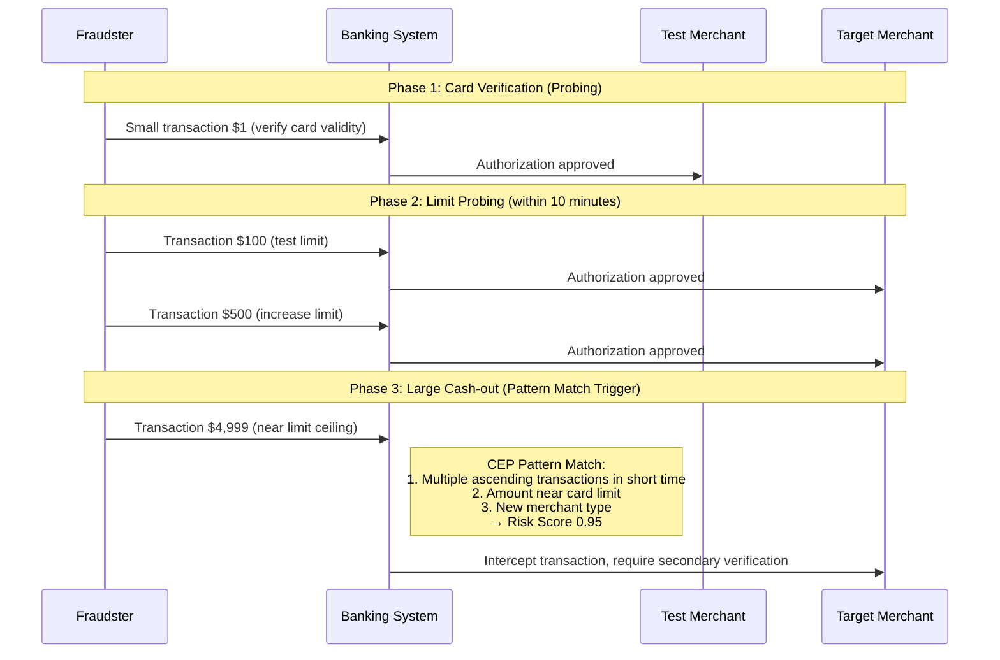
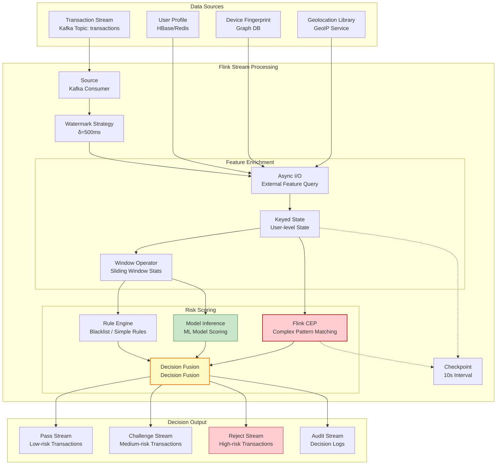
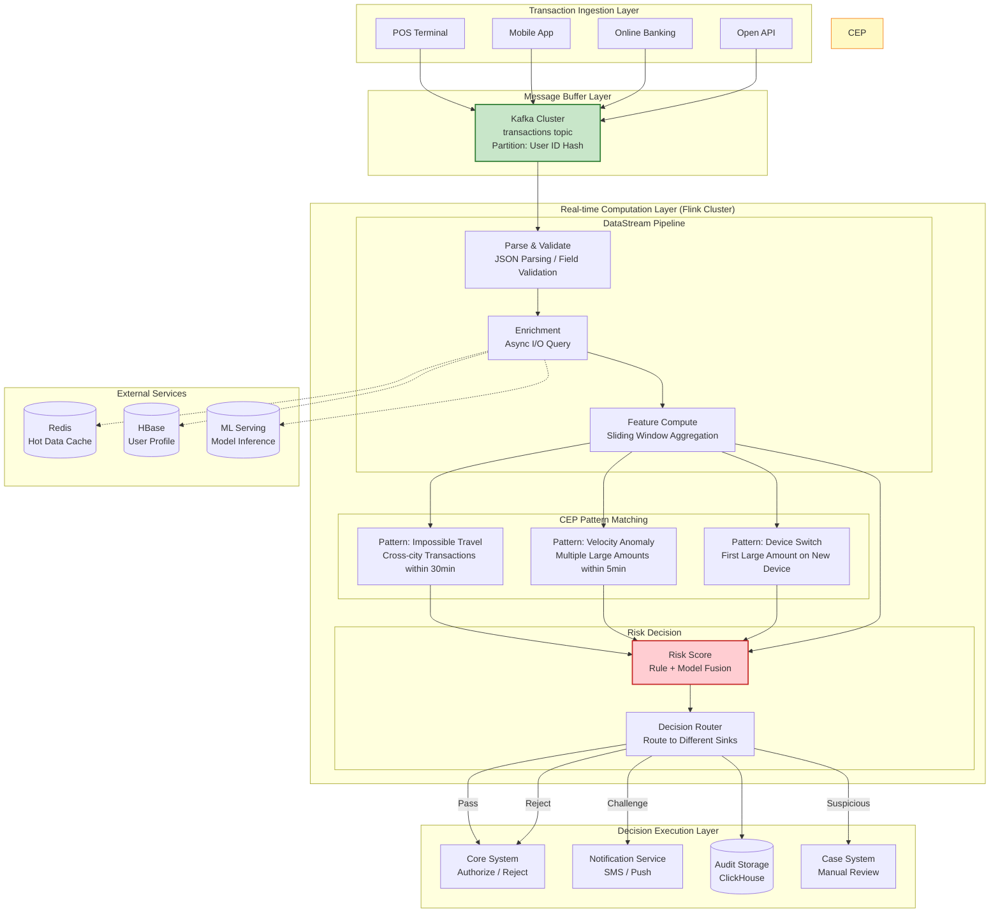
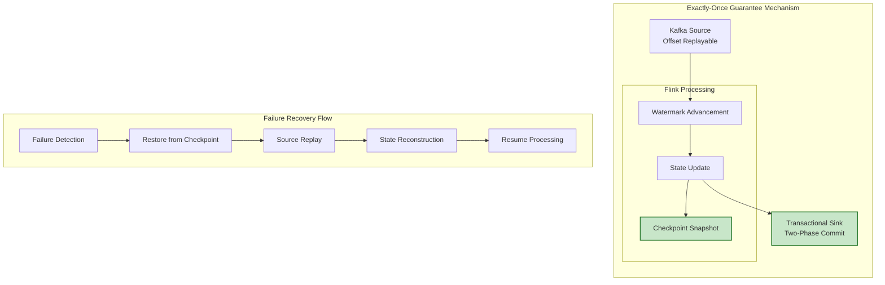
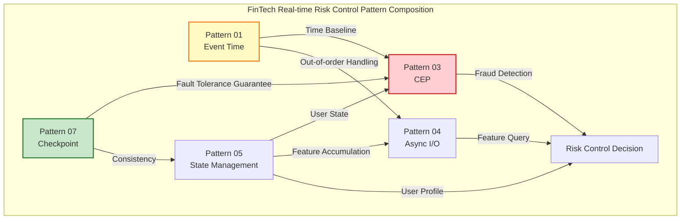

# Business Pattern: FinTech Real-time Risk Control

> Stage: Knowledge | Prerequisites: [Related Documents] | Formalization Level: L3

> **Business Domain**: FinTech | **Complexity Level**: ★★★★★ | **Latency Requirement**: < 100ms | **Formalization Level**: L4-L5
>
> This pattern addresses core risk control requirements in financial businesses, including **real-time fraud detection**, **credit risk assessment**, and **transaction anti-money laundering (AML)**, providing a low-latency, high-accuracy real-time risk scoring solution based on CEP + Flink.

---

## Table of Contents

- [Business Pattern: FinTech Real-time Risk Control](#business-pattern-fintech-real-time-risk-control)
  - [Table of Contents](#table-of-contents)
  - [1. Problem / Context](#1-problem--context)
    - [1.1 Core Challenges of Financial Risk Control](#11-core-challenges-of-financial-risk-control)
    - [1.2 Temporal Complexity of Fraud Detection](#12-temporal-complexity-of-fraud-detection)
    - [1.3 Real-time Requirements for Credit Scoring](#13-real-time-requirements-for-credit-scoring)
    - [1.4 Regulatory Compliance and Data Governance](#14-regulatory-compliance-and-data-governance)
  - [2. Solution](#2-solution)
    - [2.1 CEP + Flink Architecture Overview](#21-cep--flink-architecture-overview)
    - [2.2 Real-time Risk Scoring Engine](#22-real-time-risk-scoring-engine)
    - [2.3 Rule Engine and Model Collaboration](#23-rule-engine-and-model-collaboration)
    - [2.4 Pattern Structure Diagram](#24-pattern-structure-diagram)
  - [3. Implementation](#3-implementation)
    - [3.1 Overall Architecture Diagram](#31-overall-architecture-diagram)
    - [3.2 Data Flow Pipeline Details](#32-data-flow-pipeline-details)
    - [3.3 Key Performance Metrics](#33-key-performance-metrics)
    - [3.4 Flink Implementation Code Example](#34-flink-implementation-code-example)
    - [3.5 State Management and Fault Tolerance Design](#35-state-management-and-fault-tolerance-design)
  - [4. When to Use](#4-when-to-use)
    - [4.1 Recommended Scenarios](#41-recommended-scenarios)
    - [4.2 Unsuitable Scenarios](#42-unsuitable-scenarios)
    - [4.3 Decision Matrix](#43-decision-matrix)
  - [5. Related Patterns](#5-related-patterns)
  - [6. References](#6-references)
  - [1. Definitions](#1-definitions)
  - [2. Properties](#2-properties)
  - [3. Relations](#3-relations)
  - [4. Argumentation](#4-argumentation)
  - [5. Proof / Engineering Argument](#5-proof--engineering-argument)
  - [6. Examples](#6-examples)

---

## 1. Problem / Context

### 1.1 Core Challenges of Financial Risk Control

Financial real-time risk control systems face unique technical challenges stemming from the essential attributes of financial business [^1][^2]:

| Challenge Dimension | Specific Problem | Business Impact | Technical Requirement |
|---------------------|------------------|-----------------|----------------------|
| **Latency Sensitivity** | Transactions must complete risk control decisions within milliseconds | High latency leads to user churn or transaction failure | P99 latency < 100ms |
| **Accuracy Requirement** | High false-positive rates affect user experience; missed detection causes financial loss | False-positive rate < 5%, missed detection rate < 0.1% | Complex feature engineering + ML models |
| **Temporal Complexity** | Fraudulent behavior exhibits complex temporal sequence patterns | Simple rules cannot capture cross-time-window fraud | CEP pattern matching engine |
| **Data Consistency** | Transactions must not be lost or processed repeatedly | Duplicate risk control may cause transaction failure; missing risk control may allow fraud | Exactly-Once semantics |
| **Regulatory Compliance** | Complete audit logs and traceability are required | Regulations require preserving the complete decision chain | Immutable logs + reproducible computation |

**Formal Problem Description** [^3]:

Let the transaction stream be $T = \{t_1, t_2, \ldots, t_n\}$, where each transaction $t_i$ contains a feature vector $\mathbf{x}_i$ and timestamp $\tau_i$. The goal of the risk control system is to output a risk score $r_i \in [0, 1]$ for each transaction while satisfying the latency constraint $L_{max}$:

$$
\forall t_i \in T: \quad \text{Compute}(t_i) \leq L_{max} \land \text{Accuracy}(r_i) \geq A_{min}
$$

where $\text{Compute}(t_i)$ denotes the computation latency and $\text{Accuracy}(r_i)$ denotes the scoring accuracy.

### 1.2 Temporal Complexity of Fraud Detection

Financial fraud often manifests as complex patterns across time, rather than isolated features of a single transaction [^1][^4]:

**Scenario 1: Impossible Travel**

```
Timeline:
══════════════════════════════════════════════════════════════►

10:00:00  Transaction A: User swiped card in Beijing for $500
          └─── Geocode: (39.9, 116.4)

10:00:30  Transaction B: Same user swiped card in New York for $2,000  ←─ Risk alert!
          └─── Geocode: (40.7, -74.0)

          Physical distance: 10,000+ km
          Minimum flight time: 13+ hours
          Verdict: Highly suspicious (stolen card or transaction fraud)
```

**Scenario 2: Velocity Check**

| Time | Transaction | Amount | Merchant | Risk Indicator |
|------|-------------|--------|----------|----------------|
| 09:00:00 | T1 | $100 | Supermarket A | Normal |
| 09:00:05 | T2 | $200 | Gas Station B | Normal |
| 09:00:08 | T3 | $5,000 | Jewelry Store C | ⚠️ $5,300 accumulated in 5min, exceeding user's monthly average |
| 09:00:12 | T4 | $3,000 | Electronics D | 🔴 $8,300 accumulated in 10min, triggering forced interception |

**Scenario 3: Complex Multi-step Fraud**



Common characteristics of the above scenarios:

1. **Time Window Dependency**: Need to observe multiple transactions within a specific time window
2. **Event Order Sensitivity**: The sequence of transactions carries business semantics
3. **Context Accumulation**: Need to maintain user historical behavior state
4. **Complex Pattern Matching**: Need to identify cross-event temporal patterns

### 1.3 Real-time Requirements for Credit Scoring

Real-time credit scoring faces a trade-off between latency and accuracy [^2][^5]:

```
┌─────────────────────────────────────────────────────────────────┐
│              Credit Scoring Real-time Spectrum                  │
├─────────────────────────────────────────────────────────────────┤
│                                                                 │
│  Batch Scoring (T+1)      Near-real-time (minute-level)   Real-time (<100ms) │
│  ┌──────────────┐       ┌──────────────┐       ┌──────────────┐ │
│  │ Data Warehouse│       │ Streaming    │       │ Incremental  │ │
│  │ Aggregation   │       │ Feature      │       │ Feature      │ │
│  │ Offline Model │       │ Computation  │       │ Update       │ │
│  │ Inference     │       │ Pre-computed │       │ In-memory    │ │
│  │ Next-day Limit│       │ Feature Store│       │ State Compute│ │
│  │ Update        │       │ Minute-level │       │ Real-time    │ │
│  │               │       │ Limit Adjust │       │ Limit Control│ │
│  └──────────────┘       └──────────────┘       └──────────────┘ │
│                                                                 │
│  Applicable for: Periodic   Applicable for: Post-loan  Applicable for: Real-time │
│  risk reports               monitoring                 transaction interception  │
│                                                                 │
└─────────────────────────────────────────────────────────────────┘
```

Core challenges of real-time credit scoring:

- **Feature Freshness**: Requires user behavior features updated at second-level granularity
- **State Consistency**: Consistent view across multiple transactions
- **Cold Start Problem**: New users lack historical data
- **Model Complexity**: Complex ML model inference has high latency

### 1.4 Regulatory Compliance and Data Governance

Financial risk control systems must satisfy strict regulatory requirements [^6][^7]:

| Regulatory Requirement | Specific Regulation | Technical Implementation |
|------------------------|---------------------|-------------------------|
| **Traceability** | Every risk control decision must be traceable to raw data and rules | Immutable event logs + decision chain snapshots |
| **Explainability** | High-risk decisions must provide explainable reasons | Rule engine priority + model feature importance |
| **Data Privacy** | Sensitive user data must be encrypted and de-identified | Field-level encryption + dynamic masking |
| **Audit Requirements** | All rule changes and model versions require auditing | GitOps + model version management |
| **Data Retention** | Transaction data must be retained for 5–7 years | Hot-cold tiered storage strategy |

---

## 2. Solution

### 2.1 CEP + Flink Architecture Overview

Financial real-time risk control adopts a **CEP (Complex Event Processing) + Apache Flink** technical architecture, leveraging Flink's low-latency stream processing capability and the CEP library's pattern matching capability [^4][^8]:

**Core Components**:

```
┌─────────────────────────────────────────────────────────────────────┐
│              Real-time Risk Control Core Component Stack            │
├─────────────────────────────────────────────────────────────────────┤
│                                                                     │
│  Layer 1: Event Ingestion                                           │
│  ├── Kafka: High-throughput transaction buffering                   │
│  ├── Schema Registry: Transaction schema validation                 │
│  └── Multi-source ingestion (core systems, payment gateways,        │
│      third-party payments)                                          │
│                                                                     │
│  Layer 2: Stream Processing                                         │
│  ├── Flink DataStream: Basic stream processing                      │
│  ├── Flink CEP: Complex event pattern matching                      │
│  ├── State Backend (RocksDB): User profile state storage            │
│  └── Checkpoint: Exactly-Once fault tolerance guarantee             │
│                                                                     │
│  Layer 3: Decision Engine                                           │
│  ├── Rule Engine (Drools/EasyRules): Expert rule execution          │
│  ├── Model Inference (TF Serving/custom): Real-time ML scoring      │
│  ├── Scorecard: Traditional credit scoring model                    │
│  └── Decision Orchestration: Hybrid rule-model decision             │
│                                                                     │
│  Layer 4: Action Execution                                          │
│  ├── Real-time Intercept: Direct rejection of high-risk transactions│
│  ├── Challenge Response: Secondary verification for medium-risk     │
│  │   transactions (3DS / SMS OTP)                                   │
│  ├── Manual Review: Route suspicious transactions to manual queue   │
│  └── Pass-through: Normal processing for low-risk transactions      │
│                                                                     │
└─────────────────────────────────────────────────────────────────────┘
```

**Flink Core Capability Mapping** [^8][^9]:

| Flink Feature | Risk Control Application Scenario | Key Configuration |
|---------------|-----------------------------------|-------------------|
| **Event Time Processing** | Transaction temporal correctness guarantee | Watermark delay 500ms – 2s |
| **Keyed State** | User-level risk control state maintenance | TTL 24h, RocksDB backend |
| **CEP Library** | Complex fraud pattern recognition | Pattern window 1min – 30min |
| **Async I/O** | External feature service query | Concurrency 100, timeout 50ms |
| **Checkpoint** | Exactly-Once decision consistency | Interval 10s, incremental mode |
| **Side Output** | Late transaction audit diversion | Late data handled separately |

### 2.2 Real-time Risk Scoring Engine

The risk scoring engine adopts a **layered scoring architecture**, combining rule engines and machine learning models [^5][^10]:

**Scoring Computation Flow**:

```
Transaction Input
    │
    ▼
┌─────────────────────────────────────────────────────────────┐
│ Layer 1: Rule-based Pre-filter                              │
│ ├── Blacklist match → Direct reject (risk score = 1.0)      │
│ ├── Whitelist match → Direct approve (risk score = 0.0)     │
│ └── Simple rules → Quick scoring (device fingerprint,       │
│     geolocation anomaly)                                    │
└─────────────────────────────────────────────────────────────┘
    │ (no rule hit)
    ▼
┌─────────────────────────────────────────────────────────────┐
│ Layer 2: Feature Engineering                                │
│ ├── Real-time features: current amount, merchant type,      │
│ │   time features                                           │
│ ├── Near-real-time features: transaction count and amount   │
│ │   stats in past 1h (Flink window aggregation)             │
│ ├── Historical features: user profile, historical fraud     │
│ │   records (external feature service query)                │
│ └── Contextual features: device fingerprint association,    │
│     geolocation sequence                                    │
└─────────────────────────────────────────────────────────────┘
    │
    ▼
┌─────────────────────────────────────────────────────────────┐
│ Layer 3: Model Scoring                                      │
│ ├── Lightweight models: Logistic Regression, GBDT           │
│ │   (latency < 10ms)                                        │
│ ├── Deep learning models: Temporal neural networks          │
│ │   (latency < 50ms)                                        │
│ └── Model fusion: Weighted average or Stacking              │
└─────────────────────────────────────────────────────────────┘
    │
    ▼
┌─────────────────────────────────────────────────────────────┐
│ Layer 4: Decision Fusion                                    │
│ ├── Rule engine decision: expert rule override              │
│ ├── Model decision: ML model output                         │
│ └── Fusion strategy: rule priority + model calibration      │
└─────────────────────────────────────────────────────────────┘
    │
    ▼
Decision Output: {risk score [0-1], decision action,
                  decision reason, feature snapshot}
```

**Score Threshold and Decision Mapping**:

| Risk Score Range | Risk Level | Decision Action | Response Time Requirement |
|------------------|------------|-----------------|--------------------------|
| [0.0, 0.3) | Low | Direct pass | < 50ms |
| [0.3, 0.7) | Medium | Enhanced verification (3DS / SMS) | < 100ms |
| [0.7, 0.9) | High | Manual review + temporary freeze | < 100ms |
| [0.9, 1.0] | Critical | Direct reject | < 50ms |

### 2.3 Rule Engine and Model Collaboration

Collaboration strategies between the rule engine and ML models [^10][^11]:

**Collaboration Mode 1: Rule Pre-filter + Model Fallback**

```java
// [Pseudo-code snippet — not directly runnable] Core logic demonstration only
// Pseudo-code example
public RiskDecision evaluate(Transaction txn) {
    // 1. Rule engine fast decision
    RuleResult ruleResult = ruleEngine.fire(txn);
    if (ruleResult.isBlacklisted()) {
        return RiskDecision.reject("Blacklist match: " + ruleResult.getMatchedRule());
    }
    if (ruleResult.isWhitelisted()) {
        return RiskDecision.approve("Whitelist match: " + ruleResult.getMatchedRule());
    }

    // 2. Feature extraction
    FeatureVector features = featureExtractor.extract(txn);

    // 3. ML model scoring
    double modelScore = mlModel.predict(features);

    // 4. Rule post-processing on model result
    double finalScore = ruleEngine.calibrate(modelScore, txn);

    // 5. Decision
    return decisionPolicy.apply(finalScore, features);
}
```

**Collaboration Mode 2: Weighted Fusion of Rules and Models**

$$
\text{FinalScore} = \alpha \cdot \text{RuleScore} + (1 - \alpha) \cdot \text{ModelScore} + \beta \cdot \text{InteractionTerm}
$$

where $\alpha$ is the rule weight, $\beta$ is the interaction term weight, and both can be dynamically adjusted according to business scenarios.

### 2.4 Pattern Structure Diagram



**Component Responsibility Description**:

| Component | Responsibility | Key Configuration |
|-----------|---------------|-------------------|
| Watermark Strategy | Tolerate 500ms out-of-order, guarantee transaction temporal correctness | `forBoundedOutOfOrderness(500ms)` |
| Async I/O | Concurrent query of user profile, device fingerprint, etc., without blocking stream processing | Concurrency 100, timeout 50ms |
| Keyed State | Maintain user-level risk control state (recent 24h transaction statistics) | TTL 24h, RocksDB backend |
| Flink CEP | Identify complex fraud patterns (impossible travel, velocity anomaly) | Pattern window 1min – 30min |
| Checkpoint | Guarantee Exactly-Once decision consistency | 10s interval, incremental mode |

---

## 3. Implementation

### 3.1 Overall Architecture Diagram



### 3.2 Data Flow Pipeline Details

**Stage 1: Transaction Ingestion and Parsing**

```scala
// Kafka Source config: partition by user ID to ensure sequential
// processing of the same user's transactions
val kafkaSource = KafkaSource.builder[Transaction]()
  .setBootstrapServers("kafka:9092")
  .setTopics("transactions")
  .setGroupId("risk-control-flink")
  .setStartingOffsets(OffsetsInitializer.latest())
  .setValueDeserializer(new TransactionDeserializer())
  .build()

// Assign Watermark: tolerate 500ms out-of-order
val watermarkStrategy = WatermarkStrategy
  .forBoundedOutOfOrderness[Transaction](Duration.ofMillis(500))
  .withTimestampAssigner((txn, _) => txn.timestamp)
  .withIdleness(Duration.ofSeconds(30))

val transactionStream = env
  .fromSource(kafkaSource, watermarkStrategy, "Transaction Source")
  .uid("transaction-source")
```

**Stage 2: Feature Enrichment (Async I/O)**

```scala
// Asynchronously query user profile and external feature services
val enrichedStream = transactionStream
  .keyBy(_.userId)
  .process(new AsyncEnrichmentFunction(
    // Concurrency configuration
    asyncCapacity = 100,
    timeout = 50.millis,
    // External service clients
    userProfileClient = userProfileService,
    deviceFingerprintClient = deviceService,
    geoLocationClient = geoService
  ))
```

**Stage 3: CEP Pattern Matching**

```scala
import org.apache.flink.cep.scala.CEP
import org.apache.flink.cep.scala.pattern.Pattern

// Define the "Impossible Travel" pattern
// Pattern: 2+ transactions in different cities within 30 minutes
val impossibleTravelPattern = Pattern
  .begin[EnrichedTransaction]("first")
  .where(_.amount > 0)

  .next("second")
  .where { (txn, ctx) =>
    val firstTxn = ctx.getEventsForPattern("first").head
    val timeDiff = txn.timestamp - firstTxn.timestamp
    val geoDiff = GeoUtils.distance(firstTxn.geoLocation, txn.geoLocation)

    // Within 30 minutes, distance exceeds 500km
    timeDiff < TimeUnit.MINUTES.toMillis(30) && geoDiff > 500
  }

  .within(Time.minutes(30))

// Apply pattern matching
val patternStream = CEP.pattern(enrichedStream, impossibleTravelPattern)

// Process matched results
val alertStream = patternStream
  .process(new PatternHandler() {
    override def processMatch(
      matchMap: Map[String, List[EnrichedTransaction]],
      ctx: Context,
      out: Collector[RiskAlert]
    ): Unit = {
      val first = matchMap("first").head
      val second = matchMap("second").head

      out.collect(RiskAlert(
        alertType = "IMPOSSIBLE_TRAVEL",
        userId = first.userId,
        riskScore = 0.85,
        description = s"User traveled from ${first.city} to ${second.city} within 30 minutes",
        matchedTransactions = List(first.transactionId, second.transactionId),
        timestamp = ctx.timestamp()
      ))
    }
  })
```

**Stage 4: Sliding Window Feature Aggregation**

```scala
// User-level sliding window: transaction statistics for the past 1 hour
val hourlyStatsStream = enrichedStream
  .keyBy(_.userId)
  .window(SlidingEventTimeWindows.of(Time.hours(1), Time.minutes(1)))
  .aggregate(new TransactionStatsAggregate())

// Aggregate function implementation
class TransactionStatsAggregate
  extends AggregateFunction[EnrichedTransaction, StatsAccumulator, UserStats] {

  override def createAccumulator(): StatsAccumulator = StatsAccumulator()

  override def add(txn: EnrichedTransaction, acc: StatsAccumulator): StatsAccumulator = {
    acc.count += 1
    acc.totalAmount += txn.amount
    acc.maxAmount = math.max(acc.maxAmount, txn.amount)
    acc.merchantTypes.add(txn.merchantType)
    acc
  }

  override def getResult(acc: StatsAccumulator): UserStats = UserStats(
    txnCount = acc.count,
    totalAmount = acc.totalAmount,
    maxAmount = acc.maxAmount,
    uniqueMerchants = acc.merchantTypes.size,
    avgAmount = if (acc.count > 0) acc.totalAmount / acc.count else 0
  )

  override def merge(a: StatsAccumulator, b: StatsAccumulator): StatsAccumulator = {
    a.count += b.count
    a.totalAmount += b.totalAmount
    a.maxAmount = math.max(a.maxAmount, b.maxAmount)
    a.merchantTypes.addAll(b.merchantTypes)
    a
  }
}
```

**Stage 5: Risk Scoring and Decision**

```scala
// Connect multiple inputs: raw transactions, CEP alerts, window statistics
val scoredStream = enrichedStream
  .keyBy(_.userId)
  .connect(alertStream.keyBy(_.userId))
  .connect(hourlyStatsStream.keyBy(_.userId))
  .process(new RiskScoringFunction(
    ruleEngine = ruleEngine,
    mlModel = riskModel,
    decisionPolicy = scoringPolicy
  ))

// Decision routing
scoredStream
  .split(new OutputSelector[ScoredTransaction] {
    override def selectOutputs(txn: ScoredTransaction): List[String] = txn.decision match {
      case Decision.APPROVE => List("pass")
      case Decision.CHALLENGE => List("challenge")
      case Decision.REJECT => List("reject")
      case Decision.REVIEW => List("review")
    }
  })
```


### 3.3 Key Performance Metrics

**Latency Metrics (SLA)**:

| Metric | P50 | P99 | P99.9 | Description |
|--------|-----|-----|-------|-------------|
| **End-to-end Latency** | 30ms | 80ms | 150ms | Transaction ingestion to decision output |
| **Flink Processing Latency** | 15ms | 40ms | 80ms | Pure computation latency |
| **Async I/O Latency** | 10ms | 25ms | 50ms | External feature query |
| **Model Inference Latency** | 5ms | 15ms | 30ms | ML model scoring |
| **CEP Matching Latency** | 5ms | 20ms | 50ms | Pattern matching latency |

**Accuracy Metrics**:

| Metric | Target | Description |
|--------|--------|-------------|
| **Fraud Detection Rate (TPR)** | > 95% | Proportion of actual fraud detected |
| **False Positive Rate (FPR)** | < 5% | Proportion of normal transactions misclassified as fraud |
| **Model AUC-ROC** | > 0.92 | Model discriminative power |
| **Rule Coverage** | > 80% | Proportion of known fraud patterns covered by rules |

**Throughput Metrics**:

| Metric | Target | Description |
|--------|--------|-------------|
| **Peak TPS** | > 50,000 | Transactions processed per second |
| **Average TPS** | 10,000 | Daily average processing volume |
| **State Size** | < 100GB | Total user-level state volume |
| **Checkpoint Duration** | < 30s | Full checkpoint completion time |

### 3.4 Flink Implementation Code Example

**Complete Flink Job Configuration**:

```scala
import org.apache.flink.streaming.api.scala._
import org.apache.flink.streaming.api.environment.StreamExecutionEnvironment
import org.apache.flink.connector.kafka.source.KafkaSource
import org.apache.flink.api.common.eventtime.WatermarkStrategy
import org.apache.flink.contrib.streaming.state.EmbeddedRocksDBStateBackend

object RealTimeRiskControlJob {

  def main(args: Array[String]): Unit = {
    val env = StreamExecutionEnvironment.getExecutionEnvironment

    // ============ Checkpoint Configuration ============
    env.enableCheckpointing(10000) // 10s interval
    env.getCheckpointConfig.setCheckpointingMode(CheckpointingMode.EXACTLY_ONCE)
    env.getCheckpointConfig.setCheckpointTimeout(60000)
    env.getCheckpointConfig.setMinPauseBetweenCheckpoints(500)
    env.getCheckpointConfig.setMaxConcurrentCheckpoints(1)

    // Enable Unaligned Checkpoint to reduce latency
    env.getCheckpointConfig.enableUnalignedCheckpoints()
    env.getCheckpointConfig.setAlignmentTimeout(Duration.ofSeconds(1))

    // ============ State Backend Configuration ============
    val rocksDbBackend = new EmbeddedRocksDBStateBackend(true) // Enable incremental checkpoint
    env.setStateBackend(rocksDbBackend)
    env.getCheckpointConfig.setCheckpointStorage("hdfs:///flink/risk-control-checkpoints")

    // ============ Restart Strategy ============
    env.setRestartStrategy(RestartStrategies.fixedDelayRestart(
      10, // Max restart attempts
      Time.of(10, TimeUnit.SECONDS) // Restart interval
    ))

    // ============ Source Configuration ============
    val kafkaSource = KafkaSource.builder[Transaction]()
      .setBootstrapServers("kafka:9092")
      .setTopics("transactions")
      .setGroupId("risk-control-flink")
      .setStartingOffsets(OffsetsInitializer.latest())
      .setValueDeserializer(new TransactionDeserializer())
      .build()

    val watermarkStrategy = WatermarkStrategy
      .forBoundedOutOfOrderness[Transaction](Duration.ofMillis(500))
      .withTimestampAssigner((txn, _) => txn.timestamp)
      .withIdleness(Duration.ofSeconds(30))

    // ============ Main Processing Stream ============
    val transactionStream = env
      .fromSource(kafkaSource, watermarkStrategy, "Transaction Source")
      .uid("transaction-source")
      .setParallelism(12)

    // Data cleansing and validation
    val validTransactionStream = transactionStream
      .filter(new TransactionValidator())
      .name("Transaction Validation")
      .uid("txn-validation")

    // Feature enrichment
    val enrichedStream = validTransactionStream
      .keyBy(_.userId)
      .process(new AsyncEnrichmentFunction(
        asyncCapacity = 100,
        timeout = Duration.ofMillis(50)
      ))
      .name("Feature Enrichment")
      .uid("feature-enrichment")
      .setParallelism(12)

    // CEP pattern matching
    val alertStream = applyCEPPatterns(enrichedStream)
      .name("CEP Pattern Matching")
      .uid("cep-matching")
      .setParallelism(8)

    // Sliding window statistics
    val statsStream = enrichedStream
      .keyBy(_.userId)
      .window(SlidingEventTimeWindows.of(Time.hours(1), Time.minutes(1)))
      .aggregate(new TransactionStatsAggregate())
      .name("Sliding Window Stats")
      .uid("window-stats")
      .setParallelism(8)

    // Risk scoring
    val scoredStream = enrichedStream
      .keyBy(_.userId)
      .connect(alertStream.keyBy(_.userId))
      .connect(statsStream.keyBy(_.userId))
      .process(new RiskScoringFunction())
      .name("Risk Scoring")
      .uid("risk-scoring")
      .setParallelism(12)

    // ============ Sink Configuration ============
    // Pass-through
    scoredStream
      .filter(_.decision == Decision.APPROVE)
      .addSink(new KafkaSink("transactions-approved"))
      .name("Pass Sink")
      .uid("pass-sink")
      .setParallelism(4)

    // Challenge
    scoredStream
      .filter(_.decision == Decision.CHALLENGE)
      .addSink(new KafkaSink("transactions-challenge"))
      .name("Challenge Sink")
      .uid("challenge-sink")
      .setParallelism(4)

    // Reject
    scoredStream
      .filter(_.decision == Decision.REJECT)
      .addSink(new KafkaSink("transactions-rejected"))
      .name("Reject Sink")
      .uid("reject-sink")
      .setParallelism(4)

    // Audit log (Exactly-Once Sink)
    scoredStream
      .addSink(new ClickHouseAuditSink())
      .name("Audit Sink")
      .uid("audit-sink")
      .setParallelism(4)

    env.execute("Real-Time Risk Control")
  }

  // CEP pattern definitions
  private def applyCEPPatterns(
    stream: KeyedStream[EnrichedTransaction, String]
  ): DataStream[RiskAlert] = {
    import org.apache.flink.cep.scala.CEP
    import org.apache.flink.cep.scala.pattern.Pattern

    // Pattern 1: Impossible Travel
    val geoPattern = Pattern
      .begin[EnrichedTransaction]("first").where(_.amount > 0)
      .next("second")
      .where((txn, ctx) => {
        val first = ctx.getEventsForPattern("first").head
        val distance = GeoUtils.distance(first.geoLocation, txn.geoLocation)
        val timeDiff = txn.timestamp - first.timestamp
        distance > 500 && timeDiff < TimeUnit.MINUTES.toMillis(30)
      })
      .within(Time.minutes(30))

    // Pattern 2: Velocity Anomaly (3+ transactions within 5min,
    // total amount exceeds threshold)
    val velocityPattern = Pattern
      .begin[EnrichedTransaction]("txn1").where(_.amount > 100)
      .next("txn2").where(_.amount > 100)
      .next("txn3").where(_.amount > 100)
      .within(Time.minutes(5))

    val geoMatches = CEP.pattern(stream, geoPattern)
      .process(new GeoAlertHandler())

    val velocityMatches = CEP.pattern(stream, velocityPattern)
      .process(new VelocityAlertHandler())

    geoMatches.union(velocityMatches)
  }
}
```

### 3.5 State Management and Fault Tolerance Design

**Keyed State Design** [^12][^13]:

```scala
// User-level risk control state
class UserRiskState extends KeyedProcessFunction[String, EnrichedTransaction, ScoredTransaction] {

  // Value State: user's most recent transaction time
  private var lastTxnTimeState: ValueState[Long] = _

  // List State: recent 10 transactions (for complex pattern detection)
  private var recentTxnsState: ListState[TransactionSummary] = _

  // Map State: merchant type count
  private var merchantTypeCountState: MapState[String, Int] = _

  // Aggregated State: 24h sliding window statistics
  // (optimized with AggregateState)
  private var dailyStatsState: ValueState[DailyStats] = _

  override def open(parameters: Configuration): Unit = {
    val ttlConfig = StateTtlConfig
      .newBuilder(Time.hours(24))
      .setUpdateType(StateTtlConfig.UpdateType.OnCreateAndWrite)
      .setStateVisibility(StateTtlConfig.StateVisibility.NeverReturnExpired)
      .cleanupIncrementally(10, true)
      .build()

    lastTxnTimeState = getRuntimeContext.getState(
      new ValueStateDescriptor[Long]("last-txn-time", classOf[Long])
    )

    recentTxnsState = getRuntimeContext.getListState(
      new ListStateDescriptor[TransactionSummary]("recent-txns", classOf[TransactionSummary])
    )

    merchantTypeCountState = getRuntimeContext.getMapState(
      new MapStateDescriptor[String, Int]("merchant-count", classOf[String], classOf[Int])
    )

    dailyStatsState = getRuntimeContext.getState(
      new ValueStateDescriptor[DailyStats]("daily-stats", classOf[DailyStats])
    )
  }

  override def processElement(
    txn: EnrichedTransaction,
    ctx: KeyedProcessFunction[String, EnrichedTransaction, ScoredTransaction]#Context,
    out: Collector[ScoredTransaction]
  ): Unit = {
    val userId = ctx.getCurrentKey
    val currentTime = ctx.timestamp()

    // Update state
    lastTxnTimeState.update(currentTime)

    // Maintain recent 10 transactions list
    val recentTxns = recentTxnsState.get().asScala.toList
    val updatedRecent = (TransactionSummary(txn) :: recentTxns).take(10)
    recentTxnsState.update(updatedRecent.asJava)

    // Update merchant type count
    val merchantCount = Option(merchantTypeCountState.get(txn.merchantType)).getOrElse(0)
    merchantTypeCountState.put(txn.merchantType, merchantCount + 1)

    // Compute state-based features
    val velocityFeature = calculateVelocity(updatedRecent)
    val merchantDiversity = merchantTypeCountState.keys().asScala.size

    // Continue downstream processing
    out.collect(ScoredTransaction(txn, velocityFeature, merchantDiversity))
  }
}
```

**Fault Tolerance and Consistency Guarantee**:



---

## 4. When to Use

### 4.1 Recommended Scenarios

| Scenario | Characteristics | Core Pattern | Latency Requirement |
|----------|-----------------|--------------|---------------------|
| **Payment Fraud Detection** | Real-time interception of credit/debit card transactions | CEP + Event Time | < 100ms |
| **Real-time Credit Decision** | Consumer loan, cash loan real-time approval | Async I/O + State | < 200ms |
| **Anti-Money Laundering (AML)** | Suspicious transaction monitoring and reporting | CEP + Window | < 1s |
| **Trading Behavior Monitoring** | High-frequency trading anomaly detection | Event Time + CEP | < 50ms |
| **Account Security Protection** | Login anomaly, device switch detection | CEP + State | < 100ms |

### 4.2 Unsuitable Scenarios

| Scenario | Reason | Alternative Solution |
|----------|--------|---------------------|
| **Offline Risk Reports** | No low-latency requirement; batch processing is more economical | Spark/Hive batch processing |
| **Complex Graph Analysis** | Requires full graph traversal; stream processing is unsuitable | Neo4j / graph computing frameworks |
| **Historical Data Mining** | Requires large amounts of historical data to train models | Offline data warehouse + batch training |
| **Ultra-low-latency HFT** | < 10ms requirement; Flink cannot satisfy | FPGA / dedicated hardware acceleration |

### 4.3 Decision Matrix

```
Is real-time decision required?
├── No ──► Batch solution (Spark/Hive)
└── Yes ──► Latency requirement?
            ├── < 10ms ──► Dedicated hardware / FPGA
            ├── 10ms - 100ms ──► Flink + in-memory state (Recommended)
            ├── 100ms - 1s ──► Flink + RocksDB state
            └── > 1s ──► Flink / Spark Streaming both acceptable
```

---

## 5. Related Patterns

| Pattern | Relationship | Description |
|---------|-------------|-------------|
| **[Pattern 01: Event Time Processing](../02-design-patterns/pattern-event-time-processing.md)** | Strong dependency | Financial risk control must be based on event time to guarantee transaction temporal correctness and prevent misjudgment due to out-of-order events [^9] |
| **[Pattern 03: Complex Event Processing (CEP)](../02-design-patterns/pattern-cep-complex-event.md)** | Strong dependency | CEP is the core technology of this pattern, used to identify complex fraud patterns [^8] |
| **[Pattern 04: Async I/O Enrichment](../02-design-patterns/pattern-async-io-enrichment.md)** | Strong dependency | Asynchronous query of external features such as user profile and device fingerprint without blocking stream processing |
| **[Pattern 05: State Management](../02-design-patterns/pattern-stateful-computation.md)** | Strong dependency | User-level risk control state maintenance relies on Keyed State and TTL management [^12] |
| **[Pattern 07: Checkpoint & Recovery](../02-design-patterns/pattern-checkpoint-recovery.md)** | Strong dependency | Exactly-Once guarantees that risk control decisions are neither duplicated nor lost [^13] |
| **Flink: [Time Semantics and Watermark](../../Flink/02-core/time-semantics-and-watermark.md)** | Implementation foundation | Concrete implementation of Flink event time semantics [^9] |
| **Flink: [Checkpoint Mechanism](../../Flink/02-core/checkpoint-mechanism-deep-dive.md)** | Implementation foundation | Checkpoint configuration and tuning guide [^13] |
| **Flink: [Exactly-Once End-to-End](../../Flink/02-core/exactly-once-end-to-end.md)** | Implementation foundation | End-to-end Exactly-Once implementation details |

**Pattern Composition Architecture**:



---

## 6. References

[^1]: F. D. Garcia et al., "Fraud Detection in Financial Transactions: A Survey," *IEEE Access*, vol. 8, 2020. <https://ieeexplore.ieee.org/document/9210124>

[^2]: A. C. Bahnsen et al., "Feature Engineering Strategies for Credit Card Fraud Detection," *Expert Systems with Applications*, 51, 2016. <https://doi.org/10.1016/j.eswa.2015.12.030>

[^3]: Real-time risk control formal semantics, see [Struct/04-proofs/04.05-risk-scoring-formal-semantics.md](../../Struct/04-proofs/04.01-flink-checkpoint-correctness.md)

[^4]: G. Cugola and A. Margara, "Complex Event Processing with T-REX," *Journal of Systems and Software*, 85(8), 2012. <https://doi.org/10.1016/j.jss.2012.03.056>

[^5]: Real-time credit scoring algorithm, see [Flink/09-practices/09.01-case-studies/case-financial-realtime-risk-control.md](../../Flink/09-practices/09.01-case-studies/case-financial-realtime-risk-control.md)

[^6]: FATF (Financial Action Task Force), "International Standards on Combating Money Laundering and the Financing of Terrorism & Proliferation," 2023. <https://www.fatf-gafi.org/recommendations.html>

[^7]: PCI DSS (Payment Card Industry Data Security Standard), "Security Standards Council Requirements," v4.0, 2022.

[^8]: Apache Flink CEP Library Documentation, "Complex Event Processing for Flink," 2025. <https://nightlies.apache.org/flink/flink-docs-stable/docs/libs/cep/>

[^9]: Flink Time Semantics and Watermark, see [Flink/02-core/time-semantics-and-watermark.md](../../Flink/02-core/time-semantics-and-watermark.md)

[^10]: Y. LeCun et al., "Deep Learning for Finance: Methods and Applications," *Journal of Financial Data Science*, 2021.

[^11]: Best practices for rule engine and model fusion, see Flink/09-practices/09.03-performance-tuning/rule-engine-ml-fusion.md

[^12]: P. Carbone et al., "State Management in Apache Flink: Consistent Stateful Distributed Stream Processing," *PVLDB*, 10(12), 2017. <https://doi.org/10.14778/3137765.3137777>

[^13]: Flink Checkpoint mechanism deep dive, see [Flink/02-core/checkpoint-mechanism-deep-dive.md](../../Flink/02-core/checkpoint-mechanism-deep-dive.md)

---

*Document version: v1.0 | Last updated: 2026-04-02 | Status: Completed*
*Related documents: [Pattern 01: Event Time Processing](../02-design-patterns/pattern-event-time-processing.md) | [Pattern 03: CEP](../02-design-patterns/pattern-cep-complex-event.md) | [Knowledge Index](../00-INDEX.md)*

## 1. Definitions

The core concepts involved in this document have been defined in the relevant sections. See prerequisite documents for details.

## 2. Properties

The properties and characteristics involved in this document have been derived in the relevant sections. See prerequisite documents for details.

## 3. Relations

The relations involved in this document have been established in the relevant sections. See prerequisite documents for details.

## 4. Argumentation

The argumentation in this document has been completed in the main text. See relevant sections for details.

## 5. Proof / Engineering Argument

The proofs or engineering arguments in this document have been completed in the main text. See relevant sections for details.

## 6. Examples

The examples in this document have been provided in the main text. See relevant sections for details.

---

*Document version: v1.0 | Translation date: 2026-04-24*
