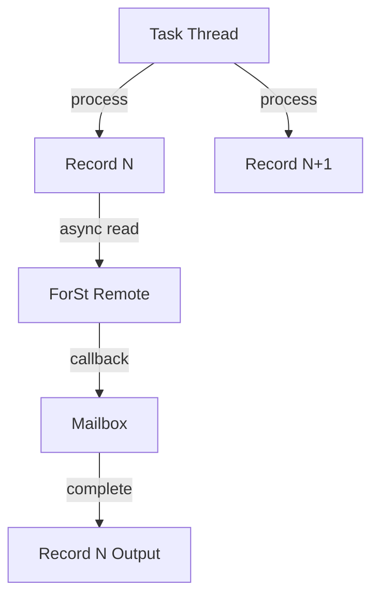

# Flink 2.0 Asynchronous Execution Model

> **Stage**: Flink/02-core | **Prerequisites**: [ForSt Backend](./flink-2.0-forst-state-backend.md) | **Formal Level**: L4
>
> **Flink Version**: 2.0.0+ | **Status**: Stable
>
> Asynchronous execution paradigm allowing operators to release task threads while waiting for remote state access.

---

## 1. Definitions

**Def-F-02-49: Asynchronous Execution Model (AEM)**

$$
\text{AEM} = (\mathcal{T}, \mathcal{S}, \mathcal{F}, \mathcal{C})
$$

where $\mathcal{T}$ = task thread pool, $\mathcal{S}$ = state storage, $\mathcal{F}$ = future callbacks, $\mathcal{C}$ = execution controller.

**Def-F-02-50: Remote Storage Latency Challenge**

| Storage | Latency | Use Case |
|---------|---------|----------|
| Local RocksDB | 1-10 μs | Same-node state |
| Remote ForSt | 0.5-2 ms | Disaggregated |
| Cloud Object Storage | 50-200 ms | Serverless |
| Distributed KV | 1-10 ms | Shared state |

**Resource utilization in sync model**:

$$
\text{Utilization} = \frac{L_{proc}}{L_{proc} + L_{state}} \approx \frac{L_{proc}}{L_{state}} \ll 1
$$

---

## 2. Properties

**Lemma-F-02-23: Thread Utilization Improvement**

Async execution improves thread utilization from $\frac{L_{proc}}{L_{state}}$ to $\approx 1$ (bounded by CPU capacity).

**Lemma-F-02-24: Per-Key Ordering Preservation**

Records sharing the same key are processed in arrival order despite async execution.

---

## 3. Relations

- **with ForSt**: Async execution requires disaggregated state backend (ForSt) to realize benefits.
- **with Mailbox Model**: Callbacks are processed via the mailbox for thread safety.

---

## 4. Argumentation

**Sync vs Async Comparison**:

```
Sync:  Record N → [Process] → [Read State] → [Write State] → Out
                         ↑ blocking (10-100ms)
                         └── thread 100% occupied

Async: Record N → [Process] → [Read State] → [Callback] → Out
                         │              ↑ async (10-100ms)
                         ↓ release thread
                   Process Record N+1
```

---

## 5. Engineering Argument

**Throughput Improvement**: With $L_{proc} = 10\mu s$ and $L_{state} = 1ms$, sync throughput = 1K RPS. Async throughput approaches 100K RPS (with sufficient concurrency).

---

## 6. Examples

```java
// Enable async execution (Flink 2.0)
stream.keyBy(Event::getUserId)
    .enableAsyncState()
    .process(new AsyncStateProcessFunction() {
        @Override
        public void processElement(Event value, Context ctx, Collector<Result> out) {
            // State access returns Future
            ctx.getAsyncState(value.getKey()).thenAccept(state -> {
                out.collect(compute(state, value));
            });
        }
    });
```

---

## 7. Visualizations

**Async Execution Architecture**:



---

## 8. References
