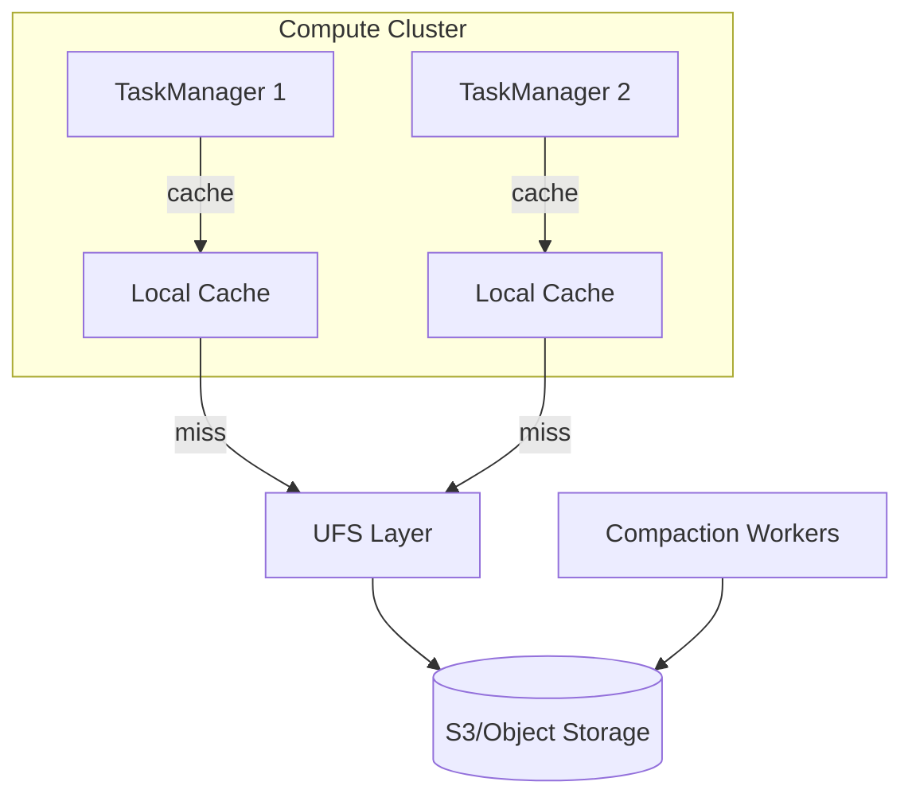

# Flink 2.0 ForSt State Backend — VLDB 2025 Deep Dive

> **Stage**: Flink/02-core | **Prerequisites**: [ForSt Backend](./flink-forst-state-backend.md) | **Formal Level**: L4
>
> **Flink Version**: 2.0.0+ | **Status**: Stable
>
> Disaggregated state backend with LSM-Tree abstraction, remote compaction, and compute-storage separation.

---

## 1. Definitions

**Def-F-02-48: ForSt Storage Engine (VLDB Version)**

$$
\text{ForSt} = \langle \text{LSM}_{\text{abstract}}, \text{UFS}, \text{Cache}_{\text{local}}, \text{Compaction}_{\text{remote}}, \text{Sync}_{\text{policy}} \rangle
$$

| Component | Purpose |
|-----------|---------|
| LSMabstract | Unified state data organization |
| UFS | Cross-storage abstraction (S3, GCS, HDFS) |
| Cachelocal | Memory + local disk two-level cache |
| Compactionremote | Offloaded compaction to dedicated cluster |
| Syncpolicy | Write-through / write-back control |

**Design Goals**:

1. Compute-storage separation for instant recovery
2. Lightweight checkpoint via file hard links
3. Elastic scaling without state migration
4. 50% cost reduction via object storage

---

## 2. Properties

**Lemma-F-02-21: Near-Constant Checkpoint Time**

Checkpoint time approaches $O(1)$ via filesystem hard links, independent of state size.

**Lemma-F-02-22: Stateless TaskManager**

TaskManagers hold no persistent state, enabling sub-second restart times.

---

## 3. Relations

- **with RocksDB**: ForSt abstracts LSM-Tree concepts while replacing local storage with remote UFS.
- **with Cloud-Native**: Designed for Kubernetes environments with ephemeral compute pods.

---

## 4. Argumentation

**Cost Comparison**:

| Factor | Local SSD | Object Storage |
|--------|-----------|----------------|
| $/GB/month | $0.10 | $0.023 |
| Durability | 99.9% | 99.999999999% |
| Throughput | High | Sufficient |
| Best for | Hot data | Cold/warm data |

---

## 5. Engineering Argument

**Remote Compaction**: Compaction CPU is offloaded to dedicated workers, freeing TaskManager CPU for record processing. Compaction lag is bounded by worker pool capacity.

---

## 6. Examples

```java
// ForSt configuration
ForStStateBackend forSt = new ForStStateBackend();
forSt.setCacheSize("1gb");
forSt.setSyncPolicy(ForStOptions.SyncPolicy.WRITE_BACK);
forSt.setRemoteCompactionEnabled(true);
env.setStateBackend(forSt);
```

---

## 7. Visualizations

**ForSt Disaggregated Architecture**:



---

## 8. References
