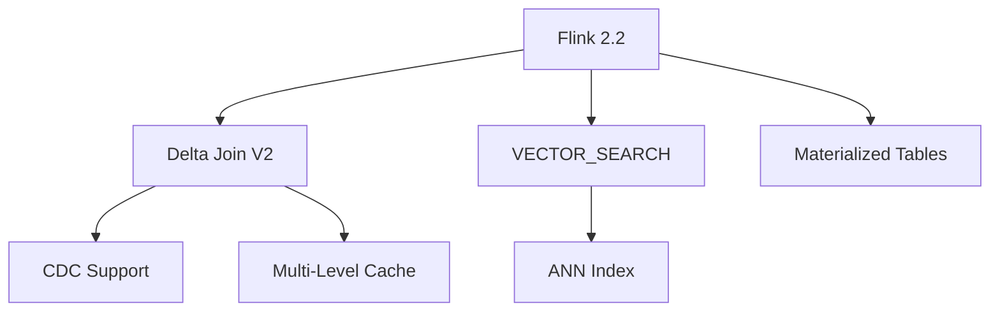

# Apache Flink 2.2 Frontier Features

> **Stage**: Flink/02-core | **Prerequisites**: [Delta Join](delta-join.md) | **Formal Level**: L4
>
> **Flink Version**: 2.2.0 | **Released**: 2025-12-04 | **Status**: GA
>
> Delta Join V2, VECTOR_SEARCH GA, materialized tables, and streaming SQL enhancements.

---

## 1. Definitions

**Def-F-02-62: Delta Join V2**

Enhanced incremental join operator with CDC source support (no DELETE), projection/filter pushdown, and multi-level caching:

$$
\mathcal{D}_{v2}(s, T, \pi, \sigma) = \{(r_s, \pi(r_t)) \mid r_s \in s \land r_t \in T \land \theta(r_s, r_t) \land \sigma(r_t)\}
$$

CDC constraint: $C_{cdc}(S) \equiv \forall e \in S: type(e) \in \{INSERT, UPDATE\}$.

**Def-F-02-63: Delta Join Cache Hierarchy**

$$Cache_{dj} = (L_1, L_2, L_3)$$

| Level | Location | Latency | Consistency |
|-------|----------|---------|-------------|
| $L_1$ | TaskManager LRU | Sub-ms | TTL eventual |
| $L_2$ | External local cache | ms | Storage-dependent |
| $L_3$ | External primary | 10-100ms | Strong |

**Def-F-02-64: VECTOR_SEARCH Operator**

Streaming vector similarity search for real-time nearest neighbor retrieval in high-dimensional space.

---

## 2. Properties

**Lemma-F-02-29: Delta Join V2 State Bound**

State size remains $< 10$GB with proper cache configuration.

**Lemma-F-02-30: Vector Search Latency**

Approximate nearest neighbor (ANN) search provides P99 latency $< 10$ms for 1M vectors.

---

## 3. Relations

- **with Streaming SQL**: All features are exposed via SQL syntax.
- **with Lakehouse**: Materialized tables integrate with Iceberg/Paimon.

---

## 4. Argumentation

**Why No DELETE in Delta Join V2?**

Zero intermediate state means no record of prior join outputs to retract. DELETE events would require stateful tracking, violating the core design principle.

**Workaround**: Filter DELETEs at source or use traditional join for mutable dimensions.

---

## 5. Engineering Argument

**Production Readiness Criteria**:

$$
\text{ProductionReady}(\mathcal{D}_{prod}) \equiv \begin{cases}
\text{StateSize} < 10\text{GB} \\
\text{CheckpointDuration} < 60\text{s} \\
\text{Availability} > 99.9\% \\
\text{Latency}_{p99} < 500\text{ms}
\end{cases}
$$

---

## 6. Examples

```sql
-- Delta Join V2 with CDC source
CREATE TABLE products (
  id INT PRIMARY KEY NOT ENFORCED,
  name STRING,
  price DECIMAL(10,2)
) WITH (
  'connector' = 'mysql-cdc',
  'debezium.skipped.operations' = 'd'  -- ignore DELETE
);

SELECT o.order_id, p.name, p.price
FROM orders o
JOIN products FOR SYSTEM_TIME AS OF o.proc_time p
  ON o.product_id = p.id;
```

---

## 7. Visualizations

**Flink 2.2 Features**:



---

## 8. References
