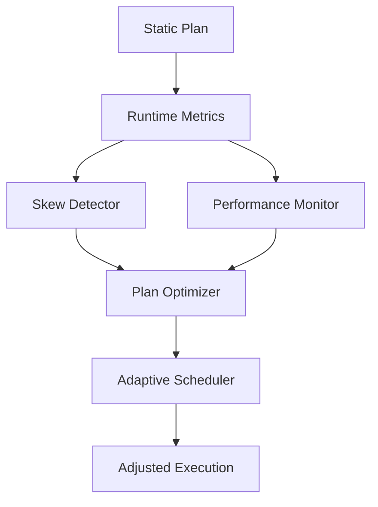

# Flink Adaptive Execution Engine V2

> **Stage**: Flink/02-core | **Prerequisites**: [Checkpoint Deep Dive](./flink-checkpoint-mechanism-deep-dive.md) | **Formal Level**: L4-L5
>
> **Flink Version**: 2.4.0 (Preview) | **Status**: Preview | **ETA**: 2026 Q3-Q4
>
> Intelligent execution plan optimization, runtime adaptive adjustment, skew detection, and resource allocation.

---

## 1. Definitions

**Def-F-02-51: Adaptive Execution Engine (AEE)**

Runtime engine that dynamically adjusts execution plans based on observed statistics:

$$
\text{AEE} = (\text{Plan}_0, \text{Metrics}, \text{Optimizer}, \text{Adjuster})
$$

**Def-F-02-52: Intelligent Execution Plan Optimizer (IEPO)**

Rewrites physical plans using runtime statistics rather than static estimates.

**Def-F-02-53: Skew Detector (SD)**

Identifies key distribution imbalance causing hot spots:

$$
\text{Skew}(K) = \frac{\max_{k \in K} \text{count}(k)}{\text{avg}_{k \in K} \text{count}(k)}
$$

**Def-F-02-54: Resource Adaptive Allocator (RAA)**

Dynamically scales task parallelism based on backlog and throughput metrics.

---

## 2. Properties

**Lemma-F-02-25: Adaptive Convergence**

The adaptive adjustment algorithm converges to a stable configuration within bounded iterations.

**Lemma-F-02-26: Skew Detection Completeness**

For skew factor $> 2$, the detector identifies the skewed key with probability $> 0.95$.

---

## 3. Relations

- **with Adaptive Scheduler**: AEE feeds decisions to the scheduler for resource reallocation.
- **with Backpressure**: AEE uses backpressure signals as feedback for adjustment.

---

## 4. Argumentation

**Why Adaptive Execution?**

Static plans based on cost models often deviate from runtime reality:

- Data skew not visible at planning time
- Network conditions vary
- External service latency changes

**Skew Handling Strategy**:

1. Detect skew via key distribution sampling
2. Split hot keys into sub-ranges
3. Assign additional parallelism to hot sub-ranges

**Anti-pattern: Over-oscillation**

Frequent adjustments can cause instability. Solution: hysteresis bands and cooldown periods.

---

## 5. Engineering Argument

**Thm-F-02-07 (Adaptive Execution Correctness)**: Runtime plan adjustments preserve semantics because they only change physical execution properties (parallelism, routing) without altering logical transformations.

---

## 6. Examples

```java
// AEE v2 configuration
Configuration config = new Configuration();
config.setBoolean("table.optimizer.adaptive-join.enabled", true);
config.setBoolean("table.optimizer.adaptive-local-agg.enabled", true);
config.setString("table.exec.skewed-join.optimization.strategy", "AUTO");
```

---

## 7. Visualizations

**AEE v2 Architecture**:



---

## 8. References
