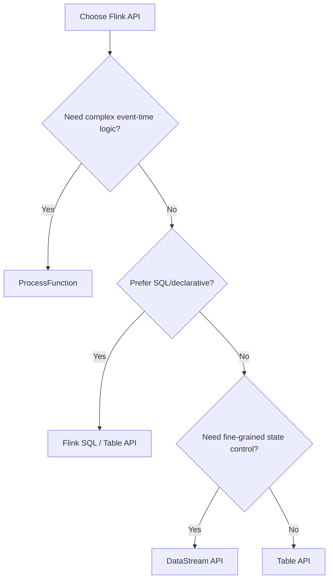

# Flink API Ecosystem Overview

> **Language**: English | **Source**: [Flink/03-api/README.md](../Flink/03-api/README.md) | **Last Updated**: 2026-04-21

---

## API Layered Architecture

Flink's API design follows the **layered abstraction principle**:

| Layer | API Type | Abstraction | Best For |
|-------|----------|-------------|----------|
| **L1: Stateful Stream Processing** | ProcessFunction | Lowest | Complex event-time logic, timers |
| **L2: DataStream** | DataStream API | Low | Stream transformations, keyed state |
| **L3: Table API** | Table API | Medium | Relational operations on streams |
| **L4: SQL** | Flink SQL | Highest | Declarative queries, analytics |

## API Selection Guide

## Key APIs

### DataStream API
- **Language**: Java, Scala, Python (PyFlink)
- **Abstraction**: Typed streams with transformations
- **State**: Keyed and operator state
- **Use case**: Custom stream processing logic

### Table API & SQL
- **Language**: Java/Scala (Table API), SQL (universal)
- **Abstraction**: Relational tables on streams
- **Optimization**: Calcite-based optimizer
- **Use case**: Analytics, ETL, reporting

### CEP (Complex Event Processing)
- **Language**: Flink SQL / DataStream
- **Abstraction**: Pattern matching over event sequences
- **Use case**: Fraud detection, monitoring, alerting

## Multi-Language Support

| Language | DataStream | Table API | SQL | CEP | Status |
|----------|-----------|-----------|-----|-----|--------|
| Java | ✅ Full | ✅ Full | ✅ Full | ✅ Full | Primary |
| Scala | ✅ Full | ✅ Full | ✅ Full | ✅ Full | Primary |
| Python | ✅ Partial | ✅ Full | ✅ Full | ⚠️ Limited | Growing |
| Rust | ⚠️ Experimental | ❌ | ❌ | ❌ | Early |

## References

[^1]: Apache Flink Documentation, "APIs", 2025.
[^2]: Apache Flink Documentation, "Table API & SQL", 2025.
