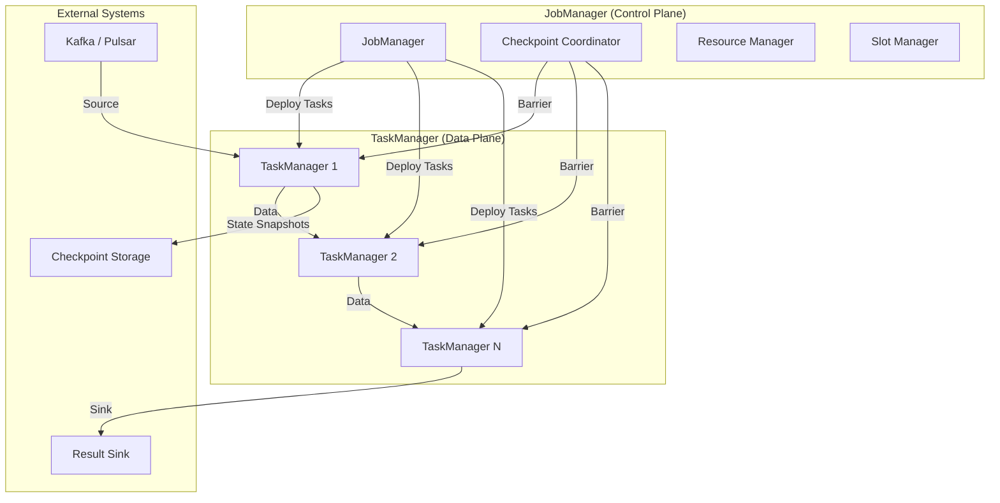

# Flink System Architecture Composition Analysis

> **Language**: English | **Source**: [Flink/01-concepts/flink-architecture-composition-analysis.md](../Flink/01-concepts/flink-architecture-composition-analysis.md) | **Last Updated**: 2026-04-21

---

## 1. Definitions

### Def-F-01-EN-01: JobManager (JM)

The control plane component of a Flink cluster, responsible for scheduling, coordination, and lifecycle management.

**Formal Definition**: Let $JM = (S, C, D)$, where:

- $S$: Scheduler — converts logical execution graph to physical execution graph
- $C$: Coordinators — CheckpointCoordinator, ResourceManager, etc.
- $D$: Scheduling decision function $D: \text{DAG} \times \text{ResourcePool} \rightarrow \text{DeploymentPlan}$

### Def-F-01-EN-02: TaskManager (TM)

The worker node responsible for actual data processing and local state maintenance.

**Formal Definition**: Let $TM_i = (T_i, M_i, K_i, N_i)$, where:

- $T_i$: Task slots — $|T_i|$ is the parallelism capacity
- $M_i$: Managed memory — for batch sorting, hash tables, RocksDB cache
- $K_i$: JVM heap — for user objects, network buffers, framework objects
- $N_i$: Network I/O thread pool — cross-TM data transfer

### Def-F-01-EN-03: Network Stack

The transport layer subsystem responsible for data exchange, serialization, and flow control.

**Formal Definition**: Let $NS = (B, Q, Ser, Des, BP)$, where:

- $B$: Network buffer pool
- $Q$: Credit-based flow control queues
- $Ser/Des$: Serializer / deserializer collections
- $BP$: Backpressure propagation $BP: \text{QueueFillLevel} \rightarrow \text{SourceRateAdjustment}$

### Def-F-01-EN-04: State Backend

The persistence abstraction for operator state storage, snapshots, and recovery.

**Formal Definition**: Let $SB = (Store, Snap, Restore)$, where:

- $Store: (Key, Value) \rightarrow \text{PersistentStorage}$
- $Snap: \text{State} \times \text{CheckpointID} \rightarrow \text{SnapshotHandle}$
- $Restore: \text{SnapshotHandle} \rightarrow \text{State}$

**Variants**:

| Backend | Storage | Best For |
|---------|---------|----------|
| MemoryStateBackend | JVM Heap | Development, small state (< 100MB) |
| FsStateBackend | JVM Heap → FileSystem | Medium state, fast recovery |
| RocksDBStateBackend | Local RocksDB → FileSystem | Large state (> 10GB), incremental CP |

### Def-F-01-EN-05: Checkpoint Coordinator

JobManager sub-component responsible for distributed consistent snapshot coordination.

**Formal Definition**: $CC = (BarrierInjector, Aligner, StateCollector, Completer)$

## 2. Architecture Composition

## 3. Component Interaction

| Interaction | Protocol | Frequency | Critical Path |
|-------------|----------|-----------|---------------|
| JM → TM Task deployment | Akka RPC | Once per job | Yes |
| TM → TM Data transfer | Netty + Credit-based FC | Continuous | Yes |
| CC → TM Checkpoint barrier | Akka RPC | Per checkpoint interval | Yes |
| TM → S3 State upload | FileSystem API | Per checkpoint | No (async) |
| TM → JM Heartbeat | Akka RPC | Every 10s | Yes |

## 4. Scaling Dimensions

| Dimension | Horizontal | Vertical |
|-----------|-----------|----------|
| **Throughput** | Add TaskManagers | Increase task slots per TM |
| **State Size** | Shard by key (key parallelism) | Increase TM memory / use RocksDB |
| **Latency** | Co-locate source and sink | Reduce network hops |
| **Availability** | Add JM HA (ZooKeeper/K8s) | Faster checkpoint intervals |

## References
