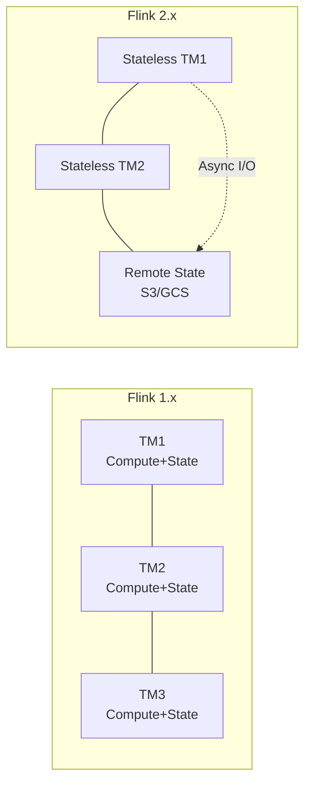

# Flink Architecture Evolution: 1.x to 2.x

> **Language**: English | **Source**: [Flink/01-concepts/flink-architecture-evolution-1x-to-2x.md](../Flink/01-concepts/flink-architecture-evolution-1x-to-2x.md) | **Last Updated**: 2026-04-21

---

## 1. Definitions

### Def-F-01-EN-25: Embedded State Architecture

Flink 1.x architecture where state storage is tightly coupled with compute tasks:

$$
\text{EmbeddedArch} = \langle TM, LocalStorage, StateBackend_{embedded}, SyncExecution \rangle
$$

Core constraint:

$$
\forall task \in Task. \; Location(State(task)) = Location(TM(task))
$$

**Characteristics**:

- State stored on TM local disk (RocksDB) or memory (HashMap)
- State lifecycle bound to compute resources
- Failure recovery requires full state migration

### Def-F-01-EN-26: Disaggregated State Architecture

Flink 2.x architecture separating state storage from compute nodes:

$$
\text{DisaggregatedArch} = \langle TM_{stateless}, RemoteStorage, StateService, AsyncExecution \rangle
$$

Core principle:

$$
\forall task \in Task. \; Location(task) \perp Location(State(task))
$$

**Characteristics**:

- State primary storage on remote object storage (S3/GCS/OSS)
- TaskManager maintains only local cache (L1/L2)
- Compute nodes can migrate freely without state transfer

### Def-F-01-EN-27: Synchronous vs. Asynchronous Execution

| Aspect | Sync (1.x) | Async (2.x) |
|--------|-----------|-------------|
| State access | Blocking | Non-blocking with futures |
| Pipeline | Stalls on cache miss | Continues with speculative execution |
| Latency | Deterministic | Lower average, higher variance |
| Throughput | Bounded by sync latency | Higher with batching |

## 2. Key Evolution Points

| Dimension | Flink 1.x | Flink 2.x |
|-----------|-----------|-----------|
| **State location** | TM local | Remote object storage |
| **State size limit** | TM disk capacity | Unlimited (cloud storage) |
| **Recovery time** | Proportional to state size | Near-instant (no state migration) |
| **Resource elasticity** | Limited (stateful rescaling) | Full (stateless TMs) |
| **Cost model** | Provision for peak state | Pay for actual compute |

## 3. Disaggregated State Benefits

| Benefit | Explanation |
|---------|-------------|
| **Instant recovery** | New TM reads state from remote, no data migration |
| **Independent scaling** | Scale compute without moving state |
| **Cost efficiency** | Use spot instances for stateless TMs |
| **Simplified ops** | No local disk management on TMs |

## 4. Trade-offs

| Concern | Mitigation |
|---------|-----------|
| Remote state latency | Local L1/L2 cache + prefetch |
| Network bandwidth | Compression + incremental sync |
| Consistency | Async checkpoint to remote with local write-ahead log |
| Cost | Tiered storage (hot SSD / warm S3 / cold glacier) |

## References
