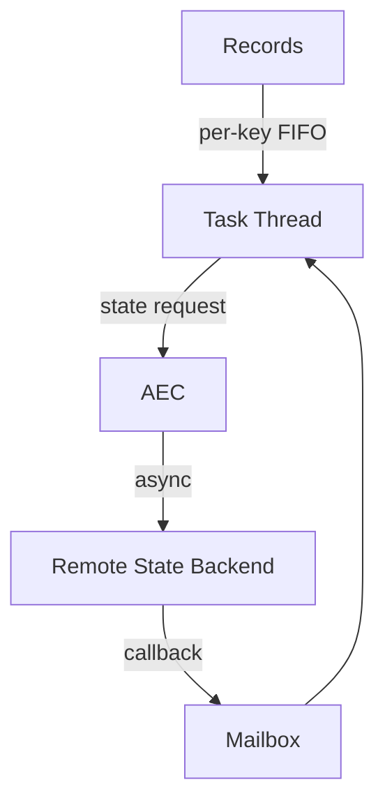

# Flink 2.0 Async Execution Model and AEC

> **Stage**: Flink/02-core | **Prerequisites**: [Disaggregated State](../01-concepts/disaggregated-state-analysis.md) | **Formal Level**: L4-L5
>
> Flink 2.0's Asynchronous Execution Controller (AEC) for non-blocking state access while preserving per-key FIFO ordering.

---

## 1. Definitions

**Def-F-02-30: Asynchronous Execution Controller (AEC)**

Flink 2.0 component managing async state access and callback execution:

$$
\text{AEC} = (S, \mathcal{P}, \mathcal{C}, \mathcal{W}, \delta, \gamma, \omega)
$$

where $S$ = state machine, $\mathcal{P}$ = pending requests, $\mathcal{C}$ = callbacks, $\mathcal{W}$ = watermark coordination.

**Def-F-02-31: Non-blocking State Access**

State requests return futures immediately, allowing the task thread to process other records while waiting for remote state backend responses.

**Def-F-02-32: Per-key FIFO**

Records sharing the same key are processed in arrival order, even with async state access.

---

## 2. Properties

**Lemma-F-02-09: AEC State Machine Completeness**

The AEC state machine covers all valid transitions between idle, pending, and completed states with no deadlocks.

**Lemma-F-02-10: Async State Monotonic Read**

For a given key, state reads observe monotonically increasing values because writes are serialized per key.

---

## 3. Relations

- **with Disaggregated State**: AEC is required for efficient access to remote state backends.
- **with Mailbox Model**: Callbacks are enqueued to the mailbox for in-order processing.

---

## 4. Argumentation

**Why Async Execution Preserves Flink 1.x Semantics**: Per-key FIFO guarantees that within each key, the execution order is identical to synchronous processing. Across different keys, ordering was already non-deterministic in 1.x.

**Throughput-Latency Trade-off**:

| Mode | Throughput | Latency | State Backend |
|------|-----------|---------|---------------|
| Sync | Baseline | Higher | Local (RocksDB) |
| Async | +30-50% | Lower | Remote (ForSt) |

---

## 5. Proofs

**Thm-F-02-05 (Semantic Preservation)**: Async execution with per-key FIFO produces the same output as sync execution for all deterministic user functions.

*Proof Sketch*: Per-key serialization ensures equivalence class preservation. Cross-key non-determinism is already present in 1.x. ∎

---

## 6. Examples

```java
// Enable async state (Flink 2.0+)
stream.keyBy(Event::getUserId)
    .enableAsyncState()
    .process(new AsyncStateProcessFunction());
```

---

## 7. Visualizations

**AEC Architecture**:



---

## 8. References
