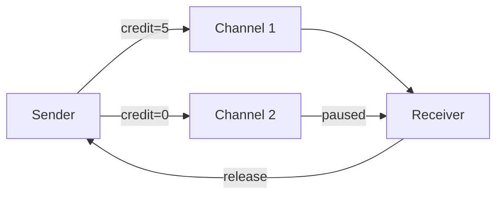

# Flink Backpressure and Flow Control

> **Stage**: Flink/02-core | **Prerequisites**: [Deployment Architecture](../01-concepts/deployment-architectures.md) | **Formal Level**: L3-L4
>
> Credit-based flow control, buffer debloating, network buffer pool management, and backpressure diagnostics.

---

## 1. Definitions

**Def-F-02-72: Backpressure**

When downstream processing rate $\mu$ < upstream production rate $\lambda$:

$$
\text{Backpressure} \iff \lambda > \mu \land \frac{dB}{dt} > 0
$$

**Def-F-02-73: Credit-Based Flow Control (CBFC)**

Flink 1.5+ per-channel flow control using credits:

$$
\text{Credit}(ch) = k > 0 \implies \text{Sender may send } k \text{ buffers}
$$

**Def-F-02-74: Buffer Debloating**

Dynamically adjusting buffer sizes to minimize latency while maintaining throughput.

**Def-F-02-75: Network Buffer Pool**

TaskManager-level managed buffer pool for CBFC physical resources.

---

## 2. Properties

**Prop-F-02-11: CBFC Deadlock Freedom**

Credit-based flow control with bounded buffers is deadlock-free because credit issuance is monotonic.

**Prop-F-02-12: Backpressure Rate Adaptation**

Backpressure propagates upstream, causing source rate reduction proportional to bottleneck severity.

**Prop-F-02-13: Buffer Isolation**

Per-channel buffers ensure local failures do not affect other channels.

---

## 3. Relations

- **with TCP Flow Control**: CBFC is a superset providing task-level granularity.
- **with Checkpoint**: Backpressure can delay barrier propagation, affecting checkpoint duration.

---

## 4. Argumentation

**Why CBFC Replaced TCP Flow Control (Flink 1.5)**:

| Factor | TCP | CBFC |
|--------|-----|------|
| Granularity | Connection | Channel (task) |
| Isolation | None | Per-channel |
| Head-of-line | Yes | No |

**Buffer Debloating Trade-off**:

| Buffer Size | Latency | Throughput |
|-------------|---------|------------|
| Small | Low | Lower |
| Large | High | Higher |
| Debloated | Optimized | Maintained |

---

## 5. Engineering Argument

**Thm-F-02-09 (CBFC Safety)**: CBFC ensures no buffer overflow because sender cannot exceed granted credits.

**Thm-F-02-10 (Backpressure Convergence)**: Backpressure propagates to source in finite steps, bounded by pipeline depth.

---

## 6. Examples

```java
// Buffer debloating configuration
Configuration config = new Configuration();
config.setInteger(TaskManagerOptions.MEMORY_NETWORK_MIN, 64);
config.setInteger(TaskManagerOptions.MEMORY_NETWORK_MAX, 256);
config.setBoolean(TaskManagerOptions.NETWORK_MEMORY_BUFFER_DEBLOAT_ENABLED, true);
```

---

## 7. Visualizations

**Credit-Based Flow Control**:



---

## 8. References
