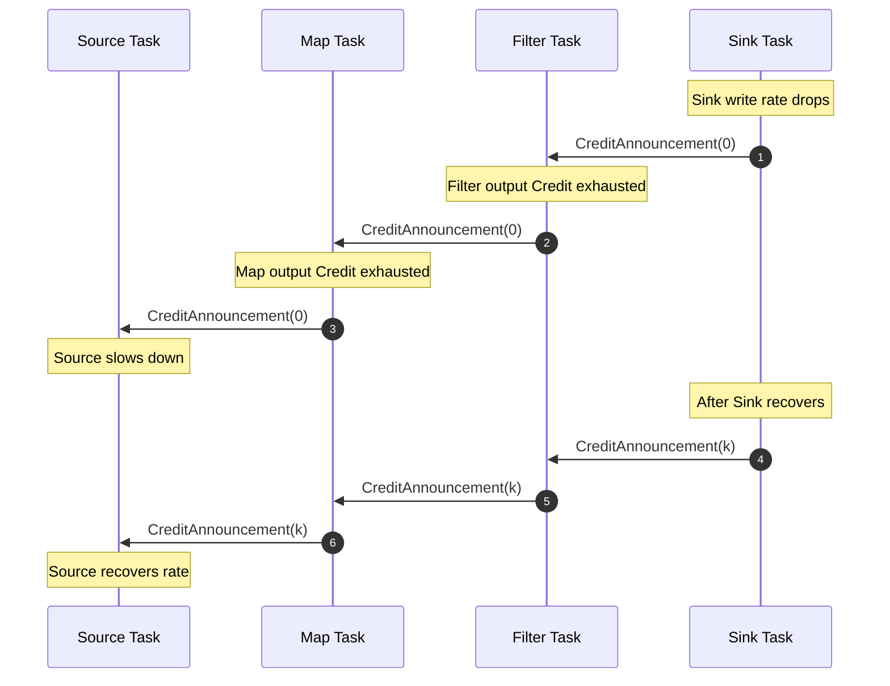
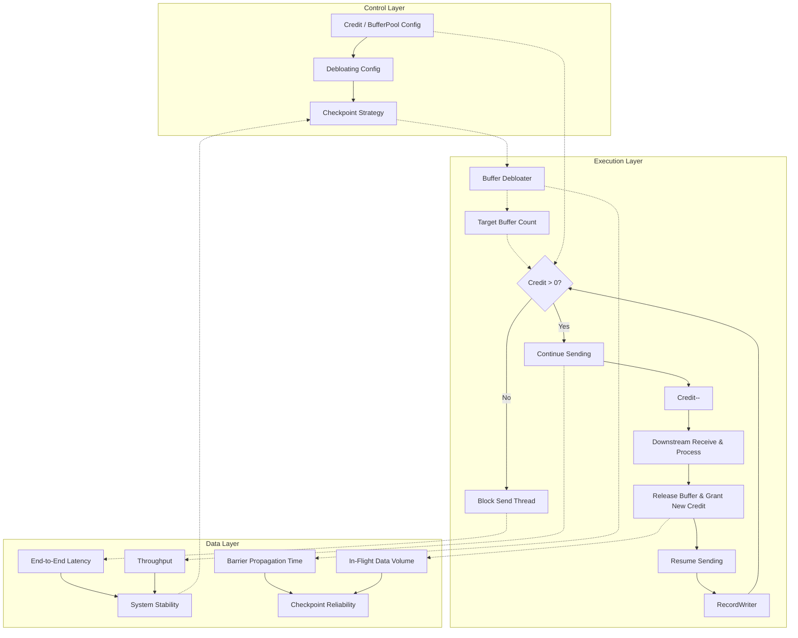
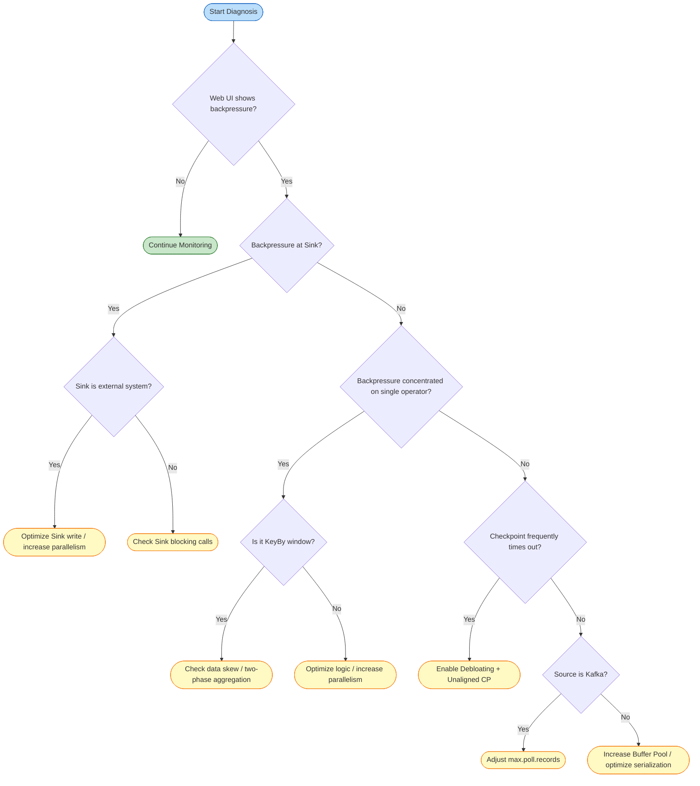
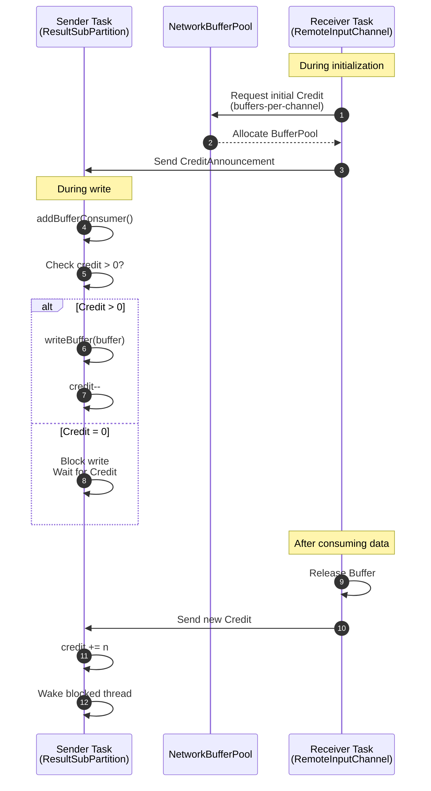
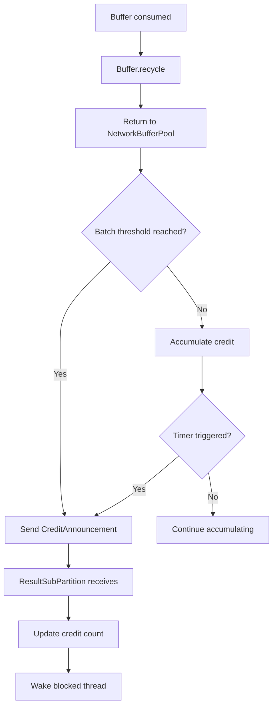
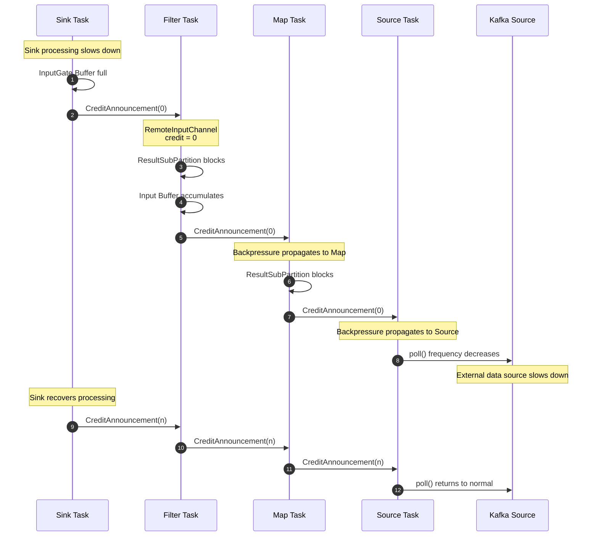

# Flink Backpressure and Flow Control Mechanisms

> Stage: Flink/ | Prerequisites: [Flink Deployment Architectures](../01-concepts/deployment-architectures.md) | Formalization Level: L3-L4

---

## Table of Contents

- [Flink Backpressure and Flow Control Mechanisms](#flink-backpressure-and-flow-control-mechanisms)
  - [Table of Contents](#table-of-contents)
  - [1. Definitions](#1-definitions)
    - [Def-F-02-01 Backpressure](#def-f-02-01-backpressure)
    - [Def-F-02-02 Credit-based Flow Control (CBFC)](#def-f-02-02-credit-based-flow-control-cbfc)
    - [Def-F-02-03 TCP Backpressure (Legacy TCP-based Backpressure)](#def-f-02-03-tcp-backpressure-legacy-tcp-based-backpressure)
    - [Def-F-02-04 Local Backpressure vs End-to-End Backpressure](#def-f-02-04-local-backpressure-vs-end-to-end-backpressure)
    - [Def-F-02-05 Buffer Debloating](#def-f-02-05-buffer-debloating)
    - [Def-F-02-06 Network Buffer Pool](#def-f-02-06-network-buffer-pool)
    - [Def-F-02-07 Backpressure Monitoring Metrics](#def-f-02-07-backpressure-monitoring-metrics)
  - [2. Properties](#2-properties)
    - [Prop-F-02-01 CBFC Guarantees Deadlock Freedom](#prop-f-02-01-cbfc-guarantees-deadlock-freedom)
    - [Prop-F-02-02 Backpressure Propagation Guarantees Upstream Rate Adaptation](#prop-f-02-02-backpressure-propagation-guarantees-upstream-rate-adaptation)
    - [Prop-F-02-03 Buffer Isolation Guarantees Localized Fault Containment](#prop-f-02-03-buffer-isolation-guarantees-localized-fault-containment)
    - [Prop-F-02-04 Buffer Debloating Shortens Checkpoint Barrier Propagation Time](#prop-f-02-04-buffer-debloating-shortens-checkpoint-barrier-propagation-time)
    - [Prop-F-02-05 Credit System Guarantees Receiver Buffer Non-Overflow](#prop-f-02-05-credit-system-guarantees-receiver-buffer-non-overflow)
  - [3. Relations](#3-relations)
    - [Relation 1: Flink CBFC `⊃` TCP Flow Control](#relation-1-flink-cbfc--tcp-flow-control)
    - [Relation 2: Local Backpressure `→` End-to-End Backpressure](#relation-2-local-backpressure--end-to-end-backpressure)
    - [Relation 3: Backpressure `↔` Checkpoint Reliability](#relation-3-backpressure--checkpoint-reliability)
  - [4. Argumentation](#4-argumentation)
    - [4.1 Why Flink 1.5 Had to Replace TCP Flow Control with CBFC](#41-why-flink-15-had-to-replace-tcp-flow-control-with-cbfc)
    - [4.2 Applicability Boundaries of Buffer Debloating](#42-applicability-boundaries-of-buffer-debloating)
    - [4.3 Impact of Buffer Debloating on Checkpointing](#43-impact-of-buffer-debloating-on-checkpointing)
    - [4.4 Structural Lemmas for Backpressure Diagnosis](#44-structural-lemmas-for-backpressure-diagnosis)
  - [5. Proof / Engineering Argument](#5-proof--engineering-argument)
    - [Theorem 5.1 (CBFC Safety)](#theorem-51-cbfc-safety)
    - [Theorem 5.2 (Backpressure Propagation Converges in Finite Steps)](#theorem-52-backpressure-propagation-converges-in-finite-steps)
    - [Engineering Argument 5.3 (Buffer Debloating + Unaligned Checkpoint Joint Selection)](#engineering-argument-53-buffer-debloating--unaligned-checkpoint-joint-selection)
  - [6. Examples](#6-examples)
    - [Example 6.1: Normal Credit-based Backpressure Propagation](#example-61-normal-credit-based-backpressure-propagation)
    - [Counter-Example 6.2: High Parallelism Gap Causes OOM](#counter-example-62-high-parallelism-gap-causes-oom)
    - [Example 6.3: Buffer Debloating Tuning Configuration](#example-63-buffer-debloating-tuning-configuration)
    - [Counter-Example 6.4: Kafka Source Backpressure Blind Spot](#counter-example-64-kafka-source-backpressure-blind-spot)
  - [7. Visualizations](#7-visualizations)
    - [Figure 7.1: Credit-based Backpressure Propagation in a Flink Pipeline](#figure-71-credit-based-backpressure-propagation-in-a-flink-pipeline)
    - [Figure 7.2: Control-Execution-Data Layer Correlation Diagram](#figure-72-control-execution-data-layer-correlation-diagram)
    - [Figure 7.3: Backpressure Diagnosis and Tuning Decision Tree](#figure-73-backpressure-diagnosis-and-tuning-decision-tree)
  - [8. Source Code Analysis](#8-source-code-analysis)
    - [8.1 Credit-based Flow Control Source Code Analysis](#81-credit-based-flow-control-source-code-analysis)
      - [8.1.1 Core Classes and Overall Architecture](#811-core-classes-and-overall-architecture)
      - [8.1.2 ResultSubPartition Write Control Logic](#812-resultsubpartition-write-control-logic)
      - [8.1.3 RemoteInputChannel Credit Feedback Mechanism](#813-remoteinputchannel-credit-feedback-mechanism)
      - [8.1.4 BufferPool Memory Management Strategy](#814-bufferpool-memory-management-strategy)
      - [8.1.5 Complete Backpressure Propagation Call Chain](#815-complete-backpressure-propagation-call-chain)
    - [8.2 Buffer Debloating Source Implementation](#82-buffer-debloating-source-implementation)
  - [9. References](#9-references)

## 1. Definitions

### Def-F-02-01 Backpressure

Let the producer aggregate rate be $R_{prod}(t)$, the consumer aggregate rate be $R_{cons}(t)$, and the buffer occupancy rate be $\rho(B, t)$:

$$
\text{Backpressure}(t) \iff R_{prod}(t) > R_{cons}(t) \land \lim_{t' \to t^+} \rho(B, t') = 1
$$

**Definition Rationale**: This definition elevates backpressure from a "phenomenon" to a system state that is detectable, quantifiable, and formally analyzable[^1].

---

### Def-F-02-02 Credit-based Flow Control (CBFC)

Let the sender be $S$, the receiver be $R$, and the logical channel be $ch(S, R)$:

$$
\begin{aligned}
&\text{Credit}(ch) = k > 0 \implies S \text{ may send at most } k \text{ network buffers to } R \\
&\text{Credit}(ch) = 0 \implies S \text{ pauses sending}
\end{aligned}
$$

Flink 1.5+ implements CBFC on `RemoteInputChannel`: the receiver feeds back the number of available buffers as credit to the upstream `ResultSubPartition`, and the upstream only writes data when credit > 0[^2][^3].

**Definition Rationale**: CBFC achieves zero-wait rate regulation via task-level pre-authorization, preventing a single slow task from blocking other channels on the same TCP connection[^4].

---

### Def-F-02-03 TCP Backpressure (Legacy TCP-based Backpressure)

Before Flink 1.5, flow control between TaskManagers relied entirely on the TCP sliding window:

$$
\text{TCP-Backpressure}(t) \iff \text{SocketBuf}_{occ}(t) \rightarrow \text{SocketBuf}_{cap} \land \text{AdvertisedWindow}(t) \rightarrow 0
$$

**Definition Rationale**: TCP's "connection-level" semantics exhibit an impedance mismatch with Flink's "task-level" channels — all channels on the same connection stall when a single channel experiences backpressure.

---

### Def-F-02-04 Local Backpressure vs End-to-End Backpressure

- **Local Backpressure (Local)**: The downstream processes slowly, causing data to accumulate in the same thread's local buffer and blocking `collect()`. Propagation delay $\tau_{local} \approx 0$.
- **End-to-End Backpressure (End-to-End)**: After the Sink rate drops, the backpressure signal traverses the inverse topology across multiple TaskManagers to reach the Source:

$$
\tau_{e2e} = \sum_{e \in Path_{src \to sink}} \tau_{credit}(e) + \tau_{network}(e)
$$

**Definition Rationale**: The Web UI backpressure reflects local thread blocking, while end-to-end latency and Checkpoint timeouts reflect cross-network backpressure accumulation.

---

### Def-F-02-05 Buffer Debloating

For subtask $v$ at current throughput $\lambda_v(t)$, Debloating dynamically adjusts the input gate target buffer count:

$$
N_{target}(v, t) = \left\lceil \frac{\lambda_v(t) \cdot T_{target}}{\text{BufferSize}} \right\rceil
$$

Where $T_{target}$ is controlled by `taskmanager.network.memory.buffer-debloat.target` (default ~ 1s)[^5][^6].

**Definition Rationale**: Fixed buffers cause excessive in-flight data during backpressure, slowing down Checkpoint Barrier propagation or increasing Unaligned Checkpoint size[^7].

---

### Def-F-02-06 Network Buffer Pool

Each TaskManager maintains a local buffer pool for each task:

$$
\text{LBP}(T) = \langle B_{net}, B_{in}, B_{out}, B_{floating}, B_{reserved} \rangle
$$

Where $B_{in}$ are exclusive buffers, $B_{floating}$ are floating buffers, and $B_{reserved}$ are reserved for Credit and Barrier messages.

**Definition Rationale**: LBP isolation is the physical foundation of Flink backpressure "localization." Without isolation, downstream backpressure would cascade to unrelated upstream tasks.

---

### Def-F-02-07 Backpressure Monitoring Metrics

Flink exposes the following core backpressure and flow control metrics[^8]:

| Metric Name | Type | Semantics |
|---------|------|---------|
| `backPressuredTimeMsPerSecond` | Counter | Milliseconds of backpressure per second; approaching 1000 indicates severity |
| `numRecordsInPerSecond` / `numRecordsOutPerSecond` | Meter | Input/output record rates |
| `outPoolUsage` / `inPoolUsage` | Gauge | Output/input buffer pool utilization |
| `debloatedBufferSize` | Gauge | Current target buffer size from Debloating |
| `estimatedTimeToConsumeBuffersMs` | Gauge | Estimated time to consume input channel buffer data |
| `numBuffersInRemotePerSecond` | Meter | Buffers received per second from remote TMs |
| `numBuffersOutPerSecond` | Meter | Buffers sent per second |

---

## 2. Properties

### Prop-F-02-01 CBFC Guarantees Deadlock Freedom

**Derivation**: Backpressure propagates along inverse edges of the DAG. A DAG is acyclic; deadlock would require a cyclic wait chain, which in turn requires a directed cycle in the data flow — a contradiction. ∎

---

### Prop-F-02-02 Backpressure Propagation Guarantees Upstream Rate Adaptation

If the Sink consumption rate drops, there exists a finite time $\Delta t$ such that the Source read rate $R_{src}(t + \Delta t) \leq R_{sink}(t)$.

**Derivation**: Once the Sink input buffer is full, it stops granting Credit to the upstream. The upstream blocks its output because Credit = 0, which in turn causes its own input buffer to fill. Given the finite DAG depth $d$, the signal reaches the Source after at most $d$ levels of propagation, and the Source slows down to match the downstream rate. ∎

---

### Prop-F-02-03 Buffer Isolation Guarantees Localized Fault Containment

If operator $v_i$ experiences backpressure, operator $v_j$ with no data dependency on $v_i$ is unaffected.

**Derivation**: Each task owns an independent LBP (Def-F-02-06), and backpressure propagates only through the Credit mechanism. If $v_j$ has no transitive dependency on $v_i$, no Credit dependency chain exists between them. ∎

---

### Prop-F-02-04 Buffer Debloating Shortens Checkpoint Barrier Propagation Time

Let $T_{barrier}$ be the time for a Barrier to traverse the queue under Aligned Checkpoint. After enabling Debloating, $\mathbb{E}[T'_{barrier}] \ll \mathbb{E}[T_{barrier}]$.

**Derivation**: Debloating reduces in-flight data from a fixed maximum $|B_{max}|$ to the minimum $|B_{target}|$ required to keep the link saturated. The Barrier must follow buffered data; less data means shorter queuing time. For Unaligned Checkpoint, it also reduces the amount of data that needs to be materialized[^7]. ∎

---

### Prop-F-02-05 Credit System Guarantees Receiver Buffer Non-Overflow

For any channel $ch(S, R)$ and any time $t$, $\text{Sent}(t) \leq \text{Granted}(t) \leq \text{BufferCapacity}$.

**Derivation**: Initially $\text{Sent}(0)=0$, $\text{Granted}(0)=|B_{free}|$. The sending precondition is $\text{Credit}>0$ (Def-F-02-02). Each send increments $\text{Sent}$ by 1 and decrements $\text{Credit}$ by 1, so $\text{Granted}=\text{Credit}+\text{Sent}$ is an invariant. The receiver only grants new Credit after releasing buffers, so $\text{Granted}$ never exceeds total capacity. ∎

> **Inference [Control→Execution]**: Credit thresholds and Buffer Pool configuration (control layer) ⟹ sender blocking/resumption timing and network memory allocation (execution layer).
>
> **Basis**: After the control layer sets `buffers-per-channel`, `floating-buffers-per-gate`, and `buffer-debloat.enabled`, the execution layer `RecordWriter` sends when `Credit > 0` and blocks when `Credit = 0`.

---

## 3. Relations

### Relation 1: Flink CBFC `⊃` TCP Flow Control

**Argument**:

- **Encoding Existence**: The TCP sliding window can be encoded as a special case of Credit-based control — the AdvertisedWindow is treated as dynamic Credit, and ACKs serve as implicit reclamation notifications.
- **Separation Result**: Flink CBFC possesses task-level fine-grained control and application-level observability that TCP lacks.
- **Conclusion**: Flink CBFC strictly subsumes TCP Flow Control in expressive power.

| Dimension | TCP-based Backpressure (Legacy) | Credit-based Flow Control (Flink 1.5+) |
|------|--------------------------------|---------------------------------------|
| Control Layer | Transport layer (kernel space) | Application layer (user space) |
| Control Granularity | Connection-level | Task/subtask-level (logical channel-level) |
| Feedback Mechanism | ACK + AdvertisedWindow | Credit Announcement + Backlog Size |
| Buffer Location | Kernel Socket Buffer | User-space Network Buffer Pool |
| Backpressure Propagation Speed | Depends on RTT, slower | Application-layer local decision, faster |
| Multiplexing Impact | Single channel backpressure blocks entire connection | Single channel backpressure affects only that channel |
| Observability | Black box | White box (directly exposed via Web UI / Metrics) |
| Barrier Propagation | May block under severe backpressure | Reserved buffers guarantee control message reachability |

*Table 1: Comparison of TCP-based vs Credit-based Backpressure Mechanisms*

---

### Relation 2: Local Backpressure `→` End-to-End Backpressure

**Relation**: Local backpressure is the "atomic step" of end-to-end backpressure propagation; end-to-end backpressure is the global closure of local backpressure over the inverse DAG topology.

**Argument**: Each hop of end-to-end backpressure consists of two phases: (1) the downstream input buffer fills, causing local backpressure; (2) the downstream stops granting Credit, and the upstream output is blocked. Let the local backpressure relation be $\mathcal{R}_{local}$; then end-to-end backpressure is $\mathcal{R}_{e2e} = \mathcal{R}_{local}^+$ (transitive closure).

---

### Relation 3: Backpressure `↔` Checkpoint Reliability

**Argument**:

- **Backpressure → Checkpoint**: Severe backpressure causes Aligned Checkpoint Barriers to queue in the data stream for extended periods, leading to Checkpoint timeouts. In this case, Unaligned Checkpoint or Buffer Debloating must be enabled[^7].
- **Checkpoint → Backpressure**: Unaligned Checkpoint materializes in-flight data into the state backend; if the data volume is too large, the Checkpoint size surges, exacerbating I/O backpressure. Therefore, Buffer Debloating is needed as a prerequisite to control data volume[^6].
- **Conclusion**: Backpressure governance and Checkpoint tuning must be designed as an integrated whole.

> **Inference [Execution→Data]**: Backpressure propagation speed (execution layer) ⟹ end-to-end latency and Checkpoint reliability (data layer).
>
> **Basis**: The latency of execution-layer Credit Announcements determines how long the backpressure signal takes to reach the Source. Slow propagation can cause intermediate buffer overflow or OOM; Barrier queuing timeouts can break Checkpoint consistency guarantees.

---

## 4. Argumentation

### 4.1 Why Flink 1.5 Had to Replace TCP Flow Control with CBFC

**Scenario**: On one TM, 10 parallel `Map` tasks send data to 10 `Filter` tasks on another TM via the same TCP connection, where 1 `Filter` slows down due to data skew.

**TCP Consequence**: Once the slow `Filter`'s Socket buffer fills, TCP sets AdvertisedWindow to 0, and all 10 upstream `Map` tasks block. Global throughput drops by 90%.

**CBFC Improvement**: Each `Map → Filter` channel has independent Credit. The slow `Filter` only stops granting Credit to its corresponding upstream `Map`; the other 9 channels operate normally. Global throughput drops by only about 10%.

Therefore, the transition from TCP to CBFC represents a paradigm leap in flow control semantics from "connection-level" to "channel-level"[^2][^4].

---

### 4.2 Applicability Boundaries of Buffer Debloating

Debloating does not yield positive benefits in all scenarios[^5][^6]:

**Multiple Inputs and Union Inputs**: If a subtask has multiple distinct input sources or `union` inputs, Debloating computes throughput at the subtask level uniformly. Low-throughput inputs may receive excessive buffers, while high-throughput inputs may be starved. It is recommended to disable Debloating for such subtasks or tune parameters manually.

**Extremely High Parallelism**: When parallelism exceeds approximately 200, the default number of floating buffers may be insufficient, and Debloating calculations may exhibit violent fluctuations. It is recommended to raise `floating-buffers-per-gate` to a level comparable to the parallelism[^5].

**Startup and Recovery Phases**: During job startup or the initial phase of failure recovery, throughput has not yet stabilized, and Debloating measurement samples are insufficient. Flink 1.19+ introduced `taskmanager.memory.starting-segment-size` (default 1024B) to mitigate startup-phase issues[^9].

**Memory Footprint Limitation**: Debloating currently only adjusts the "usage ceiling" of target buffers; it does not reduce the physical allocation of the Network Buffer Pool. To truly reduce memory footprint, `buffers-per-channel` or `segment-size` must be manually reduced[^5].

---

### 4.3 Impact of Buffer Debloating on Checkpointing

**Principle**:

$$
N_{target}(v, t) = \left\lceil \frac{\lambda_v(t) \cdot T_{target}}{\text{BufferSize}} \right\rceil
$$

**Impact on Checkpoint**:

- Reduces in-flight data in buffers
- Accelerates Checkpoint Barrier propagation speed
- Reduces the data size of Unaligned Checkpoint

**Configuration**:

```yaml
taskmanager.network.memory.buffer-debloat.target: 1000ms
taskmanager.network.memory.buffer-debloat.enabled: true
```

**Trade-offs**:

| Scenario | Recommended Configuration |
|------|----------|
| Low latency priority | Enable Debloating, target 500ms |
| High throughput priority | Disable Debloating, increase buffers |
| Large-state jobs | Enable Debloating, combined with Unaligned Checkpoint |

**Thm-F-02-10: Debloating Accelerates Checkpoint Barrier Propagation**

**Theorem**: After enabling Buffer Debloating, the expected time for Checkpoint Barriers to traverse the queue is significantly reduced.

**Proof**:
Let $T_{barrier}$ be the time for a Barrier to traverse fixed buffers under Aligned Checkpoint, and let the buffer count be $N_{max}$.

After enabling Debloating, the buffer count is adjusted to $N_{target}(t) \leq N_{max}$.

In-flight data is reduced from $N_{max} \cdot \text{BufferSize}$ to $N_{target}(t) \cdot \text{BufferSize}$.

The queued data that the Barrier must follow is reduced, so $\mathbb{E}[T'_{barrier}] \ll \mathbb{E}[T_{barrier}]$. ∎

---

### 4.4 Structural Lemmas for Backpressure Diagnosis

**Lemma 4.1 (Backpressure Location Determination)**: If the Web UI shows that operator $v$ has `backPressuredTimeMsPerSecond` close to 1000, and its downstream $v_{next}$ has `numRecordsInPerSecond` significantly lower than $v$'s `numRecordsOutPerSecond`, then the backpressure source lies between $v$ and $v_{next}$.

**Proof**: By Def-F-02-01, backpressure arises from rate mismatch + buffer saturation. $v$ has a high output rate while $v_{next}$ has a low input rate, indicating a bottleneck in $v_{next}$ or its downstream, causing $v$'s output buffer to accumulate and triggering local backpressure. ∎

**Lemma 4.2 (Credit Announcement Is Not Blocked by Data Backpressure)**: At any time, if there are reclaimable segments in the receiver $R$'s buffer, the sender $S$ will eventually receive new Credit within finite time.

**Proof**: By Def-F-02-06, the Network Buffer Pool reserves $B_{reserved}$ for control messages. Even if $R$'s data processing is completely blocked, $B_{reserved}$ can still be used to send Credit Announcements. ∎

---

## 5. Proof / Engineering Argument

### Theorem 5.1 (CBFC Safety)

Under the premise that the Flink CBFC mechanism operates normally, for any channel $ch(S, R)$ and any time $t$, $\text{Overflow}(ch, t)$ is unreachable.

**Proof**:

**Invariant $I$**: $\text{InFlight}(t) = \text{Sent}(t) - \text{Consumed}(t) \leq \text{Credit}_{total}(t)$

**Base Case** ($t = 0$): $\text{Sent}(0) = 0$, $\text{Consumed}(0) = 0$, $\text{Credit}_{total}(0) = |B_{free}| \leq \text{Cap}(ch)$. Holds.

**Inductive Step**: Assume the invariant holds at $t$:

1. **Send Event**: Precondition $\text{Credit}(S, R) > 0$ (Def-F-02-02). $\text{Sent}$ increments by 1, $\text{Credit}$ decrements by 1, $\text{InFlight}$ increments by 1 but remains within $\text{Credit}_{total}$. Invariant preserved.
2. **Consume Event**: $R$ processes a record, $\text{Consumed}$ increments by 1, and after buffer release new Credit may be granted. $\text{InFlight}$ decreases; invariant preserved.

Since $\text{Credit}_{total}(t) \leq \text{Cap}(ch)$, and control-message buffers are isolated from data buffers (Def-F-02-06), $\text{Occ}(ch, t) = \text{InFlight}(t) \leq \text{Cap}(ch)$. By Def-F-02-01, $\text{Overflow}(ch, t)$ is false. ∎

---

### Theorem 5.2 (Backpressure Propagation Converges in Finite Steps)

Let $d$ be the longest path length in the Flink DAG. If the Sink triggers backpressure at $t_0$, then by at most $t_0 + d \cdot \tau_{max}$ all Sources will perceive the backpressure, where $\tau_{max}$ is the maximum single-level Credit propagation delay.

**Proof**: Structural induction.

**Base Case** ($d = 1$): Source perceives within $\leq \tau_{max}$.

**Inductive Hypothesis**: Holds for depth $\leq k$.

**Inductive Step** ($d = k + 1$): Let the Sink be $s$, with direct predecessors $\{p_i\}$. At $t_0$, $s$ stops granting Credit to all $p_i$, and $p_i$ perceive within $t_0 + \tau_{max}$. For each $p_i$, the subgraph with $p_i$ as the local Sink has depth $\leq k$. By the inductive hypothesis, backpressure reaches all Sources within additional $k \cdot \tau_{max}$. Total delay $\leq (k+1) \cdot \tau_{max}$. ∎

---

### Engineering Argument 5.3 (Buffer Debloating + Unaligned Checkpoint Joint Selection)

Let the system state be $\langle \text{BP}_{severity}, \lambda_{variance}, P_{parallelism}, M_{network} \rangle$.

**Decision Rules**:

1. **Low backpressure, low variance**: Default Aligned Checkpoint, Debloating disabled.
2. **Medium backpressure, high variance**: Enable Debloating + Aligned Checkpoint. Automatically adapts to variance, reduces in-flight data, and shortens Checkpoint time[^7].
3. **High backpressure with frequent Checkpoint timeouts**: Enable Debloating + Unaligned Checkpoint. Unaligned allows the Barrier to skip the data queue; Debloating controls the materialized data volume, preventing Checkpoint size explosion[^6].
4. **Parallelism > 200**: Raise `floating-buffers-per-gate` to the parallelism level; otherwise Debloating calculations may fail[^5].
5. **Strictly limited network memory**: Manually reduce `buffers-per-channel` (even to 0) and `segment-size`. Debloating does not reduce physical memory allocation[^5].

---

## 6. Examples

### Example 6.1: Normal Credit-based Backpressure Propagation

Flink job `KafkaSource → Map → Filter → KafkaSink`:

1. Sink write rate drops → stops granting Credit to Filter.
2. Filter output Credit exhausted → blocks sending, input buffer accumulates.
3. Filter stops consuming from Map → Map output Credit exhausted.
4. Map stops consuming from Source → KafkaSource slows down, `poll()` frequency decreases, system reaches steady state.

---

### Counter-Example 6.2: High Parallelism Gap Causes OOM

**Scenario**: `Source → HighParallelismMap(p=100) → LowParallelismWindow(p=1) → Sink`

- Source rate: 100,000 rec/s, Buffer Pool: 512 MB, Credit delay: 50ms

The Window processing rate is only 5,000 rec/s. Before the 50ms backpressure takes effect, 100 Maps continue sending: $100,000 \times 100 \times 0.05 = 500,000$ rec ≈ 500 MB, triggering OOM.

**Analysis**: Violates the assumption in Theorem 5.2 that $\tau_{max}$ is sufficiently small. When the parallelism difference is extreme, intermediate buffers must be increased, local aggregation introduced, or the Source rate reduced[^1].

---

### Example 6.3: Buffer Debloating Tuning Configuration

**Scenario**: E-commerce real-time recommendation job; during evening promotions, Aligned Checkpoint spikes from 3s to over 30s.

```yaml
taskmanager.network.memory.buffer-debloat.enabled: true
taskmanager.network.memory.buffer-debloat.period: 500ms
taskmanager.network.memory.buffer-debloat.samples: 20
taskmanager.network.memory.buffer-debloat.threshold-percentages: 25,100
taskmanager.network.memory.floating-buffers-per-gate: 150
execution.checkpointing.unaligned: true
execution.checkpointing.max-aligned-checkpoint-size: 1mb
```

**Results**: Before tuning, `backPressuredTimeMsPerSecond ≈ 950`, average Checkpoint 28s, timeout rate 15%. After tuning, peak drops to ~600, average Checkpoint 6s, timeout rate 0%.

---

### Counter-Example 6.4: Kafka Source Backpressure Blind Spot

**Scenario**: `KafkaSource → SlowOperator → Sink`, `max.poll.records=500`.

SlowOperator backpressure causes the Flink thread `poll()` frequency to decrease, but the Kafka Consumer internal fetcher thread continues pulling messages into the `FetchedRecords` queue in the background. This manifests as expanding Consumer Lag or JVM heap memory pressure.

**Analysis**: Flink internal backpressure cannot control external client prefetching. Must be combined with reducing `max.poll.records` and increasing `fetch.min.bytes`[^1].

---

## 7. Visualizations

### Figure 7.1: Credit-based Backpressure Propagation in a Flink Pipeline



**Figure Description**: The downstream feeds back available buffers to the upstream via `CreditAnnouncement`. Propagation time is $O(d \cdot \tau_{max})$.

---

### Figure 7.2: Control-Execution-Data Layer Correlation Diagram



---

### Figure 7.3: Backpressure Diagnosis and Tuning Decision Tree



---

## 8. Source Code Analysis

### 8.1 Credit-based Flow Control Source Code Analysis

#### 8.1.1 Core Classes and Overall Architecture

**Core Classes**: `ResultSubPartition`, `RemoteInputChannel`, `BufferPool`, `NetworkBufferPool`

**Source Locations**:

- `flink-runtime/src/main/java/org/apache/flink/runtime/io/network/partition/ResultSubPartition.java`
- `flink-runtime/src/main/java/org/apache/flink/runtime/io/network/partition/consumer/RemoteInputChannel.java`
- `flink-runtime/src/main/java/org/apache/flink/runtime/io/network/buffer/BufferPool.java`
- `flink-runtime/src/main/java/org/apache/flink/runtime/io/network/buffer/NetworkBufferPool.java`

The overall call chain of Credit-based Flow Control (CBFC) is shown below:



#### 8.1.2 ResultSubPartition Write Control Logic

**Source Analysis**: `ResultSubPartition.addBufferConsumer()`

```java
// Simplified pseudocode showing core logic
public class ResultSubPartition {
    private final int[] credits;  // Available credit per channel
    private final Queue<BufferConsumer>[] pendingQueues;  // Pending send queues

    /**
     * Add buffer to subpartition, controlled by credit
     */
    public void addBufferConsumer(BufferConsumer buffer, int targetChannel) {
        // Get available credit for target channel
        int availableCredit = credits[targetChannel];

        if (availableCredit > 0) {
            // Available credit exists, write directly
            writeBufferToChannel(buffer, targetChannel);
            credits[targetChannel]--;
        } else {
            // Credit exhausted, add to waiting queue
            pendingQueues[targetChannel].add(buffer);

            // Trigger backpressure signal
            if (getBackPressureStrategy() == BackPressureStrategy.BLOCK) {
                blockWriterThread();
            }
        }
    }

    /**
     * Handle credit feedback (triggered by RemoteInputChannel)
     */
    public void onCreditAnnouncement(int channelIndex, int credit) {
        // Increase available credit
        credits[channelIndex] += credit;

        // Process buffers in waiting queue
        Queue<BufferConsumer> pending = pendingQueues[channelIndex];
        while (!pending.isEmpty() && credits[channelIndex] > 0) {
            BufferConsumer buffer = pending.poll();
            writeBufferToChannel(buffer, channelIndex);
            credits[channelIndex]--;
        }

        // Wake potentially blocked write thread
        if (credits[channelIndex] > 0) {
            unblockWriterThread();
        }
    }
}
```

**Key Mechanism Descriptions**:

| Mechanism | Implementation Class/Method | Purpose |
|------|------------|------|
| Credit Tracking | `ResultSubPartition.credits[]` | Available buffer count per output channel |
| Backpressure Blocking | `blockWriterThread()` | Blocks producer when credit=0 |
| Queue Buffering | `pendingQueues[]` | Temporarily stores buffers waiting for credit |
| Dynamic Recovery | `onCreditAnnouncement()` | Resumes sending after receiving new credit |

#### 8.1.3 RemoteInputChannel Credit Feedback Mechanism

**Source Analysis**: `RemoteInputChannel` credit management

```java
public class RemoteInputChannel {
    private int numCredits;  // Current credit count
    private final int initialCredit;  // Initial credit count
    private final BufferPool bufferPool;  // Local buffer pool

    /**
     * Request initial credit during setup
     */
    public void setup(BufferPool bufferPool) {
        this.bufferPool = bufferPool;
        // Request initial credit (default: buffers-per-channel config)
        this.numCredits = bufferPool.requestBuffers(initialCredit);

        // Send initial credit announcement to sender
        sendCreditAnnouncement(numCredits);
    }

    /**
     * Handle received buffer
     */
    public void onBuffer(Buffer buffer, int sequenceNumber) {
        // Consume buffer (hand over to operator for processing)
        processBuffer(buffer);

        // Release buffer, reclaim credit
        buffer.recycle();

        // Periodically send credit (batch optimization)
        if (shouldSendCredit()) {
            int creditsToAnnounce = calculateAvailableCredits();
            sendCreditAnnouncement(creditsToAnnounce);
        }
    }

    /**
     * Calculate available credit to send back
     */
    private int calculateAvailableCredits() {
        int available = bufferPool.getNumberOfAvailableMemorySegments();
        // Reserve some buffers
        int reserved = getReservedBuffers();
        return Math.max(0, available - reserved);
    }

    /**
     * Send credit announcement (via Netty channel)
     */
    private void sendCreditAnnouncement(int credit) {
        CreditAnnouncement announcement = new CreditAnnouncement(
            getPartitionId(),
            credit,
            getBacklogSize()  // Current backlog buffer count
        );

        // Send via PartitionRequestClient
        partitionRequestClient.sendCredit(announce);
    }
}
```

**Credit Feedback Sequence**:



#### 8.1.4 BufferPool Memory Management Strategy

**Source Analysis**: `NetworkBufferPool` and `LocalBufferPool`

```java
/**
 * Global network buffer pool (TaskManager level)
 */
public class NetworkBufferPool {
    private final List<MemorySegment> availableMemorySegments;
    private final int totalNumberOfMemorySegments;

    /**
     * Allocate LocalBufferPool for InputGate
     */
    public LocalBufferPool createBufferPool(int numRequiredBuffers, int maxNumberOfMemorySegments) {
        // Allocate memory segments from global pool
        List<MemorySegment> segments = new ArrayList<>(numRequiredBuffers);
        for (int i = 0; i < numRequiredBuffers; i++) {
            segments.add(availableMemorySegments.remove(0));
        }

        return new LocalBufferPool(this, numRequiredBuffers, segments, maxNumberOfMemorySegments);
    }

    /**
     * Recycle memory segment to global pool
     */
    public void recycle(MemorySegment segment) {
        availableMemorySegments.add(segment);
        notifyAll();  // Wake waiting allocation requests
    }
}

/**
 * Local buffer pool (InputGate level)
 */
public class LocalBufferPool {
    private final NetworkBufferPool networkBufferPool;
    private final ArrayDeque<Buffer> availableBuffers;
    private int numberOfRequestedMemorySegments;
    private final int maxNumberOfMemorySegments;

    /**
     * Request buffer (for receiving data)
     */
    public Buffer requestBuffer() throws IOException {
        synchronized (availableBuffers) {
            if (availableBuffers.isEmpty()) {
                // Try to get more memory from global pool
                if (numberOfRequestedMemorySegments < maxNumberOfMemorySegments) {
                    MemorySegment segment = networkBufferPool.requestMemorySegment();
                    if (segment != null) {
                        numberOfRequestedMemorySegments++;
                        return new NetworkBuffer(segment, this);
                    }
                }
                return null;  // No available buffer
            }
            return availableBuffers.poll();
        }
    }

    /**
     * Recycle buffer to local pool
     */
    public void recycle(MemorySegment segment) {
        synchronized (availableBuffers) {
            availableBuffers.add(new NetworkBuffer(segment, this));

            // Notify waiting requesters
            availableBuffers.notifyAll();
        }
    }
}
```

**Memory Hierarchy Structure**:

```
NetworkBufferPool (TaskManager level)
├── totalNumberOfMemorySegments: 2048 (default)
└── availableMemorySegments: global available buffers

    LocalBufferPool (InputGate level)
    ├── numRequiredBuffers: 50 (exclusive)
    ├── maxNumberOfMemorySegments: 150 (including floating)
    └── availableBuffers: local available buffers

        RemoteInputChannel
        ├── numCredits: current available credit
        └── pendingBuffers: buffers waiting to be processed
```

**Configuration Parameters and Source Mapping**:

| Configuration Parameter | Source Location | Default Value | Description |
|---------|---------|-------|------|
| `taskmanager.memory.network.fraction` | `NetworkBufferPool` | 0.1 | Network memory fraction |
| `taskmanager.memory.network.min` | `NetworkBufferPool` | 64MB | Minimum network memory |
| `taskmanager.memory.network.max` | `NetworkBufferPool` | 1GB | Maximum network memory |
| `taskmanager.network.memory.buffer-debloat.enabled` | `CreditBasedFlowControl` | false | Enable buffer debloating |
| `taskmanager.network.memory.buffer-debloat.target` | `BufferDebloating` | 1s | Target consumption time |
| `buffers-per-channel` | `RemoteInputChannel` | 2 | Initial credit per channel |
| `floating-buffers-per-gate` | `LocalBufferPool` | 8 | Floating buffer count |

#### 8.1.5 Complete Backpressure Propagation Call Chain



### 8.2 Buffer Debloating Source Implementation

**Source Location**: `flink-runtime/src/main/java/org/apache/flink/runtime/io/network/buffer/BufferDebloating.java`

```java
/**
 * Buffer debloater: dynamically adjusts buffer count
 */
public class BufferDebloating {
    private long lastEstimatedTime;
    private int currentNumberOfBuffers;

    /**
     * Calculate target buffer count
     */
    public int calculateTargetBufferCount(long currentThroughput, long lastBufferConsumptionTime) {
        // Calculate per-buffer consumption time
        long timePerBuffer = lastBufferConsumptionTime / currentNumberOfBuffers;

        // Calculate required buffer count based on target latency
        long targetBufferCount = targetTimeToConsume / timePerBuffer;

        // Apply lower and upper bounds
        return Math.min(
            Math.max((int) targetBufferCount, minBuffers),
            maxBuffers
        );
    }

    /**
     * Adjust credit
     */
    public void adjustCredits(int newBufferCount) {
        int delta = newBufferCount - currentNumberOfBuffers;
        if (delta > 0) {
            // Increase credit (request more buffers from upstream)
            requestAdditionalCredits(delta);
        } else if (delta < 0) {
            // Decrease credit (release excess buffers)
            releaseCredits(-delta);
        }
        currentNumberOfBuffers = newBufferCount;
    }
}
```

---

## 9. References

[^1]: Apache Flink Documentation, "Monitoring Back Pressure", 2025. <https://nightlies.apache.org/flink/flink-docs-stable/docs/ops/monitoring/back_pressure/>

[^2]: Apache Flink JIRA, "FLINK-7282: Credit-based Network Flow Control", 2017. <https://issues.apache.org/jira/browse/FLINK-7282>

[^3]: Alibaba Cloud, "Analysis of Network Flow Control and Back Pressure: Flink Advanced Tutorials", 2020. <https://www.alibabacloud.com/blog/analysis-of-network-flow-control-and-back-pressure-flink-advanced-tutorials_596632>

[^4]: A. Rabkin et al., "The Dataflow Model", PVLDB, 8(12), 2015.

[^5]: Apache Flink Documentation, "Network Buffer Tuning", 2025. <https://nightlies.apache.org/flink/flink-docs-stable/docs/deployment/memory/network_mem_tuning/>

[^6]: Apache Flink Documentation, "Checkpointing under Backpressure", 2025. <https://nightlies.apache.org/flink/flink-docs-stable/docs/ops/state/checkpointing_under_backpressure/>

[^7]: AWS Compute Blog, "Optimize Checkpointing In Your Amazon Managed Service For Apache Flink Applications With Buffer Debloating", 2023. <https://aws.amazon.com/blogs/compute/>

[^8]: Apache Flink Documentation, "Metrics System", 2025. <https://nightlies.apache.org/flink/flink-docs-stable/docs/ops/metrics/>

[^9]: Apache Flink JIRA, "FLINK-36556: Allow to configure starting buffer size when using buffer debloating", 2024. <https://issues.apache.org/jira/browse/FLINK-36556>

---

*Document version: v1.0 | Translation date: 2026-04-24*
