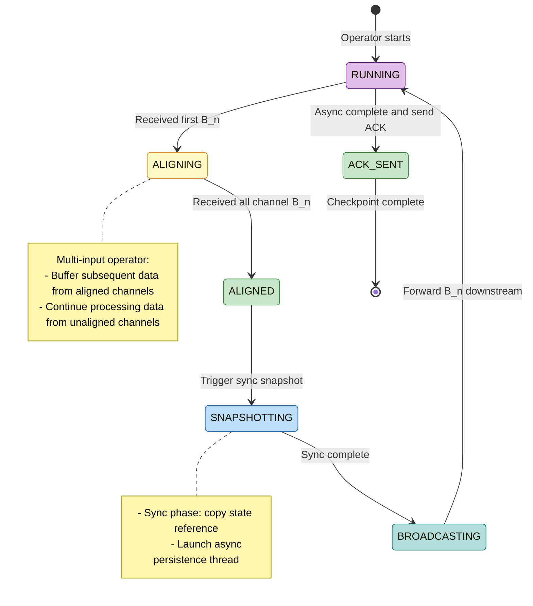
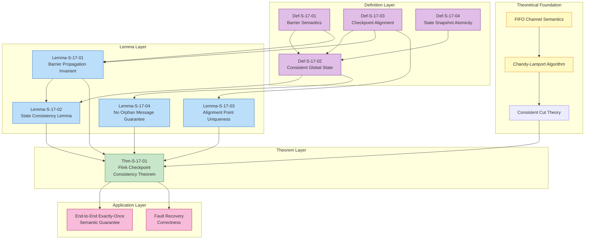
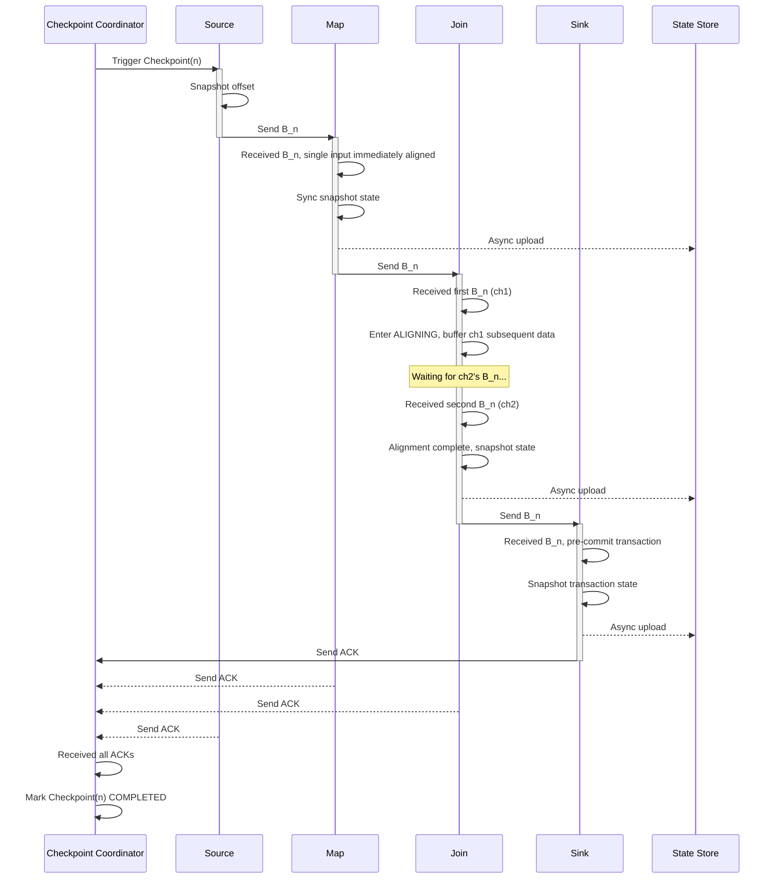

# Flink Checkpoint Correctness Proof

> **Stage**: Struct/04-proofs | **Prerequisites**: [../02-properties/02.02-consistency-hierarchy.md](../../Struct/02-properties/02.02-consistency-hierarchy.md) | **Formalization Level**: L5

---

## Table of Contents

- [Flink Checkpoint Correctness Proof](#flink-checkpoint-correctness-proof)
  - [Table of Contents](#table-of-contents)
  - [1. Definitions](#1-definitions)
    - [Def-S-17-01 (Checkpoint Barrier Semantics)](#def-s-17-01-checkpoint-barrier-semantics)
    - [Def-S-17-02 (Consistent Global State)](#def-s-17-02-consistent-global-state)
    - [Def-S-17-03 (Checkpoint Alignment)](#def-s-17-03-checkpoint-alignment)
    - [Def-S-17-04 (State Snapshot Atomicity)](#def-s-17-04-state-snapshot-atomicity)
  - [2. Properties](#2-properties)
    - [Lemma-S-17-01 (Barrier Propagation Invariant)](#lemma-s-17-01-barrier-propagation-invariant)
    - [Lemma-S-17-02 (State Consistency Lemma)](#lemma-s-17-02-state-consistency-lemma)
    - [Lemma-S-17-03 (Alignment Point Uniqueness)](#lemma-s-17-03-alignment-point-uniqueness)
    - [Lemma-S-17-04 (No Orphan Message Guarantee)](#lemma-s-17-04-no-orphan-message-guarantee)
    - [Prop-S-17-01 (Relationship Between Barrier Alignment and Exactly-Once)](#prop-s-17-01-relationship-between-barrier-alignment-and-exactly-once)
  - [3. Relations](#3-relations)
    - [Relation 1: Flink Checkpoint `↦` Chandy-Lamport Distributed Snapshot](#relation-1-flink-checkpoint--chandy-lamport-distributed-snapshot)
    - [Relation 2: Checkpoint Alignment `⟹` Consistent Cut](#relation-2-checkpoint-alignment--consistent-cut)
    - [Relation 3: Async Snapshot `≈` Sync Snapshot (Semantic Equivalence)](#relation-3-async-snapshot--sync-snapshot-semantic-equivalence)
  - [4. Argumentation](#4-argumentation)
    - [Lemma 4.1 (Causal Closure of Source Barrier Injection)](#lemma-41-causal-closure-of-source-barrier-injection)
    - [Lemma 4.2 (Alignment Completeness for Multi-Input Operators)](#lemma-42-alignment-completeness-for-multi-input-operators)
    - [Counter-Example 4.1 (State Inconsistency Under Unaligned Mode)](#counter-example-41-state-inconsistency-under-unaligned-mode)
    - [Counter-Example 4.2 (Incomplete Checkpoint Caused by Async Snapshot Failure)](#counter-example-42-incomplete-checkpoint-caused-by-async-snapshot-failure)
  - [5. Proofs](#5-proofs)
    - [Thm-S-17-01 (Flink Checkpoint Consistency Theorem)](#thm-s-17-01-flink-checkpoint-consistency-theorem)
  - [6. Examples](#6-examples)
    - [Example 6.1: Checkpoint Correctness Verification for a Simple Dataflow Graph](#example-61-checkpoint-correctness-verification-for-a-simple-dataflow-graph)
    - [Example 6.2: Multi-Way Barrier Alignment in a Complex DAG](#example-62-multi-way-barrier-alignment-in-a-complex-dag)
    - [Counter-Example 6.3: Alignment Timeout Caused by Network Latency](#counter-example-63-alignment-timeout-caused-by-network-latency)
  - [7. Visualizations](#7-visualizations)
    - [Checkpoint State Machine Diagram](#checkpoint-state-machine-diagram)
    - [Proof Dependency Graph](#proof-dependency-graph)
    - [Barrier Propagation and Snapshot Sequence Diagram](#barrier-propagation-and-snapshot-sequence-diagram)
  - [8. References](#8-references)

---

## 1. Definitions

This section establishes rigorous mathematical definitions required for the Flink Checkpoint correctness proof, based on the Chandy-Lamport distributed snapshot theory[^1] and the Flink Checkpoint execution tree model[^6]. All definitions depend on the characterization of consistency hierarchies and internal consistency in the prerequisite document [02.02-consistency-hierarchy.md](../02-properties/02.02-consistency-hierarchy.md).

---

### Def-S-17-01 (Checkpoint Barrier Semantics)

**Definition**: Checkpoint Barrier $B_n$ is a special control event injected by the Flink stream processing engine into the data stream, formally defined as:

$$
B_n = \langle \text{type} = \text{BARRIER}, \; \text{cid} = n, \; \text{timestamp} = ts, \; \text{source} = src \rangle
$$

Where:

- $\text{cid} \in \mathbb{N}^+$: Checkpoint unique identifier
- $\text{timestamp} \in \mathbb{R}^+$: Physical timestamp when the Barrier is injected
- $\text{source} \in V_{source}$: Identifier of the Source operator that injects this Barrier

**Logical Semantics of Barrier**: Barrier $B_n$ defines a **logical time boundary** in data stream $S$, dividing the stream into two parts:

$$
S = S_{<B_n} \circ \langle B_n \rangle \circ S_{>B_n}
$$

Where $S_{<B_n}$ is all data records that logically precede $B_n$, $S_{>B_n}$ is all data records that logically follow $B_n$, and $\circ$ denotes stream concatenation.

**Intuitive Explanation**: The Barrier acts like a "time divider" in the data stream. It carries the Checkpoint ID and propagates between operators, marking the boundary of "data before this point has been processed, data after this point is pending." When all operators snapshot their state upon receiving the Barrier, they capture the complete processing results up to that Barrier.

**Motivation for Definition**: In unbounded data streams, there is no natural "global snapshot moment." If each operator independently decides when to snapshot, state inconsistency will result. The Barrier, acting as a logical clock carrying the Checkpoint ID, enables all operators in a distributed environment to trigger snapshots based on **local events** (receiving the Barrier) without requiring global coordination or stopping processing.

---

### Def-S-17-02 (Consistent Global State)

**Definition**: Let $\mathcal{G} = (V, E)$ be the dataflow graph of a Flink job, $\mathcal{S} = \{ s_v \}_{v \in V}$ be the set of local states of all operators at a given moment, and $\mathcal{C} = \{ c_e \}_{e \in E}$ be the set of in-flight messages on all channels $e$. Then the **global state** $G$ is defined as:

$$
G = \langle \mathcal{S}, \mathcal{C} \rangle = \left\langle \{ s_v \}_{v \in V}, \{ c_e \}_{e \in E} \right\rangle
$$

The global state $G$ is **Consistent** if and only if it corresponds to a **Consistent Cut** in the execution history:

$$
\text{Consistent}(G) \iff \forall e = (u, v) \in E, \forall m \in c_e: \text{send}(m) \notin S_{>B_n}(u) \land \text{recv}(m) \notin S_{<B_n}(v)
$$

That is: there exists no message $m$ satisfying the orphan message condition where "the sender sends after the Barrier while the receiver receives before the Barrier."

**Equivalent Definition (Happens-Before Closure)**:

$$
\text{Consistent}(G) \iff \forall \text{events } e_1, e_2: e_1 \prec_{hb} e_2 \land e_2 \in \text{Cut} \implies e_1 \in \text{Cut}
$$

Where $\prec_{hb}$ is the Happens-Before relation defined by Lamport[^1].

**Intuitive Explanation**: A consistent global state is like taking a "panoramic photo" of a running distributed system. The states of all operators and in-flight messages in the photo must satisfy causal consistency—if the photo shows that a message has been received, then the sender's state in the photo must show that the message has been sent; conversely, if the photo shows that the message has not been sent, the receiver cannot show it as received.

**Motivation for Definition**: Without explicitly defining consistency, a Checkpoint might capture an "impossible" state (e.g., a message received but not sent), causing the recovered system to deviate from any possible execution path. This definition ensures that the Checkpoint corresponds to some real and reachable global state.

---

### Def-S-17-03 (Checkpoint Alignment)

**Definition**: Let operator $v \in V_{op}$ have $k$ input channels $In(v) = \{ ch_1, ch_2, \ldots, ch_k \}$. Operator $v$ performs **Barrier Alignment** for Checkpoint $n$ if and only if the following condition is satisfied:

$$
\text{Aligned}(v, n) \iff \forall ch_i \in In(v): B_n \in \text{Received}(v, ch_i)
$$

That is: operator $v$ has received the Barrier $B_n$ for Checkpoint $n$ from **all** input channels.

**Alignment Window**: The time interval from when operator $v$ receives the first $B_n$ to when it receives the last $B_n$ is called the **Alignment Window**:

$$
\text{AW}(v, n) = [t_{\text{first}}(B_n), t_{\text{last}}(B_n)]
$$

During the alignment window, subsequent data from channels that have already received $B_n$ is buffered, while data from channels that have not yet received $B_n$ continues to be processed normally. After alignment completes, the operator triggers a state snapshot and broadcasts $B_n$ downstream.

**Alignment Mode Classification**:

| Mode | Definition | Consistency Guarantee |
|------|------------|----------------------|
| **EXACTLY_ONCE** | Must wait for $B_n$ from all input channels before snapshotting | Strong consistency (no duplicates, no loss) |
| **AT_LEAST_ONCE** | Snapshot immediately upon receiving $B_n$ from any channel, without buffering subsequent data | No loss, possible duplicates |

**Intuitive Explanation**: Alignment is like a multi-lane toll booth waiting for all lanes to synchronize their barrier arms. Only when all lanes (input channels) have signaled "vehicle has passed" (Barrier) does the system record the current state. This ensures that state does not "cross" the Checkpoint boundary due to some lanes processing faster or slower than others.

**Motivation for Definition**: In multi-input operators (such as Join, CoProcess), data arrival rates may differ across input channels. Without alignment, the snapshot would capture a state that mixes the effects of "before Barrier" and "after Barrier" data, violating the conditions of a consistent cut. The alignment mechanism is the core guarantee for Flink to achieve Exactly-Once semantics.

---

### Def-S-17-04 (State Snapshot Atomicity)

**Definition**: The **state snapshot** $S_v^{(n)}$ of operator $v$ for Checkpoint $n$ is an atomic operation, semantically equivalent to capturing the operator state at an instantaneous moment $t_{\text{snap}}$:

$$
S_v^{(n)} = \text{State}(v, t_{\text{snap}}) \quad \text{where} \quad t_{\text{snap}} \in [t_{\text{align}}, t_{\text{broadcast}}]
$$

The **atomicity** requirement for the snapshot:

$$
\text{Atomic}(S_v^{(n)}) \iff \nexists \, t_1 < t_{\text{snap}} < t_2: \text{State}(v, t_1) \prec S_v^{(n)} \prec \text{State}(v, t_2) \land \text{Processed}(v, (t_1, t_2)) \neq \emptyset
$$

That is: the snapshot state $S_v^{(n)}$ must be some state that actually exists; no intermediate state "during the snapshot capture process" can be observed.

**Async Snapshot Mechanism**: Flink adopts a two-phase snapshot of "sync phase + async phase":

1. **Sync Phase**: Executed in the main thread, quickly obtains a state reference/copy (usually millisecond-level)
2. **Async Phase**: Executed in a background thread, serializes the state and writes it to distributed storage

$$
\text{Snapshot}(v, n) = \text{SyncPhase}(v, n) \circ \text{AsyncPhase}(v, n)
$$

**Atomicity Guarantee**: The completion of the sync phase marks the logical "snapshot moment." Even if the async phase has not yet completed, the operator can resume data processing. Async phase failure does not affect the semantics of the already-completed sync snapshot.

**Intuitive Explanation**: State snapshot atomicity is like the "click" of a camera shutter—no matter how long the subsequent photo development (async persistence) takes, the image at the moment the shutter was pressed is already determined. This ensures that even if the snapshot file has not yet been written to disk, the system has clearly established the semantics of "which state to recover from."

**Motivation for Definition**: Without guaranteeing snapshot atomicity, operator state changes during async persistence might "leak" into the snapshot, causing the recovered state to be neither the state before the Barrier nor the state after the Barrier, but some unpredictable "hybrid state." This definition clearly distinguishes between "snapshot semantic completion" and "snapshot physical completion."

---

## 2. Properties

This section derives the core properties of the Flink Checkpoint mechanism from the definitions in Section 1. All lemmas provide necessary support for the proof of Theorem Thm-S-17-01.

---

### Lemma-S-17-01 (Barrier Propagation Invariant)

**Statement**: For any dataflow edge $e = (u, v) \in E$, if upstream operator $u$ has sent Barrier $B_n$ to edge $e$, then before sending $B_n$, $u$ has:

1. Completed the local state snapshot $S_u^{(n)}$
2. Processed all $S_{<B_n}$ data from its inputs
3. Sent all processing results of $S_{<B_n}$ (including data output to $e$) downstream

**Formal Expression**:

$$
\forall e = (u, v): B_n \in \text{Sent}(u, e) \implies S_u^{(n)} \text{ captured} \land \text{Output}_{<B_n}(u, e) \text{ sent}
$$

**Proof**:

**Step 1: Analyze the state transition of operator $u$**

By Def-S-17-03, operator $u$ can only trigger a snapshot and forward the Barrier after completing Barrier alignment. The state transition sequence is:

$$
\text{RUNNING} \xrightarrow{\text{received all input } B_n} \text{ALIGNING} \xrightarrow{\text{buffer subsequent data}} \text{ALIGNED} \xrightarrow{\text{trigger snapshot}} \text{SNAPSHOTTING} \xrightarrow{\text{forward } B_n} \text{RUNNING}
$$

**Step 2: Causal preconditions for Barrier sending**

The action of operator $u$ forwarding $B_n$ occurs in the SNAPSHOTTING state, whose preconditions are:

- Aligned: all input channels' $B_n$ have been received (Def-S-17-03)
- Snapshotted: local state $S_u^{(n)}$ has been captured (Def-S-17-04)
- Processed: all input data before $B_n$ has been processed and produced output

**Step 3: Inductive derivation**

Perform topological sorting induction on the dataflow graph:

- **Base Case (Source)**: The Source operator snapshots its offset state before injecting $B_n$, satisfying the invariant.
- **Inductive Step**: Assume all upstream operators satisfy the invariant. Then the $B_n$ they forward to current operator $u$ necessarily arrives after all pre-$B_n$ data. After $u$ aligns, it snapshots and forwards $B_n$, maintaining this invariant.

**Step 4: Conclusion**

By induction, Barrier propagation on all edges $e = (u, v)$ satisfies this invariant. ∎

> **Inference [Execution→Data]**: The Barrier propagation invariant guarantees that **when a downstream operator receives $B_n$, the upstream has already processed all pre-$B_n$ data**, thereby ensuring the causal consistency of the global snapshot.

---

### Lemma-S-17-02 (State Consistency Lemma)

**Statement**: Let $\mathcal{S}^{(n)} = \{ S_v^{(n)} \mid v \in V \}$ be the set of all operator states captured by Checkpoint $n$, and $\mathcal{C}^{(n)} = \{ c_e^{(n)} \mid e \in E \}$ be the set of inter-Barrier messages recorded on each channel. Then the global state $G_n = \langle \mathcal{S}^{(n)}, \mathcal{C}^{(n)} \rangle$ is **consistent** (satisfies Def-S-17-02).

**Proof**:

**Step 1: Recall the consistency definition**

By Def-S-17-02, $G_n$ is consistent if and only if there are no orphan messages:

$$
\nexists m \in c_e^{(n)}: \text{send}(m) \in S_{>B_n}(u) \land \text{recv}(m) \in S_{<B_n}(v)
$$

**Step 2: Analyze the composition of channel state $c_e^{(n)}$**

For any edge $e = (u, v)$:

- $u$ forwards $B_n$ to $v$ after snapshot $S_u^{(n)}$ (by Lemma-S-17-01)
- $v$ snapshots $S_v^{(n)}$ only after receiving $B_n$ and completing alignment (by Def-S-17-03)
- Therefore, the position of $B_n$ in channel $e$ divides all messages into: pre-$B_n$ messages (already sent and received) and post-$B_n$ messages (not yet sent or not yet received)

**Step 3: Classify the position of message $m$**

For any message $m$ on edge $e = (u, v)$:

| Case | send(m) time | recv(m) time | Belongs to $c_e^{(n)}$? | Orphan? |
|------|-------------|-------------|------------------------|---------|
| 1 | $< B_n$ (u) | $< B_n$ (v) | No (already received) | No |
| 2 | $< B_n$ (u) | $> B_n$ (v) | **Yes** (in-flight) | No |
| 3 | $> B_n$ (u) | $< B_n$ (v) | Impossible (FIFO) | — |
| 4 | $> B_n$ (u) | $> B_n$ (v) | No (not yet sent) | No |

**Step 4: The key role of FIFO channels**

Flink's network channels guarantee FIFO (First-In-First-Out) semantics:

$$
\text{FIFO}(e) \implies \text{order}_{\text{send}} = \text{order}_{\text{recv}}
$$

Since all messages sent by $u$ before $B_n$ arrive at $v$ before $B_n$ itself, Case 3 (sent after Barrier, received before Barrier) is impossible.

**Step 5: Conclusion**

For all edges $e \in E$, $c_e^{(n)}$ only contains messages from Case 2 (sent before Barrier, received after Barrier); there are no orphan messages. Therefore $G_n$ satisfies the consistency definition of Def-S-17-02. ∎

---

### Lemma-S-17-03 (Alignment Point Uniqueness)

**Statement**: For any operator $v$ and Checkpoint $n$, there exists a unique **alignment point** $t_{\text{align}}^{(v,n)}$ such that:

$$
\forall t < t_{\text{align}}^{(v,n)}: \text{Processed}(v, t) \subseteq S_{<B_n}(v) \land \forall t > t_{\text{align}}^{(v,n)}: \text{Processed}(v, t) \subseteq S_{>B_n}(v)
$$

**Proof**:

**Step 1: Define the alignment point**

The alignment point is the moment when operator $v$ receives the last input channel's $B_n$:

$$
t_{\text{align}}^{(v,n)} = \max_{ch_i \in In(v)} \{ t \mid B_n \in \text{Received}(v, ch_i) \text{ at time } t \}
$$

**Step 2: Prove the precondition**

By the alignment definition of Def-S-17-03, before $t_{\text{align}}^{(v,n)}$, $v$ has received $B_n$ from all input channels. Since the Barrier defines a logical time boundary (Def-S-17-01), all pre-$B_n$ data has been received and processed by this moment.

**Step 3: Prove the postcondition**

After alignment completes, $v$ triggers a snapshot and may begin processing buffered data. This buffered data comes from channels that have already received $B_n$, belonging to $S_{>B_n}$. Newly arrived data also necessarily comes after all input channels' $B_n$, belonging to $S_{>B_n}$.

**Step 4: Uniqueness proof**

Assume there exist two alignment points $t_1$ and $t_2$ ($t_1 < t_2$):

- At $t_1$, at least one channel $ch_j$ has not yet received $B_n$
- At $t_2$, all channels have received $B_n$
- Therefore only $t_2$ satisfies the definition of alignment; $t_1$ is not a valid alignment point

**Conclusion**: The alignment point is uniquely determined as the moment the last $B_n$ arrives. ∎

---

### Lemma-S-17-04 (No Orphan Message Guarantee)

**Statement**: Let $G_n = \langle \mathcal{S}^{(n)}, \mathcal{C}^{(n)} \rangle$ be the global state captured by Checkpoint $n$. Then $G_n$ contains **no orphan messages**, i.e.:

$$
\forall e = (u, v) \in E, \forall m \in \text{Messages}: \neg \text{Orphan}(m, G_n)
$$

Where the orphan message is defined as:

$$
\text{Orphan}(m, G_n) \iff \text{send}(m) \in S_u^{(n)} \land \text{recv}(m) \notin S_v^{(n)} \land m \notin c_e^{(n)}
$$

**Proof**:

**Step 1: Analyze the lifecycle of message $m$**

For any message $m$ on edge $e = (u, v)$, its lifecycle can be divided into:

1. **Not-yet-sent phase**: $m$ has not yet been generated by $u$
2. **In-flight phase**: $m$ has been sent by $u$ but not yet received by $v$
3. **Processed phase**: $m$ has been received and processed by $v$

**Step 2: Analyze messages in each phase at snapshot time**

Let $t_u$ be $u$'s snapshot time (the moment $u$ forwards $B_n$), and $t_v$ be $v$'s snapshot time (the moment $v$ snapshots after alignment completes):

| Message Phase | State at $t_u$ | State at $t_v$ | Snapshot Inclusion |
|--------------|----------------|----------------|-------------------|
| Not-yet-sent | Does not contain $m$ | Does not contain $m$ | $m \notin S_u^{(n)}, m \notin S_v^{(n)}, m \notin c_e^{(n)}$ |
| In-flight | Has sent $m$ | Has not received $m$ | $m \notin S_u^{(n)}$ (only sent), $m \notin S_v^{(n)}$, **$m \in c_e^{(n)}$** |
| Processed | Has sent $m$ | Has processed $m$ | $m \notin S_u^{(n)}$, **effect $\in S_v^{(n)}$**, $m \notin c_e^{(n)}$ |

**Step 3: Exclude orphan message conditions**

An orphan message requires: $m$ has been sent (send is in snapshot), $m$ has not been received (recv is not in snapshot), and $m$ is not in the channel state.

From the table analysis:

- **Not-yet-sent**: does not satisfy "send is in snapshot"
- **In-flight**: satisfies "send is in snapshot" and "recv is not in snapshot", but $m \in c_e^{(n)}$, so it does not satisfy the third condition
- **Processed**: does not satisfy "recv is not in snapshot"

Therefore, there exists no message satisfying all orphan conditions.

**Step 4: Conclusion**

$G_n$ contains no orphan messages. ∎

---

### Prop-S-17-01 (Relationship Between Barrier Alignment and Exactly-Once)

**Statement**: Under the assumptions of replayable Source, deterministic operators, and transactional Sink commits, **Barrier Alignment** (Def-S-17-03) is the **sufficient and necessary condition** for Flink to achieve end-to-end Exactly-Once semantics.

**Proof**:

**$(\Rightarrow)$ Necessity Proof**:

Assume no alignment (AT_LEAST_ONCE mode), and consider a Join operator $J$ with two input channels:

- Channel A's $B_n$ arrives first; $J$ immediately snapshots and continues processing Channel B's data
- Record $r_B$ sent by Channel B after $B_n$ is processed, affecting the snapshot state
- After fault recovery, $J$ recovers from Checkpoint $n$, but Source B rolls back to the position before $B_n$ and replays
- $r_B$ is reprocessed, and its Join result with $r_B$'s processing effect already present in the snapshot is output again, causing duplicate output

Therefore, without alignment, Exactly-Once cannot be guaranteed; Barrier alignment is a necessary condition.

**$(\Leftarrow)$ Sufficiency Proof**:

By Lemma-S-17-02, the aligned snapshot constitutes a consistent global state $G_n$. By Def-S-17-02, $G_n$ corresponds to some consistent cut in the execution history.

Combining with Thm-S-08-02 (End-to-End Exactly-Once Correctness Theorem) from [02.02-consistency-hierarchy.md](../02-properties/02.02-consistency-hierarchy.md):

- Replayable Source guarantees no loss (At-Least-Once)
- Barrier alignment guarantees internal consistency (Consistent Checkpoint)
- Transactional Sink guarantees no duplicate external output

The conjunction of the three yields Exactly-Once.

Therefore, Barrier alignment is a sufficient condition. ∎

---

## 3. Relations

This section establishes strict mapping relationships between the Flink Checkpoint mechanism and the Chandy-Lamport distributed snapshot algorithm, as well as consistency hierarchy theory.

---

### Relation 1: Flink Checkpoint `↦` Chandy-Lamport Distributed Snapshot

**Argumentation**:

Flink's Checkpoint mechanism is a structured implementation of the Chandy-Lamport distributed snapshot algorithm[^1] in the stream processing scenario. The specific correspondence is as follows:

| Chandy-Lamport Concept | Flink Implementation | Semantic Equivalence |
|-----------------------|---------------------|---------------------|
| **Marker message** | Checkpoint Barrier $B_n$ | Equivalent: both are control events carrying snapshot ID |
| **Process state recording** | Operator state snapshot $S_v^{(n)}$ | Equivalent: both are instantaneous captures of local state |
| **Sending Marker** | Broadcasting $B_n$ downstream | Equivalent: propagating snapshot boundary along all outgoing edges |
| **Receiving Marker** | Barrier alignment | Enhanced: multi-input operators must wait for Markers from all incoming edges |
| **Channel state** | Data buffered during alignment | Extended: explicitly records in-flight messages |
| **Snapshot completion notification** | ACK message | Enhanced: coordinator explicitly collects acknowledgments |

**Encoding Existence**: There exists a bijection from the Flink Checkpoint execution tree to the Chandy-Lamport snapshot history:

$$
\forall \mathcal{T}_{CP}, \exists \mathcal{H}_{CL}: \text{Encode}(\mathcal{T}_{CP}) = \mathcal{H}_{CL}
$$

Where the Encode function maps Flink's Barrier injection, alignment, snapshot, and acknowledgment to Chandy-Lamport's Marker send, receive, and state recording.

**Semantics Preservation**: The Barrier alignment mechanism guarantees that the snapshot set constitutes a consistent cut (Def-S-17-02), completely consistent with the "no message crosses the cut boundary" guaranteed by the Chandy-Lamport algorithm (Lemma-S-17-04).

**Engineering Extensions**: Flink adds the following on top of Chandy-Lamport:

1. **Async persistence**: Separates state serialization from upload, reducing latency
2. **Incremental snapshot**: Based on RocksDB SST file immutability, only backs up changed files
3. **Two-phase commit Sink**: Aligns external system transactions with Checkpoint boundaries

---

### Relation 2: Checkpoint Alignment `⟹` Consistent Cut

**Argumentation**:

**Implication direction**: Barrier alignment (Def-S-17-03) implies that the global snapshot constitutes a Consistent Cut (Def-S-17-02).

From the proof of Lemma-S-17-02, the aligned snapshot set satisfies:

$$
\forall e = (u, v): S_u^{(n)} \text{ corresponds to } S_{<B_n}(u) \land S_v^{(n)} \text{ corresponds to } S_{<B_n}(v)
$$

Therefore, the global state $G_n = \langle \{S_v^{(n)}\}, \{c_e^{(n)}\} \rangle$ satisfies the definition of Consistent Cut.

**Non-equivalence note**: Barrier alignment is a **sufficient but not necessary** condition for Consistent Cut. In theory, as long as the snapshot moments of each operator satisfy happens-before closure, a Consistent Cut can be formed even without alignment. However, in engineering practice, alignment is the most concise and verifiable way to achieve a Consistent Cut.

**Formal Expression**:

$$
\text{AlignedCheckpoint}(n) \implies \text{ConsistentCut}(G_n)
$$

$$\text{ConsistentCut}(G_n) \kern.6em\not\kern-.6em\implies \text{AlignedCheckpoint}(n)
$$

---

### Relation 3: Async Snapshot `≈` Sync Snapshot (Semantic Equivalence)

**Argumentation**:

Flink's async snapshot mechanism (Def-S-17-04) is semantically equivalent to a sync snapshot in terms of **recovery semantics**, but superior in **performance characteristics**.

**Semantic Equivalence Proof**:

Let $S_{\text{sync}}^{(n)}$ be the state captured by sync snapshot, and $S_{\text{async}}^{(n)}$ be the state captured by async snapshot.

**Sync Phase Equivalence**: The sync phase of async snapshot captures a state reference $R^{(n)}$ at moment $t_{\text{sync}}$:

$$
R^{(n)} = \text{StateReference}(v, t_{\text{sync}}) \equiv S_{\text{sync}}^{(n)}
$$

For RocksDB State Backend, this corresponds to creating a reference to the current SST file set (hard link or metadata copy); for Heap State Backend, this corresponds to a shallow copy of the state table.

**Recovery Equivalence**: During recovery, $R^{(n)}$ is deserialized into a runtime state:

$$
\text{Restore}(R^{(n)}) = \text{Restore}(S_{\text{sync}}^{(n)}) = S_{\text{restored}}
$$

Therefore, async snapshot and sync snapshot produce the same runtime state after recovery.

**Performance Differences**:

| Dimension | Sync Snapshot | Async Snapshot |
|-----------|--------------|----------------|
| Blocking time | $O(|State|)$ (full serialization) | $O(1)$ or $O(|State|_{\text{shallow}})$ (reference copy) |
| Tail latency | High (proportional to state size) | Low (independent of state size) |
| Throughput impact | Significant decrease | Almost no impact |
| Implementation complexity | Simple | Complex (requires managing async tasks) |

**Conclusion**: Async snapshot is a **performance-optimized implementation** of sync snapshot. While maintaining semantic equivalence, it achieves non-blocking continuity of stream processing by deferring persistence to a background thread.

---

## 4. Argumentation

This section provides auxiliary lemmas, counter-example analysis, and boundary discussions to prepare for the main theorem Thm-S-17-01 in Section 5.

---

### Lemma 4.1 (Causal Closure of Source Barrier Injection)

**Statement**: Before injecting Barrier $B_n$, Source operator $src$ has persisted its current reading offset $offset_{src}$ into snapshot $S_{src}^{(n)}$. After fault recovery, $src$ replays from $offset_{src}$, neither losing nor duplicating pre-$B_n$ data.

**Proof**:

**Step 1: Source state definition**

The state of the Source operator only contains the read offset of the external system (e.g., Kafka):

$$
S_{src} = \{ (partition_i, offset_i) \}_{i \in \text{Partitions}}
$$

**Step 2: Barrier injection timing**

When the Checkpoint Coordinator triggers Checkpoint $n$:

1. Source receives the trigger command
2. Source records the current offset $offset_{src}^{(n)}$
3. Source injects $B_n$ into the output stream

**Step 3: Causal closure**

By Def-S-17-01, $B_n$ is located after all previous data in the output stream. Therefore:

$$
\forall \text{record } r \text{ before } B_n: offset(r) < offset_{src}^{(n)}
$$

$$
\forall \text{record } r \text{ after } B_n: offset(r) \geq offset_{src}^{(n)}
$$

**Step 4: Recovery semantics**

After fault recovery:

- Source recovers from $S_{src}^{(n)}$, resetting the offset to $offset_{src}^{(n)}$
- Source starts consuming from external system at position $offset_{src}^{(n)}$
- All records before $B_n$ have already been consumed (offset has advanced)
- Records after $B_n$ have not yet been consumed (offset has not advanced)

**Conclusion**: The Source's Barrier injection satisfies causal closure, providing the foundation for global consistency. ∎

---

### Lemma 4.2 (Alignment Completeness for Multi-Input Operators)

**Statement**: Let operator $v$ have $k$ input channels $In(v) = \{ch_1, \ldots, ch_k\}$. In EXACTLY_ONCE mode, $v$'s alignment mechanism guarantees:

1. After all $k$ channels' $B_n$ arrive, $v$'s state precisely reflects the processing results of all pre-$B_n$ data
2. $v$'s snapshot $S_v^{(n)}$ does not contain any effects of post-$B_n$ data

**Proof**:

**Step 1: Alignment state machine**

$v$'s state transition follows the following state machine:

```
RUNNING --(received first B_n)--> ALIGNING --(buffer other channels' data)
                                    |
                                    v
                              ALIGNED --(trigger snapshot)--> SNAPSHOTTING
                                                                   |
                                                                   v
                              RUNNING <--(forward B_n)<-- BROADCASTING
```

**Step 2: Buffer semantics**

During the ALIGNING state, subsequent data from channels that have received $B_n$ is buffered into buffer $Buffer_v$:

$$
\forall ch_i: B_n \in \text{Received}(v, ch_i) \implies \text{SubsequentData}(ch_i) \rightarrow Buffer_v
$$

**Step 3: Processing semantics**

Data from channels that have not received $B_n$ continues to be processed normally:

$$
\forall ch_j: B_n \notin \text{Received}(v, ch_j) \implies \text{Data}(ch_j) \rightarrow \text{Process}(v)
$$

**Step 4: Alignment completion condition**

When all channels have received $B_n$:

- All pre-$B_n$ data from all channels has arrived and been processed (guaranteed by FIFO)
- All post-$B_n$ data is in the buffer and has not been processed
- At this moment, state $S_v$ precisely corresponds to the state of "all pre-$B_n$ data processing completed"

**Step 5: Snapshot capture**

Snapshot $S_v^{(n)}$ is triggered immediately after alignment completes, capturing the above state. Subsequently, buffered data is released and processing continues.

**Conclusion**: The alignment mechanism for multi-input operators completely guarantees the boundary consistency of the snapshot state. ∎

---

### Counter-Example 4.1 (State Inconsistency Under Unaligned Mode)

**Scenario**: Consider a two-stream Join operator $J$ using AT_LEAST_ONCE semantics (no alignment).

**Execution Timeline**:

```
t1: Channel A sends Barrier(1)
t2: Channel B sends record r2 (belongs to post-Checkpoint 1 data)
t3: Channel A sends record r1 (belongs to post-Checkpoint 1 data)
t4: Channel B sends Barrier(1)
t5: J snapshots state (triggered by Channel A's Barrier)
```

**Analysis**:

- **Violated precondition**: At moment $t5$, $J$ triggers a snapshot due to Channel A's $B_1$, but Channel B's $B_1$ has not yet arrived
- **Resulting anomaly**: The snapshot state contains $r_2$ sent by Channel B at $t2$ (already arrived and processed before $B_1$), but does not contain $r_1$ sent by Channel A at $t3$
- **Recovery anomaly**: During recovery, Source A's offset rolls back to before $B_1$, and $r_1$ is reprocessed. The Join result of $r_1$ with $r_2$'s processing effect already present in the snapshot is output again, violating Exactly-Once

**Conclusion**: In AT_LEAST_ONCE mode, lack of alignment destroys Exactly-Once semantics and may cause duplicate downstream computation.

---

### Counter-Example 4.2 (Incomplete Checkpoint Caused by Async Snapshot Failure)

**Scenario**: Operator $v$ uses async Heap State Backend. The sync phase of Checkpoint $n$ is complete (state reference has been copied), but async upload has not yet completed.

**Execution Timeline**:

```
t1: v completes sync phase, state handle handed to async thread
t2: async thread begins writing state to HDFS
t3: v processes new data, updating local state (Heap state has changed)
t4: TaskManager crashes, v's process is killed
t5: async thread only persists 60% of state data due to network interruption
```

**Analysis**:

- **Violated precondition**: Async persistence is not yet complete, and TaskManager crash causes both local state and async task to be lost simultaneously
- **Resulting anomaly**: Checkpoint $n$ is marked as FAILED, and the system can only recover from Checkpoint $n-1$
- **State loss**: Data processed between $t1$ and $t3$ has modified $v$'s local state. These changes are neither contained in Checkpoint $n-1$ nor completely contained in Checkpoint $n$

**Conclusion**: Although async Checkpoint reduces latency, it introduces a fragile window of "sync phase ended but async phase not yet completed." A failure within this window causes the most recent Checkpoint to be lost, and data processed during this period needs to be reprocessed.

---

## 5. Proofs

### Thm-S-17-01 (Flink Checkpoint Consistency Theorem)

**Statement**: Flink's Chandy-Lamport-based Checkpoint algorithm produces a consistent global state. Formally, let $\mathcal{G}_n = \langle \mathcal{S}^{(n)}, \mathcal{C}^{(n)} \rangle$ be the global state captured by Checkpoint $n$. Then:

$$
\text{Consistent}(\mathcal{G}_n) \land \text{NoOrphans}(\mathcal{G}_n) \land \text{Reachable}(\mathcal{G}_n)
$$

That is: $\mathcal{G}_n$ satisfies the three properties of consistent cut, no orphan messages, and state reachability.

**Proof Structure**:

This proof is divided into three parts:

1. **Part 1**: Prove the correctness of Checkpoint Barrier injection and propagation
2. **Part 2**: Prove that Barrier alignment guarantees local state consistency
3. **Part 3**: Prove that the global snapshot constitutes a consistent cut

---

**Part 1: Correctness of Barrier Injection and Propagation**

**Goal**: Prove that Barriers injected by Sources and propagated downstream satisfy causal closure.

**Step 1.1: Source Barrier injection**

By Lemma 4.1, before injecting $B_n$, Source $src$ has persisted the current offset into $S_{src}^{(n)}$. Let $src$'s input be external system $Ext$:

$$
\forall r \in Ext: \text{offset}(r) < offset_{src}^{(n)} \implies r \text{ has been processed}
$$

$$
\forall r \in Ext: \text{offset}(r) \geq offset_{src}^{(n)} \implies r \text{ has not been processed}
$$

Therefore, $S_{src}^{(n)}$ precisely corresponds to the state of "all input up to $B_n$ has been consumed."

**Step 1.2: Barrier propagation invariant**

By Lemma-S-17-01, for any edge $e = (u, v)$:

$$
B_n \in \text{Sent}(u, e) \implies S_u^{(n)} \text{ captured} \land \text{Output}_{<B_n}(u, e) \text{ sent}
$$

This indicates that $B_n$ is physically located after all pre-$B_n$ output data.

**Step 1.3: Inductive propagation**

Perform topological sorting on dataflow graph $G = (V, E)$. Let the topological order be $v_1, v_2, \ldots, v_{|V|}$:

- **Base Case**: Source operators (smallest in topological order) satisfy Step 1.1
- **Inductive Step**: Assume all operators with topological order less than $k$ satisfy the propagation invariant. For operator $v_k$, all its upstream operators $u \in \text{Pred}(v_k)$ have sent $B_n$ to edge $(u, v_k)$. By the alignment definition (Def-S-17-03), $v_k$ only snapshots and forwards after receiving $B_n$ from all incoming edges, so $v_k$ also satisfies the propagation invariant.

**Part 1 Conclusion**: Barrier propagation of all operators satisfies causal closure.

---

**Part 2: Barrier Alignment Guarantees Local State Consistency**

**Goal**: Prove that the snapshot state $S_v^{(n)}$ of any operator $v$ precisely corresponds to the state where "all pre-$B_n$ input has been processed and all post-$B_n$ input has not been processed."

**Step 2.1: Alignment point definition**

By Lemma-S-17-03, operator $v$ has a unique alignment point $t_{\text{align}}^{(v,n)}$, which is the moment it receives the last input channel's $B_n$.

**Step 2.2: Multi-input operator analysis**

By Lemma 4.2, for multi-input operator $v$ with $k$ input channels:

- Before $t_{\text{align}}^{(v,n)}$, all pre-$B_n$ data from all $k$ channels has arrived and been processed (guaranteed by FIFO)
- After $t_{\text{align}}^{(v,n)}$, post-$B_n$ data is buffered and has not been processed

Therefore, state $S_v(t_{\text{align}}^{(v,n)})$ precisely satisfies:

$$
\text{Effect}(S_v(t_{\text{align}}^{(v,n)})) = \bigcup_{i=1}^{k} \text{Processed}(S_{<B_n}(ch_i))
$$

**Step 2.3: Snapshot atomicity**

By Def-S-17-04, snapshot atomicity guarantees:

$$
S_v^{(n)} = S_v(t_{\text{snap}}) \quad \text{where} \quad t_{\text{snap}} \in [t_{\text{align}}, t_{\text{broadcast}}]
$$

Since from alignment completion to broadcast, $v$ does not process new data (only executes sync snapshot), $S_v^{(n)} = S_v(t_{\text{align}}^{(v,n)})$.

**Part 2 Conclusion**: Each operator's snapshot state precisely corresponds to the Barrier boundary state.

---

**Part 3: Global Snapshot Constitutes a Consistent Cut**

**Goal**: Prove that $\mathcal{G}_n = \langle \mathcal{S}^{(n)}, \mathcal{C}^{(n)} \rangle$ satisfies the consistent cut definition.

**Step 3.1: Recall the consistent cut definition**

By Def-S-17-02, $\mathcal{G}_n$ is consistent if and only if it satisfies happens-before closure:

$$
\forall e_1, e_2: e_1 \prec_{hb} e_2 \land e_2 \in \text{Cut} \implies e_1 \in \text{Cut}
$$

**Step 3.2: Event classification**

In Flink execution, event types include:

- $\text{Process}(v, r)$: operator $v$ processes record $r$
- $\text{Send}(e, m)$: message $m$ is sent on edge $e$
- $\text{Recv}(e, m)$: message $m$ is received on edge $e$

**Step 3.3: Prove closure**

Consider any happens-before relation $e_1 \prec_{hb} e_2$:

**Case 1**: Program order within the same operator

If $e_1, e_2$ are on the same operator $v$ and $e_1$ precedes $e_2$:

- If $e_2$ is a pre-$B_n$ event ($e_2 \in \text{Cut}$), then $e_1$ is also a pre-$B_n$ event
- By Part 2, $S_v^{(n)}$ contains the effects of all pre-$B_n$ events
- Therefore $e_1 \in \text{Cut}$

**Case 2**: Cross-operator message passing

If $e_1 = \text{Send}(e, m)$, $e_2 = \text{Recv}(e, m)$ for some edge $e = (u, v)$:

- Assume $e_2 \in \text{Cut}$, i.e., $m$ is received by $v$ before $B_n$
- By FIFO and the Barrier propagation invariant (Part 1), $m$ is sent by $u$ before $B_n$
- Therefore $e_1 \in \text{Cut}$

**Case 3**: Transitive closure

By the definition of happens-before (transitive closure), the above two cases cover all $e_1 \prec_{hb} e_2$ through transitivity.

**Step 3.4: No orphan messages**

By Lemma-S-17-04, $\mathcal{G}_n$ contains no orphan messages.

**Step 3.5: State reachability**

Each state $S_v^{(n)}$ in $\mathcal{G}_n$ is the state at some real execution moment (alignment point), and therefore is reachable.

**Part 3 Conclusion**: $\mathcal{G}_n$ satisfies consistent cut, no orphan messages, and state reachability. ∎

---

**Theorem Summary**:

| Property | Proof Basis | Key Lemma/Definition |
|----------|------------|---------------------|
| **Consistent($\mathcal{G}_n$)** | Happens-before closure | Def-S-17-02, Part 3 |
| **NoOrphans($\mathcal{G}_n$)** | Barrier propagation and FIFO | Lemma-S-17-04 |
| **Reachable($\mathcal{G}_n$)** | Alignment point existence | Lemma-S-17-03, Def-S-17-04 |

---

## 6. Examples

### Example 6.1: Checkpoint Correctness Verification for a Simple Dataflow Graph

**Scenario**: Linear dataflow $Source \rightarrow Map \rightarrow Sink$

**Execution Timeline**:

```
t1: Source receives Checkpoint trigger, snapshots offset=100, injects B_1
t2: Map receives B_1 (single input, immediately aligned), snapshots state, forwards B_1
t3: Sink receives B_1, snapshots transaction state, sends ACK
t4: Coordinator receives all ACKs, marks Checkpoint 1 complete
```

**Verification**:

1. **Source**: $S_{src}^{(1)}$ contains offset=100, corresponding to consumed records 0-99
2. **Map**: $S_{map}^{(1)}$ contains the state after processing records 0-99
3. **Sink**: $S_{sink}^{(1)}$ contains the pre-committed transaction state

Global state $\mathcal{G}_1$ corresponds to the consistent cut of "records 0-99 have been completely processed."

---

### Example 6.2: Multi-Way Barrier Alignment in a Complex DAG

**Scenario**:

```
      Source A -----> Join -----> Sink
                      ^
      Source B -------+
```

**Execution Timeline**:

```
t1: Source A injects B_1, Source B injects B_1
t2: Join receives Source A's B_1, enters ALIGNING, buffers Source A's subsequent data
t3: Join continues processing Source B's data
t4: Join receives Source B's B_1, alignment complete, snapshots state, forwards B_1
t5: Sink receives B_1, snapshots, sends ACK
```

**Verification**:

The Join's alignment mechanism guarantees:

- The snapshot at moment $t4$ contains all pre-$B_1$ data from both Source A and Source B
- Source A's post-$B_1$ data is buffered and does not affect the snapshot
- During recovery, both Source A and B roll back to the $B_1$ position, Join recovers from the snapshot, with no duplicates and no loss

---

### Counter-Example 6.3: Alignment Timeout Caused by Network Latency

**Scenario**:

```
Source A (DC1) -----> Join (DC2) <----- Source B (DC3)
```

Cross-datacenter deployment, with high network latency from Source B to Join.

**Execution Timeline**:

```
t1: Checkpoint 1 triggered
t2: Source A injects B_1 (arrives at Join with 10ms latency)
t3: Source B injects B_1 (arrives at Join with 500ms latency)
t4: Join receives Source A's B_1, enters ALIGNING
t5: Checkpoint timeout (configured 300ms)
t6: Checkpoint 1 marked as FAILED
t7: Join receives Source B's B_1 (but Checkpoint has already failed)
```

**Analysis**:

- **Violated precondition**: Network latency difference (10ms vs 500ms) exceeds Checkpoint timeout
- **Resulting anomaly**: Checkpoint 1 fails, and the system cannot establish a recovery point
- **Conclusion**: Cross-datacenter deployment requires adjusting Checkpoint timeout configuration, or using unaligned Checkpoint (tolerating duplicates)

---

## 7. Visualizations

### Checkpoint State Machine Diagram



**Diagram Description**:

- This diagram shows the complete state machine of a Flink operator during the Checkpoint process
- **ALIGNING** (yellow) is the key state: multi-input operators wait for all Barriers in this state
- **ALIGNED** (green) indicates alignment is complete, and the state boundary has been determined
- **SNAPSHOTTING** (blue) contains both sync and async phases
- State transition triggers strictly correspond to Def-S-17-03 and Def-S-17-04

---

### Proof Dependency Graph



**Diagram Description**:

- This diagram shows the complete proof dependency structure of Thm-S-17-01
- **Yellow nodes**: Theoretical foundation layer (Chandy-Lamport, FIFO)
- **Purple nodes**: Four core definitions defined in this document
- **Blue nodes**: Four key lemmas supporting the theorem
- **Green node**: Main theorem Thm-S-17-01
- **Pink nodes**: Downstream applications of the theorem (Exactly-Once, fault recovery)

---

### Barrier Propagation and Snapshot Sequence Diagram



**Diagram Description**:

- This diagram shows the complete Checkpoint flow from Coordinator trigger to acknowledgment by all operators
- **Source**: Immediately snapshots and forwards Barrier
- **Map** (single input): Receives Barrier and immediately aligns and snapshots
- **Join** (multi-input): Needs to wait for Barriers from all input channels before snapshotting
- **Sink**: Snapshots transaction state to ensure end-to-end consistency
- Async upload runs in parallel with the main flow, without blocking data processing

---

## 8. References

[^1]: K. M. Chandy and L. Lamport, "Distributed Snapshots: Determining Global States of Distributed Systems," *ACM Transactions on Computer Systems*, vol. 3, no. 1, pp. 63-75, 1985. [Online]. Available: <https://doi.org/10.1145/214451.214456>

[^6]: Apache Flink Documentation, "Exactly-Once Semantics," Apache Software Foundation, 2025. [Online]. Available: <https://nightlies.apache.org/flink/flink-docs-stable/docs/learn-flink/fault_tolerance/>

---

*Document version: v1.0 | Translation date: 2026-04-24*
