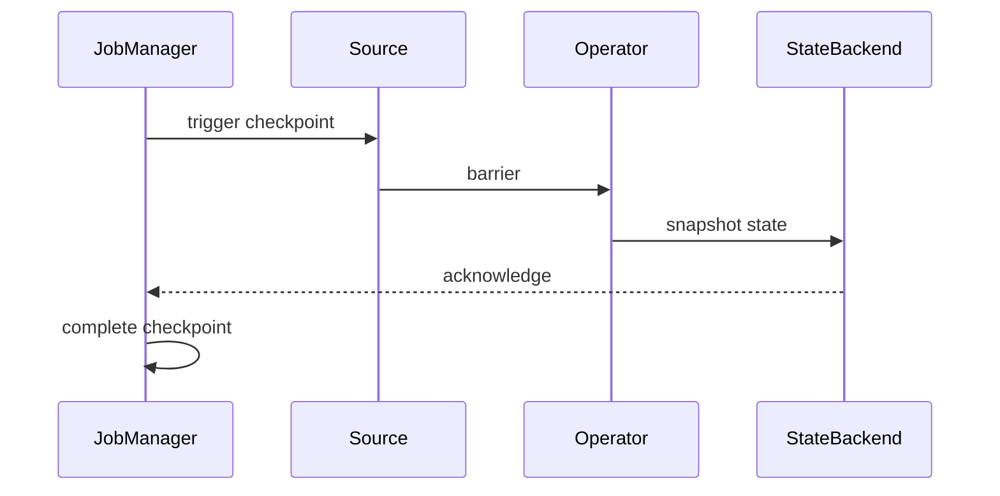

# Flink Checkpoint Mechanism Deep Dive

> **Stage**: Flink/02-core | **Prerequisites**: [Consistency Hierarchy](../../Struct/02-properties/02.02-consistency-hierarchy.md) | **Formal Level**: L4
>
> Deep analysis of Flink's distributed snapshot mechanism, covering aligned/unaligned/incremental checkpoints, state backends, and recovery semantics.

---

## 1. Definitions

**Def-F-02-11: Checkpoint Core Abstraction**

A checkpoint is a globally consistent snapshot of distributed stream processing state at a given point in time:

$$
\text{Checkpoint} = \langle S, B, M \rangle
$$

where $S$ = operator states, $B$ = barrier positions, $M$ = metadata.

**Def-F-02-12: Checkpoint Barrier**

A special control record injected into the data stream by the JobManager to demarcate logical time for snapshot boundaries[^1].

**Def-F-02-13: Aligned Checkpoint**

Barriers are buffered at operator inputs until all upstream barriers arrive, ensuring synchronous snapshot alignment.

**Def-F-02-14: Unaligned Checkpoint**

In-flight data is included in the snapshot, eliminating alignment latency at the cost of larger snapshot size.

---

## 2. Properties

**Lemma-F-02-06: Barrier Alignment Guarantees Consistency**

When all input barriers have arrived, the operator has processed exactly the same set of records on all inputs up to the checkpoint boundary.

**Lemma-F-02-07: Asynchronous Checkpoint Low Latency**

Snapshot state materialization occurs asynchronously; only barrier propagation blocks the data pipeline.

---

## 3. Relations

- **with Chandy-Lamport**: Flink's aligned checkpoint is an instance of the Chandy-Lamport distributed snapshot algorithm.
- **with Exactly-Once**: Checkpoint mechanism is the foundation for Flink's Exactly-Once semantics.

---

## 4. Argumentation

**Aligned vs Unaligned Trade-off**:

| Factor | Aligned | Unaligned |
|--------|---------|-----------|
| Latency | Head-of-line blocking | Immediate |
| Snapshot size | State only | State + in-flight |
| Backpressure impact | Amplified | Minimal |
| Recovery speed | Fast | Fast |

---

## 5. Engineering Argument

**Thm-F-02-01 (State Equivalence After Recovery)**: After restoring from a checkpoint, the system state is equivalent to the state that would have resulted from failure-free execution up to the checkpoint timestamp.

*Proof Sketch*: Barriers logically divide the stream into pre-checkpoint and post-checkpoint epochs. State snapshot captures exactly the pre-checkpoint processing effects. ∎

---

## 6. Examples

```java
// Aligned checkpoint configuration
env.enableCheckpointing(60000);
env.getCheckpointConfig().setCheckpointingMode(
    CheckpointingMode.EXACTLY_ONCE);
env.getCheckpointConfig().setMinPauseBetweenCheckpoints(30000);

// Unaligned checkpoint (Flink 1.11+)
env.getCheckpointConfig().enableUnalignedCheckpoints();
env.getCheckpointConfig().setAlignmentTimeout(Duration.ofSeconds(30));
```

---

## 7. Visualizations

**Checkpoint Architecture**:



---

## 8. References

[^1]: K. M. Chandy and L. Lamport, "Distributed Snapshots", ACM TOCS, 1985.
