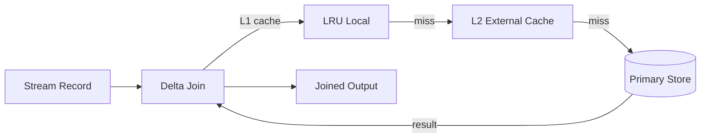

# Flink Delta Join Deep Dive

> **Stage**: Flink/02-core | **Prerequisites**: [Delta Join Basics](delta-join.md) | **Formal Level**: L5
>
> **Flink Version**: 2.2.0 GA
>
> Production-ready Delta Join V2 with CDC support, pushdown optimization, and caching.

---

## 1. Definitions

**Def-F-02-65: Delta Join V2 Production Definition**

$$
\mathcal{D}_{prod}(s, T, \mathcal{C}) = \{(r_s, \pi(r_t)) \mid r_s \in s \land r_t \in \text{lookup}_\mathcal{C}(r_s.key, T)\}
$$

Configuration space $\mathcal{C}$:

- $C_{cache}$: Cache size, TTL, eviction policy
- $C_{source}$: CDC source constraints (`'debezium.skipped.operations' = 'd'`)
- $C_{pushdown}$: Projection/filter pushdown
- $C_{fallback}$: Degradation strategy

**Def-F-02-66: No-DELETE Constraint**

$$
C_{no-del}(S) \equiv \forall e \in S: type(e) \in \{+I, +U\} \land type(e) \notin \{-D, -U\}
$$

**Rationale**: Zero intermediate state means no ability to retract prior join outputs.

---

## 2. Properties

**Lemma-F-02-31: Cache Hit Rate**

With Zipf-distributed key access and LRU cache, hit rate exceeds 90% for typical workloads.

**Lemma-F-02-32: Pushdown Effectiveness**

Projection pushdown reduces external I/O by factor of $\frac{|\text{projected columns}|}{|\text{all columns}|}$.

---

## 3. Relations

- **with Lookup Join**: Delta Join is an optimized variant for CDC sources.
- **with Async I/O**: Uses async I/O for non-blocking external lookups.

---

## 4. Argumentation

**Cache Invalidation Strategy**:

$$
TTL_{eff}(k) = \min(TTL_{local}, TTL_{source})
$$

Local cache TTL must be <= source data freshness to prevent stale reads.

**Fallback Strategy**: When external store is unavailable, options include:

- Circuit breaker (fail fast)
- Stale cache reads (degraded accuracy)
- Buffer and retry (increased latency)

---

## 5. Engineering Argument

**State Complexity**: Delta Join V2 state = cache + pending async requests. With 1GB cache and 10K pending requests, total state ~1.1GB, vs 10GB+ for traditional hash join.

---

## 6. Examples

```sql
-- MySQL CDC source ignoring DELETEs
CREATE TABLE dim_users (
  user_id INT PRIMARY KEY NOT ENFORCED,
  user_name STRING,
  tier STRING
) WITH (
  'connector' = 'mysql-cdc',
  'debezium.skipped.operations' = 'd'
);

-- Delta Join with projection pushdown
SELECT o.order_id, u.user_name
FROM orders o
JOIN dim_users FOR SYSTEM_TIME AS OF o.proc_time u
  ON o.user_id = u.user_id;
```

---

## 7. Visualizations

**Delta Join V2 Architecture**:



---

## 8. References
