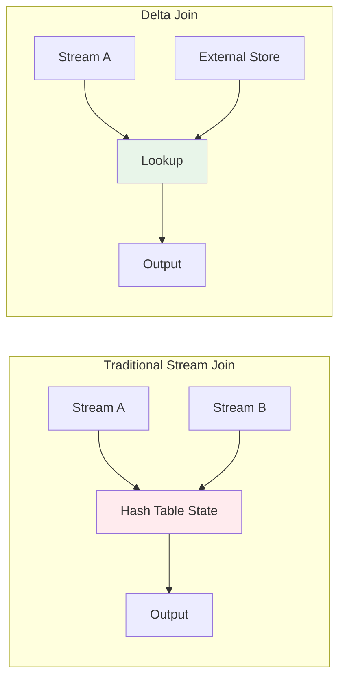

# Flink Delta Join: Large-State Stream Join Optimization

> **Stage**: Flink/02-core | **Prerequisites**: [Flink SQL Join Semantics](flink-sql-join-semantics.md), [Checkpoint Mechanism](checkpoint-mechanism-deep-dive.md) | **Formalization Level**: L4
> **Translation Date**: 2026-04-21

## Abstract

**Delta Join** is a specialized operator for optimizing large-state stream joins in Flink. Instead of materializing intermediate join results, it uses incremental lookups against external storage, reducing state from $O(|S_1| + |S_2|)$ to $O(|T|)$.

---

## 1. Definitions

### Def-F-02-20 (Delta Join Operator)

A **Delta Join** operator $\mathcal{D}$ replaces materialized intermediate results with incremental lookups:

$$\mathcal{D}(s_1, T_2, T_1): S_1 \times \mathcal{P}(T_2) \times \mathcal{P}(T_1) \to \{(r_1, r_2) \mid r_1 \in s_1 \land r_2 \in T_2 \land \theta(r_1, r_2)\}$$

where $s_1 \subseteq S_1$ is the input delta, and $\theta$ is the join condition. **Key constraint**: $\mathcal{D}$ does **not** maintain materialized join state.

### Def-F-02-21 (Bidirectional Lookup Join)

**Bidirectional Lookup Join** allows both streams to join via external lookups:

$$\text{BiLookup}(s_1, s_2, T) = \{(r_1, r_2) \mid (r_1 \in s_1 \land \text{lookup}_T(r_1) = r_2) \lor (r_2 \in s_2 \land \text{lookup}_T(r_2) = r_1)\}$$

Requires external storage $T$ to support efficient point lookups (JDBC, KV stores, Lakehouse tables).

### Def-F-02-22 (Zero Intermediate State Policy)

The **Zero Intermediate State Policy** requires:

$$\forall t \in \text{ExecutionTime}, \nexists M_t: M_t = \{(r_i, r_j) \mid r_i \in S_1 \land r_j \in S_2 \land \theta(r_i, r_j)\}$$

Join results are computed on-the-fly and released immediately after processing.

---

## 2. Optimization Mechanisms

### 2.1 Lookup Cache

| Strategy | Hit Rate | Consistency | Use Case |
|----------|----------|-------------|----------|
| No Cache | N/A | Strong | Highly dynamic data |
| LRU Cache | Medium | Eventual | Slowly changing dimensions |
| Async Preload | High | Configurable | Predictable access patterns |

### 2.2 Async Lookup

```java
// Flink AsyncFunction for Delta Join
class AsyncDeltaJoin extends AsyncFunction<Row, Row> {
    @Override
    public void asyncInvoke(Row input, ResultFuture<Row> resultFuture) {
        // Async query to external store
        CompletableFuture<Row> lookup = externalStore.queryAsync(input.getKey());
        lookup.thenAccept(result -> resultFuture.complete(Collections.singletonList(join(input, result))));
    }
}
```

### 2.3 State Reduction Analysis

| Join Type | State Size | Latency | Throughput |
|-----------|-----------|---------|------------|
| Traditional Hash Join | $O(|S_1| + |S_2|)$ | Low | High |
| Delta Join | $O(|T|)$ | Medium (lookup) | Medium |
| Bidirectional Lookup | $O(|T|)$ | Medium | Medium |

---

## 3. When to Use Delta Join

### 3.1 Ideal Conditions

- One side is a **small dimension table** (fits in memory or cache)
- External storage supports **sub-millisecond point lookups**
- Join key has **high cardinality** (many distinct keys)
- **Low latency requirement** does not preclude external I/O

### 3.2 Anti-Patterns

- Both streams are large and unbounded
- External storage is slow or unreliable
- Join requires complex multi-key matching
- Exactly-once semantics require transactional lookups

---

## 4. Visualizations



**State comparison**: Traditional join maintains hash table state; Delta Join delegates to external storage.

---

## 5. References

[^1]: Apache Flink Documentation, "Joins in Continuous Queries", 2025.
[^2]: Apache Flink 2.2 Release Notes, "Delta Join V2 GA", 2025-12-04.
[^3]: F. Hueske et al., "Stream Processing with Apache Flink", O'Reilly, 2019.
