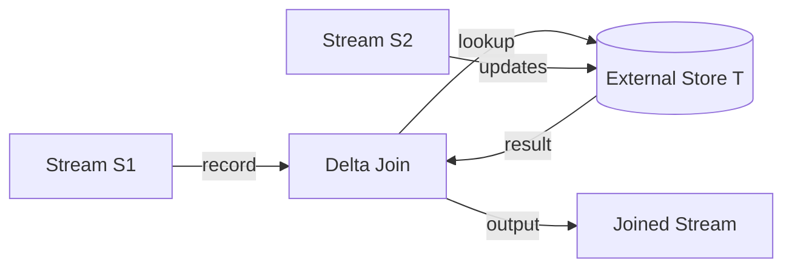

# Flink Delta Join: Large-State Stream Join Optimization

> **Stage**: Flink/02-core | **Prerequisites**: [Flink SQL Join](../03-api/03.02-table-sql-api/query-optimization-analysis.md) | **Formal Level**: L4
>
> **Flink Version**: 2.2.0 GA
>
> Delta Join optimizes large-state stream joins via incremental lookup instead of materializing intermediate results.

---

## 1. Definitions

**Def-F-02-39: Delta Join Operator**

Stream join optimization using incremental lookup against external storage:

$$
\mathcal{D}(s_1, T_2, T_1) : S_1 \times \mathcal{P}(T_2) \times \mathcal{P}(T_1) \rightarrow \{(r_1, r_2) \mid r_1 \in s_1 \land r_2 \in T_2 \land \theta(r_1, r_2)\}
$$

**Def-F-02-40: Bidirectional Lookup Join**

Extended Delta Join allowing both streams to join via external lookup without any intermediate state materialization:

$$
\text{BiLookup}(s_1, s_2, T) = \{(r_1, r_2) \mid (r_1 \in s_1 \land \text{lookup}_T(r_1) = r_2) \lor (r_2 \in s_2 \land \text{lookup}_T(r_2) = r_1)\}
$$

**Def-F-02-41: Zero Intermediate State Policy**

$$
\forall t \in \text{ExecutionTime}, \nexists M_t : M_t = \{(r_i, r_j) \mid r_i \in S_1 \land r_j \in S_2 \land \theta(r_i, r_j)\}
$$

---

## 2. Properties

**Prop-F-02-08: State Complexity Upper Bound**

$$
O(|T|_{cache} + |W|)
$$

where $|T|_{cache}$ = external storage cache size, $|W|$ = async I/O wait queue length.

---

## 3. Relations

- **with Lookup Join**: Delta Join generalizes lookup join with bidirectional capability.
- **with Async I/O**: Uses async I/O to avoid blocking the stream.

---

## 4. Argumentation

**Delta Join vs Traditional Hash Join**:

| Aspect | Hash Join | Delta Join |
|--------|-----------|------------|
| State | $O(\|S_1\| + \|S_2\|)$ | $O(\|T\|_{cache})$ |
| Memory | High | Low |
| External queries | None | Per-record |
| Use case | Both streams large | One side lookup-able |

**Optimizations**:

- LRU cache for hot join keys
- Batch lookup merging
- Async I/O for non-blocking processing

---

## 5. Engineering Argument

**State Reduction**: For joining 1B-record stream with 10M-record dimension table, traditional join needs ~10GB state. Delta Join needs only cache-sized state (~100MB with 1% hit rate).

---

## 6. Examples

```sql
-- Delta Join in Flink SQL
SELECT o.order_id, c.name, p.price
FROM Orders o
JOIN Customers FOR SYSTEM_TIME AS OF o.proc_time c
  ON o.customer_id = c.id
JOIN Products FOR SYSTEM_TIME AS OF o.proc_time p
  ON o.product_id = p.id;
```

---

## 7. Visualizations

**Delta Join Architecture**:



---

## 8. References
