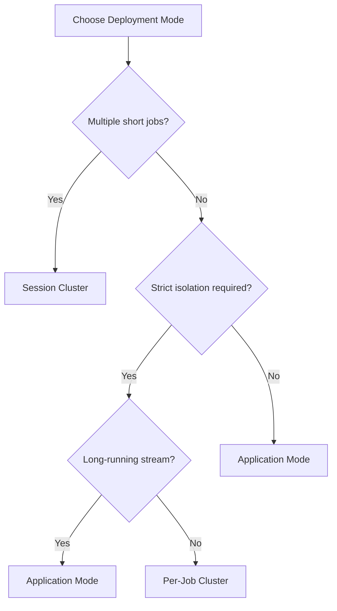

# Flink Deployment Architectures

> **Language**: English | **Source**: [Flink/01-concepts/deployment-architectures.md](../Flink/01-concepts/deployment-architectures.md) | **Last Updated**: 2026-04-21

---

## Deployment Configuration

A Flink deployment $\mathcal{D}$ is a triple:

$$
\mathcal{D} = \langle \mathcal{M}, \mathcal{P}, \mathcal{R}_{mgr} \rangle
$$

where:

- $\mathcal{M} \in \{\text{Session}, \text{Per-Job}, \text{Application}\}$: job submission mode
- $\mathcal{P} \in \{\text{Standalone}, \text{YARN}, \text{Kubernetes}\}$: resource platform
- $\mathcal{R}_{mgr}$: Flink ResourceManager adapter protocol

## Deployment Modes

### Session Cluster

Multiple jobs share a single Flink cluster.

| Aspect | Behavior |
|--------|----------|
| **Isolation** | Low (shared JobManager) |
| **Startup** | Fast (cluster already running) |
| **Use case** | Development, multi-tenant platforms |
| **Risk** | One job failure may affect others |

### Per-Job Cluster

Each job gets a dedicated cluster, created on submission and torn down after completion.

| Aspect | Behavior |
|--------|----------|
| **Isolation** | High (dedicated JobManager) |
| **Startup** | Slow (cluster creation overhead) |
| **Use case** | Production batch jobs, strict isolation |
| **Risk** | Higher resource overhead |

### Application Mode

Application entrypoint runs on the cluster; cluster lifecycle bound to the application.

| Aspect | Behavior |
|--------|----------|
| **Isolation** | High |
| **Startup** | Medium |
| **Use case** | Microservices, long-running streaming jobs |
| **Benefit** | Proper `main()` isolation; no client-side dependencies |

## Resource Platform Matrix

| Platform | Session | Per-Job | Application | Best For |
|----------|---------|---------|-------------|----------|
| **Standalone** | ✅ | ✅ | ✅ | On-premise, fixed infrastructure |
| **YARN** | ✅ | ✅ | ✅ | Hadoop ecosystem, batch + stream |
| **Kubernetes** | ✅ | ✅ | ✅ | Cloud-native, auto-scaling, GitOps |

## Decision Tree



## Example: Kubernetes Application Mode

```yaml
apiVersion: flink.apache.org/v1beta1
kind: FlinkDeployment
metadata:
  name: streaming-pipeline
spec:
  image: my-flink-app:1.0
  flinkVersion: v1.18
  jobManager:
    resource:
      memory: 2Gi
      cpu: 1
  taskManager:
    resource:
      memory: 4Gi
      cpu: 2
  job:
    jarURI: local:///opt/flink/usrlib/app.jar
    parallelism: 4
    upgradeMode: savepoint
    state: running
```

## References
