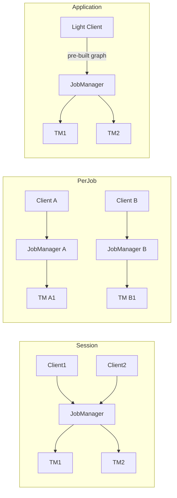

# Flink Deployment Architectures

> **Stage**: Flink/ | **Prerequisites**: [Dataflow Model Formalization](../Struct/dataflow-model-formalization.md) | **Formalization Level**: L3-L4
> **Translation Date**: 2026-04-21

## Abstract

Flink supports multiple deployment modes and resource platforms. This document formalizes the deployment configuration space, compares Session, Per-Job, and Application modes, and provides decision frameworks for production deployments.

---

## 1. Definitions

### 1.1 Deployment Configuration

A Flink deployment configuration $\mathcal{D}$ is a triple:

$$\mathcal{D} = \langle \mathcal{M}, \mathcal{P}, \mathcal{R}_{mgr} \rangle$$

where:

- $\mathcal{M} \in \{\text{Session}, \text{Per-Job}, \text{Application}\}$: job submission mode
- $\mathcal{P} \in \{\text{Standalone}, \text{YARN}, \text{Kubernetes}, \text{Mesos}\}$: resource platform
- $\mathcal{R}_{mgr}$: Flink ResourceManager adapter protocol for the platform

### 1.2 Session Cluster Mode

A **Session Cluster** runs a long-lived Flink cluster that accepts multiple job submissions:

$$\text{Session} = (JM_{shared}, \{TM_1, \ldots, TM_n\}, \text{JobQueue})$$

- JobManager is shared across all jobs
- TaskManagers are pre-allocated
- Jobs compete for shared resources

**Trade-off**: Low startup latency vs. resource isolation risk.

### 1.3 Per-Job Cluster Mode

A **Per-Job Cluster** creates a dedicated Flink cluster for each job:

$$\text{PerJob} = (JM_{dedicated}, \{TM_1, \ldots, TM_m\}_{job})$$

- JobManager and TaskManagers are job-specific
- Cluster lifecycle = job lifecycle
- Maximum resource isolation

**Trade-off**: High isolation vs. startup overhead.

### 1.4 Application Mode

**Application Mode** executes the main method on the cluster, with the job graph built pre-submission:

$$\text{Application} = (JM_{app}, \{TM_i\}, \text{Client}_{lightweight})$$

- Client only submits the pre-built job graph
- Main method runs on JobManager (reduces client-side dependencies)
- Combines benefits of Session (shared infrastructure) and Per-Job (isolation)

### 1.5 Resource Platforms

| Platform | Orchestration | Use Case |
|----------|--------------|----------|
| Standalone | Manual / Script | Development, edge |
| YARN | Hadoop ecosystem | On-premise big data |
| Kubernetes | Container-native | Cloud-native, microservices |
| Mesos | Two-level scheduling | Legacy (deprecated in Flink 1.14+) |

---

## 2. Properties

### 2.1 Isolation vs. Sharing Trade-off

| Mode | Resource Isolation | Startup Latency | Client Dependency |
|------|-------------------|-----------------|-------------------|
| Session | Low | Very Low | Heavy (job graph built client-side) |
| Per-Job | High | High | Heavy |
| Application | Medium-High | Medium | Light (graph pre-built) |

### 2.2 Elasticity Characteristics

- **Session**: TaskManagers can be added/removed dynamically; jobs scale within cluster bounds.
- **Per-Job**: Fixed at submission; requires cluster restart for scaling.
- **Application**: Supports dynamic scaling via Kubernetes HPA / YARN auto-scaling.

---

## 3. Relations

### 3.1 Deployment Mode × Platform Matrix

| | Standalone | YARN | Kubernetes |
|--|-----------|------|------------|
| Session | Dev/testing | Multi-tenant platform | Cloud-native platform |
| Per-Job | Rare | Batch processing | CI/CD pipelines |
| Application | N/A | Production streaming | Primary recommendation |

### 3.2 Architecture Comparison



---

## 4. Decision Framework

### 4.1 Formal Selection Criteria

Define a utility function for deployment selection:

$$U(\mathcal{D}) = w_1 \cdot \text{Isolation}(\mathcal{D}) + w_2 \cdot \frac{1}{\text{Latency}(\mathcal{D})} + w_3 \cdot \text{Elasticity}(\mathcal{D})$$

where $w_1 + w_2 + w_3 = 1$ are organizational weights.

### 4.2 Decision Tree

```
Do you need strong resource isolation?
├── YES → Do you need fast startup?
│         ├── YES → Application Mode
│         └── NO  → Per-Job Mode
└── NO  → Do you have multiple small jobs?
          ├── YES → Session Mode
          └── NO  → Application Mode (recommended default)
```

### 4.3 Boundary Conditions

- **Session mode unsuitable**: Jobs with conflicting resource requirements, strict SLAs, or security isolation needs.
- **Per-Job mode unsuitable**: High-frequency job submission (>1/minute) due to startup overhead.
- **Application mode limitations**: Requires Kubernetes or YARN; standalone clusters must use Session.

---

## 5. Engineering Examples

### 5.1 Kubernetes Native Application Mode

```bash
# Submit Flink application to Kubernetes
./bin/flink run-application \
    --target kubernetes-application \
    -Dkubernetes.cluster-id=my-flink-app \
    -Dkubernetes.container.image=my-flink-image:1.20 \
    local:///opt/flink/usrlib/my-app.jar
```

### 5.2 YARN Session Cluster (Multi-Tenant)

```bash
# Start a YARN session with 5 TaskManagers
./bin/yarn-session.sh -n 5 -jm 2048 -tm 8192

# Submit multiple jobs to the session
./bin/flink run -t yarn-session my-job1.jar
./bin/flink run -t yarn-session my-job2.jar
```

### 5.3 Standalone Per-Job (Edge Computing)

```bash
# Manually start cluster per job (legacy pattern)
./bin/start-cluster.sh
./bin/flink run my-edge-job.jar
./bin/stop-cluster.sh
```

---

## 6. References
