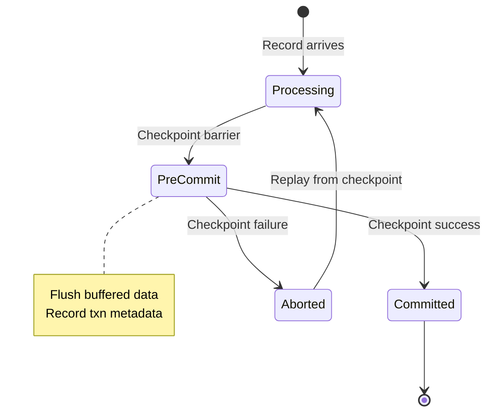

# Flink Exactly-Once Correctness Proof

> **Stage**: Struct/04-proofs | **Prerequisites**: [Flink Checkpoint Correctness](flink-checkpoint-correctness.md), [Consistency Hierarchy](consistency-hierarchy.md) | **Formalization Level**: L5
> **Translation Date**: 2026-04-21

## Abstract

This document proves Flink's Exactly-Once semantics correctness, covering the two-phase commit protocol, replayable sources, idempotent sinks, and end-to-end consistency guarantees.

---

## 1. Definitions

### Def-S-18-01 (Exactly-Once Semantics)

An execution satisfies **Exactly-Once** iff every input record's observable effect appears exactly once:

$$\forall r \in \text{Input}: |\text{ObservableEffect}(r)| = 1$$

### Def-S-18-02 (End-to-End Consistency)

**End-to-end consistency** requires Exactly-Once across the entire pipeline:

$$\text{EndToEndEO} = \text{SourceEO} \land \text{ProcessingEO} \land \text{SinkEO}$$

### Def-S-18-03 (Two-Phase Commit — 2PC)

Flink's 2PC protocol for transactional sinks:

$$\text{2PC} = \langle \text{PreCommit}, \text{Commit}, \text{Abort} \rangle$$

- **Phase 1 (Pre-commit)**: Flush buffered data; record transaction metadata in state
- **Phase 2 (Commit)**: On checkpoint success, commit transactions to external system
- **Abort**: On checkpoint failure, rollback uncommitted transactions

### Def-S-18-04 (Replayable Source)

A **replayable source** supports offset reset to any previously checkpointed position:

$$\text{Replayable}(src) \iff \forall cp: \text{Restore}(src, \text{Offset}(cp))$$

### Def-S-18-05 (Idempotency)

A sink is **idempotent** iff duplicate writes produce the same result:

$$\forall d: \text{Write}(d) \circ \text{Write}(d) = \text{Write}(d)$$

---

## 2. Key Lemmas

### Lemma-S-18-01 (Source Replayability)

Replayable sources guarantee At-Least-Once delivery:

$$\text{Replayable}(src) \land \text{Checkpoint}(cp) \Rightarrow \text{AtLeastOnce}(src, cp)$$

### Lemma-S-18-02 (2PC Atomicity)

Flink's 2PC implementation ensures atomic commit/abort:

$$\text{Commit}(txn) \land \neg\text{Abort}(txn) \Rightarrow \text{AllOrNothing}(txn)$$

### Lemma-S-18-03 (State Recovery Consistency)

State recovery from a consistent checkpoint restores deterministic processing:

$$\text{ConsistentCheckpoint}(cp) \land \text{Restore}(cp) \Rightarrow \text{Deterministic}(\text{post-restore})$$

### Lemma-S-18-04 (Operator Determinism)

Deterministic operators produce the same output given the same input and state:

$$\text{Deterministic}(op) \iff \forall \sigma, \text{in}: op(\sigma, \text{in}) = \text{same output}$$

---

## 3. Correctness Theorem

### Thm-S-18-01 (Flink Exactly-Once Correctness)

Flink provides end-to-end Exactly-Once semantics if:

1. Sources are replayable (Lemma-S-18-01)
2. Sinks use 2PC or are idempotent
3. Checkpoints are consistent (Lemma-S-18-03)
4. Operators are deterministic (Lemma-S-18-04)

**Proof.** We prove no-loss and no-duplication separately.

**Step 1 (No Loss — At-Least-Once).**

On failure, Flink restores from the last successful checkpoint. By Lemma-S-18-01, sources replay from checkpointed offsets. By Lemma-S-18-03, restored state is consistent. All records after the checkpoint are reprocessed. Thus, no record is lost. ∎

**Step 2 (No Duplication — At-Most-Once).**

For 2PC sinks: Pre-committed transactions are committed only on checkpoint success. If a checkpoint fails, pre-committed transactions are aborted. Thus, no duplicate commits. For idempotent sinks: Duplicate writes produce the same effect (Def-S-18-05). Thus, duplicates are invisible. ∎

**Step 3 (Combination).**

At-Least-Once + At-Most-Once = Exactly-Once (Lemma-K-05-02). ∎

---

## 4. Visualizations

**2PC state machine**: Pre-commit on barrier, commit on success, abort on failure.

---

## 5. References
