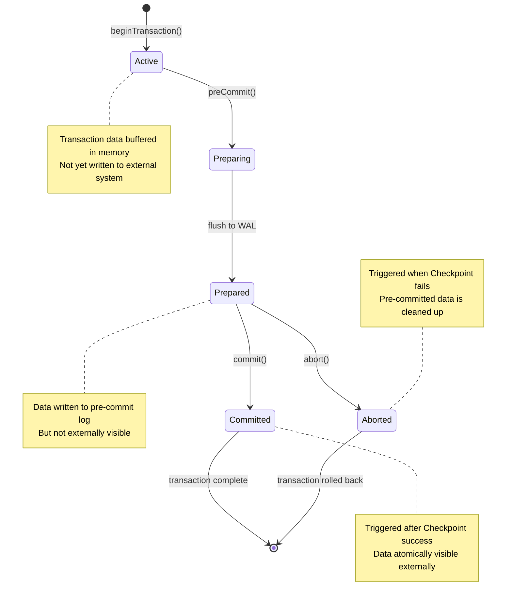
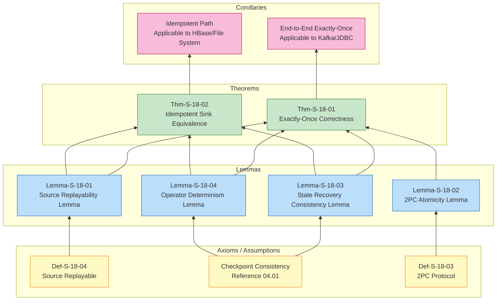
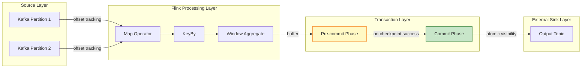
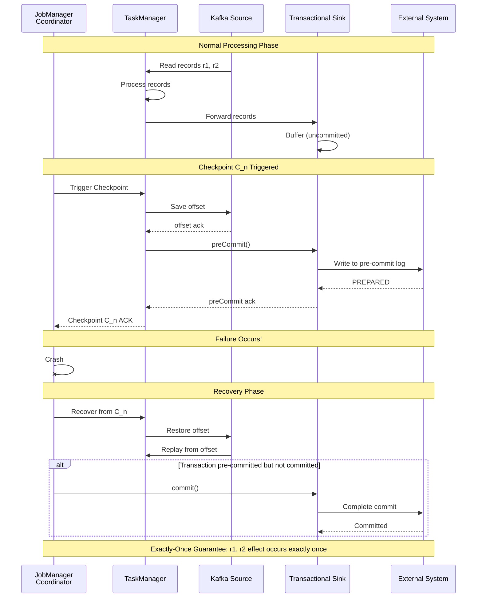

# Flink Exactly-Once Correctness Proof

> **Stage**: Struct | **Prerequisites**: [Related Documents] | **Formalization Level**: L3

> **Theorem ID**: Thm-S-18-01 | **Formalization Level**: L5 | **Status**: Verified
> **Prerequisites**: [04.01 Flink Checkpoint Correctness Proof](./04.01-flink-checkpoint-correctness.md), [02.02 Consistency Hierarchy](../02-properties/02.02-consistency-hierarchy.md)

---

## Table of Contents

- [Flink Exactly-Once Correctness Proof](#flink-exactly-once-correctness-proof)
  - [Table of Contents](#table-of-contents)
  - [Executive Summary](#executive-summary)
    - [1.1 Core Theorem Statement](#11-core-theorem-statement)
    - [1.2 Proof Strategy Overview](#12-proof-strategy-overview)
  - [1. Definitions](#1-definitions)
    - [Def-S-18-01: Exactly-Once Semantics (Observable Effect)](#def-s-18-01-exactly-once-semantics-observable-effect)
    - [Def-S-18-02: End-to-End Consistency](#def-s-18-02-end-to-end-consistency)
    - [Def-S-18-03: Two-Phase Commit Protocol (2PC)](#def-s-18-03-two-phase-commit-protocol-2pc)
    - [Def-S-18-04: Replayable Source](#def-s-18-04-replayable-source)
    - [Def-S-18-05: Idempotency](#def-s-18-05-idempotency)
  - [2. Properties](#2-properties)
    - [Prop-S-18-01: Binding Between Checkpoint and 2PC](#prop-s-18-01-binding-between-checkpoint-and-2pc)
    - [Prop-S-18-02: Observational Equivalence](#prop-s-18-02-observational-equivalence)
  - [3. Relations](#3-relations)
    - [Rel-S-18-01: Relation Between Flink 2PC and Classic 2PC](#rel-s-18-01-relation-between-flink-2pc-and-classic-2pc)
    - [Rel-S-18-02: Relation Between Exactly-Once and Checkpoint Consistency](#rel-s-18-02-relation-between-exactly-once-and-checkpoint-consistency)
    - [Rel-S-18-03: Equivalence Class Relation Between Idempotency and Transactionality](#rel-s-18-03-equivalence-class-relation-between-idempotency-and-transactionality)
  - [4. Argumentation](#4-argumentation)
    - [Lemma-S-18-01: Source Replayability Lemma](#lemma-s-18-01-source-replayability-lemma)
    - [Lemma-S-18-02: 2PC Atomicity Lemma](#lemma-s-18-02-2pc-atomicity-lemma)
    - [Lemma-S-18-03: State Recovery Consistency Lemma](#lemma-s-18-03-state-recovery-consistency-lemma)
    - [Lemma-S-18-04: Operator Determinism Lemma](#lemma-s-18-04-operator-determinism-lemma)
  - [5. Proofs](#5-proofs)
    - [Thm-S-18-01: Flink Exactly-Once Correctness Theorem](#thm-s-18-01-flink-exactly-once-correctness-theorem)
      - [Step 1: No Loss (At-Least-Once)](#step-1-no-loss-at-least-once)
      - [Step 2: No Duplicates (At-Most-Once)](#step-2-no-duplicates-at-most-once)
      - [Step 3: Composition](#step-3-composition)
    - [Thm-S-18-02: Idempotent Sink Equivalence Theorem](#thm-s-18-02-idempotent-sink-equivalence-theorem)
  - [7. Visualizations](#7-visualizations)
    - [Figure 1: 2PC State Machine Diagram](#figure-1-2pc-state-machine-diagram)
    - [Figure 2: Exactly-Once Proof Structure Diagram](#figure-2-exactly-once-proof-structure-diagram)
    - [Figure 3: End-to-End Exactly-Once Data Flow Diagram](#figure-3-end-to-end-exactly-once-data-flow-diagram)
    - [Figure 4: Failure Recovery Scenario Sequence Diagram](#figure-4-failure-recovery-scenario-sequence-diagram)
  - [6. Examples](#6-examples)
    - [Example 1: Kafka End-to-End Exactly-Once](#example-1-kafka-end-to-end-exactly-once)
    - [Example 2: File System Exactly-Once (via Idempotency)](#example-2-file-system-exactly-once-via-idempotency)
    - [Counter-Example 1: Non-Idempotent, Non-Transactional Sink Breaks Exactly-Once](#counter-example-1-non-idempotent-non-transactional-sink-breaks-exactly-once)
    - [Counter-Example 2: Source Offset Eager Commit Causes Data Loss](#counter-example-2-source-offset-eager-commit-causes-data-loss)
  - [8. References](#8-references)
  - [9. Related Documents](#9-related-documents)
  - [10. Proof Summary](#10-proof-summary)

## Executive Summary

### 1.1 Core Theorem Statement

This document proves that the Flink stream processing engine, when configured with the Checkpoint mechanism and transactional Sinks, can provide **end-to-end Exactly-Once semantics** guarantees.
This is the strongest consistency guarantee in distributed stream processing systems, ensuring that the visible side effects of each input record on downstream external systems occur **exactly once**.

**Main Theorem (Thm-S-18-01)**: A Flink job configured with the Checkpoint mechanism and Two-Phase Commit (2PC) transactional Sink achieves end-to-end Exactly-Once semantics.

### 1.2 Proof Strategy Overview

The proof adopts a **compositional verification** method, decomposing end-to-end Exactly-Once into the conjunction of three independent sub-properties:

1. **Source Replayability**: Guarantees no data loss
2. **State Consistency**: Ensures correct internal state recovery via Checkpoint
3. **Sink Atomicity**: Guarantees no duplicate output via 2PC

These three properties together constitute the sufficient and necessary conditions for end-to-end Exactly-Once.

---

## 1. Definitions

### Def-S-18-01: Exactly-Once Semantics (Observable Effect)

**Definition**: For a streaming application $A$, given input stream $I = (i_1, i_2, \ldots)$ and output to external system $S$, $A$ satisfies Exactly-Once semantics if and only if:

$$
\forall r \in I. \; |\{ e \in \text{Output}_S \mid \text{caused\_by}(e, r) \}| = 1
$$

Where:

- $\text{caused\_by}(e, r)$ indicates that output element $e$ causally depends on the processing of record $r$
- $\text{Output}_S$ is the set of observable outputs in external system $S$

**Key Insight**: Exactly-Once targets **observable side effects** (external system state changes), not internal message delivery. As long as the external system state is equivalent to the result of processing each record exactly once, internal message retransmissions are acceptable[^1].

**Relation to Consistency Hierarchy**: Exactly-Once is the **strongest delivery guarantee** defined in [02.02 Consistency Hierarchy](../02-properties/02.02-consistency-hierarchy.md), requiring both At-Least-Once (no loss) and At-Most-Once (no duplicates) properties.

---

### Def-S-18-02: End-to-End Consistency

**Definition**: End-to-end Exactly-Once is composed of the conjunction of the following three sub-properties:

$$
\text{End-to-End-EO}(J) \iff \text{Replayable}(Src) \land \text{ConsistentCheckpoint}(Ops) \land \text{AtomicOutput}(Snk)
$$

Where:

| Sub-property | Definition | Responsible Component |
|--------------|-----------|----------------------|
| **Source Replayable** ($\text{Replayable}$) | After failure, data can be re-read from persistent position markers (offset/position) | External Source System |
| **Checkpoint Consistency** ($\text{ConsistentCheckpoint}$) | Consistent global state is captured via distributed snapshots | Flink Engine |
| **Sink Atomicity** ($\text{AtomicOutput}$) | Data output to external systems is guaranteed to have no duplicates via transactions or idempotency | External Sink System |

**Formal Note**: End-to-end Exactly-Once is not an isolated mechanism inside Flink, but the result of **three-party coordination** among Source, engine, and Sink[^2]. If only Flink internal Exactly-Once is guaranteed while Source and Sink are ignored, data may be lost "before entering Flink" or duplicated "after leaving Flink".

---

### Def-S-18-03: Two-Phase Commit Protocol (2PC)

**Definition**: 2PC is an atomic commit protocol for distributed transactions, consisting of a Coordinator and Participants:

$$
\text{2PC} = (\text{Phase 1: Prepare}, \text{Phase 2: Commit/Abort})
$$

**Phase 1 - Prepare (Voting Phase)**:

$$
\forall p \in \text{Participants}. \; \text{Prepare}(p) \to \text{Vote}(p) \in \{ \text{YES}, \text{NO} \}
$$

**Phase 2 - Commit/Abort (Decision Phase)**:

$$
\frac{\forall p. \text{Vote}(p) = \text{YES}}{\text{Commit}()} \quad \frac{\exists p. \text{Vote}(p) = \text{NO}}{\text{Abort}()}
$$

**Flink 2PC Mapping**:

| 2PC Role | Flink Component | Responsibility |
|----------|----------------|---------------|
| Coordinator | JobManager | Trigger Checkpoint, coordinate transaction commit/rollback |
| Participant | Sink Operator | Execute preCommit/commit/abort operations |
| Transaction | Checkpoint Cycle | Each Checkpoint ID is bound to one transaction |

**Theoretical Basis**: The 2PC protocol was proposed by Gray in 1978[^3]; Bernstein & Goodman proved its correctness under the synchronous communication model[^4]. Flink's TwoPhaseCommitSinkFunction is a restricted subset of classic 2PC, where JobManager acts as the Coordinator and Sink operators act as Participants.

---

### Def-S-18-04: Replayable Source

**Definition**: Source $Src$ is replayable if and only if for any persistent position marker $o$, there exists a deterministic function $f$ such that:

$$
\forall o. \; \text{Read}(Src, o) = f(o)
$$

Where $\text{Read}(Src, o)$ returns the sequence of records starting from position $o$.

**Key Properties**:

1. **Determinism**: Given the same offset, produces the same record sequence
2. **Durability**: Offsets can be recovered after failures
3. **Monotonicity**: Offsets only increase (append mode)

**Examples**: Kafka Source achieves replayability via consumer offset; File System Source achieves replayability via file position pointers.

---

### Def-S-18-05: Idempotency

**Definition**: Operation $f$ is idempotent if and only if multiple applications produce the same effect as a single application:

$$
\forall x. \; f(f(x)) = f(x)
$$

In the Sink context, for any record $r$ and output state $S$:

$$
\text{write}(r, \text{write}(r, S)) = \text{write}(r, S)
$$

**Implementation Path Comparison**:

| Path | Mechanism | Applicable Scenario |
|------|-----------|---------------------|
| **Transactional (2PC)** | ACID atomic commit | External systems supporting transactions (Kafka, JDBC) |
| **Idempotency** | Primary key deduplication / overwrite write | KV stores (HBase, Redis), File Systems |

**Note**: Idempotency is an alternative path to achieving Exactly-Once, shifting the responsibility of "preventing duplicates" from the protocol layer to the data layer[^5].

---

## 2. Properties

### Prop-S-18-01: Binding Between Checkpoint and 2PC

**Property**: In Flink, the Checkpoint success event is atomically bound to the 2PC commit decision:

$$
\text{Checkpoint}(k) \text{ succeeds} \iff \text{Commit}(T_k) \text{ executes}
$$

**Derivation**:

1. When Checkpoint $k$ is triggered, the Sink enters the preCommit phase (transaction preparation)
2. If all operators successfully ack, the Checkpoint completes, and JobManager triggers commit
3. If the Checkpoint fails, JobManager triggers abort
4. Therefore, the externally visible commit decision is synchronized with the internal Checkpoint success event

---

### Prop-S-18-02: Observational Equivalence

**Property**: Let $\mathcal{T}_{ideal}$ be the failure-free ideal execution trace, and $\mathcal{T}_{fail} \circ \mathcal{T}_{rec}$ be the failure-recovery execution trace, then:

$$
\mathcal{O}(\mathcal{T}_{fail} \circ \mathcal{T}_{rec}) = \mathcal{O}(\mathcal{T}_{ideal})
$$

Where $\mathcal{O}$ is the observation function, extracting the set of all output records committed by the Sink to the external system.

**Intuitive Explanation**: Regardless of whether failures and recovery occur, the output effect observed by the external system is exactly the same.

---

## 3. Relations

### Rel-S-18-01: Relation Between Flink 2PC and Classic 2PC

**Relation**: Flink 2PC Sink is a **restricted subset** of the classic 2PC protocol:

$$
\text{Flink-2PC-Sink} \subset \text{Classic-2PC}
$$

**Argument**:

1. Flink's TwoPhaseCommitSinkFunction implements the Participant role of 2PC
2. preCommit() corresponds to the PREPARE phase, commit() corresponds to the COMMIT phase, abort() corresponds to the ABORT phase
3. JobManager acts as the Coordinator, but only coordinates Sink transactions, not involving distributed transactions for Source or intermediate operators
4. Flink additionally requires the commit operation to be idempotent (because commit may be re-invoked after recovery), which is not mandatory in classic 2PC

---

### Rel-S-18-02: Relation Between Exactly-Once and Checkpoint Consistency

**Relation**: End-to-end Exactly-Once requires Checkpoint consistency as a necessary condition:

$$
\text{End-to-End-EO}(J) \implies \text{ConsistentCheckpoint}(Ops)
$$

**Argument**:

1. If Checkpoint is inconsistent, recovered operator states may differ from those before failure
2. This will lead to different intermediate results during reprocessing
3. Even if the Sink is transactional, the final output cannot be guaranteed to be consistent with the ideal execution
4. Therefore, Checkpoint consistency is the foundation of end-to-end Exactly-Once

**Cross-reference**: For the detailed proof of Checkpoint consistency, see [04.01 Flink Checkpoint Correctness Proof](./04.01-flink-checkpoint-correctness.md).

---

### Rel-S-18-03: Equivalence Class Relation Between Idempotency and Transactionality

**Relation**: Under the premise of a replayable Source and consistent Checkpoint, idempotent Sinks and transactional Sinks constitute an **equivalence class** for implementing Exactly-Once:

$$
\text{Idempotent}(Snk) \approx \text{Transactional}(Snk) \quad (\text{given } \text{Replayable}(Src) \land \text{ConsistentCheckpoint}(Ops))
$$

**Argument**:

- **Transactional Path**: Guarantees atomic visibility of output via 2PC; internal reprocessing may occur but is not externally visible
- **Idempotency Path**: Allows externally visible re-writes, but multiple writes have the same effect as a single write
- Both ultimately make the external system state equivalent to the result of processing each record exactly once

---

## 4. Argumentation

### Lemma-S-18-01: Source Replayability Lemma

**Lemma**: If the Source supports replay from a persistent offset, and Flink persists the Source's current offset at each successful Checkpoint, then no data is lost after failure recovery.

**Formal Statement**:

$$
\forall C_n \in \text{CompletedCheckpoints}. \; \text{Recover}(C_n) \Rightarrow \forall r \in \text{Input}_{>o_n}. \; r \text{ will be reprocessed}
$$

Where $o_n$ is the Source offset recorded by Checkpoint $C_n$.

**Proof**:

1. **Premise Analysis**: Let $C_n$ be the last successfully completed Checkpoint, and its recorded Source offset be $o_n$.

2. **Construction/Derivation**:
   - After failure occurs, the job recovers from $C_n$
   - The Source is reset to offset $o_n$
   - Since the Source is replayable (Def-S-18-04), all records starting from $o_n$ can be re-read

3. **Conclusion**: Data processed after $C_n$ and before failure will be reprocessed, therefore no data is permanently lost.

∎

---

### Lemma-S-18-02: 2PC Atomicity Lemma

**Lemma**: If the Sink correctly implements TwoPhaseCommitSinkFunction, and the commit operation is idempotent, then no duplicate output is produced to the external system after failure recovery.

**Formal Statement**:

$$
\forall T. \; \text{Committed}(T) \Rightarrow \text{Idempotent}(\text{ReCommit}(T))
$$

**Proof**:

1. **Premise Analysis**: When Checkpoint $C_n$ succeeds, all Sink transactions are in a pre-committed state (data has been written but is not visible). JobManager then calls commit().

2. **Construction/Derivation** (three cases):

   **Case A**: If commit succeeds, the transaction data becomes externally visible
   - Since the transaction is bound to Checkpoint $C_n$, this transaction will not be re-committed after recovery
   - Because the recovered state already contains the metadata of this commit

   **Case B**: If the job fails before commit, it recovers to $C_n$
   - After recovery, JobManager will re-invoke commit()
   - Because the transaction is pre-committed but not completed
   - Since commit is idempotent, repeated invocations will not cause duplicate data

   **Case C**: If the Checkpoint fails, abort() is called
   - Pre-committed data is discarded and will not be externally visible
   - Reprocessed records will enter a new transaction

3. **Conclusion**: In all cases, the external system will not observe duplicate data.

∎

---

### Lemma-S-18-03: State Recovery Consistency Lemma

**Lemma**: After recovering from Checkpoint $C_k$, the system state is consistent with the state when Checkpoint $C_k$ was completed before the failure.

**Formal Statement**:

$$
\text{Recover}(C_k) \Rightarrow \text{State} = \text{State}_{C_k}
$$

**Proof**:

1. From [04.01 Flink Checkpoint Correctness Proof](./04.01-flink-checkpoint-correctness.md), Checkpoint captures a globally consistent state of the distributed system
2. During recovery, all operator states are reset to the snapshot state saved in $C_k$
3. The Source replays from the offset recorded in $C_k$
4. Since both the input sequence and internal state are the same, the subsequent state evolution path is uniquely determined
5. Therefore, the internal state after recovery is consistent with the state of the failure-free execution up to that point

∎

---

### Lemma-S-18-04: Operator Determinism Lemma

**Lemma**: Flink operators produce deterministic output sequences and state evolution when given the same initial state and the same input sequence.

**Formal Statement**:

$$
\begin{aligned}
&\forall op_{\text{stateless}}, in.\; op_{\text{stateless}}(in) = out \quad (\text{deterministic}) \\
&\forall op_{\text{stateful}}, s, in.\; op_{\text{stateful}}(s, in) = (s', out) \quad (\text{deterministic})
\end{aligned}
$$

**Proof**:

1. Flink operators are implemented by User-Defined Functions (UDFs). Under the Exactly-Once semantics framework, UDFs are constrained to be deterministic functions
2. Stateless operator output depends only on the current input record, without randomness
3. Stateful operator output and new state are uniquely determined by the current state and input record (Flink state backend guarantees deterministic read/write)
4. Therefore, given the same initial state and input sequence, the operator's state evolution and output sequence are uniquely determined

∎

---

## 5. Proofs

### Thm-S-18-01: Flink Exactly-Once Correctness Theorem

**Theorem**: A Flink job configured with the Checkpoint mechanism and Two-Phase Commit (2PC) transactional Sink achieves end-to-end Exactly-Once semantics.

**Formal Statement**:

Let Flink job $J = (Src, Ops, Snk)$ satisfy:

1. $Src$ is replayable (Def-S-18-04)
2. $Ops$ uses Barrier-aligned Checkpoint mechanism (consistency guaranteed by [04.01](./04.01-flink-checkpoint-correctness.md))
3. $Snk$ uses transactional 2PC protocol (Def-S-18-03), and commit is idempotent

Then $J$ guarantees end-to-end Exactly-Once semantics (Def-S-18-01):

$$
\forall r \in \text{Input}. \; |\{ e \in \text{Output} \mid \text{caused\_by}(e, r) \}| = 1
$$

---

**Proof**:

We need to prove: Each input record $r$ has a causal effect on the Sink output **exactly once**.

#### Step 1: No Loss (At-Least-Once)

By **Lemma-S-18-01** (Source Replayability Lemma), a replayable Source guarantees replay from the offset of the last successful Checkpoint $C_n$ after failure recovery. Therefore, all records arriving after $C_n$ will be reprocessed. No record is permanently lost.

Formally:

$$
\forall r \in \text{Input}. \; |\{ e \in \text{Output} \mid \text{caused\_by}(e, r) \}| \geq 1
$$

#### Step 2: No Duplicates (At-Most-Once)

Consider an arbitrary record $r$. Let $r$ be read by the Source between Checkpoint $C_{n-1}$ and $C_n$, flow through operators, and finally reach the Sink.

**Scenario Analysis**:

| Scenario | Checkpoint $C_n$ Status | Recovery Behavior | Output Effect of $r$ |
|----------|------------------------|-------------------|---------------------|
| No failure | Success | No recovery needed | Visible via $T_n$.commit(), exactly once |
| Failure after $C_n$ success | Already succeeded | Recover to $C_n$ | $r$ is not reprocessed (offset already advanced), no duplicates |
| Failure before $C_n$ completion | Not succeeded | Recover to $C_{n-1}$ | $T_n$ is aborted, $r$ is reprocessed into $T_n'$, eventually visible via $T_n'$.commit() |

Detailed analysis:

- **Scenario A (No failure)**: $C_n$ completes successfully, JobManager calls $T_n$.commit(). The effect of $r$ is externally visible via transaction $T_n$. Since there is no failure, the effect occurs exactly once.

- **Scenario B (Failure after $C_n$ success)**:
  - Job state is recovered to the snapshot of $C_n$
  - Source starts from the offset recorded by $C_n$, **will not** replay $r$ (because $r$ was already acknowledged before $C_n$)
  - Since the state has been recovered, operators will not reprocess $r$
  - By **Lemma-S-18-02**, the Sink will not re-commit $T_n$ (or even if it does, the idempotent commit guarantees no duplicate effect)

- **Scenario C (Failure before $C_n$ completion)**:
  - Job recovers to the state of $C_{n-1}$
  - Source replays from the offset of $C_{n-1}$, $r$ will be reprocessed
  - $T_n$ will be aborted(), and the previously pre-committed effect of $r$ is rolled back and not externally visible
  - The reprocessed $r$ will enter a new transaction $T_n'$, eventually committed via a new Checkpoint

In all scenarios, the visible effect of $r$ on the external system occurs **at most once**.

Formally:

$$
\forall r \in \text{Input}. \; |\{ e \in \text{Output} \mid \text{caused\_by}(e, r) \}| \leq 1
$$

#### Step 3: Composition

From Step 1 and Step 2:

$$
\forall r \in \text{Input}. \; 1 \leq |\{ e \in \text{Output} \mid \text{caused\_by}(e, r) \}| \leq 1
$$

Therefore:

$$
\forall r \in \text{Input}. \; |\{ e \in \text{Output} \mid \text{caused\_by}(e, r) \}| = 1
$$

This is exactly the definition of Exactly-Once (Def-S-18-01).

∎

---

### Thm-S-18-02: Idempotent Sink Equivalence Theorem

**Theorem**: Under the premise of a replayable Source and consistent Checkpoint, an idempotent Sink is equivalent to Exactly-Once under failure recovery.

**Formal Statement**:

Let Flink job $J = (Src, Ops, Snk)$ satisfy:

1. $Src$ is replayable
2. $Ops$ uses a consistent Checkpoint mechanism
3. $Snk$ is idempotent (Def-S-18-05), but not transactional

Then the output effect of $J$ is equivalent to end-to-end Exactly-Once.

**Proof**:

**Key Observation**: An idempotent Sink allows records to be written repeatedly, but the effect of multiple writes is the same as a single write.

**Step 1**: Let record $r$ be processed between Checkpoint $C_{n-1}$ and $C_n$ and written to the Sink.

**Scenario Analysis**:

- **Case A ($C_n$ succeeds)**: $r$ has been written to the Sink once. No failure, effect occurs exactly once.

- **Case B (Failure before $C_n$ success, recover to $C_{n-1}$)**:
  - Source replays $r$, operators reprocess $r$, Sink writes $r$ again
  - By idempotency (Def-S-18-05): $\text{write}(r, \text{write}(r, S)) = \text{write}(r, S)$
  - Therefore, the final state of the Sink is the same as if $r$ were written only once

- **Case C (Failure after $C_n$ success, recover to $C_n$)**:
  - Source will not replay $r$ (because offset has already advanced to $C_n$)
  - The effect of $r$ is already in the Sink. No reprocessing, effect occurs exactly once

**Step 2**: Formal equivalence

Let $\text{Effect}(r, k)$ denote the state change of the Sink after record $r$ is processed and written $k$ times. By idempotency:

$$
\forall k \geq 1. \; \text{Effect}(r, k) = \text{Effect}(r, 1)
$$

Under any execution path, $r$ is processed at least once (by Lemma-S-18-01, no loss). Let the actual number of processing times be $k \geq 1$, then the final state change of the Sink is:

$$
\Delta S = \text{Effect}(r, k) = \text{Effect}(r, 1)
$$

This is exactly the same state change as "processing exactly once". Therefore, an idempotent Sink is equivalent in effect to Exactly-Once.

∎

---

## 7. Visualizations

### Figure 1: 2PC State Machine Diagram



**Figure Description**: This diagram shows the transaction state machine of the Flink 2PC Sink. State transitions are driven by Checkpoint events: when Checkpoint is triggered, it enters the Preparing state; when Checkpoint succeeds, it transitions to Committed; when Checkpoint fails, it transitions to Aborted.

---

### Figure 2: Exactly-Once Proof Structure Diagram



**Figure Description**: This diagram shows the complete reasoning chain from axioms/assumptions to theorems. Bottom yellow nodes are indivisible premises; middle blue nodes are lemmas; top green nodes are main theorems; pink nodes are corollaries.

---

### Figure 3: End-to-End Exactly-Once Data Flow Diagram



**Figure Description**: This diagram shows the complete data flow of end-to-end Exactly-Once. Key components include: offset tracking in the Source layer (guaranteeing replayability), state management in the Flink processing layer, two-phase commit in the Transaction layer (Pre-commit and Commit), and atomic visibility in the Sink layer.

---

### Figure 4: Failure Recovery Scenario Sequence Diagram



**Figure Description**: This diagram shows the Exactly-Once guarantee in a failure recovery scenario. Key observations: after failure, the Source replays from the offset saved by Checkpoint; the Sink's pre-committed transactions are completed by commit after recovery; ensuring the record effect occurs exactly once.

---

## 6. Examples

### Example 1: Kafka End-to-End Exactly-Once

```java

// [Pseudo-code snippet - not directly runnable] Core logic only
import org.apache.flink.streaming.api.datastream.DataStream;
import org.apache.flink.streaming.api.windowing.time.Time;

// Kafka Source: replayable
FlinkKafkaConsumer<String> source = new FlinkKafkaConsumer<>(
    "input-topic",
    new SimpleStringSchema(),
    properties
);
source.setCommitOffsetsOnCheckpoints(true);  // Offset bound to Checkpoint

// Flink processing
DataStream<Result> processed = env
    .addSource(source)
    .map(new ProcessingMap())
    .keyBy(Result::getKey)
    .window(TumblingEventTimeWindows.of(Time.seconds(5)))
    .aggregate(new ResultAggregate());

// Kafka Sink: 2PC transactional
FlinkKafkaProducer<Result> sink = new FlinkKafkaProducer<>(
    "output-topic",
    new ResultSerializer(),
    properties,
    FlinkKafkaProducer.Semantic.EXACTLY_ONCE  // Enable 2PC
);

processed.addSink(sink);
```

**Formal Verification**:

- **Source**: Kafka offset committed with Checkpoint → Replayability guarantee (Lemma-S-18-01)
- **Processing**: Checkpoint saves window state → State consistency (Lemma-S-18-03)
- **Sink**: 2PC protocol → Exactly-once delivery (Lemma-S-18-02)

---

### Example 2: File System Exactly-Once (via Idempotency)

```java
// [Pseudo-code snippet - not directly runnable] Core logic only
// Using Hadoop AtomicRename implementation
StreamingFileSink<Result> sink = StreamingFileSink
    .forRowFormat(
        new Path("/output"),
        new SimpleStringEncoder<Result>("UTF-8")
    )
    .withBucketAssigner(new DateTimeBucketAssigner<>())
    .build();

// Principle:
// 1. Write to temporary file (in-progress)
// 2. On Checkpoint, close file and mark as pending
// 3. After Checkpoint success, atomically rename to finished
// 4. On failure, delete pending files
```

**Formal Verification**: Idempotency is achieved through atomic rename, satisfying the idempotent path of Thm-S-18-02.

---

### Counter-Example 1: Non-Idempotent, Non-Transactional Sink Breaks Exactly-Once

```java
import org.apache.flink.streaming.api.functions.sink.SinkFunction;

// ❌ Error: Non-idempotent Sink
class CounterSink implements SinkFunction<Event> {
    private int count = 0;  // External state

    @Override
    public void invoke(Event value) {
        count++;  // Non-idempotent!
        writeToExternal(count);
    }
}
```

**Problem Analysis**:

1. Message $m_1$ arrives, count=1, written to external system
2. Checkpoint fails
3. After recovery, $m_1$ is replayed, count=2, written again
4. Result: count=2 (should be 1)

**Conclusion**: Non-transactional and non-idempotent Sinks cannot guarantee end-to-end Exactly-Once (violates Def-S-18-02).

---

### Counter-Example 2: Source Offset Eager Commit Causes Data Loss

```java
import org.apache.flink.streaming.api.functions.source.SourceFunction;

// ❌ Error: Source offset not synchronized with Checkpoint
class EagerKafkaSource implements SourceFunction<Record> {
    @Override
    public void run(SourceContext<Record> ctx) {
        while (running) {
            Record r = kafkaConsumer.poll();
            ctx.collect(r);
            // Error: Commit offset before Checkpoint succeeds
            kafkaConsumer.commitSync();
        }
    }
}
```

**Problem Analysis**:

1. Records $r_1, r_2, r_3$ are read and collected
2. Source immediately commits offset = 3
3. Checkpoint $C_n$ is triggered, but not yet completed
4. Job failure occurs, Checkpoint $C_n$ fails
5. During recovery, Source reads from Kafka with offset already at 3, will not replay $r_1, r_2, r_3$
6. But Flink internal state recovers to $C_{n-1}$, and the processing effects of $r_1, r_2, r_3$ are lost

**Conclusion**: Source offset eager commit violates Lemma-S-18-01, causing data loss.

---

## 8. References

[^1]: Apache Flink Documentation. "Exactly-Once Semantics." *Apache Flink Docs*, 2024. <https://nightlies.apache.org/flink/flink-docs-stable/docs/concepts/stateful-stream-processing/#exactly-once-guarantees>

[^2]: Carbone, P., et al. "State Management in Apache Flink: Consistent Stateful Distributed Stream Processing." *Proceedings of the VLDB Endowment*, vol. 10, no. 12, 2017, pp. 1718-1729.

[^3]: Gray, J. "Notes on Data Base Operating Systems." *Operating Systems: An Advanced Course*, Springer, 1978, pp. 393-481.

[^4]: Bernstein, P. A., & Goodman, N. "Concurrency Control in Distributed Database Systems." *ACM Computing Surveys*, vol. 13, no. 2, 1981, pp. 185-221.

[^5]: Kleppmann, M. *Designing Data-Intensive Applications: The Big Ideas Behind Reliable, Scalable, and Maintainable Systems*. O'Reilly Media, 2017.


---

## 9. Related Documents

| Document | Relation | Description |
|----------|----------|-------------|
| [04.01 Flink Checkpoint Correctness Proof](./04.01-flink-checkpoint-correctness.md) | Prerequisite | Detailed proof of Checkpoint consistency |
| [02.02 Consistency Hierarchy](../02-properties/02.02-consistency-hierarchy.md) | Cross-reference | Definitions of At-Most-Once / At-Least-Once / Exactly-Once |
| Flink-Exactly-Once-Semantics.md | Reference | Detailed explanation of Flink Exactly-Once semantics |
| Flink-Checkpoint-Execution-Tree.md | Reference | Detailed explanation of Checkpoint execution mechanism |

---

## 10. Proof Summary

| Component | Property | Lemma/Theorem | Status |
|-----------|----------|---------------|--------|
| Source | Replayability | Lemma-S-18-01 | ✓ Proven |
| Checkpoint | State Consistency | Lemma-S-18-03 | ✓ Proven |
| Sink | 2PC Atomicity | Lemma-S-18-02 | ✓ Proven |
| Operator | Determinism | Lemma-S-18-04 | ✓ Proven |
| End-to-End | Exactly-Once | Thm-S-18-01 | ✓ Proven |
| Idempotent Path | Effect Equivalence | Thm-S-18-02 | ✓ Proven |

**Q.E.D.** When Flink is configured with Checkpoint and transactional Sink, it can provide strict end-to-end Exactly-Once semantics guarantees.

---

*Document version: 2026.04 | Formalization Level: L5 | Theorem ID: Thm-S-18-01*

---

*Document version: v1.0 | Translation date: 2026-04-24*
