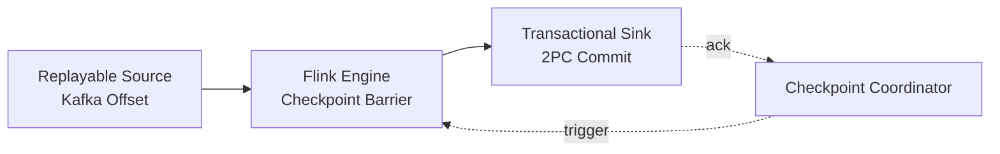

# Flink End-to-End Exactly-Once Guarantees

> **Stage**: Flink | **Prerequisites**: [Checkpoint Mechanism](./flink-state-management-complete-guide.md) | **Formal Level**: L3
>
> **Flink Version**: 1.17-1.19 | **Status**: Production Ready | **Complexity**: L4 (Advanced)

---

## 1. Definitions

**Def-F-02-05: Exactly-Once Semantics**

For each input record $r$ in a streaming application, the output to external systems reflects exactly one processing effect[^1]:

$$
\forall r \in \text{Input}. \; |\{ e \in \text{Output} \mid \text{caused\_by}(e, r) \}| = 1
$$

**Key Insight**: Exactly-Once targets **side effects** (external system state changes), not internal record transmission count. During fault recovery, records are inevitably reprocessed; Exactly-Once guarantees that "reprocessing produces no new side effects."

**Def-F-02-06: Three Pillars of End-to-End Exactly-Once**

| Pillar | Component | Requirement |
|--------|-----------|-------------|
| Replayable Source | Kafka, Pulsar | Offset-based recovery, idempotent producers |
| Consistent Checkpoint | Flink Engine | Barrier-aligned or unaligned snapshot |
| Transactional Sink | Kafka, JDBC | Two-phase commit, idempotent writes |

---

## 2. Properties

**Prop-F-02-05: Idempotent Sink Output**

For idempotent sink functions $f$, applying $f$ multiple times with the same input yields identical external state:

$$
\forall x. \; f(f(x)) = f(x)
$$

**Prop-F-02-06: Transactional Commit Atomicity**

Two-phase commit (2PC) sinks guarantee that checkpoint completion and external transaction commit are atomic: either both succeed or both abort[^2].

---

## 3. Relations

- **with Checkpointing**: Exactly-Once builds upon aligned/unaligned checkpoint barriers.
- **with State Management**: Operator state must be recoverable to consistent point-in-time snapshot.
- **with Source/Sink Contracts**: Requires `CheckpointedFunction` + `TwoPhaseCommitSinkFunction` implementations.

---

## 4. Argumentation

**At-Least-Once vs Exactly-Once Trade-off**:

| Guarantee | Latency Impact | Throughput Impact | Use Case |
|-----------|--------------|-------------------|----------|
| At-Least-Once | None | None | Logging, metrics |
| Exactly-Once (Aligned) | Barrier latency | Head-of-line blocking | Financial transactions |
| Exactly-Once (Unaligned) | Buffer copying overhead | Higher than aligned | High-throughput pipelines |

---

## 5. Engineering Argument

**Theorem (End-to-End Exactly-Once)**: Given a replayable source, aligned checkpoint with state backend, and transactional 2PC sink, the pipeline provides end-to-end Exactly-Once semantics.

*Proof Sketch*:

1. Source replays from last committed offset upon recovery.
2. Flink restores all operators to checkpoint state.
3. Sink commits transactions only upon checkpoint acknowledge.
4. If failure occurs before commit, transaction aborts; after commit, source offset advanced.
∎

---

## 6. Examples

```java
// FlinkKafkaProducer with EXACTLY_ONCE
FlinkKafkaProducer<String> producer = new FlinkKafkaProducer<>(
    topic,
    new SimpleStringSchema(),
    properties,
    FlinkKafkaProducer.Semantic.EXACTLY_ONCE
);
stream.addSink(producer);
```

---

## 7. Visualizations

**End-to-End Exactly-Once Architecture**:



---

## 8. References

[^1]: Apache Flink Documentation, "Exactly-Once Semantics", 2025. <https://nightlies.apache.org/flink/flink-docs-stable/docs/dev/datastream/fault-tolerance/exactly-once/>
[^2]: M. Kleppmann, *Designing Data-Intensive Applications*, O'Reilly, 2017.
