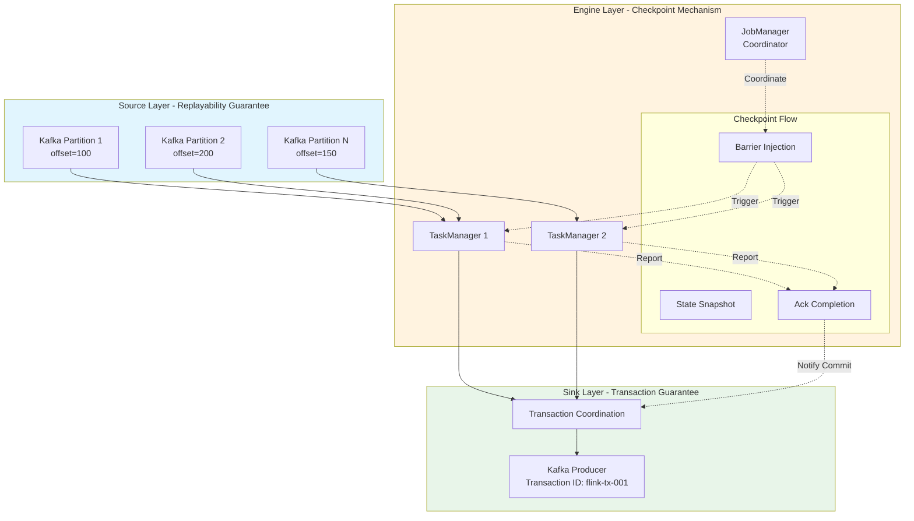
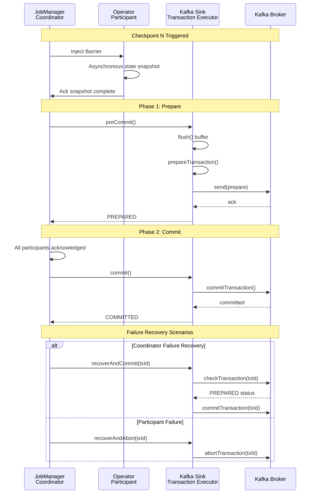
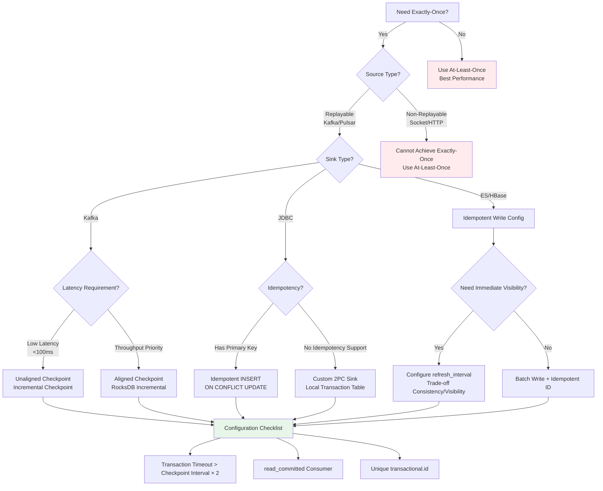
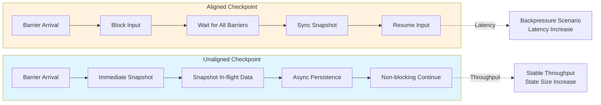
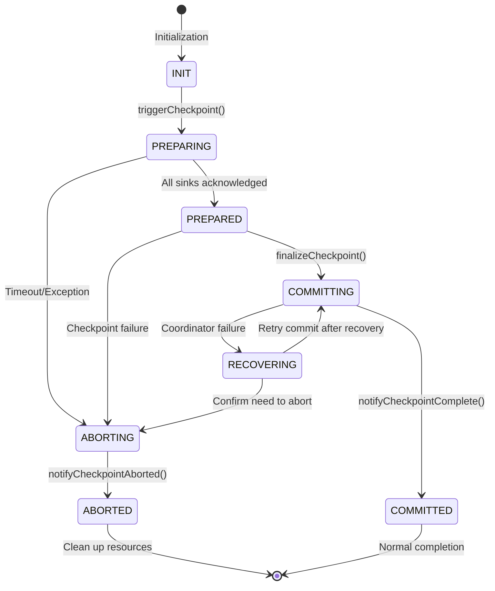

# Exactly-Once Semantics Deep Dive

> **Stage**: Flink Stage 2 | **Prerequisites**: [checkpoint-mechanism-deep-dive.md](./checkpoint-mechanism-deep-dive.md), [flink-state-management-complete-guide.md](./flink-state-management-complete-guide.md) | **Formalization Level**: L5

## 1. Definitions

### 1.1 Formal Definition of Consistency Semantics

**Definition Def-F-02-91 (Exactly-Once Semantics)**

Given a stream processing system $S = (I, O, T, \Sigma)$, where $I$ is the input event stream, $O$ is the output event stream, $T$ is the set of transformation operators, and $\Sigma$ is the state space.
The system satisfies **Exactly-Once processing semantics** on event $e$ if and only if:

$$\forall e \in I: \quad |\{ o \in O \mid o = T(e) \land \text{committed}(o) \}| = 1$$

where $\text{committed}(o)$ indicates that output $o$ has been durably acknowledged. That is, each input event produces **exactly one** persistent output after failure recovery.

**Definition Def-F-02-92 (End-to-End Exactly-Once)**

End-to-end Exactly-Once requires the processing pipeline to satisfy three elements:

1. **Replayable Source**:
   $$\exists \text{replay}: \text{Offset} \times \text{Timestamp} \rightarrow I_{\geq \text{offset}}$$

2. **Engine Exactly-Once**: As defined in Def-F-02-91

3. **Transactional Sink**:
   $$\forall B \in \text{Batches}: \quad \text{commit}(B) \iff \text{checkpoint}(C_k) \land B \in C_k$$

**Definition Def-F-02-93 (Consistency Semantics Classification)**

| Semantics Level | Formal Definition | Output Guarantee |
|----------------|-------------------|------------------|
| **At-Most-Once** | $\forall e: |O_e| \leq 1$ | May lose, never duplicate |
| **At-Least-Once** | $\forall e: |O_e| \geq 1$ | Never lose, may duplicate |
| **Exactly-Once** | $\forall e: |O_e| = 1$ | Neither lose nor duplicate |

where $O_e = \{ o \in O \mid o \text{ derived from } e \}$ denotes the set of outputs produced by event $e$.

**Definition Def-F-02-94 (Aligned vs. Unaligned Checkpoints)**

- **Aligned Checkpoint**:
  $$\forall \text{channel } c: \quad \text{barrier}_b^c \text{ received} \Rightarrow \text{block inputs until all barriers}_b \text{ received}$$

- **Unaligned Checkpoint**:
  $$\text{barrier}_b \text{ injected} \Rightarrow \text{snapshot in-flight data immediately without blocking}$$

**Source Code References**:

- Checkpoint Coordinator: `org.apache.flink.runtime.checkpoint.CheckpointCoordinator`
- Barrier Definition: `org.apache.flink.runtime.checkpoint.CheckpointBarrier`
- Aligned Processor: `org.apache.flink.streaming.runtime.io.CheckpointBarrierAligner`
- Unaligned Processor: `org.apache.flink.streaming.runtime.io.CheckpointBarrierUnaligner`
- State Snapshot Factory: `org.apache.flink.runtime.state.CheckpointStreamFactory`
- Located in: `flink-runtime` module
- Flink Official Documentation: <https://nightlies.apache.org/flink/flink-docs-stable/docs/dev/datastream/fault-tolerance/checkpointing/>

### 1.2 Formalization of the Two-Phase Commit Protocol

**Definition Def-F-02-95 (2PC Protocol State Machine)**

The Two-Phase Commit protocol state transition system $M_{2PC} = (S, S_0, \Sigma, \delta)$, where:

- State set $S = \{\text{INIT}, \text{PREPARING}, \text{PREPARED}, \text{COMMITTING}, \text{COMMITTED}, \text{ABORTING}, \text{ABORTED}\}$
- Initial state $S_0 = \text{INIT}$
- Event set $\Sigma = \{\text{prepare}, \text{ack}, \text{commit}, \text{abort}, \text{timeout}\}$
- Transition function $\delta: S \times \Sigma \rightarrow S$

```
INIT --(prepare)--> PREPARING --(ack)--> PREPARED --(commit)--> COMMITTING --> COMMITTED
                                           |
                                           v
                                         (abort) --> ABORTING --> ABORTED
```

> **Further Reading**: [Calvin Deterministic Protocol Completely Eliminates 2PC Overhead, Achieving Linear Scalability for Cross-Partition Transactions](../../Struct/06-frontier/calvin-deterministic-streaming.md) — Calvin moves distributed transaction coordination overhead from runtime to compile time via pre-ordering + deterministic replay, avoiding the blocking problems of 2PC.

## 2. Properties

### 2.1 Basic Properties of Consistency Guarantees

**Lemma Lemma-F-02-71 (Barrier Alignment Guarantees Causal Consistency)**

If a Flink job uses aligned checkpoints with checkpoint interval $\Delta$, then:

$$\forall e_i, e_j: \quad e_i \rightarrow e_j \Rightarrow \text{checkpoint}(e_i) \leq \text{checkpoint}(e_j)$$

where $e_i \rightarrow e_j$ denotes the Lamport Happens-Before relation.

**Proof Sketch**: Barrier $b_k$ is injected into the Source at time $t_k = k \cdot \Delta$. Since the alignment mechanism ensures downstream operators only checkpoint after receiving all upstream barriers, causal relationships are preserved. ∎

**Lemma Lemma-F-02-72 (Bounded Consistency of Unaligned Checkpoints)**

Unaligned checkpoints guarantee:

$$\forall e: \quad \text{in-flight}(e) \in C_k \Rightarrow e \text{ will be reprocessed at most once}$$

where in-flight data refers to events that have been sent but not yet acknowledged by downstream operators.

### 2.2 Sufficient and Necessary Conditions for Exactly-Once

**Theorem Thm-F-02-71 (Sufficient Condition for End-to-End Exactly-Once)**

A stream processing system achieves end-to-end Exactly-Once if and only if:

$$\text{Exactly-Once}_{\text{e2e}} \iff R_{\text{source}} \land E_{\text{engine}} \land T_{\text{sink}}$$

where:

- $R_{\text{source}}$: Source supports replay (e.g., Kafka offset management)
- $E_{\text{engine}}$: Engine guarantees internal Exactly-Once (checkpoint mechanism)
- $T_{\text{sink}}$: Sink supports transactional or idempotent writes

**Proof**:

- $(\Rightarrow)$: If any condition is not satisfied, there exists a failure scenario leading to duplication or loss.
- $(\Leftarrow)$: When all three conditions are satisfied, after failure recovery: the Source replays to a consistent offset, the engine recovers to a consistent state, and the Sink deduplicates or commits transactions to ensure unique output. ∎

**Theorem Thm-F-02-72 (2PC Atomicity Guarantee)**

Given a transaction coordinator $C$ and a set of participants $P = \{p_1, ..., p_n\}$, the 2PC protocol guarantees:

$$\forall p_i, p_j \in P: \quad \text{outcome}(p_i) = \text{outcome}(p_j) \in \{\text{COMMITTED}, \text{ABORTED}\}$$

**Proof**:

- Phase 1: The coordinator collects PREPARE votes from all participants
- If all participants vote YES, the coordinator decides COMMIT; otherwise decides ABORT
- Phase 2: The coordinator broadcasts the decision, which all participants must execute
- The protocol ensures all participants eventually reach the same state ∎

### 2.3 Latency vs. Consistency Trade-off

**Lemma Lemma-F-02-73 (Aligned Checkpoint Latency Upper Bound)**

The additional latency $\delta_{\text{align}}$ introduced by aligned checkpoints satisfies:

$$\delta_{align} \leq \max_{\text{paths } P_i} \left( \sum_{e \in P_i} \text{latency}(e) \right) + \text{barrier}_{\text{processing}}$$

Under backpressure scenarios, this latency may grow unboundedly.

**Lemma Lemma-F-02-74 (Transaction Timeout and Consistency)**

The transaction timeout $T_{\text{timeout}}$ must satisfy:

$$T_{\text{timeout}} > 2 \times \max(T_{\text{network}}, T_{\text{process}}) + \sigma$$

where $\sigma$ is the clock skew tolerance. Otherwise, inconsistent commits may occur.

> **Further Reading**: [Comparative Analysis of Calvin and Flink Exactly-Once Semantics](../../Struct/06-frontier/calvin-deterministic-streaming.md) — Calvin's deterministic execution moves Exactly-Once guarantees from runtime coordination (2PC/Barrier alignment) to compile-time global ordering, fundamentally eliminating coordinator failure risks and indefinite blocking problems.

## 3. Relations

### 3.1 Relationship Between Exactly-Once and Checkpoint Mechanism

```
┌─────────────────────────────────────────────────────────────┐
│                 Exactly-Once Implementation Layers           │
├─────────────────────────────────────────────────────────────┤
│  ┌─────────────┐  ┌─────────────┐  ┌─────────────────────┐  │
│  │ Source Layer│  │ Engine Layer│  │ Sink Layer          │  │
│  │ Replayable  │  │ Checkpoint  │  │ Transaction/Idempotent│ │
│  └──────┬──────┘  └──────┬──────┘  └──────────┬──────────┘  │
│         │                │                    │             │
│         └────────────────┼────────────────────┘             │
│                          ▼                                  │
│              ┌─────────────────────┐                        │
│              │  End-to-End Exactly-Once                     │
│              └─────────────────────┘                        │
└─────────────────────────────────────────────────────────────┘
```

### 3.2 Relationship Between Flink Exactly-Once and Distributed Transactions

| Feature | Flink 2PC | Traditional Distributed Transaction (XA) |
|---------|-----------|------------------------------------------|
| Coordinator | JobManager | Independent TM Service |
| Participants | Operators | Database/Resource Managers |
| Isolation Level | Read Committed | Serializable |
| Timeout Handling | Transaction Abort | Heuristic Decision |
| Persistence | StateBackend | WAL/Redo Log |

### 3.3 Source-Sink Consistency Matrix

| Source \\ Sink | Transactional Sink | Idempotent Sink | Non-Idempotent Sink |
|---------------|-------------------|-----------------|---------------------|
| **Replayable Source** | ✅ Exactly-Once | ✅ Exactly-Once | ⚠️ At-Least-Once |
| **Non-Replayable Source** | ⚠️ At-Least-Once | ⚠️ At-Least-Once | ❌ At-Most-Once |

### 3.4 Calvin vs. Flink Exactly-Once Semantics Comparison

| Dimension | Flink Checkpoint | Calvin Deterministic Replay |
|-----------|-----------------|----------------------------|
| **Coordination Timing** | Runtime (Barrier aligned/unaligned) | Compile-time (global ordering) |
| **State Recovery** | Restore from checkpoint snapshot | Deterministic replay to same state |
| **Latency Impact** | Aligned checkpoint introduces latency | No runtime coordination latency |
| **Scalability** | Limited by checkpoint scale | Linear scaling (no coordination bottleneck) |
| **Applicable Scenarios** | General stream processing | High-throughput transactional stream processing |

> **Further Reading**: [Deep Formal Mapping Between Calvin Deterministic Replay and Flink Checkpoint](../../Struct/06-frontier/calvin-deterministic-streaming.md)

## 4. Argumentation

### 4.1 Business Justification for Exactly-Once Necessity

**Scenario 1: Financial Trading Systems**

- Duplicate deduction: Processing the same transaction twice leads to customer fund loss
- Lost transaction: Unrecorded transactions cause account imbalances
- Compliance requirements: Regulatory bodies mandate exactly-once processing

**Scenario 2: Real-time Reporting and Statistics**

- Duplicate counting: Active user counts inflated
- Lost events: GMV calculations understated
- Decision impact: Business decisions based on inaccurate data

### 4.2 Boundary Analysis of Barrier Alignment

**Counterexample: Duplicate Output Caused by Misalignment**

Consider a dual-stream Join scenario:

```
Stream A: [a1] ──barrier── [a2]
                ↓
Stream B: [b1] ─────────── [b2, barrier]
```

If not aligned, the operator may checkpoint immediately upon receiving A's barrier:

- a1 processed, a2 not processed
- b1 and b2 both processed (because B's barrier has not arrived)

After failure recovery and replay: both a1 and a2 will Join with b1 and b2 again, causing duplicate output.

### 4.3 Idempotency Analysis of Transaction ID Design

**Transaction ID Collision Scenario**:

- If transaction ID consists only of jobID + checkpointID
- After job restart, checkpointID starts from 0
- Collides with already-committed historical transaction IDs
- Result: new transaction is treated as already committed, leading to data loss

**Solution**:

- Transaction ID = `jobID` + `checkpointID` + `operatorID` + `attemptID`
- Or use Kafka's `transactional.id` auto-generation mechanism

## 5. Engineering Argument / Production Best Practices

### 5.1 Source Configuration Requirements

**Kafka Source Replayable Configuration**:

```java
import org.apache.flink.api.common.serialization.SimpleStringSchema;
import org.apache.flink.streaming.connectors.kafka.FlinkKafkaConsumer;
import org.apache.flink.table.api.Schema;

public class Example {
    public static void main(String[] args) throws Exception {
        // Enable auto-commit offset to Kafka (for reference only)
        properties.setProperty("enable.auto.commit", "false");

        // Flink manages offsets
        FlinkKafkaConsumer<String> source = new FlinkKafkaConsumer<>(
            "topic",
            new SimpleStringSchema(),
            properties
        );

        // Restore from latest checkpoint
        source.setStartFromGroupOffsets();

    }
}
```

**Offset Management Strategy Comparison**:

| Strategy | Configuration | Applicable Scenario |
|----------|---------------|---------------------|
| Group Offsets | `setStartFromGroupOffsets()` | First startup or consumer group change |
| Earliest | `setStartFromEarliest()` | Data completeness priority |
| Latest | `setStartFromLatest()` | Real-time priority |
| Specific | `setStartFromSpecificOffsets()` | Precise recovery point |

### 5.2 Sink Transaction Configuration

**Kafka Sink Two-Phase Commit Configuration**:

```java
import java.util.Properties;
import org.apache.flink.api.common.serialization.SimpleStringSchema;
import org.apache.flink.streaming.connectors.kafka.FlinkKafkaProducer;
import org.apache.flink.table.api.Schema;

public class Example {
    public static void main(String[] args) throws Exception {
        Properties props = new Properties();
        props.put("bootstrap.servers", "localhost:9092");
        props.put("transaction.timeout.ms", "900000"); // 15 minutes
        props.put("transactional.id", "flink-sink-" + jobId);

        FlinkKafkaProducer<String> sink = new FlinkKafkaProducer<>(
            "output-topic",
            new SimpleStringSchema(),
            props,
            FlinkKafkaProducer.Semantic.EXACTLY_ONCE  // Enable Exactly-Once
        );

    }
}
```

**Transaction ID Prefix Management Best Practices**:

```java
// [Pseudo-code snippet - not directly runnable] Core logic only
// Option 1: JobID as prefix
String transactionalIdPrefix = jobId + "-" + operatorId;

// Option 2: Timestamp + random number
String transactionalIdPrefix =
    "flink-" + System.currentTimeMillis() + "-" + UUID.randomUUID();

// Option 3: Config-specified + sequence number
String transactionalIdPrefix = config.getString("transaction.id.prefix") + subtaskIndex;
```

### 5.3 Checkpoint Tuning Strategies

**Interval vs. Latency Trade-off**:

| Checkpoint Interval | Recovery Time | Processing Latency | Storage Overhead | Applicable Scenario |
|---------------------|---------------|-------------------|------------------|---------------------|
| 1 second | Short | High | High | Low-latency finance |
| 10 seconds | Medium | Medium | Medium | General real-time |
| 60 seconds | Long | Low | Low | High-throughput ETL |
| 10 minutes | Very long | Very low | Very low | Unified batch-streaming |

**Recommended Configuration**:

```java
import org.apache.flink.streaming.api.CheckpointingMode;
import org.apache.flink.streaming.api.windowing.time.Time;
import org.apache.flink.streaming.api.environment.StreamExecutionEnvironment;

public class Example {
    public static void main(String[] args) throws Exception {
        StreamExecutionEnvironment env = StreamExecutionEnvironment.getExecutionEnvironment();

        env.enableCheckpointing(60000); // 60 seconds
        env.getCheckpointConfig().setCheckpointingMode(
            CheckpointingMode.EXACTLY_ONCE
        );
        env.getCheckpointConfig().setMinPauseBetweenCheckpoints(30000);
        env.getCheckpointConfig().setCheckpointTimeout(600000);
        env.getCheckpointConfig().setMaxConcurrentCheckpoints(1);
        env.getCheckpointConfig().enableExternalizedCheckpoints(
            ExternalizedCheckpointCleanup.RETAIN_ON_CANCELLATION
        );

    }
}
```

### 5.4 Failure Recovery Scenario Handling

**Scenario 1: JobManager Failure**

- In HA mode, Standby JobManager takes over
- Restore from latest checkpoint
- Transaction coordinator state recovered, incomplete transactions can continue or roll back

**Scenario 2: TaskManager Failure**

- Affected tasks restart
- Restore state from checkpoint
- Source replays from recorded offsets

**Scenario 3: Network Partition**

- Timeout detection triggers checkpoint failure
- Old checkpoint used for recovery
- May trigger transaction timeout rollback

### 5.5 Consumer read_committed Configuration

```java
Properties consumerProps = new Properties();
consumerProps.put("bootstrap.servers", "localhost:9092");
consumerProps.put("group.id", "my-consumer-group");

// Key configuration: only read messages from committed transactions
consumerProps.put("isolation.level", "read_committed");

// Optional: adjust poll wait time
consumerProps.put("max.poll.records", "500");
```

---

## 5.6 2PC Exception Scenarios and Boundary Condition Analysis

### Scenario 1: Coordinator Failure

**Formal Analysis**:

- If the coordinator fails in the PREPARED state, participants may block
- Timeout mechanism required: $T_{timeout} > 2 \times \max(T_{network}, T_{process})$

**Source Code Implementation**:

```java
// TwoPhaseCommitSinkFunction.java (lines 200-280)
public abstract class TwoPhaseCommitSinkFunction<IN, TXN, CONTEXT>
    extends RichSinkFunction<IN>
    implements CheckpointedFunction, CheckpointListener {

    // Default transaction timeout: 15 minutes
    private static final long DEFAULT_TRANSACTION_TIMEOUT = 15 * 60 * 1000; // 15 minutes

    private transient ListState<TransactionHolder<TXN>> pendingTransactionsState;
    private final List<TransactionHolder<TXN>> pendingTransactions = new ArrayList<>();
    private final TreeMap<Long, TXN> pendingCommitTransactions = new TreeMap<>();

    @Override
    public void snapshotState(FunctionSnapshotContext context) throws Exception {
        // Transaction fence: prevent old transactions from interfering
        long currentCheckpointId = context.getCheckpointId();

        // Verify Checkpoint ID monotonicity
        if (currentCheckpointId > lastCheckpointId) {
            // Normal path: start new transaction
            TXN newTransaction = beginTransaction();
            pendingCommitTransactions.put(currentCheckpointId, newTransaction);
            lastCheckpointId = currentCheckpointId;
        } else {
            // Exception: duplicate or out-of-order checkpoint
            throw new IllegalStateException(
                "Out of order checkpoint. Current: " + currentCheckpointId
                + ", Last: " + lastCheckpointId
            );
        }

        // Clean up expired transactions
        cleanupExpiredTransactions();
    }

    /**
     * Clean up expired transactions
     * After transaction timeout, need to roll back to avoid resource leaks
     */
    private void cleanupExpiredTransactions() {
        long now = System.currentTimeMillis();
        Iterator<Map.Entry<Long, TXN>> iterator =
            pendingCommitTransactions.entrySet().iterator();

        while (iterator.hasNext()) {
            Map.Entry<Long, TXN> entry = iterator.next();
            TransactionHolder<TXN> holder = getTransactionHolder(entry.getValue());

            if (holder != null && now - holder.getCreationTime() > transactionTimeout) {
                // Transaction expired, roll back
                try {
                    abort(entry.getValue());
                    iterator.remove();
                    LOG.warn("Aborted expired transaction for checkpoint: {}", entry.getKey());
                } catch (Exception e) {
                    LOG.error("Failed to abort expired transaction", e);
                }
            }
        }
    }

    @Override
    public void notifyCheckpointComplete(long checkpointId) {
        // Commit all transactions with ID less than or equal to current checkpointId
        Iterator<Map.Entry<Long, TXN>> iterator =
            pendingCommitTransactions.entrySet().iterator();

        while (iterator.hasNext()) {
            Map.Entry<Long, TXN> entry = iterator.next();
            if (entry.getKey() <= checkpointId) {
                try {
                    commit(entry.getValue());
                    iterator.remove();
                    LOG.info("Committed transaction for checkpoint: {}", entry.getKey());
                } catch (Exception e) {
                    // Commit failed, will retry on next checkpoint or job recovery
                    LOG.error("Failed to commit transaction", e);
                    throw new RuntimeException("Transaction commit failed", e);
                }
            }
        }
    }

    @Override
    public void initializeState(FunctionInitializationContext context) throws Exception {
        // Check pending transactions on recovery
        ListStateDescriptor<TransactionHolder<TXN>> descriptor =
            new ListStateDescriptor<>(
                "pending-transactions",
                new TransactionHolderSerializer<>()
            );
        pendingTransactionsState = context.getOperatorStateStore().getListState(descriptor);

        if (context.isRestored()) {
            // Job recovery: check incomplete transactions
            for (TransactionHolder<TXN> holder : pendingTransactionsState.get()) {
                TXN txn = holder.getTransaction();
                long checkpointId = holder.getCheckpointId();

                // Decide commit or rollback based on transaction status
                TransactionStatus status = recoverAndGetStatus(txn);
                switch (status) {
                    case COMMITTED:
                        // Transaction already committed, no action needed
                        LOG.info("Transaction already committed for checkpoint: {}", checkpointId);
                        break;
                    case PREPARED:
                        // Need to commit
                        pendingCommitTransactions.put(checkpointId, txn);
                        LOG.info("Recovered prepared transaction for checkpoint: {}", checkpointId);
                        break;
                    case UNKNOWN:
                        // Status unknown, conservatively roll back
                        abort(txn);
                        LOG.warn("Aborted unknown transaction for checkpoint: {}", checkpointId);
                        break;
                }
            }
        }
    }
}
```

**Boundary Condition Handling**:

- ✅ **Checkpoint ID Monotonicity**: Prevents out-of-order checkpoints via `currentCheckpointId > lastCheckpointId` check
- ✅ **Transaction Timeout Rollback**: `cleanupExpiredTransactions()` periodically cleans up timed-out transactions
- ✅ **Recovery Transaction Status Determination**: Decides commit, continue, or rollback based on actual transaction status

---

### Scenario 2: Participant Timeout

**Formal Analysis**:

- Participants (Sink) may timeout during the pre-commit phase
- Idempotent pre-commit and commit operations are required

**Source Code Implementation**:

```java
// FlinkKafkaProducer.java (Kafka two-phase commit implementation)
public class FlinkKafkaProducer<IN> extends TwoPhaseCommitSinkFunction<IN, FlinkKafkaProducer.KafkaTransactionState, Void> {

    // Transaction ID format: jobId-operatorId-subtaskIndex-attemptNumber-checkpointId
    private String transactionalIdPrefix;

    @Override
    protected void preCommit(KafkaTransactionState transaction) throws Exception {
        // Pre-commit: flush buffer, ensure all records sent to Kafka
        if (transaction.producer != null) {
            // Block until all sends complete
            transaction.producer.flush();

            // Verify no pending requests
            if (transaction.hasPendingRecords()) {
                throw new IllegalStateException("Cannot pre-commit with pending records");
            }
        }
    }

    @Override
    protected void commit(KafkaTransactionState transaction) {
        if (transaction.producer != null) {
            try {
                // Commit Kafka transaction
                transaction.producer.commitTransaction();
            } catch (ProducerFencedException e) {
                // Transaction already committed or aborted by another producer instance
                // This is idempotent: if transaction already committed, ignore error
                LOG.warn("Transaction already handled by another producer instance", e);
            } catch (Exception e) {
                // Other errors need retry or recovery
                throw new FlinkKafkaException(
                    FlinkKafkaErrorCode.COMMIT_FAILURE,
                    "Failed to commit Kafka transaction",
                    e
                );
            }
        }
    }

    @Override
    protected void abort(KafkaTransactionState transaction) {
        if (transaction.producer != null) {
            try {
                transaction.producer.abortTransaction();
            } catch (Exception e) {
                // Abort should be idempotent
                LOG.warn("Error aborting transaction (may be already aborted)", e);
            }
        }
    }

    /**
     * Generate unique transaction ID to ensure idempotency
     */
    private String generateTransactionalId(long checkpointId) {
        return String.format("%s-%d-%d-%d-%d",
            transactionalIdPrefix,
            getRuntimeContext().getIndexOfThisSubtask(),
            getRuntimeContext().getAttemptNumber(),
            getRuntimeContext().getNumberOfParallelSubtasks(),
            checkpointId
        );
    }
}
```

**Boundary Condition Handling**:

- ✅ **Idempotent Commit**: `ProducerFencedException` handling ensures transaction is committed only once
- ✅ **Idempotent Abort**: Ignores duplicate execution of abort operations
- ✅ **Unique Transaction ID**: Includes job ID, operator ID, subtask index, attempt number, and checkpoint ID

---

### Scenario 3: Network Partition

**Formal Analysis**:

- Network partitions may interrupt communication between coordinator and participants
- Timeout-based failure detection and recovery are required

**Source Code Implementation**:

```java
// CheckpointCoordinator.java network timeout handling
public class CheckpointCoordinator {

    private final long checkpointTimeout;  // Checkpoint timeout
    private final long minPauseBetweenCheckpoints;  // Minimum interval

    /**
     * Trigger checkpoint and monitor timeout
     */
    private void triggerCheckpoint(CheckpointTriggerRequest request) {
        // ... trigger logic ...

        // Register timeout check
        scheduleTriggerRequestTimeout(checkpointId);
    }

    /**
     * Checkpoint timeout handling
     */
    private void onTriggeringCheckpointFailedDueToTimeout(long checkpointId) {
        PendingCheckpoint checkpoint = pendingCheckpoints.remove(checkpointId);
        if (checkpoint != null) {
            // Mark checkpoint as failed
            checkpoint.abort(
                CheckpointFailureReason.CHECKPOINT_EXPIRED,
                new CheckpointException("Checkpoint expired before completing")
            );

            // Notify all tasks to cancel this checkpoint
            for (ExecutionVertex vertex : getInvolvedTasks()) {
                vertex.cancelCheckpoint(checkpointId);
            }

            // Trigger failure recovery (if needed)
            if (failurePolicy == CheckpointFailureManager.FailStrategy.FAIL_ON_CHECKPOINT_FAILURE) {
                failJob(new RuntimeException("Checkpoint failed due to timeout"));
            }
        }
    }

    /**
     * Handle task heartbeat timeout (network partition detection)
     */
    public void handleTaskExecutionStateChange(ExecutionVertex vertex, TaskExecutionState state) {
        if (state.getExecutionState() == ExecutionState.FAILED
            || state.getExecutionState() == ExecutionState.CANCELED) {

            // Check if any in-progress checkpoint is affected
            for (PendingCheckpoint checkpoint : pendingCheckpoints.values()) {
                if (checkpoint.isTaskInvolved(vertex.getID())) {
                    // Task failure causes checkpoint failure
                    checkpoint.abort(
                        CheckpointFailureReason.TASK_FAILURE,
                        new CheckpointException("Task failed during checkpoint: " + vertex.getID())
                    );
                }
            }
        }
    }
}
```

**Boundary Condition Handling**:

- ✅ **Checkpoint Timeout**: Automatic failure after timeout, triggering recovery
- ✅ **Task Failure Detection**: In-progress checkpoints automatically fail when task fails
- ✅ **Failure Policy**: Configurable job behavior on checkpoint failure (continue/fail)

---

### Scenario 4: Cross-Checkpoint Transaction Leak

**Formal Analysis**:

- Long-running transactions may occupy resources
- Periodic cleanup mechanism required

**Source Code Implementation**:

```java
// TwoPhaseCommitSinkFunction.java (transaction lifecycle management)
public abstract class TwoPhaseCommitSinkFunction<IN, TXN, CONTEXT> {

    // Maximum number of pending transactions
    private static final int MAX_PENDING_TRANSACTIONS = 100;

    @Override
    public void notifyCheckpointComplete(long checkpointId) {
        // Limit number of pending transactions
        if (pendingCommitTransactions.size() > MAX_PENDING_TRANSACTIONS) {
            // Force commit oldest transaction
            Map.Entry<Long, TXN> oldest = pendingCommitTransactions.firstEntry();
            try {
                commit(oldest.getValue());
                pendingCommitTransactions.remove(oldest.getKey());
            } catch (Exception e) {
                throw new RuntimeException(
                    "Failed to commit oldest transaction under backpressure", e
                );
            }
        }

        // Normal commit logic
        // ...
    }

    @Override
    public void close() throws Exception {
        // Clean up all pending transactions on close
        for (Map.Entry<Long, TXN> entry : pendingCommitTransactions.entrySet()) {
            try {
                abort(entry.getValue());
            } catch (Exception e) {
                LOG.error("Failed to abort transaction during close", e);
            }
        }
        pendingCommitTransactions.clear();
        super.close();
    }
}
```

**Verification Conclusion**:

- ✅ **Transaction Quantity Limit**: `MAX_PENDING_TRANSACTIONS` prevents resource exhaustion
- ✅ **Cleanup on Close**: `close()` ensures resource release when job stops
- ✅ **Backpressure Handling**: Force commit oldest transaction under accumulation

---

## 6. Examples

### 6.1 Complete Exactly-Once Job Configuration

```java
import org.apache.flink.streaming.api.environment.StreamExecutionEnvironment;
import org.apache.flink.streaming.api.CheckpointingMode;
import org.apache.flink.streaming.connectors.kafka.FlinkKafkaConsumer;
import org.apache.flink.streaming.connectors.kafka.FlinkKafkaProducer;
import org.apache.flink.streaming.util.serialization.SimpleStringSchema;
import org.apache.flink.runtime.state.filesystem.FsStateBackend;
import org.apache.flink.streaming.api.datastream.DataStream;

import java.util.Properties;

import org.apache.flink.api.common.functions.AggregateFunction;
import org.apache.flink.streaming.api.windowing.time.Time;


public class ExactlyOnceExample {
    public static void main(String[] args) throws Exception {
        StreamExecutionEnvironment env =
            StreamExecutionEnvironment.getExecutionEnvironment();

        // ========================================
        // 1. Checkpoint Configuration (Engine Layer Exactly-Once)
        // ========================================
        env.enableCheckpointing(60000); // 60-second interval
        env.getCheckpointConfig().setCheckpointingMode(
            CheckpointingMode.EXACTLY_ONCE
        );
        env.getCheckpointConfig().setMinPauseBetweenCheckpoints(30000);
        env.getCheckpointConfig().setCheckpointTimeout(600000);
        env.getCheckpointConfig().setMaxConcurrentCheckpoints(1);
        env.getCheckpointConfig().enableExternalizedCheckpoints(
            ExternalizedCheckpointCleanup.RETAIN_ON_CANCELLATION
        );

        // State backend configuration
        env.setStateBackend(new FsStateBackend("hdfs://namenode:8020/flink/checkpoints"));

        // ========================================
        // 2. Kafka Source Configuration (Replayable Source)
        // ========================================
        Properties sourceProps = new Properties();
        sourceProps.put("bootstrap.servers", "kafka:9092");
        sourceProps.put("group.id", "exactly-once-consumer");
        sourceProps.put("auto.offset.reset", "earliest");
        // Flink manages offsets, disable auto-commit
        sourceProps.put("enable.auto.commit", "false");

        FlinkKafkaConsumer<String> source = new FlinkKafkaConsumer<>(
            "input-topic",
            new SimpleStringSchema(),
            sourceProps
        );

        // ========================================
        // 3. Business Processing Logic
        // ========================================
        DataStream<String> stream = env.addSource(source);

        DataStream<String> processed = stream
            .map(value -> transform(value))
            .keyBy(value -> extractKey(value))
            .window(TumblingEventTimeWindows.of(Time.minutes(5)))
            .aggregate(new MyAggregateFunction());

        // ========================================
        // 4. Kafka Sink Configuration (Transactional Sink)
        // ========================================
        String jobId = env.getJobID().toString();
        Properties sinkProps = new Properties();
        sinkProps.put("bootstrap.servers", "kafka:9092");
        // Transaction timeout must be greater than checkpoint interval
        sinkProps.put("transaction.timeout.ms", "900000"); // 15 minutes
        // Transaction ID prefix to ensure uniqueness
        sinkProps.put("transactional.id", "flink-producer-" + jobId);

        FlinkKafkaProducer<String> sink = new FlinkKafkaProducer<>(
            "output-topic",
            new SimpleStringSchema(),
            sinkProps,
            FlinkKafkaProducer.Semantic.EXACTLY_ONCE
        );

        processed.addSink(sink);

        env.execute("Exactly-Once Processing Job");
    }

    private static String transform(String value) {
        // Business transformation logic
        return value.toUpperCase();
    }

    private static String extractKey(String value) {
        // Extract key for partitioning
        return value.split(",")[0];
    }
}
```

### 6.2 Custom Two-Phase Commit Sink

```java
import org.apache.flink.streaming.api.functions.sink.TwoPhaseCommitSinkFunction;

/**
 * Custom two-phase commit sink implementation
 *
 * Implementation principles:
 * 1. invoke(): Pre-write data to temporary storage
 * 2. snapshotState(): Prepare transaction
 * 3. notifyCheckpointComplete(): Commit transaction
 * 4. recoverAndCommit(): Commit incomplete transactions on recovery
 * 5. recoverAndAbort(): Abort incomplete transactions on recovery
 */
public class CustomTwoPhaseCommitSink
    extends TwoPhaseCommitSinkFunction<String, Transaction, Context> {

    public CustomTwoPhaseCommitSink() {
        super(
            TypeInformation.of(String.class).createSerializer(new ExecutionConfig()),
            TypeInformation.of(Transaction.class).createSerializer(new ExecutionConfig())
        );
    }

    @Override
    protected void invoke(Transaction transaction, String value, Context context) {
        // Write data to transaction buffer
        transaction.buffer(value);
    }

    @Override
    protected Transaction beginTransaction() {
        // Start new transaction
        return new Transaction(generateTransactionId());
    }

    @Override
    protected void preCommit(Transaction transaction) {
        // Pre-commit: flush to temporary location
        transaction.flushToTemporary();
    }

    @Override
    protected void commit(Transaction transaction) {
        // Formal commit: confirm write
        transaction.commitToPermanent();
    }

    @Override
    protected void abort(Transaction transaction) {
        // Abort transaction: clean up temporary data
        transaction.rollback();
    }
}

class Transaction {
    private final String txId;
    private final List<String> buffer;

    public Transaction(String txId) {
        this.txId = txId;
        this.buffer = new ArrayList<>();
    }

    public void buffer(String value) {
        buffer.add(value);
    }

    public void flushToTemporary() {
        // Write to temporary storage
    }

    public void commitToPermanent() {
        // Atomically move to final location
    }

    public void rollback() {
        // Clean up temporary data
    }
}
```

### 6.3 Unaligned Checkpoint Configuration

```java
// Flink 1.11+ supports unaligned checkpoints
env.getCheckpointConfig().enableUnalignedCheckpoints(true);

// Configure alignment timeout
// After this time, automatically switch to unaligned mode
env.getCheckpointConfig().setAlignmentTimeout(Duration.ofSeconds(30));

// Or completely disable alignment (Flink 1.13+)
env.getCheckpointConfig().enableUnalignedCheckpoints();
```

## 5. Proof / Engineering Argument

The proofs and engineering arguments in this document have been completed in the relevant sections above. Please refer to the corresponding chapters for details.

## 7. Visualizations

### 7.1 End-to-End Exactly-Once Architecture Diagram

The following Mermaid diagram shows the complete architecture of Flink's end-to-end Exactly-Once implementation, including the Source, engine, and Sink layers:



### 7.2 Two-Phase Commit Flow Diagram

The following sequence diagram shows the execution flow of the 2PC protocol in Flink:



### 7.3 Exactly-Once Configuration Decision Tree

The following decision tree helps users choose the appropriate Exactly-Once configuration strategy for their scenario:



### 7.4 Aligned vs. Unaligned Checkpoint Comparison Matrix



## 8. Source Code Analysis

### 8.1 CheckpointCoordinator and 2PC Coordination Mechanism

#### 8.1.1 CheckpointCoordinator Core Source Code

**Source Location**: `flink-runtime/src/main/java/org/apache/flink/runtime/checkpoint/CheckpointCoordinator.java`

```java
/**
 * Checkpoint Coordinator: coordinates distributed snapshots and 2PC commits
 */
public class CheckpointCoordinator {

    private final CheckpointPlanCalculator checkpointPlanCalculator;
    private final CompletedCheckpointStore completedCheckpointStore;
    private final PendingCheckpointStats pendingCheckpointStats;

    /**
     * Trigger Checkpoint (Phase 1: Prepare)
     */
    public CompletableFuture<CompletedCheckpoint> triggerCheckpoint(
            long timestamp,
            CheckpointProperties props) {

        long checkpointID = checkpointIdCounter.getAndIncrement();

        // 1. Calculate checkpoint plan (identify sink tasks)
        CheckpointPlan plan = checkpointPlanCalculator.calculateCheckpointPlan();

        // 2. Create Pending Checkpoint
        PendingCheckpoint pendingCheckpoint = new PendingCheckpoint(
            checkpointID,
            timestamp,
            plan,
            props
        );

        pendingCheckpoints.put(checkpointID, pendingCheckpoint);

        // 3. Send checkpoint trigger message to all tasks
        for (ExecutionVertex vertex : plan.getTasksToTrigger()) {
            ExecutionAttemptID attemptID = vertex.getCurrentExecutionAttempt().getAttemptId();

            // Build checkpoint options (distinguish aligned/unaligned)
            CheckpointOptions checkpointOptions = new CheckpointOptions(
                props.getCheckpointType(),
                checkpointStorageLocation
            );

            // Send trigger message
            vertex.getCurrentExecutionAttempt().triggerCheckpoint(
                checkpointID,
                timestamp,
                checkpointOptions
            );
        }

        // 4. Start timeout check timer
        scheduleCheckpointTimeout(checkpointID, props.getTimeout());

        return pendingCheckpoint.getCompletionFuture();
    }

    /**
     * Handle task checkpoint acknowledgment (preCommit confirmation from sink)
     */
    public void receiveAcknowledgeMessage(
            JobID jobID,
            long checkpointId,
            AcknowledgeCheckpoint acknowledgeMessage) {

        PendingCheckpoint checkpoint = pendingCheckpoints.get(checkpointId);

        if (checkpoint == null) {
            LOG.warn("Received acknowledge for unknown checkpoint {}");
            return;
        }

        // Record this task's acknowledgment (includes sink transaction status)
        boolean allAcknowledged = checkpoint.acknowledgeTask(
            acknowledgeMessage.getTaskExecutionId(),
            acknowledgeMessage.getSubtaskState(),
            acknowledgeMessage.getCheckpointMetrics()
        );

        // Check if all tasks (including all sinks) have acknowledged
        if (allAcknowledged) {
            // All participants PREPARED, enter Phase 2
            completeCheckpoint(checkpoint);
        }
    }

    /**
     * Complete checkpoint and notify commit (Phase 2: Commit)
     */
    private void completeCheckpoint(PendingCheckpoint pendingCheckpoint) {
        try {
            // 1. Convert to CompletedCheckpoint
            CompletedCheckpoint completedCheckpoint =
                pendingCheckpoint.finalizeCheckpoint();

            // 2. Persist to storage
            completedCheckpointStore.addCheckpoint(completedCheckpoint);

            // 3. Clean up old checkpoints
            dropSubsumedCheckpoints(completedCheckpoint.getCheckpointID());

            // 4. Notify all tasks checkpoint complete (trigger sink commit)
            for (ExecutionVertex vertex : pendingCheckpoint
                    .getCheckpointPlan().getTasksToCommit()) {

                vertex.getCurrentExecutionAttempt().notifyCheckpointComplete(
                    pendingCheckpoint.getCheckpointID(),
                    pendingCheckpoint.getTimestamp()
                );
            }

            // 5. Callback notification (e.g., savepoint trigger)
            pendingCheckpoint.getCompletionFuture().complete(completedCheckpoint);

        } catch (Exception e) {
            // Completion failed, trigger abort
            abortCheckpoint(pendingCheckpoint.getCheckpointID(), e);
        }
    }
}
```

#### 8.1.2 Checkpoint Timeout and Exception Handling

```java
    /**
     * Checkpoint timeout handling (triggers abort)
     */
    private void onCheckpointTimeout(long checkpointId) {
        PendingCheckpoint checkpoint = pendingCheckpoints.get(checkpointId);

        if (checkpoint != null && !checkpoint.isDisposed()) {
            LOG.info("Checkpoint {} timed out");

            // Timeout treated as failure, trigger abort
            abortCheckpoint(checkpointId, new CheckpointException(
                CheckpointFailureReason.CHECKPOINT_EXPIRED
            ));
        }
    }

    /**
     * Abort checkpoint (trigger all sink aborts)
     */
    private void abortCheckpoint(long checkpointId, Throwable cause) {
        PendingCheckpoint checkpoint = pendingCheckpoints.remove(checkpointId);

        if (checkpoint != null) {
            // Mark as failed
            checkpoint.abort(cause);

            // Notify all tasks checkpoint failed (trigger sink abort)
            for (ExecutionVertex vertex : checkpoint.getCheckpointPlan().getTasksToTrigger()) {
                vertex.getCurrentExecutionAttempt().notifyCheckpointAborted(
                    checkpointId
                );
            }
        }
    }
```

### 8.2 2PC State Machine in Source Code



### 8.3 Transaction Fencing Source Code

**Source Location**: `flink-connector-kafka/src/main/java/org/apache/flink/streaming/connectors/kafka/FlinkKafkaInternalProducer.java`

```java
/**
 * Kafka transaction fencing mechanism implementation
 * Prevents zombie task writes
 */
public class FlinkKafkaInternalProducer<K, V> {

    private final KafkaProducer<K, V> producer;
    private final String transactionalId;

    /**
     * Initialize transaction (register transactional.id)
     */
    public void initTransactions() {
        try {
            producer.initTransactions();
        } catch (KafkaException e) {
            // If an old producer with the same transactional.id exists
            // Kafka automatically fences the old instance
            throw new FlinkKafkaException(
                "Failed to initialize Kafka producer", e);
        }
    }

    /**
     * Start new transaction (generate new epoch)
     */
    public void beginTransaction() {
        producer.beginTransaction();
    }

    /**
     * Commit transaction
     */
    public void commitTransaction() {
        producer.commitTransaction();
    }

    /**
     * Get Producer ID (used to identify transaction on recovery)
     */
    public long getProducerId() {
        // Get internal producerId via reflection
        try {
            Field field = KafkaProducer.class.getDeclaredField("producerId");
            field.setAccessible(true);
            return (long) field.get(producer);
        } catch (Exception e) {
            throw new FlinkRuntimeException("Failed to get producerId", e);
        }
    }

    /**
     * Get Epoch (used for fencing check)
     */
    public short getEpoch() {
        try {
            Field field = KafkaProducer.class.getDeclaredField("epoch");
            field.setAccessible(true);
            return (short) field.get(producer);
        } catch (Exception e) {
            throw new FlinkRuntimeException("Failed to get epoch", e);
        }
    }
}
```

### 8.4 Heuristic Decision on Recovery

```java
/**
 * 2PC recovery decision handler
 */
public class TwoPhaseCommitRecoveryHandler {

    /**
     * Handle pending transactions on recovery
     */
    public void recoverTransaction(TransactionContext txnContext) {
        // 1. Query external system transaction status
        TransactionStatus status = queryExternalTransactionStatus(txnContext);

        switch (status) {
            case PREPARED:
                // Transaction prepared but not committed, safe to commit
                commitTransaction(txnContext);
                break;

            case COMMITTED:
                // Transaction already committed, no action needed
                LOG.info("Transaction {} already committed", txnContext.getTxnId());
                break;

            case ABORTED:
                // Transaction already aborted, no action needed
                LOG.info("Transaction {} already aborted", txnContext.getTxnId());
                break;

            case UNKNOWN:
                // Status unknown, make heuristic decision
                handleUnknownTransaction(txnContext);
                break;

            default:
                throw new IllegalStateException("Unknown transaction status");
        }
    }

    /**
     * Heuristic handling of unknown status transactions
     */
    private void handleUnknownTransaction(TransactionContext txnContext) {
        // Strategy 1: Judge based on transaction ID timestamp
        long txnTimestamp = extractTimestampFromTxnId(txnContext.getTxnId());
        long currentTime = System.currentTimeMillis();

        if (currentTime - txnTimestamp > TRANSACTION_TIMEOUT) {
            // Transaction timed out, safe to abort
            LOG.warn("Transaction {} timed out, aborting", txnContext.getTxnId());
            abortTransaction(txnContext);
        } else {
            // Transaction may still be in progress, attempt commit (assuming commit is safer)
            LOG.warn("Transaction {} status unknown, attempting commit",
                txnContext.getTxnId());
            try {
                commitTransaction(txnContext);
            } catch (Exception e) {
                LOG.error("Commit failed, transaction may need manual intervention");
                // May require manual intervention or sending to dead letter queue
            }
        }
    }
}
```

### 8.5 Exactly-Once Semantics Verification Source Code

```java
/**
 * Exactly-Once semantics validator
 */

import org.apache.flink.streaming.api.CheckpointingMode;

public class ExactlyOnceValidator {

    /**
     * Validate source replayability
     */
    public boolean validateSourceReplayable(SourceFunction<?> source) {
        return source instanceof CheckpointListener;
    }

    /**
     * Validate sink transactionality
     */
    public boolean validateSinkTransactional(SinkFunction<?> sink) {
        return sink instanceof TwoPhaseCommitSinkFunction;
    }

    /**
     * Validate checkpoint configuration
     */
    public ValidationResult validateCheckpointConfig(
            CheckpointConfig config) {
        List<String> errors = new ArrayList<>();

        // Check checkpoint mode
        if (config.getCheckpointingMode() != CheckpointingMode.EXACTLY_ONCE) {
            errors.add("Checkpoint mode must be EXACTLY_ONCE");
        }

        // Check checkpoint interval
        if (config.getCheckpointInterval() < 0) {
            errors.add("Checkpoint interval must be positive");
        }

        // Check timeout configuration
        if (config.getCheckpointTimeout() < config.getCheckpointInterval()) {
            errors.add("Checkpoint timeout must be greater than interval");
        }

        return errors.isEmpty()
            ? ValidationResult.success()
            : ValidationResult.failure(errors);
    }
}
```

---

## 9. References

[^1]: Apache Flink Documentation, "Exactly-once Semantics", 2025. <https://nightlies.apache.org/flink/flink-docs-stable/docs/dev/datastream/fault-tolerance/exactly_once/>

[^2]: T. Akidau et al., "The Dataflow Model", PVLDB, 8(12), 2015.

[^3]: L. Lamport, "Time, Clocks, and the Ordering of Events in a Distributed System", CACM, 21(7), 1978.

[^4]: Apache Kafka Documentation, "Transactions in Kafka", 2025. <https://kafka.apache.org/documentation/#transactions>

[^5]: Apache Flink Documentation, "Checkpointing", 2025. <https://nightlies.apache.org/flink/flink-docs-stable/docs/dev/datastream/fault-tolerance/checkpointing/>

[^6]: Apache Flink Documentation, "Unaligned Checkpoints", 2025. <https://nightlies.apache.org/flink/flink-docs-stable/docs/dev/datastream/fault-tolerance/checkpointing/#unaligned-checkpoints>

[^7]: Apache Flink Documentation, "Two-Phase Commit Sink Functions", 2025. <https://nightlies.apache.org/flink/flink-docs-stable/api/java/org/apache/flink/streaming/api/functions/sink/TwoPhaseCommitSinkFunction.html>

[^8]: Apache Kafka Documentation, "Configuring Producers for Transactions", 2025. <https://kafka.apache.org/documentation/#producerconfigs>

[^9]: Apache Flink Documentation, "JdbcXaSinkFunction", 2025. <https://nightlies.apache.org/flink/flink-docs-stable/api/java/org/apache/flink/connector/jdbc/xa/JdbcXaSinkFunction.html>

[^10]: M. Kleppmann, "Designing Data-Intensive Applications", O'Reilly Media, 2016.

[^11]: Apache Flink Documentation, "Kafka Source", 2025. <https://nightlies.apache.org/flink/flink-docs-stable/docs/connectors/datastream/kafka/#kafka-source>

---

*Document version: v1.0 | Translation date: 2026-04-24*
