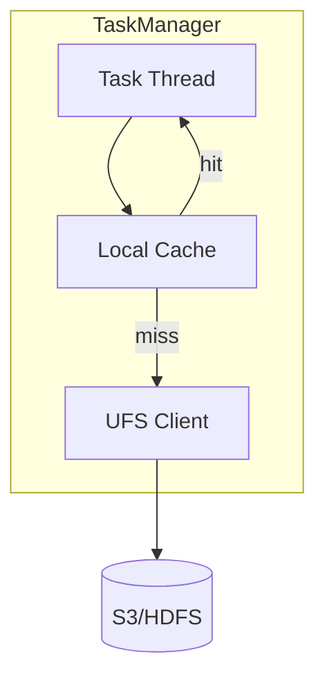

# ForSt (For Streaming) — Flink 2.0 Disaggregated State Backend

> **Stage**: Flink/02-core | **Prerequisites**: [Disaggregated State](../01-concepts/disaggregated-state-analysis.md) | **Formal Level**: L4
>
> **Flink Version**: 2.0.0+ | **Status**: Stable
>
> Disaggregated state storage engine decoupling compute from storage, with local cache and remote DFS persistence.

---

## 1. Definitions

**Def-F-02-46: ForSt Storage Engine**

$$
\text{ForSt} = \langle \text{UFS}, \text{LocalCache}, \text{StateMapping}, \text{SyncPolicy} \rangle
$$

where UFS = Unified File System, LocalCache = LRU/SLRU hot data cache, StateMapping = key-to-file location map, SyncPolicy = write-through/write-back.

**Def-F-02-47: Unified File System (UFS)**

Cross-storage backend abstraction (HDFS, S3, GCS, Azure Blob):

$$
\text{UFS} = \langle \text{StorageBackend}, \text{PathMapping}, \text{AtomicOps}, \text{ConsistencyLevel} \rangle
$$

Key property: Atomic visibility — reads see either complete new data or old data, never intermediate state.

---

## 2. Properties

**Lemma-F-02-19: Cache Hit Latency**

Local cache hits provide ~μs latency comparable to HashMapStateBackend.

**Lemma-F-02-20: Cache Miss Latency**

Remote DFS reads provide ~ms latency, bounded by network RTT and storage throughput.

---

## 3. Relations

- **with RocksDB**: ForSt replaces local RocksDB with remote storage + local cache.
- **with Async Execution**: ForSt enables Flink 2.0 async state access pattern.

---

## 4. Argumentation

**ForSt vs RocksDB Comparison**:

| Factor | RocksDB | ForSt |
|--------|---------|-------|
| Storage | Local disk | Remote DFS |
| Capacity | Disk-limited | Unlimited |
| Recovery | State migration | Instant (stateless TM) |
| Elasticity | Slow | Fast |
| Latency | ~ms | ~μs (hit) / ~ms (miss) |

---

## 5. Engineering Argument

**Disaggregated State Benefits**: TaskManagers become stateless, enabling:

1. Fast failover (< 5s restart)
2. Independent compute/storage scaling
3. No state migration on rescaling

---

## 6. Examples

```java
// ForSt state backend configuration
ForStStateBackend forSt = new ForStStateBackend();
forSt.setCacheSize("512mb");
forSt.setSyncPolicy(ForStOptions.SyncPolicy.WRITE_THROUGH);
env.setStateBackend(forSt);
```

---

## 7. Visualizations

**ForSt Architecture**:



---

## 8. References
