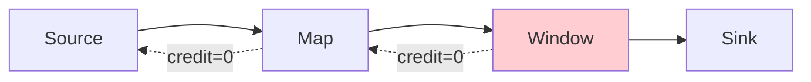

# Flink Network Stack Evolution: From TCP to Credit-Based Flow Control

> **Stage**: Flink/02-core | **Prerequisites**: [Backpressure and Flow Control](backpressure-and-flow-control.md) | **Formalization Level**: L4
> **Translation Date**: 2026-04-21

## Abstract

Flink's network stack evolved from TCP-based backpressure (pre-1.5) to credit-based flow control (1.5+). This evolution enables task-level granularity, eliminates head-of-line blocking, and provides deterministic backpressure propagation.

---

## 1. Definitions

### Def-F-02-26 (TCP-based Backpressure)

Flink 1.4 and earlier relied on TCP sliding windows for flow control:

$$\text{TCP-Backpressure} = \langle \text{SocketBuffer}, \text{AdvertisedWindow}, \text{KernelFlowControl} \rangle$$

**Limitations**:
- Connection-level control (not task-level)
- All channels on one TCP connection share the window
- One slow task blocks the entire connection

### Def-F-02-27 (Credit-based Flow Control — CBFC)

Flink 1.5+ introduced task-level credit-based flow control:

$$\text{CBFC} = \langle \text{Credit}_{channel}, \text{RemoteInputChannel}, \text{ResultSubPartition}, \text{BufferPool} \rangle$$

**Semantics**:

$$\text{Credit}(ch) = k > 0 \implies \text{Sender can send at most } k \text{ buffers to channel}$$
$$\text{Credit}(ch) = 0 \implies \text{Sender pauses}$$

**Key innovation**: Each logical channel has independent credits, eliminating head-of-line blocking.

---

## 2. Evolution Comparison

| Aspect | TCP-based (≤1.4) | Credit-based (1.5+) |
|--------|------------------|---------------------|
| Granularity | Connection | Task / Channel |
| Backpressure Source | Kernel TCP buffer | Application buffer pool |
| Propagation Speed | OS-dependent | Immediate (in-process) |
| Head-of-line Blocking | Yes | No |
| Fine-grained Control | No | Yes (per upstream task) |

---

## 3. Credit-Based Mechanism

### 3.1 Credit Exchange Protocol

```
1. Receiver announces available buffers (credit) to sender
2. Sender sends data up to credit limit
3. Receiver decrements credit as buffers are used
4. Receiver returns credit when buffers are freed
5. Sender resumes sending when credit > 0
```

### 3.2 Buffer Pool Hierarchy

```
NetworkBufferPool (TM-level, fixed size)
├── LocalBufferPool (per channel)
│   ├── Exclusive buffers (guaranteed minimum)
│   └── Floating buffers (shared pool)
└── Backpressure threshold triggers credit = 0
```

### 3.3 Backpressure Propagation



**Backpressure propagation**: Slow Window operator exhausts credits; Map pauses; Source reduces ingestion.

---

## 4. Performance Implications

### 4.1 Latency vs. Throughput Trade-off

| Configuration | Latency | Throughput | Use Case |
|--------------|---------|------------|----------|
| Small buffers | Lower | Lower | Low-latency streaming |
| Large buffers | Higher | Higher | Batch processing |
| Auto-tuned | Balanced | Balanced | Mixed workloads |

### 4.2 Tuning Parameters

```java
// Flink configuration
env.setBufferTimeout(100);  // Buffer flush timeout (ms)
// Network buffers: taskmanager.memory.network.fraction = 0.1
// Network buffer size: taskmanager.memory.network.min = 64mb
```

---

## 5. References

[^1]: Apache Flink Documentation, "Network Stack", 2025.
[^2]: Apache Flink 1.5 Release Notes, "Credit-based Flow Control", 2018.
[^3]: F. Hueske et al., "Stream Processing with Apache Flink", O'Reilly, 2019.
[^4]: M. Kleppmann, "Designing Data-Intensive Applications", O'Reilly, 2017.
