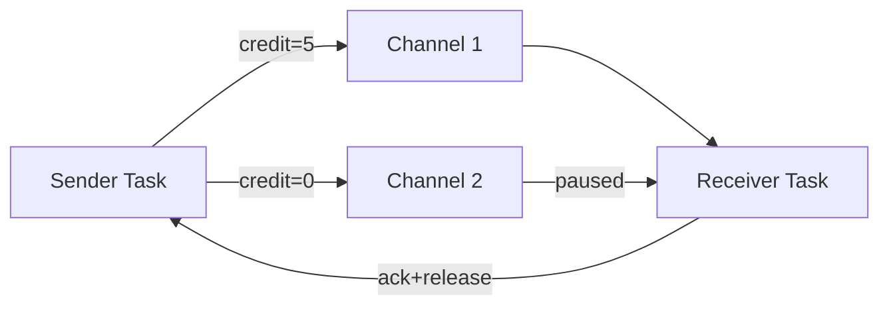

# Network Stack Evolution: From TCP to Credit-Based Flow Control

> **Stage**: Flink/02-core | **Prerequisites**: [Backpressure](./flink-backpressure-flow-control.md) | **Formal Level**: L4
>
> Analysis of Flink's network layer evolution from TCP-based backpressure to fine-grained credit-based flow control.

---

## 1. Definitions

**Def-F-02-26: TCP-based Backpressure**

Flink 1.4 and earlier relied on TCP sliding windows for flow control:

$$
\text{Backpressure}(t) \iff \text{SocketBuf}_{occ}(t) \to \text{SocketBuf}_{cap} \land \text{AdvertisedWindow}(t) \to 0
$$

**Limitations**: Connection-level (not task-level); all channels on same TCP connection share the window; one slow task blocks entire connection.

**Def-F-02-27: Credit-based Flow Control (CBFC)**

Flink 1.5+ introduced task-level fine-grained flow control:

$$
\text{CBFC} = \langle \text{Credit}_{channel}, \text{RemoteInputChannel}, \text{ResultSubPartition}, \text{BufferPool} \rangle
$$

$$
\text{Credit}(ch) = k > 0 \implies \text{Sender may send at most } k \text{ buffers to channel}
$$

**Innovation**: Per-channel credit management; single slow task does not affect others.

---

## 2. Properties

**Lemma-F-02-08: CBFC Isolation**

With credit-based flow control, backpressure on channel $ch_i$ does not affect throughput on channel $ch_j$ where $i \neq j$.

---

## 3. Relations

- **with Backpressure**: CBFC is the implementation mechanism for Flink's backpressure propagation.
- **with Task Scheduling**: Credit depletion triggers upstream task backpressure via the scheduler.

---

## 4. Argumentation

**TCP vs CBFC Comparison**:

| Factor | TCP-based | Credit-based |
|--------|-----------|--------------|
| Granularity | Connection | Channel (task) |
| Isolation | None | Per-channel |
| Latency impact | High | Low |
| Resource fairness | Poor | Good |

---

## 5. Engineering Argument

**Thm-F-02-03 (CBFC Deadlock Freedom)**: Credit-based flow control with bounded buffer pools is deadlock-free because credit issuance is monotonic and buffer release is guaranteed upon processing.

---

## 6. Examples

```java
// Network buffer configuration
Configuration config = new Configuration();
config.setInteger(TaskManagerOptions.NETWORK_MEMORY_MIN, 256);
config.setInteger(TaskManagerOptions.NETWORK_MEMORY_MAX, 512);
// Credit-based flow control enabled by default in Flink 1.5+
```

---

## 7. Visualizations

**Credit-based Flow Control**:



---

## 8. References
