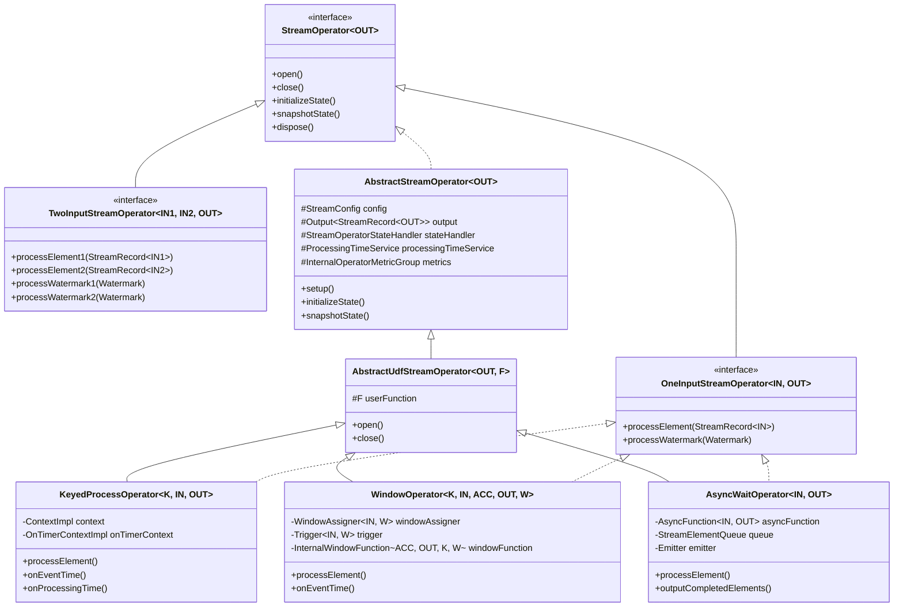
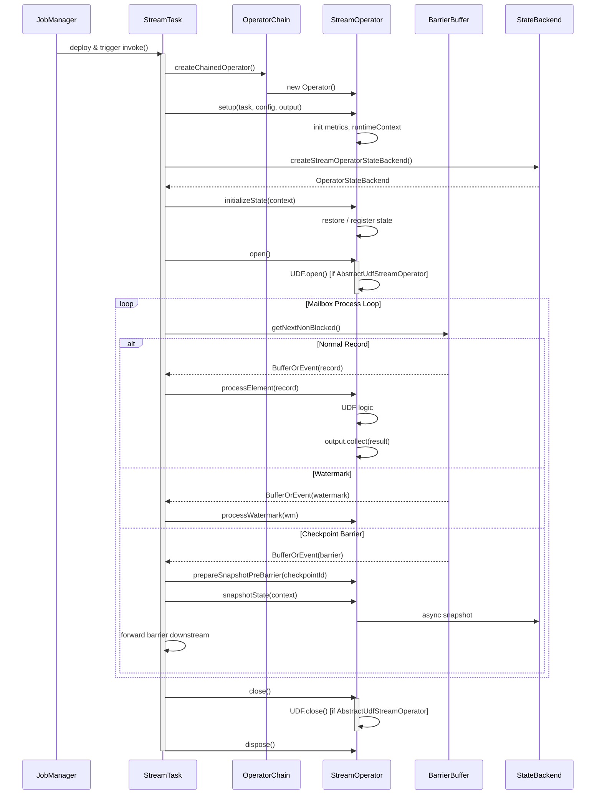
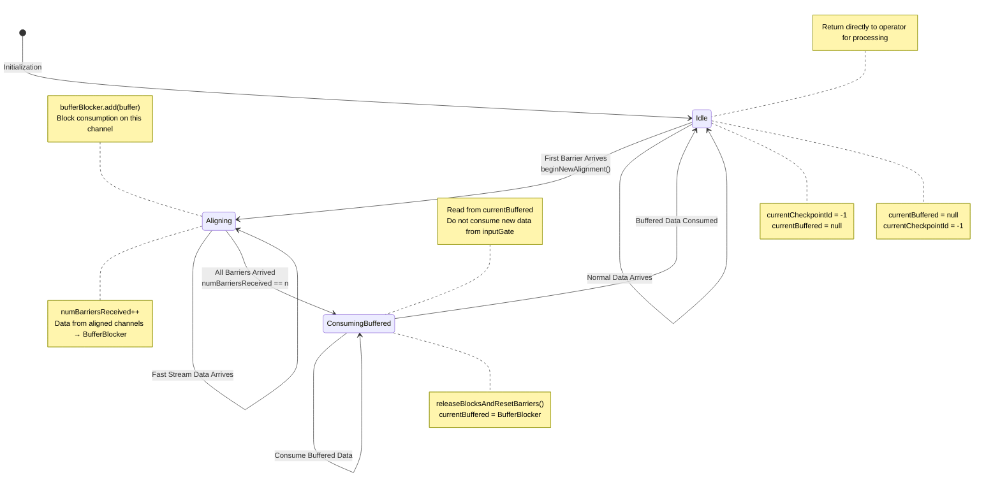

# Flink Core Operator Source Code Deep Dive

> **Stage**: Flink/02-core | **Prerequisites**: [Flink DataStream API Core Concepts](flink-datastream-core-concepts.md), [Flink State and Fault Tolerance Mechanisms](flink-state-fault-tolerance.md) | **Formalization Level**: L4-L5 | **Source Version**: Apache Flink 1.18 (release-1.18 branch)
> **Last Updated**: 2026-04

---

## Table of Contents

- [Flink Core Operator Source Code Deep Dive](#flink-core-operator-source-code-deep-dive)
  - [Table of Contents](#table-of-contents)
  - [1. Definitions](#1-definitions)
    - [1.1 Operator Core Abstractions](#11-operator-core-abstractions)
    - [1.2 Lifecycle Phase Definitions](#12-lifecycle-phase-definitions)
    - [1.3 State Management Core Definitions](#13-state-management-core-definitions)
    - [1.4 Network Transport Core Definitions](#14-network-transport-core-definitions)
  - [2. Properties](#2-properties)
  - [3. Relations](#3-relations)
    - [3.1 Operator Inheritance Hierarchy Panorama](#31-operator-inheritance-hierarchy-panorama)
    - [3.2 Mapping Between Operator Lifecycle and StreamTask](#32-mapping-between-operator-lifecycle-and-streamtask)
    - [3.3 Binding Relationship Between State Backend and Operator](#33-binding-relationship-between-state-backend-and-operator)
    - [3.4 Relationship Between Network Layer and Operator Output](#34-relationship-between-network-layer-and-operator-output)
  - [4. Argumentation](#4-argumentation)
    - [4.1 Core Implementation Argumentation of KeyedProcessOperator](#41-core-implementation-argumentation-of-keyedprocessoperator)
    - [4.2 State Complexity Argumentation of WindowOperator](#42-state-complexity-argumentation-of-windowoperator)
    - [4.3 Asynchronous Semantics Argumentation of AsyncWaitOperator](#43-asynchronous-semantics-argumentation-of-asyncwaitoperator)
  - [5. Proof / Engineering Argument](#5-proof--engineering-argument)
    - [5.1 Theorem: BarrierBuffer Exactly-Once Alignment Correctness](#51-theorem-barrierbuffer-exactly-once-alignment-correctness)
    - [5.2 Theorem: RecordWriter.emit() Serialization Atomicity](#52-theorem-recordwriteremit-serialization-atomicity)
    - [5.3 Theorem: RocksDBStateBackend Incremental Checkpoint Convergence](#53-theorem-rocksdbstatebackend-incremental-checkpoint-convergence)
  - [6. Examples](#6-examples)
    - [6.1 Operator Lifecycle Call Chain Verification](#61-operator-lifecycle-call-chain-verification)
    - [6.2 KeyedStateBackend.getPartitionedState() Invocation Example](#62-keyedstatebackendgetpartitionedstate-invocation-example)
    - [6.3 Credit-based Flow Control Buffer Allocation Example](#63-credit-based-flow-control-buffer-allocation-example)
  - [7. Visualizations](#7-visualizations)
    - [7.1 Operator Core Inheritance Hierarchy Class Diagram](#71-operator-core-inheritance-hierarchy-class-diagram)
    - [7.2 Operator Lifecycle and StreamTask Interaction Sequence Diagram](#72-operator-lifecycle-and-streamtask-interaction-sequence-diagram)
    - [7.3 BarrierBuffer Alignment Mechanism State Machine Diagram](#73-barrierbuffer-alignment-mechanism-state-machine-diagram)
  - [8. References](#8-references)

## 1. Definitions

### 1.1 Operator Core Abstractions

**Def-SRC-01-01** (StreamOperator Interface). `StreamOperator<OUT>` (流算子) is the top-level interface for all stream processing operators in Flink DataStream, defined in `flink-streaming-java/src/main/java/org/apache/flink/streaming/api/operators/StreamOperator.java`. This interface declares all lifecycle hook methods of an operator and extends `CheckpointListener`, `KeyContext`, and `Disposable`, thereby unifying **lifecycle management**, **state and fault tolerance management**, and **data processing** into a single contract.

```java
// StreamOperator.java (line 45-120)
@PublicEvolving
public interface StreamOperator<OUT>
        extends CheckpointListener, KeyContext, Disposable, Serializable {

    void open() throws Exception;
    void close() throws Exception;
    void dispose() throws Exception;

    void initializeState(StateInitializationContext context) throws Exception;
    void snapshotState(StateSnapshotContext context) throws Exception;

    void prepareSnapshotPreBarrier(long checkpointId) throws Exception;

    void setKeyContextElement1(StreamRecord<?> record) throws Exception;
    void setKeyContextElement2(StreamRecord<?> record) throws Exception;

    OperatorID getOperatorID();
    InternalOperatorMetricGroup getMetricGroup();
}
```

**Def-SRC-01-02** (OneInputStreamOperator / TwoInputStreamOperator). Based on the input arity of the operator, Flink defines two parallel sub-interfaces beneath `StreamOperator`:

- `OneInputStreamOperator<IN, OUT>` (单输入流算子): single-input stream operator interface, declaring `processElement(StreamRecord<IN>)` and `processWatermark(Watermark)`.
- `TwoInputStreamOperator<IN1, IN2, OUT>` (双输入流算子): dual-input stream operator interface, declaring `processElement1/2` and `processWatermark1/2`.
- `MultipleInputStreamOperator` (多输入流算子): multi-input stream operator interface (introduced in Flink 1.11+), used in conjunction with `AbstractStreamOperatorV2`.

```java
// OneInputStreamOperator.java (line 38-55)
@PublicEvolving
public interface OneInputStreamOperator<IN, OUT>
        extends StreamOperator<OUT>, Input<IN> {
    default void setKeyContextElement(StreamRecord<IN> record) throws Exception {
        setKeyContextElement1(record);
    }
}
```

**Def-SRC-01-03** (AbstractStreamOperator). `AbstractStreamOperator<OUT>` (抽象流算子) is the default abstract implementation of `StreamOperator`, located in `AbstractStreamOperator.java` (approximately line 80-700). It aggregates all runtime infrastructure of an operator:

| Member Variable | Type | Responsibility |
|---------|------|------|
| `config` | `StreamConfig` | Operator configuration (parallelism, state descriptors, etc.) |
| `output` | `Output<StreamRecord<OUT>>` | Downstream output handle |
| `stateHandler` | `StreamOperatorStateHandler` | State backend proxy |
| `processingTimeService` | `ProcessingTimeService` | Processing time service |
| `timeServiceManager` | `InternalTimeServiceManager<?>` | Event time / processing time Timer management |
| `metrics` | `InternalOperatorMetricGroup` | Operator-level metric collection |
| `stateKeySelector1/2` | `KeySelector<?, ?>` | Extract Key from elements to support KeyedState |

**Def-SRC-01-04** (AbstractUdfStreamOperator). `AbstractUdfStreamOperator<OUT, F extends Function>` (抽象UDF流算子) extends `AbstractStreamOperator<OUT>` and is the base class for all operators that **contain a User-Defined Function (UDF)**. Its core extension is the encapsulation of `protected final F userFunction`, proxying UDF lifecycle calls in the lifecycle methods.

```java
// AbstractUdfStreamOperator.java (line 55-140)
public abstract class AbstractUdfStreamOperator<OUT, F extends Function>
        extends AbstractStreamOperator<OUT>
        implements OutputTypeConfigurable<OUT> {

    protected final F userFunction;

    public AbstractUdfStreamOperator(F userFunction) {
        this.userFunction = requireNonNull(userFunction);
        checkUdfCheckpointingPreconditions();
    }

    @Override
    public void open() throws Exception {
        super.open();
        FunctionUtils.openFunction(userFunction, new Configuration());
    }

    @Override
    public void close() throws Exception {
        FunctionUtils.closeFunction(userFunction);
        super.close();
    }
}
```

### 1.2 Lifecycle Phase Definitions

**Def-SRC-01-05** (Operator Lifecycle Six Phases). Based on the Flink official documentation and the `StreamTask` (流任务) call chain, the operator lifecycle can be strictly divided into six phases:

1. **Setup Phase**: After `StreamTask` constructs `OperatorChain` (算子链), it calls `operator.setup()`, initializing `RuntimeContext` and the metric system.
2. **State Initialization Phase**: Calls `initializeState(StateInitializationContext)`, restoring from checkpoint or registering initial state.
3. **Open Phase**: Calls `open()`, executes the UDF's `open()`, registers Timers.
4. **Processing Phase**: Repeatedly calls `processElement()` / `processWatermark()`.
5. **Checkpoint Phase**: Calls `prepareSnapshotPreBarrier()` → `snapshotState()` → asynchronous upload.
6. **Termination Phase**: Calls `close()` → `dispose()`, releasing resources.

### 1.3 State Management Core Definitions

**Def-SRC-01-06** (StateBackend and Operator State Backend). The `StateBackend` (状态后端) interface is defined in `flink-runtime/.../state/StateBackend.java`, responsible for:

- Creating checkpoint storage via `createCheckpointStorage(JobID)`.
- Creating operator-level state backend (`OperatorStateBackend`) via `createStreamOperatorStateBackend(...)`.
- Creating keyed state backend (`KeyedStateBackend`) via `createKeyedStateBackend(...)`.

**Def-SRC-01-07** (KeyedStateBackend.getPartitionedState). `KeyedStateBackend` (键控状态后端) provides a partitioned state view for the currently active Key via `getPartitionedState(StateDescriptor)`. The internal implementation relies on `StateTable<K, N, S>`, which is hash-partitioned by `KeyGroup`.

```java
// KeyedStateBackend.java (conceptual source, based on HeapKeyedStateBackend / RocksDBKeyedStateBackend)
@Override
public <N, S extends State> S getPartitionedState(
        final N namespace,
        final TypeSerializer<N> namespaceSerializer,
        final StateDescriptor<S, ?> stateDescriptor) throws Exception {

    // 1. Retrieve or register StateFactory from stateDescriptor
    // 2. Build InternalKvState<K, N, ?>, bind current keyContext
    // 3. Return user-facing State wrapper (e.g., InternalValueState)
}
```

### 1.4 Network Transport Core Definitions

**Def-SRC-01-08** (RecordWriter and ResultSubpartition). `RecordWriter<T>` (记录写入器) is the core bridge from operator output to the network layer, located in `flink-runtime/.../api/writer/RecordWriter.java`. Each downstream channel corresponds to one `ResultSubpartition` (结果子分区); data is serialized via `SpanningRecordSerializer` and then written into `BufferBuilder`.

**Def-SRC-01-09** (Credit-based Flow Control). The credit-based flow control mechanism (基于信用的流控) introduced in Flink 1.5 (`FLINK-7282`). Each `RemoteInputChannel` owns **exclusive buffers** (独占缓冲区), while the local buffer pool of `SingleInputGate` provides **floating buffers** (浮动缓冲区). The receiver advertises available capacity in **credits** (1 buffer = 1 credit), and the sender only forwards data to the Netty layer when credit > 0.

**Def-SRC-01-10** (BarrierBuffer Alignment). `BarrierBuffer` (屏障缓冲区) is the Exactly-Once implementation of `CheckpointBarrierHandler`. Core idea: when a barrier from checkpoint `k` arrives on one input channel first, that channel is blocked and its subsequent data is buffered until barriers for the same checkpoint from all input channels have arrived; then the block is released and `snapshotState()` is triggered.

---

## 2. Properties

**Lemma-SRC-01-01** (Operator Inheritance Hierarchy Closure). Let `O` be any DataStream operator; then `O` must satisfy one of the following inheritance closures:

1. If `O` contains a UDF and is single-input, then `O ≺ AbstractUdfStreamOperator ∧ O implements OneInputStreamOperator`.
2. If `O` contains a UDF and is dual-input, then `O ≺ AbstractUdfStreamOperator ∧ O implements TwoInputStreamOperator`.
3. If `O` is a Table API operator or has no UDF, then `O ≺ AbstractStreamOperator` (direct inheritance, not via `AbstractUdfStreamOperator`).
4. If `O` is multi-input (Flink 1.11+), then `O` is based on `AbstractStreamOperatorV2` + `MultipleInputStreamOperator`.

*Intuition*: `AbstractStreamOperator` and `AbstractUdfStreamOperator` form two orthogonal inheritance lines—the former provides infrastructure (state, metrics, Timer), while the latter adds UDF lifecycle proxying. Input arity is distinguished by `OneInputStreamOperator` / `TwoInputStreamOperator` / `MultipleInputStreamOperator`.

**Lemma-SRC-01-02** (Lifecycle Invocation Totality). Under normal execution (no exceptions), lifecycle method invocations on a single operator instance satisfy a strict total order:

```
setup ≺ initializeState ≺ open ≺ (processElement | processWatermark)* ≺
(prepareSnapshotPreBarrier ≺ snapshotState)* ≺ close ≺ dispose
```

*Proof Sketch*: The `StreamTask.invoke()` method (`StreamTask.java` line 600-750) sequentially calls the above methods through `OperatorChain`. `processElement` and `processWatermark` alternate in the processing loop but never run concurrently with `snapshotState`—Flink's Mailbox (邮箱) model guarantees single-threaded semantics.

**Lemma-SRC-01-03** (RocksDB Checkpoint Asynchronous Snapshot Atomicity). The `snapshotState()` operation of `RocksDBStateBackend` splits the state snapshot into a **synchronous part** (acquiring the RocksDB `Snapshot` handle, stopping writes) and an **asynchronous part** (traversing SST files and uploading). Due to the immutability of LSM-Tree in RocksDB's `Checkpoint` / `Snapshot` mechanism, concurrent writes during asynchronous reads do not affect snapshot consistency.

**Prop-SRC-01-01** (Credit-based Flow Control Backpressure Propagation Monotonicity). Under credit-based flow control, if a downstream operator processes slower than the upstream, the available credit of the downstream `RemoteInputChannel` monotonically decreases to 0; after credit exhaustion, the upstream `ResultSubpartition` stops outputting data to Netty. Backpressure is established at the **application layer** rather than the TCP layer, avoiding Head-of-Line Blocking on multiplexed connections.

---

## 3. Relations

### 3.1 Operator Inheritance Hierarchy Panorama

The inheritance hierarchy of Flink DataStream operators can be viewed as a **Lattice**:

- Layer 0: `StreamOperator` (interface contract)
- Layer 1: `AbstractStreamOperator` (infrastructure) + `OneInputStreamOperator` / `TwoInputStreamOperator` (input contract)
- Layer 2: `AbstractUdfStreamOperator` (UDF proxy)
- Layer 3: Concrete operators (`StreamMap`, `WindowOperator`, `KeyedProcessOperator`, `AsyncWaitOperator`, etc.)

```
StreamOperator(I)
    ├── AbstractStreamOperator(A)
    │       └── AbstractUdfStreamOperator(A)
    │               ├── StreamMap(C) ──implements── OneInputStreamOperator(I)
    │               ├── StreamFlatMap(C) ──implements── OneInputStreamOperator(I)
    │               ├── StreamFilter(C) ──implements── OneInputStreamOperator(I)
    │               ├── WindowOperator(C) ──implements── OneInputStreamOperator(I), Triggerable
    │               ├── KeyedProcessOperator(C) ──implements── OneInputStreamOperator(I), Triggerable
    │               ├── AsyncWaitOperator(C) ──implements── OneInputStreamOperator(I)
    │               ├── CoProcessOperator(C) ──implements── TwoInputStreamOperator(I)
    │               └── StreamSource(C) ──implements── OneInputStreamOperator(I)
    │
    ├── OneInputStreamOperator(I) ──extends── StreamOperator(I) + Input<IN>
    ├── TwoInputStreamOperator(I) ──extends── StreamOperator(I)
    └── MultipleInputStreamOperator(I) ──extends── StreamOperator(I)
```

### 3.2 Mapping Between Operator Lifecycle and StreamTask

The operator lifecycle does not run independently; it is embedded within the `StreamTask` lifecycle framework:

| StreamTask Phase | Operator Methods Invoked | Source Location (StreamTask.java) |
|----------------|--------------|---------------------------|
| `beforeInvoke()` | `setup()` → `initializeState()` → `open()` | line 550-600 |
| `runMailboxLoop()` | `processElement()` / `processWatermark()` | line 620-680 |
| `triggerCheckpoint()` | `prepareSnapshotPreBarrier()` → `snapshotState()` | line 800-900 |
| `afterInvoke()` | `close()` → `dispose()` | line 700-750 |

### 3.3 Binding Relationship Between State Backend and Operator

`StreamTaskStateInitializerImpl` is responsible for binding `StateBackend` to the operator during the `StreamTask` initialization phase:

```
StateBackend
    ├── createStreamOperatorStateBackend() → OperatorStateBackend
    │       └── Used by AbstractStreamOperator.initializeState()
    ├── createKeyedStateBackend() → KeyedStateBackend
    │       └── Used by KeyedProcessOperator / WindowOperator
    └── createCheckpointStorage() → CheckpointStorage
            └── Used by snapshotState() asynchronous thread to write to remote storage
```

### 3.4 Relationship Between Network Layer and Operator Output

The operator sends data downstream via `Output<StreamRecord<OUT>>` (typically `AbstractStreamOperator.CountingOutput`). The call chain is:

```
operator.processElement()
    → output.collect(record)
        → RecordWriterOutput.pushToRecordWriter()
            → RecordWriter.emit(delegate)
                → SpanningRecordSerializer.addRecord()
                    → serializer.copyToBufferBuilder(BufferBuilder)
                        → ResultSubpartition.add(BufferConsumer)
                            → Netty layer sends via Credit-based flow control
```

---

## 4. Argumentation

### 4.1 Core Implementation Argumentation of KeyedProcessOperator

`KeyedProcessOperator<K, IN, OUT>` (键控处理算子) (located in `flink-streaming-java/.../operators/KeyedProcessOperator.java`) is the execution carrier for `KeyedProcessFunction`. Its special characteristics are:

1. **KeyedState Access**: Obtains `HeapKeyedStateBackend` or `RocksDBKeyedStateBackend` via `getKeyedStateBackend()`, and switches the current Key context via `setCurrentKey(key)` in `processElement`.
2. **Timer Management**: Implements the `Triggerable<K, N>` interface; `InternalTimeServiceManager` maintains event-time and processing-time priority queues. When `onEventTime()` / `onProcessingTime()` is called back, the operator invokes `userFunction.onTimer()`.
3. **State Consistency**: During `snapshotState()`, `KeyedStateBackend` traverses all KeyGroups and writes state to the checkpoint output stream; in the RocksDB scenario, the native RocksDB `snapshot` API is leveraged to achieve zero-copy snapshots.

```java
// KeyedProcessOperator.java (line 85-130, conceptual source)
public class KeyedProcessOperator<K, IN, OUT>
        extends AbstractUdfStreamOperator<OUT, KeyedProcessFunction<K, IN, OUT>>
        implements OneInputStreamOperator<IN, OUT>, Triggerable<K, VoidNamespace> {

    private transient TimestampedCollector<OUT> collector;
    private transient ContextImpl context;
    private transient OnTimerContextImpl onTimerContext;

    @Override
    public void open() throws Exception {
        super.open();
        collector = new TimestampedCollector<>(output);
        context = new ContextImpl(userFunction, getProcessingTimeService());
        onTimerContext = new OnTimerContextImpl(
                getKeyedStateBackend().getKeySerializer(),
                userFunction,
                getProcessingTimeService());
    }

    @Override
    public void processElement(StreamRecord<IN> element) throws Exception {
        // 1. Set current Key context
        setCurrentKey(element.getValue());
        // 2. Invoke user function to process element
        userFunction.processElement(element.getValue(), context, collector);
        // 3. Collector sends result via output
    }

    @Override
    public void onEventTime(InternalTimer<K, VoidNamespace> timer) throws Exception {
        setCurrentKey(timer.getKey());
        onTimerContext.setTimer(timer);
        userFunction.onTimer(timer.getTimestamp(), onTimerContext, collector);
    }
}
```

### 4.2 State Complexity Argumentation of WindowOperator

`WindowOperator` (窗口算子) (located in `flink-streaming-java/.../operators/windowing/WindowOperator.java`, approximately 500+ lines) is one of the most complex operators in Flink. Its complexity arises from:

1. **Multi-State Storage**: Each window maintains independent `ListState<IN>` (window contents) and `ReducingState<ACC>` (incremental aggregation). If `MergingWindowAssigner` (e.g., Session Window) is used, an additional `MapState<W, W>` is required to record window merge mappings.
2. **Trigger Mechanism**: The `Trigger` interface determines when a window fires computation and when it is purged. `WindowOperator` calls `trigger.onElement()` in `processElement`; if it returns `TriggerResult.FIRE`, `emitWindowContents()` is executed.
3. **Late Data Policy**: Data exceeding `allowedLateness` is routed to the side-output stream via `sideOutputLateData`.

```java
// WindowOperator.java (line 280-350, conceptual source)
@Override
public void processElement(StreamRecord<IN> element) throws Exception {
    final Collection<W> elementWindows = windowAssigner.assignWindows(
        element.getValue(), element.getTimestamp(), windowAssignerContext);

    final K key = (K) getCurrentKey();
    final boolean isSkippedElement = windowAssigner.isEventTime() &&
            isWindowLate(new TimeWindow(element.getTimestamp(), element.getTimestamp()));

    if (isSkippedElement) {
        if (lateDataOutputTag != null) {
            sideOutput(element);
        }
        return;
    }

    for (W window : elementWindows) {
        if (windowAssigner.isEventTime()) {
            windowState.setCurrentNamespace(window);
            windowState.add(element.getValue());  // Write to ListState
        }
        // Register Cleanup Timer
        registerCleanupTimer(window);
        // Invoke Trigger
        TriggerResult triggerResult = triggerContext.onElement(element, window);
        if (triggerResult.isFire()) {
            emitWindowContents(window, windowState.get());
        }
        if (triggerResult.isPurge()) {
            windowState.clear();
        }
    }
}
```

### 4.3 Asynchronous Semantics Argumentation of AsyncWaitOperator

`AsyncWaitOperator` (异步等待算子) (located in `flink-streaming-java/.../operators/async/AsyncWaitOperator.java`) achieves ordered / unordered output for asynchronous I/O via **StreamElementQueue**:

- **OrderedStreamElementQueue**: Strictly preserves input order for output; an element can only be emitted when the asynchronous callback of the head-of-queue element completes.
- **UnorderedStreamElementQueue**: Allows out-of-order output, but Watermark must wait for all earlier elements to complete.
- **Emitter Thread**: An independent `Emitter` thread (scheduled by `OperatorActions`) pulls completed `AsyncResult` from the queue and calls `output.collect()` to send downstream.

```java
// AsyncWaitOperator.java (line 110-180, conceptual source)
@Override
public void processElement(StreamRecord<IN> element) throws Exception {
    // Add element to async queue and start async callback
    final StreamRecordQueueEntry<OUT> streamRecordBufferEntry =
            new StreamRecordQueueEntry<>(element);
    asyncFunction.asyncInvoke(element.getValue(), streamRecordBufferEntry);
    // Attempt to emit completed results downstream (actually executed by Emitter thread)
    outputCompletedElements();
}

// Emitter thread logic
class Emitter implements Runnable {
    @Override
    public void run() {
        while (running) {
            // Poll completed entry from OrderedStreamElementQueue / UnorderedStreamElementQueue
            AsyncResult asyncResult = queue.poll();
            if (asyncResult != null) {
                asyncResult.emitResult(output);
            }
        }
    }
}
```

---

## 5. Proof / Engineering Argument

### 5.1 Theorem: BarrierBuffer Exactly-Once Alignment Correctness

**Thm-SRC-01-01** (BarrierBuffer Exactly-Once Correctness). Let operator `op` have `n` input channels `C = {c₁, c₂, ..., cₙ}`. The `getNextNonBlocked()` method of `BarrierBuffer` guarantees: before the barrier alignment of checkpoint `k` completes, operator `op` will not consume any records belonging to checkpoint `k+1` or later.

*Engineering Argument*:

1. **Alignment Trigger**: When the first barrier `Bₖ` arrives from channel `cᵢ`, `BarrierBuffer` enters the alignment state (`beginNewAlignment`), setting `currentCheckpointId` to `k`.
2. **Fast-Stream Blocking**: For channels that have already received `Bₖ`, subsequent data is appended to the `ArrayDeque<Buffer>` of `BufferBlocker`; data from channels that have not yet received `Bₖ` is consumed normally.
3. **Alignment Completion Condition**: When `numBarriersReceived + numClosedChannels == totalNumberOfInputChannels`, `releaseBlocksAndResetBarriers()` is called, handing over the buffered data in `BufferBlocker` to `currentBuffered`, and consumption resumes.
4. **Semantic Guarantee**: Since data from the fast stream is buffered rather than discarded during blocking, and `snapshotState()` is triggered only after all data before the barrier has been consumed, the snapshot state precisely corresponds to the data subset before the barrier, satisfying Exactly-Once.

```java
// BarrierBuffer.java (line 150-250, conceptual source)
@Override
public BufferOrEvent getNextNonBlocked() throws Exception {
    while (true) {
        BufferOrEvent next = inputGate.getNextBufferOrEvent();
        if (next.isBuffer()) {
            if (currentBuffered != null) {
                // Consuming aligned buffered data
                return currentBuffered.getNext();
            }
            if (currentCheckpointId != -1 && !hasReceivedBarrier(next.getChannelIndex())) {
                // A channel has aligned; current data belongs to fast stream → buffer
                bufferBlocker.add(next);
                continue;
            }
            return next;  // Normal consumption
        } else if (next.isEvent() && next.getEvent() instanceof CheckpointBarrier) {
            CheckpointBarrier barrier = (CheckpointBarrier) next.getEvent();
            if (currentCheckpointId == -1) {
                beginNewAlignment(barrier);
            } else if (barrier.getId() == currentCheckpointId) {
                numBarriersReceived++;
                if (numBarriersReceived + numClosedChannels == totalNumberOfInputChannels) {
                    releaseBlocksAndResetBarriers();
                    return next;  // Return barrier, trigger snapshotState
                }
            }
        }
    }
}
```

### 5.2 Theorem: RecordWriter.emit() Serialization Atomicity

**Thm-SRC-01-02** (RecordWriter Serialization Atomicity). `RecordWriter.emit(T record, int targetChannel)` guarantees: a single record is either fully serialized into one or more `Buffer`s of `ResultSubpartition`, or not written at all (All-or-Nothing).

*Engineering Argument*:

1. `RecordWriter` first calls `serializer.serializeRecord(record)`, serializing the record into its internal intermediate buffer `DataOutputSerializer`.
2. It then calls `copyFromSerializerToTargetChannel(targetChannel)`, copying data from the intermediate buffer to the target channel's `BufferBuilder`.
3. If a single record exceeds the capacity of one `Buffer`, new `BufferBuilder`s are requested in a loop until fully written. Only when `result.isFullRecord()` holds is the record considered written; otherwise, writing continues to the next Buffer.
4. In exceptional scenarios (e.g., `BufferPool` exhaustion), `InterruptedException` or `IOException` propagates upward. Partially written Buffers are only visible to Netty after `finishBufferBuilder`, so no half-record can appear.

```java
// RecordWriter.java (line 95-170, conceptual source)
protected void emit(T record, int targetChannel)
        throws IOException, InterruptedException {
    serializer.serializeRecord(record);
    if (copyFromSerializerToTargetChannel(targetChannel)) {
        serializer.prune();  // Release intermediate buffer
    }
}

protected boolean copyFromSerializerToTargetChannel(int targetChannel)
        throws IOException, InterruptedException {
    serializer.reset();
    BufferBuilder bufferBuilder = getBufferBuilder(targetChannel);
    SerializationResult result = serializer.copyToBufferBuilder(bufferBuilder);

    while (result.isFullBuffer()) {
        finishBufferBuilder(bufferBuilder);
        if (result.isFullRecord()) {
            emptyCurrentBufferBuilder(targetChannel);
            return true;  // Complete record written
        }
        bufferBuilder = requestNewBufferBuilder(targetChannel);
        result = serializer.copyToBufferBuilder(bufferBuilder);
    }
    return false;
}
```

### 5.3 Theorem: RocksDBStateBackend Incremental Checkpoint Convergence

**Thm-SRC-01-03** (RocksDB Incremental Checkpoint Convergence). After enabling incremental checkpoints, Flink's checkpoint data volume converges to a stable upper bound over time and does not grow indefinitely.

*Engineering Argument*:

1. RocksDB's LSM-Tree performs **compaction** in the background, merging multiple Level-0 SST files into Level-1, Level-2 files. After compaction completes, old SST files can be deleted.
2. Flink incremental checkpoints only upload **new or modified SST files** and **MANIFEST** metadata. For old files that have been eliminated by compaction, subsequent checkpoints no longer reference them.
3. Flink's `RocksDBIncrementalSnapshotOperation` builds `SnapshotResult` in `materializeSnapshot()`, referencing the current list of valid SST files. When old checkpoints are cleaned up (according to retention policy), their uniquely referenced files are also deleted.
4. Therefore, in steady state, the incremental checkpoint data volume is proportional to **state mutation rate × checkpoint interval**, rather than total state volume, thus converging.

```java
// RocksDBKeyedStateBackend.java (incremental snapshot related, conceptual source)
public RunnableFuture<SnapshotResult<KeyedStateHandle>> snapshot(
        long checkpointId,
        long timestamp,
        CheckpointStreamFactory streamFactory,
        CheckpointOptions checkpointOptions) throws Exception {

    if (isIncrementalCheckpointsEnabled()) {
        // Incremental snapshot: compare with previous checkpoint's SST file list, upload only diff
        return new RocksDBIncrementalSnapshotOperation(
                checkpointId,
                stateMetaInfoSnapshots,
                rocksDB,
                previousSnapshotFiles,  // Previous SST file set
                streamFactory
        ).toAsyncSnapshotFutureTask();
    } else {
        // Full snapshot
        return new RocksDBFullSnapshotOperation(...).toAsyncSnapshotFutureTask();
    }
}
```

---

## 6. Examples

### 6.1 Operator Lifecycle Call Chain Verification

The following code snippet is based on Flink 1.18 `StreamTask.invoke()`, demonstrating the actual call stack of the operator lifecycle:

```java
// StreamTask.java (line 530-620)
public final void invoke() throws Exception {
    // ==== Initialization Phase ====
    beforeInvoke();  // line 540
    // Internal call chain:
    //   → operatorChain.createChainedOperator()
    //   → operator.setup(containingTask, config, output)
    //   → operator.initializeState(stateInitializationContext)
    //   → operator.open()

    // ==== Processing Phase ====
    runMailboxLoop();  // line 590
    // Internal loop:
    //   → StreamOneInputProcessor.processInput()
    //   → barrierHandler.getNextNonBlocked()
    //   → operator.processElement(record)
    //   → operator.processWatermark(watermark)

    // ==== Termination Phase ====
    afterInvoke();  // line 610
    // Internal call chain:
    //   → operator.close()
    //   → operator.dispose()
}
```

### 6.2 KeyedStateBackend.getPartitionedState() Invocation Example

Taking the acquisition of `ValueState<Integer>` as an example:

```java
// HeapKeyedStateBackend.java / RocksDBKeyedStateBackend.java (line 300-380)
@Override
@SuppressWarnings("unchecked")
public <N, S extends State, V> S getPartitionedState(
        N namespace,
        TypeSerializer<N> namespaceSerializer,
        StateDescriptor<S, V> stateDescriptor) throws Exception {

    // 1. Check namespace serializer compatibility
    checkNamespaceSerializerCompatibility(namespaceSerializer);

    // 2. Retrieve or create InternalKvState from StateTable
    StateFactory<?, ?, ?> stateFactory = StateFactory.createStateFactory(
            stateDescriptor.getType(), stateDescriptor.getSerializer());
    InternalKvState<K, N, V> kvState = (InternalKvState<K, N, V>) stateFactory.createState(
            stateDescriptor, getKeySerializer(), namespaceSerializer);

    // 3. Register kvState into StateTable (partitioned by KeyGroup)
    stateTable.setNamespace(namespace);
    return (S) kvState;
}
```

### 6.3 Credit-based Flow Control Buffer Allocation Example

Assume the downstream operator has 2 input channels with the following configuration:

```yaml
taskmanager.network.memory.buffer-debloat.enabled: false
taskmanager.network.memory.buffers-per-channel: 2
taskmanager.network.memory.floating-buffers-per-gate: 8
```

Then the Buffer allocation of `SingleInputGate` is:

| Channel | Exclusive Buffers | Floating Buffers (Shared) |
|-----|-------------------|------------------------|
| `RemoteInputChannel-0` | 2 | Up to 8 (on-demand allocation) |
| `RemoteInputChannel-1` | 2 | Up to 8 (on-demand allocation) |

Initially, each `RemoteInputChannel` sends a `credit = 2` announcement to the corresponding upstream `ResultSubpartition`. The upstream only sends data when credit > 0.

---

## 7. Visualizations

### 7.1 Operator Core Inheritance Hierarchy Class Diagram

The following class diagram shows the complete inheritance chain of Flink DataStream operators from interface to concrete implementation, focusing on the `StreamOperator` → `AbstractStreamOperator` → `AbstractUdfStreamOperator` main line, and the parallel input contract system of `OneInputStreamOperator` / `TwoInputStreamOperator`.



### 7.2 Operator Lifecycle and StreamTask Interaction Sequence Diagram

The following sequence diagram shows how `StreamTask` drives the complete operator lifecycle from initialization to termination, and the interleaving relationship between the single-threaded processing loop under the Mailbox model and Checkpoint.



### 7.3 BarrierBuffer Alignment Mechanism State Machine Diagram

The following state machine diagram precisely characterizes the state transitions of `BarrierBuffer` when processing multi-input channel Checkpoint Barriers, and the buffering behavior of `BufferBlocker` during the alignment phase.



---

## 8. References
