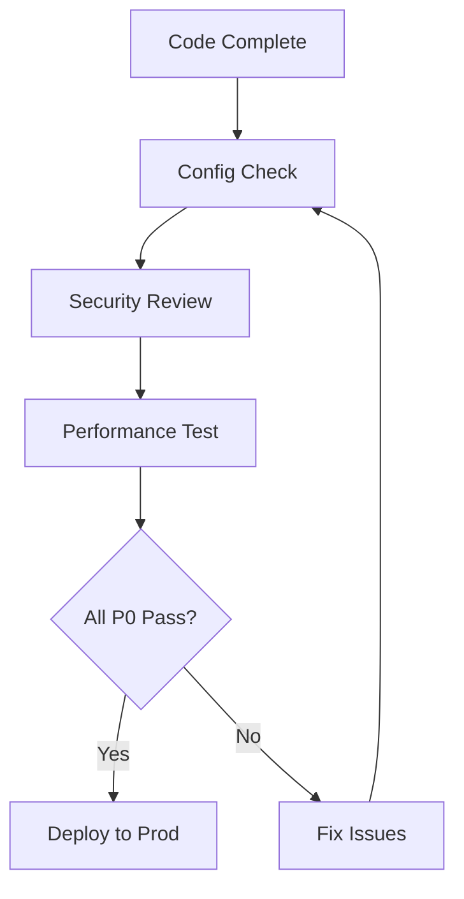

# Flink Production Deployment Checklist

> **Stage**: Knowledge/07-best-practices | **Prerequisites**: [Anti-Patterns](../09-anti-patterns/anti-pattern-checklist.md) | **Formal Level**: L3
>
> Complete checklist for Flink job deployment from development to production.

---

## 1. Definitions

**Def-K-07-01: Production Readiness Checklist**

Systematic verification steps ensuring Flink jobs meet stability, reliability, security, and performance requirements:

$$
\text{ProductionReady}(Job) \iff \forall c_i \in C_{P0} : check\_fn(c_i, Job) = true
$$

Each check item $c_i = (category, priority, check\_fn, remediation)$.

---

## 2. Properties

**Prop-K-07-01: Checklist Completeness**

All critical failure modes are covered by at least one P0 check item.

**Prop-K-07-02: Priority Ordering**

P0 (blocking) > P1 (critical) > P2 (recommended) in deployment gate sequence.

---

## 3. Relations

- **with Anti-Patterns**: Checklist detects known anti-patterns before production.
- **with Monitoring**: Post-deployment checks feed into alerting rules.

---

## 4. Argumentation

**Check Priority Rationale**:

| Priority | Examples | Gate |
|----------|----------|------|
| P0 | Checkpoint enabled, Exactly-Once sink | Deployment blocked |
| P1 | Monitoring configured, Backpressure alerts | Review required |
| P2 | Documentation, Runbooks | Recommended |

---

## 5. Checklist Details

**Configuration Checks**:
- [ ] Checkpoint interval < 5 minutes
- [ ] Watermark strategy configured
- [ ] Parallelism set appropriately
- [ ] State backend selected and configured
- [ ] Restart strategy configured

**Monitoring Checks**:
- [ ] Job metrics exported to Prometheus/Grafana
- [ ] Lag alerts for Kafka sources
- [ ] Backpressure monitoring enabled
- [ ] Custom business metrics defined

**Security Checks**:
- [ ] Kerberos/SASL for Kafka
- [ ] TLS for REST endpoints
- [ ] RBAC for Web UI
- [ ] Audit logging enabled

**Performance Checks**:
- [ ] Throughput tested at 2x expected peak
- [ ] State size within backend capacity
- [ ] GC pauses < 100ms
- [ ] Checkpoint duration < interval

---

## 6. Examples

```yaml
# Production readiness gate
gates:
  pre_deploy:
    - check: checkpoint_enabled
      severity: blocking
    - check: monitoring_configured
      severity: warning
  post_deploy:
    - check: lag_below_threshold
      duration: 10m
      severity: blocking
```

---

## 7. Visualizations

**Deployment Checklist Flow**:


---

## 8. References

[^1]: Apache Flink Documentation, "Production Readiness", 2025.
[^2]: Netflix Tech Blog, "Streaming Production Checklist", 2023.
