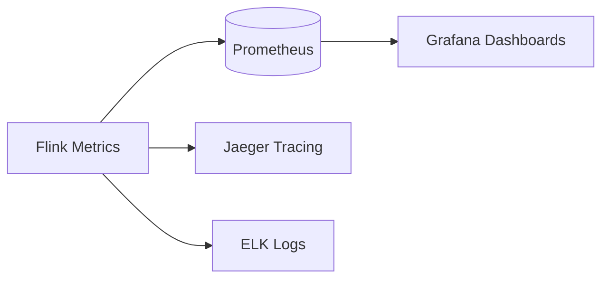

# Flink Runtime & Operations Overview

> **Language**: English | **Source**: [Flink/04-runtime/README.md](../Flink/04-runtime/README.md) | **Last Updated**: 2026-04-21

---

## Runtime Architecture

Flink runtime is a **distributed data stream processing engine** with Master-Worker architecture:

```
┌─────────────────────────────────────────────┐
│                  Flink Runtime              │
├─────────────────────────────────────────────┤
│                                             │
│  ┌─────────────┐      ┌─────────────────┐  │
│  │ JobManager  │◄────►│ TaskManager 1   │  │
│  │  (Master)   │      │  ┌───────────┐  │  │
│  │  - Scheduler│      │  │ Task Slot │  │  │
│  │  - Checkpoints│    │  │ Task Slot │  │  │
│  └─────────────┘      │  └───────────┘  │  │
│                       └─────────────────┘  │
│                              ...            │
│                       ┌─────────────────┐  │
│                       │ TaskManager N   │  │
│                       └─────────────────┘  │
│                                             │
└─────────────────────────────────────────────┘
```

## Core Concepts

| Concept | Description | Responsibility |
|---------|-------------|----------------|
| **JobManager** | Control plane | Scheduling, coordination, checkpoints |
| **TaskManager** | Data plane | Task execution, local state, network I/O |
| **Slot** | Resource unit | One parallel instance of a pipeline |
| **Task** | Execution unit | One parallel subtask of an operator |
| **ExecutionGraph** | Physical plan | Deployment mapping of logical plan |

## Deployment Modes

| Mode | Cluster Lifecycle | Isolation | Use Case |
|------|-------------------|-----------|----------|
| **Session** | Long-running, shared | Low | Development, multi-tenant |
| **Per-Job** | Job-bound | High | Production batch |
| **Application** | Application-bound | High | Long-running streaming |

## Operations Checklist

### Pre-Launch
- [ ] State backend selected and configured
- [ ] Checkpoint interval < max replay tolerance
- [ ] Watermark strategy matches data pattern
- [ ] Parallelism aligned with source partitions
- [ ] Monitoring dashboards configured

### Post-Launch
- [ ] Checkpoint duration < 50% of interval
- [ ] Backpressure ratio < 20%
- [ ] Watermark lag < 5 minutes
- [ ] JVM heap usage < 70%
- [ ] Record latency p99 < 2× SLA

## Observability Stack



## References

[^1]: Apache Flink Documentation, "Deployment", 2025.
[^2]: Apache Flink Documentation, "Monitoring and Debugging", 2025.
