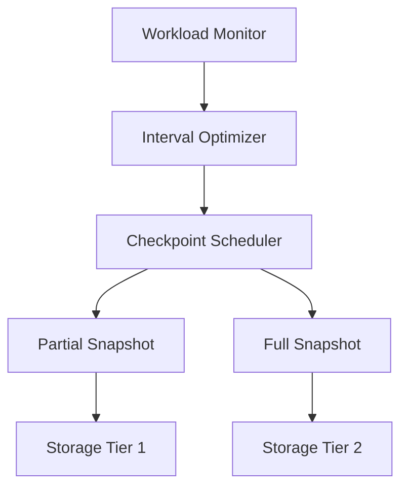

# Smart Checkpointing Strategies

> **Stage**: Flink/02-core | **Prerequisites**: [Checkpoint Deep Dive](../flink-checkpoint-mechanism-deep-dive.md) | **Formal Level**: L4
>
> Advanced checkpointing techniques: adaptive intervals, load-aware scheduling, incremental optimization, and partial checkpoints.

---

## 1. Definitions

**Def-F-02-110: Smart Checkpointing**

Checkpoint strategy that dynamically adapts to workload characteristics, optimizing for latency, throughput, and recovery time.

**Def-F-02-111: Adaptive Checkpoint Interval**

Automatically adjusts checkpoint frequency based on observed backpressure, state size growth, and failure rate.

**Def-F-02-112: Load-Aware Scheduling**

Co-locates checkpoint tasks with low-utilization slots to minimize impact on data processing.

---

## 2. Properties

**Lemma-F-02-50: Adaptive Interval Convergence**

The adaptive interval algorithm converges to a stable checkpoint frequency that balances recovery time and processing overhead.

**Lemma-F-02-51: Incremental Checkpoint Storage Upper Bound**

With incremental checkpoints, storage growth is bounded by $O(\Delta S \cdot N)$ where $\Delta S$ = state change rate and $N$ = retained checkpoints.

---

## 3. Relations

- **with Traditional Checkpointing**: Smart checkpointing is a superset that adds adaptation layers.
- **with Fault Domain Isolation**: Partial checkpoints enable per-fault-domain recovery without global restart.

---

## 4. Argumentation

**Checkpoint Frequency vs Recovery Time Trade-off**:

| Checkpoint Interval | Recovery Time | Overhead | Best For |
|---------------------|--------------|----------|----------|
| 30s | ~30s | High | Critical pipelines |
| 5min | ~5min | Low | Batch-friendly jobs |
| Adaptive | Variable | Balanced | Variable workloads |

---

## 5. Engineering Argument

**Thm-F-02-04 (Partial Checkpoint Consistency)**: Partial checkpoints that capture only modified state partitions remain consistent because unmodified partitions retain their last checkpoint state, and the global checkpoint metadata records the composition.

---

## 6. Examples

```java
// Adaptive checkpoint configuration
env.enableCheckpointing(60000);
env.getCheckpointConfig().setCheckpointIntervalMode(
    CheckpointIntervalMode.ADAPTIVE);
env.getCheckpointConfig().setMinCheckpointInterval(10000);
env.getCheckpointConfig().setMaxCheckpointInterval(300000);
```

---

## 7. Visualizations

**Smart Checkpointing Architecture**:



---

## 8. References
