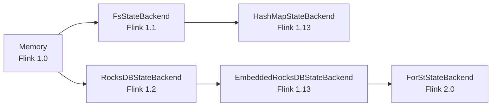

# State Backend Evolution Analysis

> **Stage**: Flink/02-core | **Prerequisites**: [State Backends Comparison](./state-backends-deep-comparison.md) | **Formal Level**: L4
>
> Evolution from MemoryStateBackend to HashMapStateBackend, RocksDBStateBackend, and Flink 2.0's ForSt remote state backend.

---

## 1. Definitions

**Def-F-02-33: MemoryStateBackend**

Flink 1.0's original state backend storing state in TaskManager JVM heap:

$$
|S_{total}| \leq \alpha \cdot \text{taskmanager.memory.task.heap.size}, \quad \alpha \approx 0.3
$$

**Def-F-02-34: HashMapStateBackend**

Flink 1.13+ unified in-memory backend replacing MemoryStateBackend and FsStateBackend:

$$
\text{HashMapStateBackend} = \langle \text{Heap}_{tm}, \text{HashMap}_{K,V}, \Psi_{\text{async-snapshot}} \rangle
$$

**Def-F-02-35: RocksDBStateBackend**

Flink 1.2+ (renamed EmbeddedRocksDBStateBackend in 1.13+) using embedded RocksDB LSM-Tree:

$$
\text{RocksDBStateBackend} = \langle \text{LSM-Tree}, \text{MemTable}, \text{SST Files}, \text{WAL}, \Psi_{\text{incremental}} \rangle
$$

**Def-F-02-36: ForStStateBackend (Flink 2.0)**

Disaggregated remote state backend enabling async state access:

$$
\text{ForSt} = \langle \text{Remote KV Store}, \text{AEC}, \text{Cache}_{\text{local}}, \Psi_{\text{async}} \rangle
$$

---

## 2. Properties

**Lemma-F-02-11: State Backend Latency Hierarchy**

$$
\text{Latency}_{\text{HashMap}} \ll \text{Latency}_{\text{RocksDB}} \ll \text{Latency}_{\text{ForSt (cache miss)}}
$$

**Lemma-F-02-12: Capacity Hierarchy**

$$
\text{Capacity}_{\text{HashMap}} \ll \text{Capacity}_{\text{RocksDB}} \approx \text{Capacity}_{\text{ForSt}}
$$

---

## 3. Relations

- **with Checkpoint**: RocksDB enables incremental checkpoints; ForSt enables async checkpointing.
- **with Async Execution**: ForSt is required for Flink 2.0 async state access.

---

## 4. Argumentation

**State Backend Selection Decision Tree**:

| State Size | Latency Requirement | Backend |
|------------|---------------------|---------|
| < 100MB | < 1ms | HashMap |
| 100MB - 100GB | < 10ms | RocksDB |
| > 100GB | < 50ms | ForSt (disaggregated) |

---

## 5. Engineering Argument

**Incremental Checkpoint Completeness**: RocksDB incremental checkpoints capture only changed SST files since the last checkpoint. Completeness is guaranteed because the SST file set forms a persistent snapshot of the LSM-Tree state.

---

## 6. Examples

```java
// RocksDB state backend
EmbeddedRocksDBStateBackend rocksDb = new EmbeddedRocksDBStateBackend(true);
rocksDb.setPredefinedOptions(PredefinedOptions.FLASH_SSD_OPTIMIZED);
env.setStateBackend(rocksDb);
```

---

## 7. Visualizations

**State Backend Evolution**:



---

## 8. References
