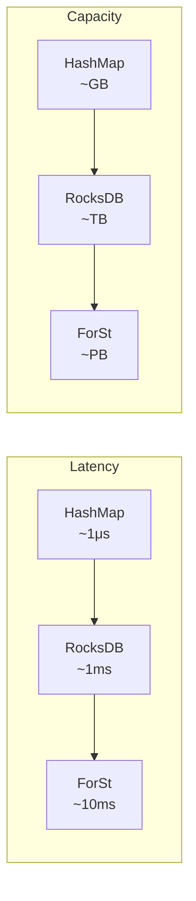

# Flink State Backends Deep Comparison

> **Stage**: Flink/02-core | **Prerequisites**: [Checkpoint Deep Dive](../flink-checkpoint-mechanism-deep-dive.md) | **Formal Level**: L4
>
> Comprehensive comparison of MemoryStateBackend, HashMapStateBackend, RocksDBStateBackend, and ForStStateBackend.

---

## 1. Definitions

**Def-F-02-37: State Backend**

Pluggable storage layer for Flink operator state, defining how state is stored, accessed, and snapshotted.

**Def-F-02-38: Incremental Checkpointing**

Only changed state data is included in the checkpoint, reducing snapshot size and duration.

---

## 2. Properties

**Lemma-F-02-13: State Backend Latency Ordering**

$$
\text{HashMap} \ll \text{RocksDB} \ll \text{ForSt (remote)}
$$

**Lemma-F-02-14: State Capacity Scalability**

$$
\text{HashMap} \ll \text{RocksDB} \approx \text{ForSt}
$$

**Prop-F-02-07: Checkpoint Time Complexity**

| Backend | Full Checkpoint | Incremental |
|---------|----------------|-------------|
| HashMap | $O(|S|)$ | N/A |
| RocksDB | $O(|S|)$ | $O(|\Delta S|)$ |
| ForSt | Async remote | Async incremental |

---

## 3. Relations

- **with Checkpoint**: Different backends offer different checkpoint capabilities (full vs incremental).
- **with Dataflow Model**: State backend choice affects latency and throughput of the dataflow.

---

## 4. Argumentation

**State Backend Selection Decision Tree**:

1. State size < 100MB and latency < 1ms? → HashMapStateBackend
2. State size > 100GB or SSD available? → RocksDBStateBackend
3. Cloud-native, disaggregated storage? → ForStStateBackend

**Anti-patterns**:

- Large state in HashMap → GC pauses, OOM
- High random read in RocksDB → Compaction overhead
- Low bandwidth with ForSt → Remote access latency

---

## 5. Engineering Argument

**Thm-F-02-06 (State Backend Selection Completeness)**: For any streaming workload, there exists an optimal state backend choice that minimizes the cost function $C = \alpha \cdot \text{Latency} + \beta \cdot \text{Throughput}^{-1} + \gamma \cdot \text{RecoveryTime}$.

---

## 6. Examples

```java
// RocksDB production configuration
EmbeddedRocksDBStateBackend rocksDb = new EmbeddedRocksDBStateBackend(true);
rocksDb.setPredefinedOptions(PredefinedOptions.FLASH_SSD_OPTIMIZED);
rocksDb.setMemoryManaged(true);
env.setStateBackend(rocksDb);
```

---

## 7. Visualizations

**State Backend Comparison Matrix**:



---

## 8. References
