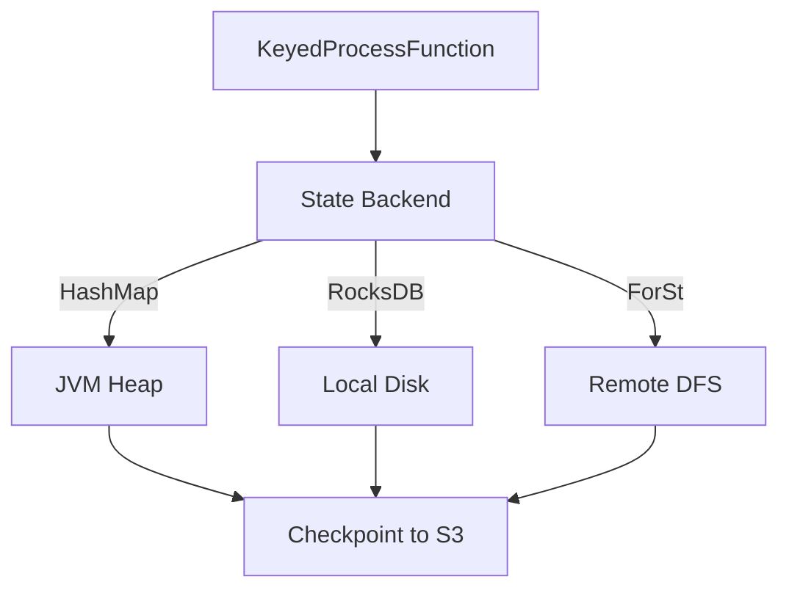

# Flink State Management Complete Guide

> **Stage**: Flink/02-core | **Prerequisites**: [Checkpoint Deep Dive](checkpoint-mechanism-deep-dive.md) | **Formal Level**: L4
>
> Comprehensive guide to Flink state backends, state types, checkpoint mechanisms, and TTL strategies.

---

## 1. Definitions

**Def-F-02-77: State Backend**

Pluggable storage layer for operator state.

**Def-F-02-78: Keyed State**

Partitioned state scoped to a specific key:

- ValueState: Single value per key
- ListState: List of values per key
- MapState: Map structure per key
- ReducingState: Reducible aggregate per key
- AggregatingState: Aggregatable value per key

**Def-F-02-79: Operator State**

Global state bound to operator instance, shared across all records.

**Def-F-02-80: Checkpoint**

Distributed snapshot mechanism for fault tolerance.

**Def-F-02-81: State TTL**

Time-to-live for automatic state expiration.

---

## 2. Properties

**Lemma-F-02-37: State Backend Latency**

$$
\text{HashMap} \ll \text{RocksDB} \ll \text{ForSt (remote)}
$$

**Lemma-F-02-38: State Backend Capacity**

$$
\text{HashMap} \ll \text{RocksDB} \approx \text{ForSt}
$$

**Prop-F-02-14: State Type Selection**

| Use Case | State Type |
|----------|-----------|
| Counter | ValueState |
| Buffer | ListState |
| Key-value lookup | MapState |
| Incremental aggregate | ReducingState |

---

## 3. Relations

- **with Checkpoint**: State backends provide snapshot capabilities.
- **with State TTL**: TTL prevents unbounded state growth.

---

## 4. Argumentation

**State Backend Selection**:

| State Size | Latency | Backend |
|------------|---------|---------|
| < 100MB | < 1ms | HashMapStateBackend |
| 100MB - 100GB | < 10ms | EmbeddedRocksDBStateBackend |
| > 100GB | < 50ms | ForStStateBackend |

**Checkpoint Types**:

| Type | Full | Incremental | Changelog |
|------|------|-------------|-----------|
| Size | All state | Delta only | Change log |
| Speed | Slow | Fast | Fastest |
| Backend | All | RocksDB | All |

---

## 5. Engineering Argument

**Thm-F-02-11 (State Backend Optimality)**: For any workload, there exists an optimal backend minimizing cost function $C = \alpha \cdot \text{Latency} + \beta \cdot \text{Throughput}^{-1} + \gamma \cdot \text{RecoveryTime}$.

---

## 6. Examples

```java
// ValueState example
class CounterFunction extends KeyedProcessFunction<String, Event, Result> {
    private ValueState<Long> countState;

    @Override
    public void open(Configuration params) {
        countState = getRuntimeContext().getState(
            new ValueStateDescriptor<>("count", Types.LONG));
    }

    @Override
    public void processElement(Event value, Context ctx, Collector<Result> out) throws Exception {
        Long current = countState.value();
        if (current == null) current = 0L;
        current += 1;
        countState.update(current);
        out.collect(new Result(value.getKey(), current));
    }
}
```

---

## 7. Visualizations

**State Backend Architecture**:



---

## 8. References
