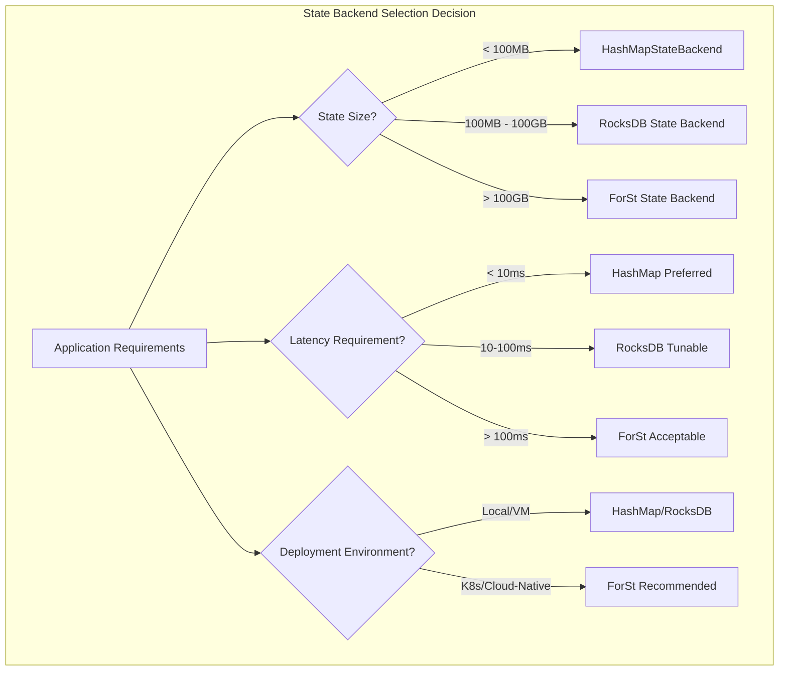
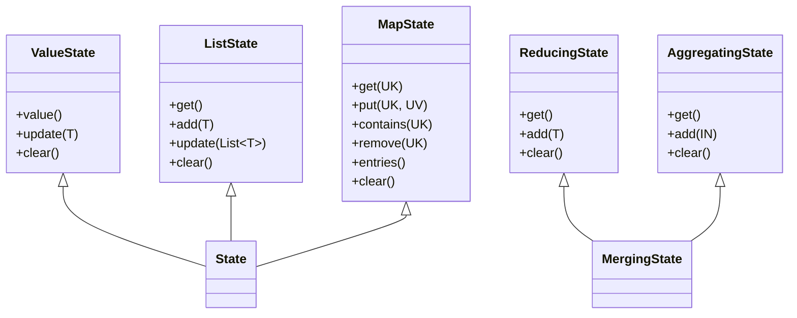
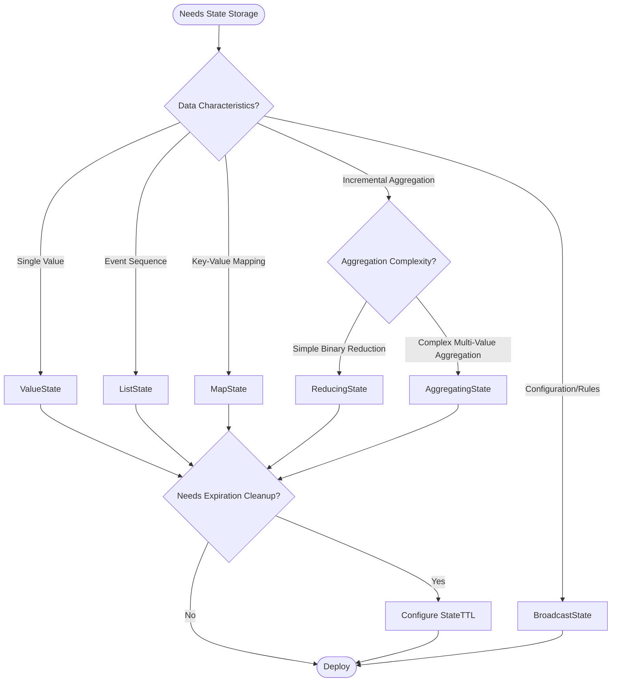
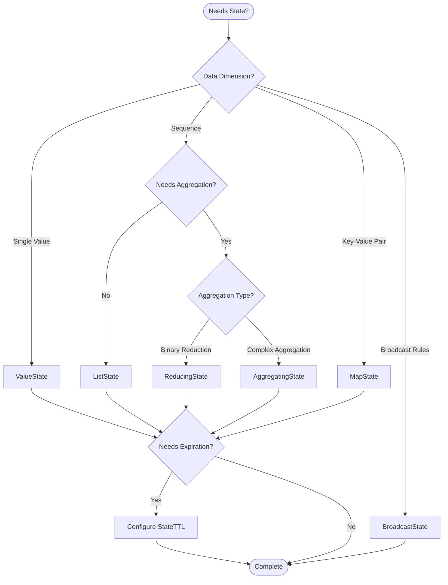
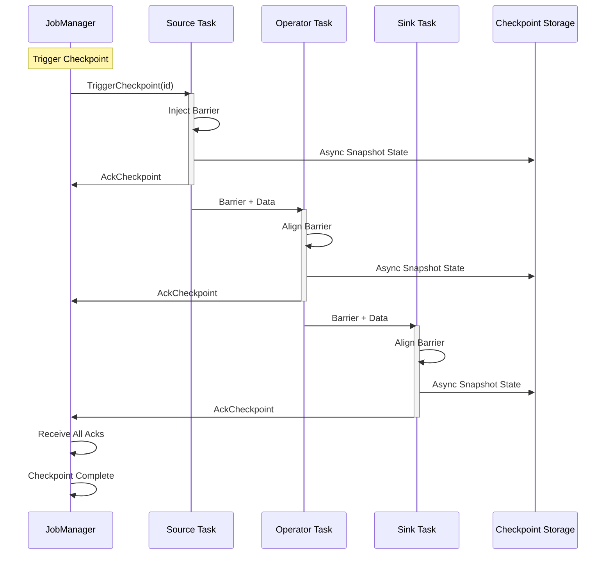
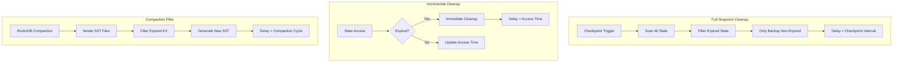

# Flink State Management Complete Feature Guide

> **Stage**: Flink/02-core-mechanisms | **Prerequisites**: [checkpoint-mechanism-deep-dive.md](./checkpoint-mechanism-deep-dive.md), [flink-state-ttl-best-practices.md](./flink-state-ttl-best-practices.md), [forst-state-backend.md](./forst-state-backend.md) | **Formalization Level**: L4

---

## Table of Contents

- [Flink State Management Complete Feature Guide](#flink-state-management-complete-feature-guide)
  - [Table of Contents](#table-of-contents)
  - [1. Definitions](#1-definitions)
    - [Def-F-02-90: State Backend](#def-f-02-90-state-backend)
    - [Def-F-02-91: HashMapStateBackend](#def-f-02-91-hashmapstatebackend)
    - [Def-F-02-92: EmbeddedRocksDBStateBackend](#def-f-02-92-embeddedrocksdbstatebackend)
    - [Def-F-02-93: ForStStateBackend (Flink 2.0+)](#def-f-02-93-forststatebackend-flink-20)
    - [Def-F-02-94: Keyed State](#def-f-02-94-keyed-state)
    - [Def-F-02-95: Operator State](#def-f-02-95-operator-state)
    - [Def-F-02-96: Checkpoint](#def-f-02-96-checkpoint)
    - [Def-F-02-97: State TTL](#def-f-02-97-state-ttl)
    - [Def-F-02-98: Changelog State Backend (Flink 1.15+)](#def-f-02-98-changelog-state-backend-flink-115)
  - [2. Properties](#2-properties)
    - [Lemma-F-02-70: State Backend Latency Characteristics](#lemma-f-02-70-state-backend-latency-characteristics)
    - [Lemma-F-02-71: State Backend Capacity Scalability](#lemma-f-02-71-state-backend-capacity-scalability)
    - [Prop-F-02-70: State Type Selection Theorem](#prop-f-02-70-state-type-selection-theorem)
    - [Prop-F-02-71: Checkpoint Consistency Guarantee](#prop-f-02-71-checkpoint-consistency-guarantee)
  - [3. Relations](#3-relations)
    - [3.1 State Backend to Application Scenario Mapping](#31-state-backend-to-application-scenario-mapping)
    - [3.2 State Type and Operation Semantics Relations](#32-state-type-and-operation-semantics-relations)
    - [3.3 Checkpoint Mechanism and Consistency Levels](#33-checkpoint-mechanism-and-consistency-levels)
  - [4. Argumentation](#4-argumentation)
    - [4.1 State Backend Deep Comparison](#41-state-backend-deep-comparison)
      - [4.1.1 Performance Comparison Matrix](#411-performance-comparison-matrix)
      - [4.1.2 Technical Implementation Differences](#412-technical-implementation-differences)
    - [4.2 State Type Selection Decision Tree](#42-state-type-selection-decision-tree)
    - [4.3 Checkpoint Mechanism Detailed Explanation](#43-checkpoint-mechanism-detailed-explanation)
      - [4.3.1 Full Checkpoint vs Incremental Checkpoint vs Changelog](#431-full-checkpoint-vs-incremental-checkpoint-vs-changelog)
      - [4.3.2 Checkpoint Configuration Parameters](#432-checkpoint-configuration-parameters)
    - [4.4 State TTL Expiration Policies](#44-state-ttl-expiration-policies)
  - [5. Proof / Engineering Argument](#5-proof--engineering-argument)
    - [Thm-F-02-90: State Backend Selection Optimality Theorem](#thm-f-02-90-state-backend-selection-optimality-theorem)
    - [Thm-F-02-91: Checkpoint Completeness Theorem](#thm-f-02-91-checkpoint-completeness-theorem)
    - [Thm-F-02-92: State TTL Consistency Theorem](#thm-f-02-92-state-ttl-consistency-theorem)
    - [Engineering Argument: State Query Performance Optimization](#engineering-argument-state-query-performance-optimization)
  - [6. Examples](#6-examples)
    - [6.1 ValueState Complete Example](#61-valuestate-complete-example)
    - [6.2 ListState Complete Example](#62-liststate-complete-example)
    - [6.3 MapState Complete Example](#63-mapstate-complete-example)
    - [6.4 ReducingState Complete Example](#64-reducingstate-complete-example)
    - [6.5 AggregatingState Complete Example](#65-aggregatingstate-complete-example)
    - [6.6 BroadcastState Complete Example](#66-broadcaststate-complete-example)
    - [6.7 State Backend Configuration Complete Example](#67-state-backend-configuration-complete-example)
  - [7. Visualizations](#7-visualizations)
    - [7.1 State Backend Architecture Comparison Diagram](#71-state-backend-architecture-comparison-diagram)
    - [7.2 State Type Selection Decision Tree](#72-state-type-selection-decision-tree)
    - [7.3 Checkpoint Lifecycle Sequence Diagram](#73-checkpoint-lifecycle-sequence-diagram)
    - [7.4 TTL Cleanup Strategy Comparison](#74-ttl-cleanup-strategy-comparison)
  - [8. Performance Tuning and Troubleshooting](#8-performance-tuning-and-troubleshooting)
    - [8.1 State Backend Selection Guide](#81-state-backend-selection-guide)
      - [8.1.1 Decision Matrix](#811-decision-matrix)
      - [8.1.2 Configuration Templates](#812-configuration-templates)
    - [8.2 State Type Performance Tuning](#82-state-type-performance-tuning)
      - [8.2.1 ValueState Optimization](#821-valuestate-optimization)
      - [8.2.2 MapState Optimization](#822-mapstate-optimization)
      - [8.2.3 ListState Optimization](#823-liststate-optimization)
    - [8.3 Checkpoint Tuning](#83-checkpoint-tuning)
      - [8.3.1 Timeout and Retry Configuration](#831-timeout-and-retry-configuration)
      - [8.3.2 Unaligned Checkpoint Configuration](#832-unaligned-checkpoint-configuration)
    - [8.4 TTL Configuration Best Practices](#84-ttl-configuration-best-practices)
      - [8.4.1 SQL-Based State TTL Configuration](#841-sql-based-state-ttl-configuration)
      - [8.4.2 Important State TTL Behaviors](#842-important-state-ttl-behaviors)
      - [8.4.3 TTL Duration Calculation Formula](#843-ttl-duration-calculation-formula)
      - [8.4.4 Cleanup Strategy Selection](#844-cleanup-strategy-selection)
    - [8.5 Troubleshooting Guide](#85-troubleshooting-guide)
      - [8.5.1 Frequent Checkpoint Timeouts](#851-frequent-checkpoint-timeouts)
      - [8.5.2 Continuous State Growth (OOM Risk)](#852-continuous-state-growth-oom-risk)
      - [8.5.3 State Access Performance Issues](#853-state-access-performance-issues)
    - [8.6 Changelog State Backend Production Configuration](#86-changelog-state-backend-production-configuration)
      - [8.6.1 Enabling Changelog State Backend](#861-enabling-changelog-state-backend)
      - [8.6.2 Changelog Configuration Parameters](#862-changelog-configuration-parameters)
    - [8.7 State Migration and Upgrade](#87-state-migration-and-upgrade)
      - [8.7.1 Savepoint vs Checkpoint Comparison](#871-savepoint-vs-checkpoint-comparison)
      - [8.7.2 State Compatibility Rules](#872-state-compatibility-rules)
      - [8.7.3 Upgrade Operation Process](#873-upgrade-operation-process)
  - [9. References](#9-references)

---

## 1. Definitions

### Def-F-02-90: State Backend

**Definition**: State Backend is the Flink runtime component responsible for state storage, access, and snapshot persistence, formally defined as:

$$
\text{StateBackend} = \langle \text{Storage}, \text{Serialization}, \text{Snapshot}, \text{Recovery} \rangle
$$

Where:

- $\text{Storage}$: Physical storage medium for state (memory/disk/distributed storage)
- $\text{Serialization}$: State serialization/deserialization strategy
- $\text{Snapshot}$: State snapshot generation mechanism
- $\text{Recovery}$: Fault recovery strategy

Flink 1.x/2.x provides three main State Backends:

| State Backend | Storage Location | Serialization | Applicable Scenarios |
|--------------|------------------|---------------|----------------------|
| HashMapStateBackend | JVM Heap | Async Snapshot | Small state, low latency |
| EmbeddedRocksDBStateBackend | Local RocksDB | Incremental Snapshot | Large state, high throughput |
| ForStStateBackend (Flink 2.0+) | Distributed Storage + Local Cache | Metadata Snapshot | Ultra-large scale, cloud-native |

---

### Def-F-02-91: HashMapStateBackend

**Definition**: HashMapStateBackend is a JVM heap memory-based state backend using `HashMap` data structure to store key-value state:

$$
\text{HashMapStateBackend} = \langle \text{Heap}_K, \text{TypeSerializer}_T, \text{AsyncSnapshot} \rangle
$$

**Core Characteristics**:

1. **Storage Model**: Each key-value state corresponds to a `HashMap<K, T>`
2. **Access Latency**: $O(1)$ average time complexity
3. **Snapshot Mechanism**: Asynchronous copy-on-write, non-blocking data stream processing
4. **Memory Management**: Limited by TaskManager heap memory size

**Constraints**:

$$
|S_{total}| \leq \text{taskmanager.memory.framework.heap.size} - \text{overhead}
$$

---

### Def-F-02-92: EmbeddedRocksDBStateBackend

**Definition**: EmbeddedRocksDBStateBackend uses an embedded RocksDB engine to store state, based on the LSM-Tree data structure:

$$
\text{RocksDBStateBackend} = \langle \text{LSM-Tree}, \text{SSTFiles}, \text{MemTable}, \text{WAL} \rangle
$$

**Core Characteristics**:

1. **Storage Model**: LSM-Tree structure, write operations first enter MemTable, then flush to SST files
2. **Access Latency**: Point lookup $O(\log N)$, range query $O(\log N + K)$ ($K$ is the number of results)
3. **Storage Capacity**: Limited by local disk capacity
4. **Serialization**: State values are serialized into byte arrays using `TypeSerializer`

**LSM-Tree Structure**:

$$
\text{RocksDB} = \text{MemTable} \cup \left( \bigcup_{i=0}^{L} \text{Level}_i \right)
$$

Where $\text{Level}_i$ contains SST files sorted by key, satisfying $\forall f \in \text{Level}_i: |f| \leq s \cdot r^i$ ($s$ is the base size, $r$ is the level multiplier) [^1].

---

### Def-F-02-93: ForStStateBackend (Flink 2.0+)

**Definition**: ForSt (For Streaming) is a disaggregated state backend introduced in Flink 2.0, primarily storing state in distributed file systems:

$$
\text{ForStStateBackend} = \langle \text{UFS}, \text{LocalCache}, \text{LazyRestore}, \text{RemoteCompaction} \rangle
$$

Where:

- $\text{UFS}$ (Unified File System): Distributed storage abstraction (S3/HDFS/GCS)
- $\text{LocalCache}$: Local hot data cache (LRU/SLRU management)
- $\text{LazyRestore}$: Lazy recovery mechanism, loading state on demand
- $\text{RemoteCompaction}$: Remote Compaction service

---

### Def-F-02-94: Keyed State

**Definition**: Keyed State is state bound to a specific key, only available on `KeyedStream`:

$$
\text{KeyedState} = \{ s_k \mid k \in \text{KeySpace}, s_k \in \text{StateValue} \}
$$

**State Type Classification**:

| State Type | Symbol | Semantics | Applicable Scenarios |
|-----------|--------|-----------|----------------------|
| ValueState | $V_k$ | Single-value state | Latest value storage |
| ListState | $L_k$ | List state | Event sequences |
| MapState | $M_k$ | Map state | Key-value aggregation |
| ReducingState | $R_k$ | Reducing state | Incremental aggregation |
| AggregatingState | $A_k$ | Aggregating state | Complex aggregation |

---

### Def-F-02-95: Operator State

**Definition**: Operator State is state bound to operator instances, independent of key:

$$
\text{OperatorState} = \langle \text{Instance}_i, \text{StatePartitions}, \text{RescaleMode} \rangle
$$

**State Types**:

| Type | Description | Rescaling Strategy |
|------|-------------|-------------------|
| List State | List state | Even redistribution |
| Union List State | Union list state | Full broadcast |
| Broadcast State | Broadcast state | Full replication |

---

### Def-F-02-96: Checkpoint

**Definition**: Checkpoint is a globally consistent state snapshot of a distributed stream processing job at a specific point in time:

$$
\text{Checkpoint} = \langle ID, TS, \{S_i\}_{i \in Tasks}, \text{Metadata} \rangle
$$

**Checkpoint Types**:

| Type | Symbol | Description |
|------|--------|-------------|
| Full Checkpoint | $CP_{full}$ | Full state snapshot |
| Incremental Checkpoint | $CP_{inc}$ | Only captures changed state |
| Aligned Checkpoint | $CP_{align}$ | Triggered by barrier alignment |
| Unaligned Checkpoint | $CP_{unaligned}$ | Non-aligned trigger |

---

### Def-F-02-97: State TTL

**Definition**: State TTL is an automatic expiration and cleanup mechanism for state:

$$
\text{StateTTL} = \langle \tau, \text{UpdateType}, \text{Visibility}, \text{CleanupStrategy} \rangle
$$

Where:

- $\tau$: TTL duration
- $\text{UpdateType} \in \{ \text{OnCreateAndWrite}, \text{OnReadAndWrite}, \text{Disabled} \}$
- $\text{Visibility} \in \{ \text{NeverReturnExpired}, \text{ReturnExpiredIfNotCleanedUp} \}$
- $\text{CleanupStrategy} \in \{ \text{FullSnapshot}, \text{Incremental}, \text{CompactionFilter} \}$

### Def-F-02-98: Changelog State Backend (Flink 1.15+)

**Definition**: Changelog State Backend is a state backend enhancement mechanism that achieves second-level recovery by materializing state changes in real time [^4]:

$$
\text{ChangelogStateBackend} = \langle \text{BaseBackend}, \text{ChangelogStorage}, \text{PeriodicMaterialization} \rangle
$$

**Core Mechanisms**:

1. **Real-time Materialization**: State changes are continuously written to Changelog, rather than only periodic Checkpoints
2. **Parallel Recovery**: During recovery, the base Checkpoint + Changelog are read in parallel, achieving second-level recovery
3. **Storage Separation**: Changelog is stored separately from the base state, supporting independent lifecycle management

**Configuration Example**:

```yaml
# flink-conf.yaml state.backend.changelog.enabled: true
state.backend.changelog.storage: filesystem
state.backend.changelog.periodic-materialization.interval: 10min
```

---

## 2. Properties

### Lemma-F-02-70: State Backend Latency Characteristics

**Lemma**: The state access latency of the three State Backends satisfies the following inequality:

$$
\text{Latency}_{HashMap} < \text{Latency}_{RocksDB}^{cache\_hit} < \text{Latency}_{ForSt}^{cache\_hit} < \text{Latency}_{RocksDB}^{cache\_miss} < \text{Latency}_{ForSt}^{cache\_miss}
$$

**Proof**:

1. **HashMap**: Direct memory access, nanosecond-level latency
2. **RocksDB Cache Hit**: Block Cache in memory, sub-microsecond level
3. **ForSt Cache Hit**: Local cache access, microsecond level
4. **RocksDB Cache Miss**: Local disk I/O, millisecond level
5. **ForSt Cache Miss**: Network I/O to distributed storage, tens of milliseconds level

$\square$

---

### Lemma-F-02-71: State Backend Capacity Scalability

**Lemma**: The capacity limits of the three State Backends satisfy:

$$
\text{Capacity}_{HashMap} \ll \text{Capacity}_{RocksDB} < \text{Capacity}_{ForSt} \approx \infty
$$

**Proof**:

- **HashMap**: Limited by TM heap memory (typically < 10GB)
- **RocksDB**: Limited by TM local disk (typically 100GB - several TB)
- **ForSt**: Limited by distributed storage capacity (theoretically unlimited)

$\square$

---

### Prop-F-02-70: State Type Selection Theorem

**Proposition**: For keyed state operations, the optimal state type selection satisfies:

| Operation Mode | Optimal State Type | Complexity |
|---------------|-------------------|------------|
| Single-value read/write | ValueState | $O(1)$ |
| Append sequence | ListState | $O(1)$ append |
| Key-value mapping | MapState | $O(1)$ per key |
| Incremental reduction | ReducingState | $O(1)$ space |
| Complex aggregation | AggregatingState | $O(1)$ space |

**Corollary**: Using the wrong state type leads to space or time complexity degradation. For example, using ListState to store aggregated values requires $O(N)$ space, while ReducingState only needs $O(1)$.

---

### Prop-F-02-71: Checkpoint Consistency Guarantee

**Proposition**: If Checkpoint uses Aligned mode and the State Backend provides atomic snapshots, the recovered state satisfies:

$$
\text{restore}(CP_n) = S_{t_n}
$$

Where $S_{t_n}$ is the true state at Checkpoint $n$ moment.

---

## 3. Relations

### 3.1 State Backend to Application Scenario Mapping



**Detailed Mapping Table**:

| Scenario Characteristics | Recommended Backend | Rationale |
|-------------------------|---------------------|-----------|
| Small state (< 100MB), low latency | HashMapStateBackend | Memory access, nanosecond-level latency |
| Medium state (100MB - 10GB) | RocksDB + Full Checkpoint | Disk storage, async snapshot |
| Large state (> 10GB) | RocksDB + Incremental Checkpoint | Reduce I/O, lower timeout risk |
| Ultra-large scale (> 1TB) | ForSt | Disaggregated storage, elastic scaling |
| Frequent point lookups | HashMapStateBackend | $O(1)$ hash lookup |
| Range scans | RocksDB/ForSt | LSM-Tree optimization |
| Cloud-native deployment | ForSt | Storage-compute separation, cost optimization |

---

### 3.2 State Type and Operation Semantics Relations



---

### 3.3 Checkpoint Mechanism and Consistency Levels

| Checkpoint Mode | Alignment Strategy | Consistency Guarantee | Latency Impact |
|----------------|-------------------|----------------------|----------------|
| Aligned + Exactly-Once | Barrier alignment | Strong consistency | Medium |
| Unaligned + Exactly-Once | Non-aligned + in-flight data | Strong consistency | Low |
| Aligned + At-Least-Once | No barrier alignment | At-least-once | Low |

**Relation Derivation**:

$$
\text{Exactly-Once} \Rightarrow \text{Aligned} \lor (\text{Unaligned} \land \text{InFlightSnapshot})
$$

---

## 4. Argumentation

### 4.1 State Backend Deep Comparison

#### 4.1.1 Performance Comparison Matrix

| Dimension | HashMapStateBackend | EmbeddedRocksDBStateBackend | ForStStateBackend |
|-----------|--------------------|----------------------------|-------------------|
| **Access Latency** | ⭐⭐⭐⭐⭐ (ns) | ⭐⭐⭐ (μs-ms) | ⭐⭐ (ms) |
| **Storage Capacity** | ⭐⭐ (< 10GB) | ⭐⭐⭐⭐ (TB) | ⭐⭐⭐⭐⭐ (PB) |
| **Checkpoint Speed** | ⭐⭐⭐ (Full) | ⭐⭐⭐⭐ (Incremental) | ⭐⭐⭐⭐⭐ (Metadata) |
| **Recovery Speed** | ⭐⭐⭐⭐ | ⭐⭐⭐ | ⭐⭐⭐⭐⭐ (LazyRestore) |
| **Memory Efficiency** | ⭐⭐ | ⭐⭐⭐⭐ | ⭐⭐⭐⭐⭐ |
| **CPU Overhead** | ⭐⭐⭐⭐⭐ (Low) | ⭐⭐⭐ (Medium) | ⭐⭐ (High serialization) |
| **Disk I/O** | None | High | Medium (Network I/O) |
| **Serialization Overhead** | Only at Checkpoint | Every read/write | Every read/write |
| **Cloud-Native Friendly** | ⭐⭐ | ⭐⭐⭐ | ⭐⭐⭐⭐⭐ |
| **Cost Efficiency** | ⭐⭐⭐ | ⭐⭐⭐ | ⭐⭐⭐⭐⭐ |

#### 4.1.2 Technical Implementation Differences

```mermaid
graph TB
    subgraph "HashMapStateBackend"
        H1[KeyedProcessFunction] --> H2[HashMap State Table]
        H2 --> H3[JVM Heap Memory]
        H3 --> H4[Async Snapshot<br/>Copy-on-Write]
    end

    subgraph "RocksDBStateBackend"
        R1[KeyedProcessFunction] --> R2[RocksDB JNI]
        R2 --> R3[MemTable<br/>WAL]
        R3 --> R4[SST Files<br/>LSM-Tree]
        R4 --> R5[Local Disk]
        R5 --> R6[Incremental Snapshot]
    end

    subgraph "ForStStateBackend"
        F1[KeyedProcessFunction] --> F2[Local Cache<br/>LRU/SLRU]
        F2 --> F3[Cache Miss?]
        F3 -->|Yes| F4[Async Fetch<br/>from DFS]
        F3 -->|No| F5[Direct Read]
        F4 --> F6[Unified File System<br/>S3/HDFS]
        F6 --> F7[Metadata Snapshot]
    end
```



---

### 4.2 State Type Selection Decision Tree



---

### 4.3 Checkpoint Mechanism Detailed Explanation

#### 4.3.1 Full Checkpoint vs Incremental Checkpoint vs Changelog

| Characteristic | Full Checkpoint | Incremental Checkpoint | Changelog State Backend |
|---------------|----------------|----------------------|------------------------|
| Snapshot Content | Complete state data | Changes since last Checkpoint | Real-time state change stream |
| Storage Overhead | $O(|S|)$ | $O(|\Delta S|)$ | $O(|S|) + O(|Changelog|)$ |
| Recovery Time | $O(|S|)$ | $O(|S|)$ (needs merge) | $O(|S_{base}|) + O(|Changelog|)$ (parallel) |
| Network Transfer | Large | Small | Continuous |
| Recovery Speed | Minutes | Minutes | Seconds |
| Applicable Scenarios | Small state | Large state | Latency-sensitive, second-level recovery needs |

**Changelog State Backend Principle**:

Based on real-time materialization of state changes:

$$
CP_n^{changelog} = \{ \delta_1, \delta_2, \ldots, \delta_n \} \quad \text{where} \quad \delta_i = S_{t_i} - S_{t_{i-1}}
$$

**RocksDB Incremental Checkpoint Principle**:

Based on SST file immutability:

$$
CP_n^{inc} = \{ f \in \text{SST}_n \mid f \notin \text{SST}_{n-1} \}
$$

#### 4.3.2 Checkpoint Configuration Parameters

```java
import java.time.Duration;
import org.apache.flink.configuration.Configuration;
import org.apache.flink.contrib.streaming.state.EmbeddedRocksDBStateBackend;
import org.apache.flink.streaming.api.CheckpointingMode;
import org.apache.flink.streaming.api.windowing.time.Time;
import org.apache.flink.streaming.api.environment.StreamExecutionEnvironment;

public class Example {
    public static void main(String[] args) throws Exception {
        StreamExecutionEnvironment env = StreamExecutionEnvironment.getExecutionEnvironment();

        // Basic configuration
        env.enableCheckpointing(60000);  // 60-second interval
        env.getCheckpointConfig().setCheckpointingMode(CheckpointingMode.EXACTLY_ONCE);
        env.getCheckpointConfig().setCheckpointTimeout(600000);  // 10-minute timeout
        env.getCheckpointConfig().setMaxConcurrentCheckpoints(1);
        env.getCheckpointConfig().setMinPauseBetweenCheckpoints(30000);

        // Incremental Checkpoint (RocksDB)
        env.setStateBackend(new EmbeddedRocksDBStateBackend(true));

        // Unaligned Checkpoint
        env.getCheckpointConfig().enableUnalignedCheckpoints();
        env.getCheckpointConfig().setAlignmentTimeout(Duration.ofSeconds(30));

        // Changelog State Backend (Flink 1.15+)
        Configuration config = new Configuration();
        config.setBoolean("state.backend.changelog.enabled", true);
        config.setString("state.backend.changelog.storage", "filesystem");
        env.configure(config);

    }
}

```

---

### 4.4 State TTL Expiration Policies

| Policy | Trigger Timing | Timeliness | CPU Overhead |
|--------|---------------|------------|--------------|
| Full Snapshot | Checkpoint completion | Low | Low |
| Incremental | During state access | High | Medium |
| RocksDB Compaction Filter | During Compaction | Medium | Low |

**TTL Configuration Elements**:

$$
\text{TTL}_{effective} = \text{base TTL} + \text{cleanup delay}
$$

Where cleanup delay depends on the selected cleanup strategy.

---

## 5. Proof / Engineering Argument

### Thm-F-02-90: State Backend Selection Optimality Theorem

**Theorem**: For a given application feature vector $\vec{A} = \langle \text{size}, \text{latency}, \text{throughput}, \text{cost} \rangle$, there exists a unique State Backend selection $B^*$ that minimizes the comprehensive cost function:

$$
B^* = \arg\min_{B \in \mathcal{B}} \mathcal{C}(\vec{A}, B)
$$

Where the cost function:

$$
\mathcal{C}(\vec{A}, B) = w_1 \cdot \text{LatencyCost} + w_2 \cdot \text{StorageCost} + w_3 \cdot \text{CheckpointCost} + w_4 \cdot \text{RecoveryCost}
$$

**Proof**:

**Case 1**: When $\text{size} < 100\text{MB}$ and $\text{latency} < 10\text{ms}$:

- HashMap: $\mathcal{C} = 0 + O(1) + O(|S|) + O(|S|)$ (low latency advantage)
- RocksDB: $\mathcal{C} = O(\log N) + O(1) + O(|\Delta S|) + O(|S|)$
- ForSt: $\mathcal{C} = O(\text{network}) + O(0.1) + O(1) + O(|M|)$

HashMap has the lowest latency cost, therefore $B^* = \text{HashMap}$.

**Case 2**: When $100\text{MB} < \text{size} < 10\text{GB}$:

RocksDB's incremental Checkpoint significantly reduces network transfer cost, making it comprehensively optimal.

**Case 3**: When $\text{size} > 100\text{GB}$:

ForSt's disaggregated storage architecture breaks through local capacity limits, making it the only feasible solution.

$\square$

---

### Thm-F-02-91: Checkpoint Completeness Theorem

**Theorem**: For any Checkpoint sequence $CP_1, CP_2, \ldots, CP_n$, if each Checkpoint completes successfully, the recovered state $S_{recovered}$ equals the state corresponding to the latest successful Checkpoint:

$$
S_{recovered} = S_{CP_{\max \{ i \mid CP_i \text{ completed} \}}}
$$

**Proof**:

Based on the correctness of the Chandy-Lamport snapshot algorithm [^2], Flink Checkpoint forms a consistent cut. Each operator state snapshot occurs after receiving all input barriers, thus capturing the complete processing results up to the barrier.

During recovery, the system rebuilds state from Checkpoint metadata and replays data after the Checkpoint. Since data sources are replayable and operators are deterministic, the recovered execution trace is equivalent to the original execution.

$\square$

---

### Thm-F-02-92: State TTL Consistency Theorem

**Theorem**: TTL configured as `NeverReturnExpired` guarantees:

$$
\forall s \in \text{State}: \text{read}(s) \neq \bot \Rightarrow t_{now} - t_{lastAccess} \leq \tau
$$

**Proof**:

The TTL filter checks the expiration condition on every state access. If the state is expired and visibility is `NeverReturnExpired`, the filter returns `null`, and the upper-layer logic treats the state as non-existent.

Since the clock is monotonically increasing, once a state expires, it will always satisfy the expiration condition and will never incorrectly return an expired value.

$\square$

---

### Engineering Argument: State Query Performance Optimization

**QueryableState Architecture**: [^3]

QueryableState allows external clients to directly query Flink internal state, but has the following limitations:

1. **Consistency Limitation**: Query results reflect a snapshot at a certain moment, not real-time updates
2. **Performance Impact**: High-concurrency queries affect normal data processing
3. **Availability Limitation**: The queried Task must be running

**Optimization Strategies**:

$$
\text{QueryThroughput} = \frac{\text{AvailableThreads}}{\text{QueryLatency} + \text{StateAccessTime}}
$$

By increasing the QueryableState Server thread count and optimizing the state access path, query throughput can be improved.

---

## 6. Examples

### 6.1 ValueState Complete Example

```java
import org.apache.flink.api.common.state.ValueState;
import org.apache.flink.api.common.state.ValueStateDescriptor;
import org.apache.flink.api.common.time.Time;
import org.apache.flink.configuration.Configuration;
import org.apache.flink.streaming.api.functions.KeyedProcessFunction;
import org.apache.flink.util.Collector;

import org.apache.flink.streaming.api.windowing.time.Time;


/**
 * Def-F-02-98: Session state management with TTL
 */
public class SessionTracker extends KeyedProcessFunction<String, Event, SessionResult> {

    private ValueState<SessionInfo> sessionState;
    private static final long SESSION_TIMEOUT_MS = Time.minutes(30).toMilliseconds();

    @Override
    public void open(Configuration parameters) {
        // Configure TTL
        StateTtlConfig ttlConfig = StateTtlConfig
            .newBuilder(Time.minutes(30))
            .setUpdateType(StateTtlConfig.UpdateType.OnReadAndWrite)
            .setStateVisibility(StateTtlConfig.StateVisibility.NeverReturnExpired)
            .cleanupIncrementally(10, true)
            .build();

        ValueStateDescriptor<SessionInfo> descriptor = new ValueStateDescriptor<>(
            "session-info",
            SessionInfo.class
        );
        descriptor.enableTimeToLive(ttlConfig);
        sessionState = getRuntimeContext().getState(descriptor);
    }

    @Override
    public void processElement(Event event, Context ctx, Collector<SessionResult> out)
            throws Exception {
        SessionInfo session = sessionState.value();
        long currentTime = ctx.timestamp();

        if (session == null) {
            // New session
            session = new SessionInfo(event.getUserId(), currentTime);
        } else if (currentTime - session.getLastActivityTime() > SESSION_TIMEOUT_MS) {
            // Session expired, output old session result
            out.collect(new SessionResult(session, true));
            session = new SessionInfo(event.getUserId(), currentTime);
        }

        session.addEvent(event);
        sessionState.update(session);

        // Register timer to check session timeout
        ctx.timerService().registerEventTimeTimer(
            session.getLastActivityTime() + SESSION_TIMEOUT_MS
        );
    }

    @Override
    public void onTimer(long timestamp, OnTimerContext ctx, Collector<SessionResult> out)
            throws Exception {
        SessionInfo session = sessionState.value();
        if (session != null && timestamp >= session.getLastActivityTime() + SESSION_TIMEOUT_MS) {
            out.collect(new SessionResult(session, true));
            sessionState.clear();
        }
    }
}
```

---

### 6.2 ListState Complete Example

```java
/**
 * Def-F-02-99: Event Buffer - Batch Processing Mode
 */
public class EventBuffer extends KeyedProcessFunction<String, Event, List<Event>> {

    private ListState<Event> bufferedEvents;
    private static final int BATCH_SIZE = 100;
    private static final long FLUSH_INTERVAL_MS = 5000;

    @Override
    public void open(Configuration parameters) {
        ListStateDescriptor<Event> descriptor = new ListStateDescriptor<>(
            "event-buffer",
            Event.class
        );
        bufferedEvents = getRuntimeContext().getListState(descriptor);
    }

    @Override
    public void processElement(Event event, Context ctx, Collector<List<Event>> out)
            throws Exception {
        bufferedEvents.add(event);

        // Check buffer size
        Iterable<Event> events = bufferedEvents.get();
        int count = 0;
        for (Event e : events) {
            count++;
        }

        if (count >= BATCH_SIZE) {
            flushBuffer(out);
        }

        // Register periodic flush timer
        ctx.timerService().registerProcessingTimeTimer(
            ctx.timerService().currentProcessingTime() + FLUSH_INTERVAL_MS
        );
    }

    @Override
    public void onTimer(long timestamp, OnTimerContext ctx, Collector<List<Event>> out)
            throws Exception {
        flushBuffer(out);
    }

    private void flushBuffer(Collector<List<Event>> out) throws Exception {
        List<Event> batch = new ArrayList<>();
        for (Event event : bufferedEvents.get()) {
            batch.add(event);
        }

        if (!batch.isEmpty()) {
            out.collect(batch);
            bufferedEvents.clear();
        }
    }
}
```

---

### 6.3 MapState Complete Example

```java
/**
 * Def-F-02-100: User Behavior Counter - MapState Application
 */
public class UserBehaviorCounter extends KeyedProcessFunction<String, UserEvent, Metrics> {

    private MapState<String, Long> behaviorCounts;
    private MapState<String, Long> lastUpdateTime;

    @Override
    public void open(Configuration parameters) {
        // Configure TTL - 7-day expiration
        StateTtlConfig ttlConfig = StateTtlConfig
            .newBuilder(Time.days(7))
            .setUpdateType(StateTtlConfig.UpdateType.OnCreateAndWrite)
            .setStateVisibility(StateTtlConfig.StateVisibility.NeverReturnExpired)
            .cleanupInRocksdbCompactFilter(1000)
            .build();

        MapStateDescriptor<String, Long> countDescriptor = new MapStateDescriptor<>(
            "behavior-counts",
            String.class,
            Long.class
        );
        countDescriptor.enableTimeToLive(ttlConfig);
        behaviorCounts = getRuntimeContext().getMapState(countDescriptor);

        MapStateDescriptor<String, Long> timeDescriptor = new MapStateDescriptor<>(
            "last-update",
            String.class,
            Long.class
        );
        timeDescriptor.enableTimeToLive(ttlConfig);
        lastUpdateTime = getRuntimeContext().getMapState(timeDescriptor);
    }

    @Override
    public void processElement(UserEvent event, Context ctx, Collector<Metrics> out)
            throws Exception {
        String behavior = event.getBehaviorType();

        // Update count
        Long count = behaviorCounts.get(behavior);
        if (count == null) {
            count = 0L;
        }
        behaviorCounts.put(behavior, count + 1);
        lastUpdateTime.put(behavior, ctx.timestamp());

        // Output aggregated metrics every 100 times
        if ((count + 1) % 100 == 0) {
            Map<String, Long> snapshot = new HashMap<>();
            for (Map.Entry<String, Long> entry : behaviorCounts.entries()) {
                snapshot.put(entry.getKey(), entry.getValue());
            }
            out.collect(new Metrics(event.getUserId(), snapshot, ctx.timestamp()));
        }
    }
}
```

---

### 6.4 ReducingState Complete Example

```java
/**
 * Def-F-02-101: Incremental Aggregation - ReducingState Application
 */
public class IncrementalAggregator extends KeyedProcessFunction<String, SensorReading, AggregatedResult> {

    private ReducingState<SensorReading> reducingState;

    @Override
    public void open(Configuration parameters) {
        // Reduce function: merge two SensorReadings, keeping sum and count
        ReduceFunction<SensorReading> reduceFunction = (a, b) -> {
            return new SensorReading(
                a.getSensorId(),
                a.getTimestamp(),  // Keep earliest timestamp
                a.getValue() + b.getValue(),  // Accumulate value
                a.getCount() + b.getCount()   // Accumulate count
            );
        };

        ReducingStateDescriptor<SensorReading> descriptor = new ReducingStateDescriptor<>(
            "sensor-aggregate",
            reduceFunction,
            SensorReading.class
        );
        reducingState = getRuntimeContext().getReducingState(descriptor);
    }

    @Override
    public void processElement(SensorReading reading, Context ctx, Collector<AggregatedResult> out)
            throws Exception {
        reducingState.add(reading);

        // Output aggregation result at window end
        SensorReading aggregated = reducingState.get();
        if (aggregated != null && aggregated.getCount() >= 100) {
            double avg = aggregated.getValue() / aggregated.getCount();
            out.collect(new AggregatedResult(
                reading.getSensorId(),
                avg,
                aggregated.getCount(),
                ctx.timestamp()
            ));
            reducingState.clear();
        }
    }
}
```

---

### 6.5 AggregatingState Complete Example

```java
/**
 * Def-F-02-102: Complex Aggregation - AggregatingState Application
 */

import org.apache.flink.api.common.functions.AggregateFunction;

public class ComplexAggregator extends KeyedProcessFunction<String, Trade, TradeStatistics> {

    private AggregatingState<Trade, TradeStatistics> tradeStats;

    @Override
    public void open(Configuration parameters) {
        // Aggregate function: accumulate trade statistics
        AggregateFunction<Trade, TradeStatisticsAccumulator, TradeStatistics> aggregateFunction =
            new AggregateFunction<Trade, TradeStatisticsAccumulator, TradeStatistics>() {

            @Override
            public TradeStatisticsAccumulator createAccumulator() {
                return new TradeStatisticsAccumulator();
            }

            @Override
            public TradeStatisticsAccumulator add(Trade trade, TradeStatisticsAccumulator acc) {
                acc.addTrade(trade);
                return acc;
            }

            @Override
            public TradeStatistics getResult(TradeStatisticsAccumulator acc) {
                return acc.toStatistics();
            }

            @Override
            public TradeStatisticsAccumulator merge(TradeStatisticsAccumulator a, TradeStatisticsAccumulator b) {
                return a.merge(b);
            }
        };

        AggregatingStateDescriptor<Trade, TradeStatisticsAccumulator, TradeStatistics> descriptor =
            new AggregatingStateDescriptor<>(
                "trade-statistics",
                aggregateFunction,
                TradeStatisticsAccumulator.class
            );
        tradeStats = getRuntimeContext().getAggregatingState(descriptor);
    }

    @Override
    public void processElement(Trade trade, Context ctx, Collector<TradeStatistics> out)
            throws Exception {
        tradeStats.add(trade);

        // Output current statistics every minute
        TradeStatistics stats = tradeStats.get();
        if (stats != null && ctx.timestamp() - stats.getWindowStart() >= 60000) {
            out.collect(stats);
            tradeStats.clear();
        }
    }
}
```

---

### 6.6 BroadcastState Complete Example

```java
/**
 * Def-F-02-103: Dynamic Rule Processing - BroadcastState Application
 */

import org.apache.flink.streaming.api.environment.StreamExecutionEnvironment;
import org.apache.flink.streaming.api.datastream.DataStream;
import org.apache.flink.api.common.state.ValueState;
import org.apache.flink.api.common.state.ValueStateDescriptor;

public class DynamicRuleProcessor {

    public static void main(String[] args) throws Exception {
        StreamExecutionEnvironment env = StreamExecutionEnvironment.getExecutionEnvironment();

        // Event stream
        DataStream<Event> events = env.addSource(new EventSource());

        // Rule stream (broadcast)
        DataStream<Rule> rules = env.addSource(new RuleSource());

        // Broadcast state descriptor
        MapStateDescriptor<String, Rule> ruleStateDescriptor = new MapStateDescriptor<>(
            "rules",
            String.class,
            Rule.class
        );

        BroadcastStream<Rule> broadcastRules = rules.broadcast(ruleStateDescriptor);

        // Connect event stream and rule stream
        DataStream<Alert> alerts = events
            .keyBy(Event::getUserId)
            .connect(broadcastRules)
            .process(new RuleEvaluator(ruleStateDescriptor));

        alerts.print();
        env.execute("Dynamic Rule Processing");
    }

    /**
     * Rule evaluation function
     */
    public static class RuleEvaluator extends KeyedBroadcastProcessFunction<String, Event, Rule, Alert> {

        private final MapStateDescriptor<String, Rule> ruleStateDescriptor;
        private ValueState<UserProfile> userState;

        public RuleEvaluator(MapStateDescriptor<String, Rule> ruleStateDescriptor) {
            this.ruleStateDescriptor = ruleStateDescriptor;
        }

        @Override
        public void open(Configuration parameters) {
            userState = getRuntimeContext().getState(
                new ValueStateDescriptor<>("user-profile", UserProfile.class)
            );
        }

        @Override
        public void processElement(Event event, ReadOnlyContext ctx, Collector<Alert> out)
                throws Exception {
            UserProfile profile = userState.value();
            if (profile == null) {
                profile = new UserProfile(event.getUserId());
            }
            profile.update(event);
            userState.update(profile);

            // Read broadcast rules for matching
            ReadOnlyBroadcastState<String, Rule> rules = ctx.getBroadcastState(ruleStateDescriptor);
            for (Map.Entry<String, Rule> entry : rules.immutableEntries()) {
                Rule rule = entry.getValue();
                if (rule.matches(profile, event)) {
                    out.collect(new Alert(event.getUserId(), rule.getId(), event.getTimestamp()));
                }
            }
        }

        @Override
        public void processBroadcastElement(Rule rule, Context ctx, Collector<Alert> out)
                throws Exception {
            BroadcastState<String, Rule> rules = ctx.getBroadcastState(ruleStateDescriptor);

            if (rule.isDelete()) {
                rules.remove(rule.getId());
            } else {
                rules.put(rule.getId(), rule);
            }
        }
    }
}
```

---

### 6.7 State Backend Configuration Complete Example

```java
/**
 * Thm-F-02-93: State Backend Comprehensive Configuration
 */

import org.apache.flink.streaming.api.environment.StreamExecutionEnvironment;

public class StateBackendConfiguration {

    /**
     * HashMapStateBackend Configuration - Small state, low latency scenarios
     */
    public static void configureHashMapBackend(StreamExecutionEnvironment env) {
        // Set heap memory state backend
        HashMapStateBackend hashMapBackend = new HashMapStateBackend();
        env.setStateBackend(hashMapBackend);

        // Checkpoint configuration
        env.enableCheckpointing(10000);  // 10-second interval
        env.getCheckpointConfig().setCheckpointStorage("file:///tmp/flink-checkpoints");

        // Memory tuning (flink-conf.yaml)
        // taskmanager.memory.framework.heap.size: 512mb
        // taskmanager.memory.task.heap.size: 2gb
    }

    /**
     * RocksDB State Backend Configuration - Large state scenarios
     */
    public static void configureRocksDBBackend(StreamExecutionEnvironment env) {
        // Enable incremental Checkpoint
        EmbeddedRocksDBStateBackend rocksDbBackend = new EmbeddedRocksDBStateBackend(true);
        env.setStateBackend(rocksDbBackend);

        // Checkpoint configuration
        env.enableCheckpointing(60000);  // 60-second interval
        env.getCheckpointConfig().setCheckpointStorage("hdfs:///flink/checkpoints");
        env.getCheckpointConfig().setCheckpointTimeout(600000);

        // RocksDB tuning configuration
        DefaultConfigurableOptionsFactory optionsFactory = new DefaultConfigurableOptionsFactory();
        optionsFactory.setRocksDBOptions("write_buffer_size", "64MB");
        optionsFactory.setRocksDBOptions("target_file_size_base", "32MB");
        optionsFactory.setRocksDBOptions("max_bytes_for_level_base", "256MB");
        optionsFactory.setRocksDBOptions("table_cache_numshardbits", "6");

        env.setRocksDBStateBackend(rocksDbBackend, optionsFactory);
    }

    /**
     * ForSt State Backend Configuration - Flink 2.0+ Cloud-native scenarios
     */
    public static void configureForStBackend(StreamExecutionEnvironment env) {
        // Flink 2.0+ configuration
        ForStStateBackend forstBackend = new ForStStateBackend();
        forstBackend.setUFSStoragePath("s3://flink-state-bucket/jobs/job-001");
        forstBackend.setLocalCacheSize("10 gb");
        forstBackend.setLazyRestoreEnabled(true);

        env.setStateBackend(forstBackend);

        // Checkpoint configuration (ForSt recommends longer intervals)
        env.enableCheckpointing(120000);  // 2-minute interval
        env.getCheckpointConfig().setCheckpointStorage("s3://flink-checkpoints");
    }
}
```

---

## 7. Visualizations

### 7.1 State Backend Architecture Comparison Diagram

```mermaid
graph TB
    subgraph "HashMapStateBackend"
        H1[Operator] --> H2[StateManager]
        H2 --> H3[HashMap Table]
        H3 --> H4[JVM Heap]
        H4 --> H5[Async Snapshot]
        H5 --> H6[Checkpoint Storage]
    end

    subgraph "RocksDBStateBackend"
        R1[Operator] --> R2[StateManager]
        R2 --> R3[RocksDB JNI]
        R3 --> R4[MemTable]
        R3 --> R5[Block Cache]
        R4 --> R6[SST Files]
        R6 --> R7[Local Disk]
        R7 --> R8[Incremental Snapshot]
        R8 --> R9[Checkpoint Storage]
    end

    subgraph "ForStStateBackend"
        F1[Operator] --> F2[StateManager]
        F2 --> F3[Local Cache]
        F3 -->|Hit| F4[Memory]
        F3 -->|Miss| F5[Async Fetch]
        F5 --> F6[UFS Client]
        F6 --> F7[S3/HDFS]
        F7 --> F8[Metadata Snapshot]
        F8 --> F9[Checkpoint Storage]
    end
```



---

### 7.2 State Type Selection Decision Tree



---

### 7.3 Checkpoint Lifecycle Sequence Diagram



---

### 7.4 TTL Cleanup Strategy Comparison



---

## 8. Performance Tuning and Troubleshooting

### 8.1 State Backend Selection Guide

#### 8.1.1 Decision Matrix

| Evaluation Dimension | HashMap | RocksDB | ForSt |
|---------------------|---------|---------|-------|
| **State Size** | < 100MB | 100MB - 100GB | > 100GB |
| **Access Latency Requirement** | < 1ms | 1-10ms | > 10ms acceptable |
| **Checkpoint Frequency** | High | Medium | Low |
| **Recovery Time Requirement** | Seconds | Minutes | Sub-second (LazyRestore) |
| **Deployment Environment** | Single machine/VM | VM/Bare Metal | K8s/Cloud-native |
| **Cost Sensitivity** | Medium | Medium | High |

#### 8.1.2 Configuration Templates

**Small State, Low Latency Template**:

```java
import org.apache.flink.runtime.state.hashmap.HashMapStateBackend;
import org.apache.flink.streaming.api.environment.StreamExecutionEnvironment;

public class Example {
    public static void main(String[] args) throws Exception {
        StreamExecutionEnvironment env = StreamExecutionEnvironment.getExecutionEnvironment();
        // Heap memory configuration
        env.setStateBackend(new HashMapStateBackend());
        env.enableCheckpointing(10000);
        env.getCheckpointConfig().setCheckpointStorage("file:///tmp/checkpoints");

        // flink-conf.yaml
        taskmanager.memory.framework.heap.size: 512mb
        taskmanager.memory.task.heap.size: 2gb
        taskmanager.memory.managed.size: 256mb

    }
}

```

**Large State, High Throughput Template**:

```java
import org.apache.flink.contrib.streaming.state.EmbeddedRocksDBStateBackend;
import org.apache.flink.streaming.api.environment.StreamExecutionEnvironment;

public class Example {
    public static void main(String[] args) throws Exception {
        StreamExecutionEnvironment env = StreamExecutionEnvironment.getExecutionEnvironment();
        // RocksDB incremental Checkpoint
        EmbeddedRocksDBStateBackend rocksDb = new EmbeddedRocksDBStateBackend(true);
        env.setStateBackend(rocksDb);
        env.enableCheckpointing(60000);
        env.getCheckpointConfig().setCheckpointStorage("hdfs:///checkpoints");

        // Tuning parameters
        DefaultConfigurableOptionsFactory factory = new DefaultConfigurableOptionsFactory();
        factory.setRocksDBOptions("write_buffer_size", "64MB");
        factory.setRocksDBOptions("max_write_buffer_number", "4");
        factory.setRocksDBOptions("target_file_size_base", "32MB");
        factory.setRocksDBOptions("max_bytes_for_level_base", "256MB");

    }
}

```

**Cloud-Native, Ultra-Large Scale Template**:

```yaml
# flink-conf.yaml (Flink 2.0+)
state.backend: forst
state.backend.forst.ufs.type: s3
state.backend.forst.ufs.s3.bucket: flink-state
state.backend.forst.local.cache.size: 10gb
state.backend.forst.restore.mode: LAZY
```

---

### 8.2 State Type Performance Tuning

#### 8.2.1 ValueState Optimization

```java

// [Pseudo-code snippet - not directly runnable] Core logic demonstration only
import org.apache.flink.api.common.typeinfo.Types;

// Use primitive types to reduce boxing overhead
ValueStateDescriptor<Long> descriptor = new ValueStateDescriptor<>(
    "counter",
    Types.LONG  // Avoid using Long.class
);

// Batch updates to reduce state access
List<Event> buffer = new ArrayList<>();
for (Event event : events) {
    buffer.add(event);
    if (buffer.size() >= 100) {
        updateState(buffer);  // Batch update
        buffer.clear();
    }
}
```

#### 8.2.2 MapState Optimization

```java
// [Pseudo-code snippet - not directly runnable] Core logic demonstration only
// Bulk operations are better than single operations
// Not recommended
for (String key : keys) {
    mapState.put(key, value);  // N JNI calls
}

// Recommended: Use bulk API (if available) or reduce key count through design
```

#### 8.2.3 ListState Optimization

```java
// [Pseudo-code snippet - not directly runnable] Core logic demonstration only
// Control list size to avoid OOM
if (listSize > MAX_LIST_SIZE) {
    flushAndClear();
}

// Use Iterable instead of List to reduce memory copy
Iterable<Event> events = listState.get();
for (Event event : events) {
    process(event);
}
```

---

### 8.3 Checkpoint Tuning

#### 8.3.1 Timeout and Retry Configuration

```java
import org.apache.flink.streaming.api.windowing.time.Time;
import org.apache.flink.streaming.api.environment.StreamExecutionEnvironment;

public class Example {
    public static void main(String[] args) throws Exception {
        StreamExecutionEnvironment env = StreamExecutionEnvironment.getExecutionEnvironment();
        // Checkpoint configuration
        env.enableCheckpointing(60000);
        env.getCheckpointConfig().setCheckpointTimeout(600000);  // 10-minute timeout
        env.getCheckpointConfig().setMaxConcurrentCheckpoints(1);
        env.getCheckpointConfig().setMinPauseBetweenCheckpoints(30000);

        // Failure retry strategy
        env.setRestartStrategy(RestartStrategies.fixedDelayRestart(
            3,  // Maximum retry count
            Time.of(10, TimeUnit.SECONDS)  // Retry interval
        ));

        // Failure tolerance configuration
        env.getCheckpointConfig().setTolerableCheckpointFailureNumber(3);

    }
}

```

#### 8.3.2 Unaligned Checkpoint Configuration

```java
import java.time.Duration;
import org.apache.flink.streaming.api.windowing.time.Time;
import org.apache.flink.streaming.api.environment.StreamExecutionEnvironment;

public class Example {
    public static void main(String[] args) throws Exception {
        StreamExecutionEnvironment env = StreamExecutionEnvironment.getExecutionEnvironment();
        // Enable Unaligned Checkpoint for low-latency scenarios
        env.getCheckpointConfig().enableUnalignedCheckpoints();
        env.getCheckpointConfig().setAlignmentTimeout(Duration.ofSeconds(30));

        // Control in-flight data size
        env.getCheckpointConfig().setMaxUnalignedCheckpoints(2);

        // Enable aligned checkpoint timeout auto-switch
        env.getCheckpointConfig().setAlignmentTimeout(Duration.ofSeconds(10));

    }
}

```

---

### 8.4 TTL Configuration Best Practices

#### 8.4.1 SQL-Based State TTL Configuration

Flink SQL supports configuring State TTL via SET commands [^5]:

```sql
-- Set global State TTL
SET 'sql.state-ttl' = '1 day';
SET 'sql.state-ttl.cleanup-strategy' = 'incremental';

-- Specify TTL in CREATE TABLE
CREATE TABLE events (
    user_id STRING,
    event_time TIMESTAMP(3),
    WATERMARK FOR event_time AS event_time - INTERVAL '5' SECOND
) WITH (
    'connector' = 'kafka',
    'topic' = 'events',
    'properties.bootstrap.servers' = 'kafka:9092'
);
```

#### 8.4.2 Important State TTL Behaviors

| Behavior | Description |
|----------|-------------|
| TTL controls internal state | State TTL only controls Flink internal aggregation state, not data retention in output Kafka topics |
| Restart after expiration | After state expires, the next event triggers a new aggregation (starting from initial value) |
| No historical state reading | Flink does not read historical state from Kafka for aggregation (performance consideration) |

#### 8.4.3 TTL Duration Calculation Formula

$$
\text{TTL}_{effective} = \max(\text{Window Size} + \text{Max Lateness} + \text{Safety Margin}, \text{Compliance Period})
$$

```java

// [Pseudo-code snippet - not directly runnable] Core logic demonstration only
import org.apache.flink.streaming.api.windowing.time.Time;

// Calculation example
Time windowSize = Time.hours(1);
Time allowedLateness = Time.minutes(30);
Time safetyMargin = Time.minutes(15);
Time compliancePeriod = Time.days(7);

Time ttl = Time.milliseconds(Math.max(
    windowSize.toMilliseconds() + allowedLateness.toMilliseconds() + safetyMargin.toMilliseconds(),
    compliancePeriod.toMilliseconds()
));
```

#### 8.4.4 Cleanup Strategy Selection

| State Backend | State Size | Recommended Cleanup Strategy | Configuration Code |
|--------------|-----------|------------------------------|-------------------|
| HashMap | < 100MB | Full Snapshot | `.cleanupFullSnapshot()` |
| HashMap | 100MB - 1GB | Incremental | `.cleanupIncrementally(10, true)` |
| RocksDB | Any | Compaction Filter | `.cleanupInRocksdbCompactFilter(1000)` |

---

### 8.5 Troubleshooting Guide

#### 8.5.1 Frequent Checkpoint Timeouts

**Diagnostic Steps**:

```bash
# 1. Check Checkpoint duration trend
# Flink Web UI → Job → Checkpoints → History

# 2. Check State size growth curl http://jobmanager:8081/jobs/<job-id>/checkpoints/stats

# 3. Check TM resource usage top / htop  # CPU
df -h       # Disk
free -m     # Memory
```

**Solution Matrix**:

| Root Cause | Symptom | Solution |
|-----------|---------|----------|
| State too large | Checkpoint size > 1GB | Enable incremental Checkpoint |
| Network bottleneck | High upload time ratio | Increase network bandwidth or adjust parallelism |
| Disk I/O | TM disk usage 100% | Use SSD or ForSt |
| Backpressure | Long Checkpoint alignment time | Enable Unaligned Checkpoint |
| GC pause | High synchronous phase time | Adjust JVM heap memory configuration |

#### 8.5.2 Continuous State Growth (OOM Risk)

**Checklist**:

```java
// [Pseudo-code snippet - not directly runnable] Core logic demonstration only
// 1. Check if all states are configured with TTL
@Override
public void open(Configuration parameters) {
    LOG.info("TTL Config: {}" + ttlConfig);  // Confirm effectiveness
}

// 2. Monitor state size
getRuntimeContext().getMetricGroup().gauge("stateSizeBytes",
    (Gauge<Long>) this::estimateStateSize);

// 3. Check for uncleaned historical state
// View Keyed State entry count in Checkpoint
```

**Resolution Strategies**:

```java
import org.apache.flink.api.common.state.StateTtlConfig;
import org.apache.flink.contrib.streaming.state.EmbeddedRocksDBStateBackend;
import org.apache.flink.streaming.api.windowing.time.Time;
import org.apache.flink.streaming.api.environment.StreamExecutionEnvironment;

public class Example {
    public static void main(String[] args) throws Exception {
        StreamExecutionEnvironment env = StreamExecutionEnvironment.getExecutionEnvironment();

        // Strategy 1: Enable TTL
        StateTtlConfig ttlConfig = StateTtlConfig
            .newBuilder(Time.hours(24))
            .setUpdateType(StateTtlConfig.UpdateType.OnCreateAndWrite)
            .cleanupInRocksdbCompactFilter()
            .build();

        // Strategy 2: Switch to RocksDB
        env.setStateBackend(new EmbeddedRocksDBStateBackend(true));

        // Strategy 3: State sharding
        // Use finer-grained keys to distribute state across multiple subtasks

    }
}

```

#### 8.5.3 State Access Performance Issues

**Diagnostic Metrics**:

```java
// [Pseudo-code snippet - not directly runnable] Core logic demonstration only
// Add custom metrics to monitor state access latency
private transient long lastAccessTime;
private transient Histogram stateAccessLatency;

@Override
public void open(Configuration parameters) {
    stateAccessLatency = getRuntimeContext()
        .getMetricGroup()
        .histogram("stateAccessLatency", new DropwizardHistogramWrapper(
            new com.codahale.metrics.Histogram(new SlidingWindowReservoir(500))
        ));
}

@Override
public void processElement(Event event, Context ctx, Collector<Result> out) {
    long start = System.nanoTime();
    State value = state.value();
    stateAccessLatency.update(System.nanoTime() - start);
    // ...
}
```

**Optimization Strategies**:

| Problem | Optimization Solution |
|---------|----------------------|
| RocksDB read amplification | Increase block cache size |
| Serialization overhead | Use Kryo or Avro serialization |
| JNI call overhead | Batch operations, reduce call frequency |
| Hot key problem | Key partitioning optimization, avoid data skew |

---

### 8.6 Changelog State Backend Production Configuration

#### 8.6.1 Enabling Changelog State Backend

```java
import org.apache.flink.configuration.Configuration;
import org.apache.flink.contrib.streaming.state.EmbeddedRocksDBStateBackend;
import org.apache.flink.streaming.api.environment.StreamExecutionEnvironment;

public class Example {
    public static void main(String[] args) throws Exception {

        /**
         * Def-F-02-105: Changelog State Backend Production Configuration
         * Scenario: Financial transaction processing requiring second-level recovery
         */
        public static void configureChangelogBackend(StreamExecutionEnvironment env) {
            // Base state backend
            EmbeddedRocksDBStateBackend rocksDbBackend = new EmbeddedRocksDBStateBackend(true);
            env.setStateBackend(rocksDbBackend);

            // Enable Changelog
            Configuration config = new Configuration();
            config.setBoolean("state.backend.changelog.enabled", true);
            config.setString("state.backend.changelog.storage", "filesystem");
            config.setString("state.backend.changelog.periodic-materialization.interval", "10min");
            config.setInteger("state.backend.changelog.materialization.max-concurrent", 1);
            env.configure(config);

            // Checkpoint configuration (Changelog recommends longer intervals)
            env.enableCheckpointing(120000);  // 2 minutes
            env.getCheckpointConfig().setCheckpointStorage("s3://flink-checkpoints");
        }

    }
}
```

#### 8.6.2 Changelog Configuration Parameters

| Configuration Item | Default Value | Description |
|-------------------|--------------|-------------|
| `state.backend.changelog.enabled` | false | Whether to enable Changelog |
| `state.backend.changelog.storage` | filesystem | Changelog storage type |
| `state.backend.changelog.periodic-materialization.interval` | 10min | Materialization interval |
| `state.backend.changelog.materialization.max-concurrent` | 1 | Maximum concurrent materialization tasks |

### 8.7 State Migration and Upgrade

#### 8.7.1 Savepoint vs Checkpoint Comparison

| Characteristic | Checkpoint | Savepoint |
|---------------|-----------|-----------|
| Trigger Method | Automatic/Periodic | Manual trigger |
| Storage Location | Configured directory | Specified path |
| State Format | Internal format | Standard format |
| Cross-Version Compatibility | Limited | Supported |
| Used for Upgrade | No | Yes |

#### 8.7.2 State Compatibility Rules

```java
// [Pseudo-code snippet - not directly runnable] Core logic demonstration only
// Add field (forward compatible)
public class UserState {
    private String userId;      // Existing field
    private String name;        // Existing field
    private int age;            // New field, needs default value

    // Constructor needs to handle default values
    public UserState() {
        this.age = 0;  // Default value
    }
}

// Serialization compatibility configuration
env.getConfig().registerTypeWithKryoSerializer(UserState.class, new CompatibleSerializer());
```

#### 8.7.3 Upgrade Operation Process

```bash
# 1. Trigger Savepoint flink savepoint <job-id> <target-path>

# 2. Stop old job flink cancel <job-id>

# 3. Deploy new job (restore from Savepoint)
flink run -s <savepoint-path> -c <main-class> <jar-file>

# 4. Verify state recovery
# Check Flink Web UI state size is consistent with expectations
```


---

## 9. References

[^1]: Facebook Engineering, "RocksDB: A persistent key-value store for fast storage environments", <https://rocksdb.org/>

[^2]: K. Mani Chandy and Leslie Lamport, "Distributed Snapshots: Determining Global States of Distributed Systems", ACM Transactions on Computer Systems, Vol. 3, No. 1, 1985.

[^3]: Apache Flink Documentation, "Queryable State" (Removed in Flink 1.18). Removal announcement see [FLINK-35516](https://issues.apache.org/jira/browse/FLINK-35516). Historical documentation archive: <https://web.archive.org/web/*/https://nightlies.apache.org/flink/flink-docs-release-1.16/docs/dev/datastream/fault-tolerance/queryable_state/>

[^4]: Apache Flink Documentation, "State Backends", 2025. <https://nightlies.apache.org/flink/flink-docs-stable/docs/ops/state/state_backends/>

[^5]: Conduktor, "Flink State Management and Checkpointing", 2024. <https://conduktor.io/glossary/flink-state-management-and-checkpointing>

---

*Document version: v1.0 | Translation date: 2026-04-24*
