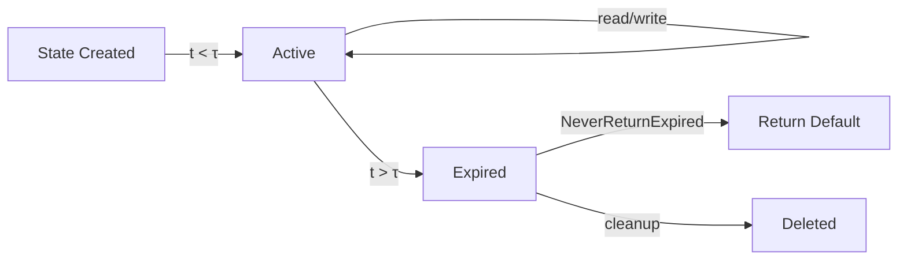

# Flink State TTL Best Practices

> **Stage**: Flink/02-core | **Prerequisites**: [Checkpoint Deep Dive](./flink-checkpoint-mechanism-deep-dive.md) | **Formal Level**: L4-L5
>
> State lifecycle management: TTL configuration, update types, visibility, and cleanup strategies.

---

## 1. Definitions

**Def-F-02-42: State TTL**

Maximum duration a state entry remains valid:

$$
\text{TTL}(s) = \{ \tau \mid s \text{ is valid at time } t \iff t - t_c \leq \tau \}
$$

**Def-F-02-43: TTL Update Type**

| Type | Symbol | Behavior |
|------|--------|----------|
| OnCreateAndWrite | $U_{CW}$ | Update $t_{last}$ on write/create |
| OnReadAndWrite | $U_{RW}$ | Update $t_{last}$ on read/write |
| Disabled | $U_{\emptyset}$ | No TTL update |

**Def-F-02-44: State Visibility**

$$
V(s) = \begin{cases} \text{NeverReturnExpired} & s \in S_{exp} \Rightarrow \text{read}(s) = \bot \\ \text{ReturnExpiredIfNotCleanedUp} & s \in S_{exp} \land \neg\text{cleaned}(s) \Rightarrow \text{read}(s) = v \end{cases}
$$

**Def-F-02-45: Cleanup Strategy**

| Strategy | Symbol | Backend | Trigger |
|----------|--------|---------|---------|
| Full Snapshot | $C_{FS}$ | Heap, RocksDB | Checkpoint completion |
| Incremental | $C_{INC}$ | Heap | State access |
| RocksDB Compaction | $C_{COMP}$ | RocksDB | Compaction |

---

## 2. Properties

**Lemma-F-02-17: Expired State Monotonicity**

Expired state set $S_{exp}(t)$ is monotonically non-decreasing:

$$
\forall t_1 < t_2, \quad S_{exp}(t_1) \subseteq S_{exp}(t_2)
$$

**Lemma-F-02-18: Cleanup Timeliness Ordering**

$$
C_{INC} \prec C_{COMP} \prec C_{FS}
$$

---

## 3. Relations

- **with State Backend**: Cleanup strategy depends on backend type.
- **with Checkpoint**: Full snapshot cleanup occurs during checkpoint.

---

## 4. Argumentation

**TTL Configuration Guidelines**:

| State Type | TTL | Update Type | Visibility |
|------------|-----|-------------|------------|
| User session | 24h | OnReadAndWrite | NeverReturnExpired |
| Temporary cache | 1h | OnCreateAndWrite | ReturnExpiredIfNotCleanedUp |
| Aggregated metrics | 7d | OnCreateAndWrite | NeverReturnExpired |

---

## 5. Engineering Argument

**State Size Bound with TTL**: With TTL $\tau$ and arrival rate $\lambda$, steady-state size is bounded by $\lambda \cdot \tau$ (assuming no cleanup delays).

---

## 6. Examples

```java
// TTL configuration
StateTtlConfig ttlConfig = StateTtlConfig
    .newBuilder(Time.hours(24))
    .setUpdateType(OnCreateAndWrite)
    .setStateVisibility(NeverReturnExpired)
    .cleanupFullSnapshot()
    .build();

ValueStateDescriptor<MyState> descriptor =
    new ValueStateDescriptor<>("myState", MyState.class);
descriptor.enableTimeToLive(ttlConfig);
```

---

## 7. Visualizations

**TTL Lifecycle**:



---

## 8. References
