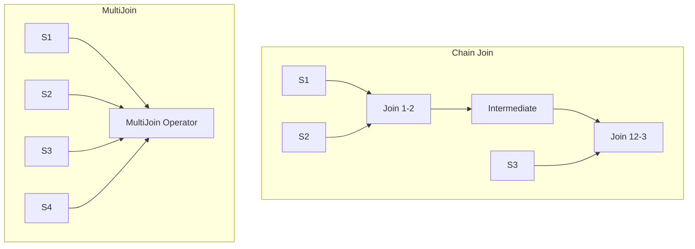

# Flink StreamingMultiJoinOperator: Zero-Intermediate-State Multi-Way Join

> **Stage**: Flink/02-core | **Prerequisites**: [Delta Join](./flink-delta-join-deep-dive.md) | **Formal Level**: L4
>
> **Flink Version**: 2.1.0+ (Experimental), 2.2.0+ (Optimized)
>
> Multi-way stream join with zero intermediate state, eliminating state explosion from chained binary joins.

---

## 1. Definitions

**Def-F-02-70: StreamingMultiJoinOperator**

Flink 2.1 experimental operator that transforms chained binary joins into single-operator multi-stream协同处理:

$$
\mathcal{M}(S_1, S_2, \ldots, S_n, \Theta) = \{(k, (v_1, v_2, \ldots, v_n), t_{max}) \mid \forall i: (k, v_i, t_i) \in S_i \land \theta_i(k, t_1, \ldots, t_n)\}
$$

**Def-F-02-71: Zero Intermediate State**

For $n$-way join, the operator stores only $n$ original input streams, no $S_i \bowtie S_j$ intermediate results:

$$
\text{State}(\mathcal{M}) = \bigcup_{i=1}^{n} \text{State}(S_i)
$$

$$
\forall i, j \in [1, n], i \neq j: \nexists M_{ij} \subseteq \text{State}(\mathcal{M}) : M_{ij} = S_i \bowtie_{\theta} S_j
$$

---

## 2. Properties

**Lemma-F-02-15: State Reduction**

For $n$-way join with state size $|S_i|$ per stream, zero-intermediate-state reduces total state from $O(n^2 \cdot |S|)$ to $O(n \cdot |S|)$.

**Lemma-F-02-16: Common Join Key Requirement**

All input streams must share at least one common join key for optimizer application.

---

## 3. Relations

- **with Delta Join**: Both optimize join state, but MultiJoin eliminates intermediate state entirely.
- **with SQL Optimizer**: Activated by `table.optimizer.multi-join.enabled`.

---

## 4. Argumentation

**Traditional Chain Join vs MultiJoin**:

| Aspect | Chain Join | MultiJoin |
|--------|-----------|-----------|
| State | $O(n^2 \cdot |S|)$ | $O(n \cdot |S|)$ |
| Latency | Cumulative | Single operator |
| Recovery | Multi-step | Single snapshot |

---

## 5. Engineering Argument

**State Reduction Proof**: For 4-way join with 1GB state per stream, chain join requires $4 \times 1GB + 3 \times \text{intermediate} \approx 10GB$. MultiJoin requires only $4 \times 1GB = 4GB$.

---

## 6. Examples

```sql
-- MultiJoin enabled in Flink SQL
SET table.optimizer.multi-join.enabled = true;

SELECT o.order_id, c.name, p.title, s.status
FROM Orders o
JOIN Customers c ON o.customer_id = c.id
JOIN Products p ON o.product_id = p.id
JOIN Shipments s ON o.order_id = s.order_id;
```

---

## 7. Visualizations

**MultiJoin Architecture**:



---

## 8. References
