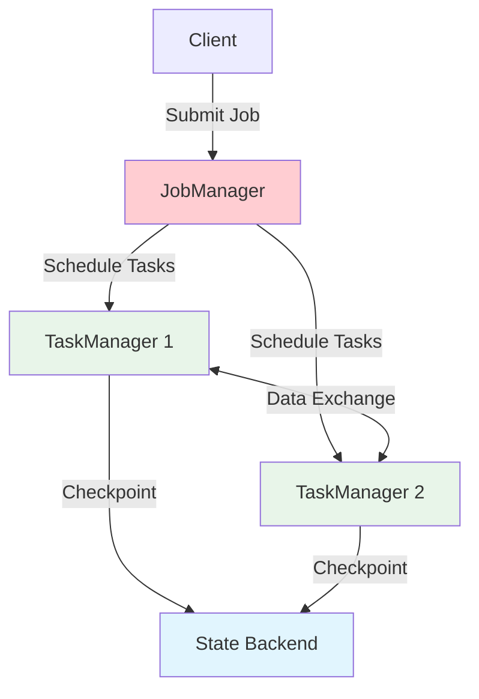

# Flink System Architecture

> **Stage**: Flink/01-concepts | **Prerequisites**: [Flink System Architecture Deep Dive](flink-system-architecture-deep-dive.md) | **Formalization Level**: L4
> **Translation Date**: 2026-04-21

## Abstract

This document provides a formal analysis of Flink's system architecture components: JobManager, TaskManager, Network Stack, and State Backend. Each component is defined with formal semantics and related to the broader Dataflow model.

---

## 1. Definitions

### Def-F-01-01: JobManager (JM)

The **JobManager** is Flink's control-plane component, responsible for scheduling, coordination, and lifecycle management.

**Formal definition**: Let $JM = (S, C, D)$ where:

- $S$: Scheduler, maps logical execution graph to physical execution graph and assigns tasks to TaskManagers
- $C$: Coordinators, including CheckpointCoordinator, ResourceManager, etc.
- $D$: Scheduling decision function $D: \text{DAG} \times \text{ResourcePool} \to \text{DeploymentPlan}$

**Intuition**: JobManager is the "brain" of the distributed system. It receives user jobs, analyzes dataflow graphs, decides task placement, and continuously monitors execution.

### Def-F-01-02: TaskManager (TM)

The **TaskManager** is Flink's worker node, executing data processing tasks and maintaining local state.

**Formal definition**: Let $TM_i = (T_i, M_i, K_i, N_i)$ where:

- $T_i$: Task slot set, $|T_i|$ is the parallelism capacity of this TM
- $M_i$: Managed memory for batch sorting, hash tables, and RocksDB cache
- $K_i$: JVM heap memory for user objects, network buffers, and Flink framework objects
- $N_i$: Network I/O thread pool for cross-TM data transfer

### Def-F-01-03: Network Stack

The **Network Stack** handles data exchange, serialization/deserialization, and flow control.

**Formal definition**: Let $NS = (B, Q, Ser, Des, BP)$ where:

- $B$: Network buffer pool
- $Q$: Credit-based flow control queues
- $Ser$: Serializer collection supporting multiple type strategies
- $Des$: Deserializer collection
- $BP$: Backpressure mechanism $BP: \text{QueueFillLevel} \to \text{SourceRateAdjustment}$

### Def-F-01-04: State Backend

The **State Backend** is the persistence abstraction for operator state storage, snapshots, and recovery.

**Formal definition**: Let $SB = (Store, Snap, Restore)$ where:

- $Store: (Key, Value) \to \text{PersistentStorage}$: key-value state storage
- $Snap: \text{State} \times \text{CheckpointID} \to \text{SnapshotHandle}$: asynchronous snapshot
- $Restore: \text{SnapshotHandle} \to \text{State}$: state recovery

---

## 2. Properties

### Prop-F-01-01: JobManager Single Point of Responsibility

For any job $j$, there exists exactly one JobManager instance responsible for its scheduling decisions at any time (with HA failover, this is the active leader).

### Prop-F-01-02: Task Slot Exclusivity

Each task slot $t \in T_i$ executes at most one task vertex at a time:

$$\forall t \in T_i: |\text{AssignedTasks}(t)| \leq 1$$

### Prop-F-01-03: Network Buffer Boundedness

The network buffer pool $B$ has a fixed maximum size:

$$|B| \leq B_{max} = f(\text{TM memory}, \text{buffer size})$$

This boundedness is the foundation of Flink's backpressure mechanism.

---

## 3. Relations

### Relation 1: JM-TM and Master-Worker Pattern

The JM-TM relationship instantiates the classic Master-Worker pattern:
- JM = master (coordination, scheduling)
- TM = worker (execution, local state)
- Heartbeat = liveness detection

### Relation 2: Network Stack and TCP Flow Control

Flink's credit-based flow control extends TCP's sliding window:
- TCP: byte-level flow control
- Flink: buffer-level flow control with application-aware credits

### Relation 3: State Backend and CAP Theorem

State backend choice reflects CAP trade-offs:
- **MemoryStateBackend**: CP (fast, but volatile)
- **FsStateBackend**: AP (persistent, but slower)
- **RocksDBStateBackend**: Tunable C/A with spill-to-disk

---

## 4. Architecture Composition

### 4.1 Component Interaction



### 4.2 Memory Architecture

```
TaskManager JVM Heap
├── Framework Memory (Flink internals)
├── Network Buffers (fixed, off-heap)
├── Managed Memory (off-heap, batch + RocksDB)
└── JVM Heap (user objects, JVM overhead)
```

---

## 5. Engineering Implications

### 5.1 Slot Sharing

Flink allows **slot sharing**: subtasks from the same pipeline can share a slot if they are not connected by a shuffle:

```java
// Slot sharing group (default: all operators in one group)
operator.slotSharingGroup("group1");
```

Benefits: Reduced inter-TM communication, better resource utilization.

### 5.2 Backpressure Propagation

When a downstream operator is slow:
1. Its input buffers fill up
2. Credit stops being sent upstream
3. Upstream stops producing
4. Propagation reaches source, reducing ingestion rate

This is a **closed-loop control system** with the network buffer as the actuator.

---

## 6. References

[^1]: Apache Flink Documentation, "Configuration", 2025. https://nightlies.apache.org/flink/flink-docs-stable/docs/deployment/config/
[^2]: Apache Flink Documentation, "Memory Configuration", 2025.
[^3]: F. Hueske et al., "Stream Processing with Apache Flink", O'Reilly, 2019.
[^4]: M. Kleppmann, "Designing Data-Intensive Applications", O'Reilly, 2017.
