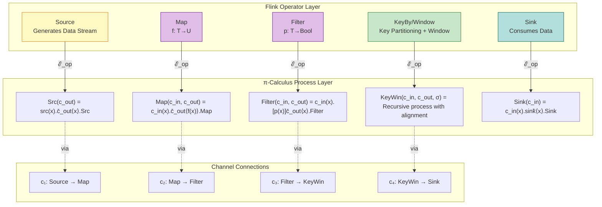
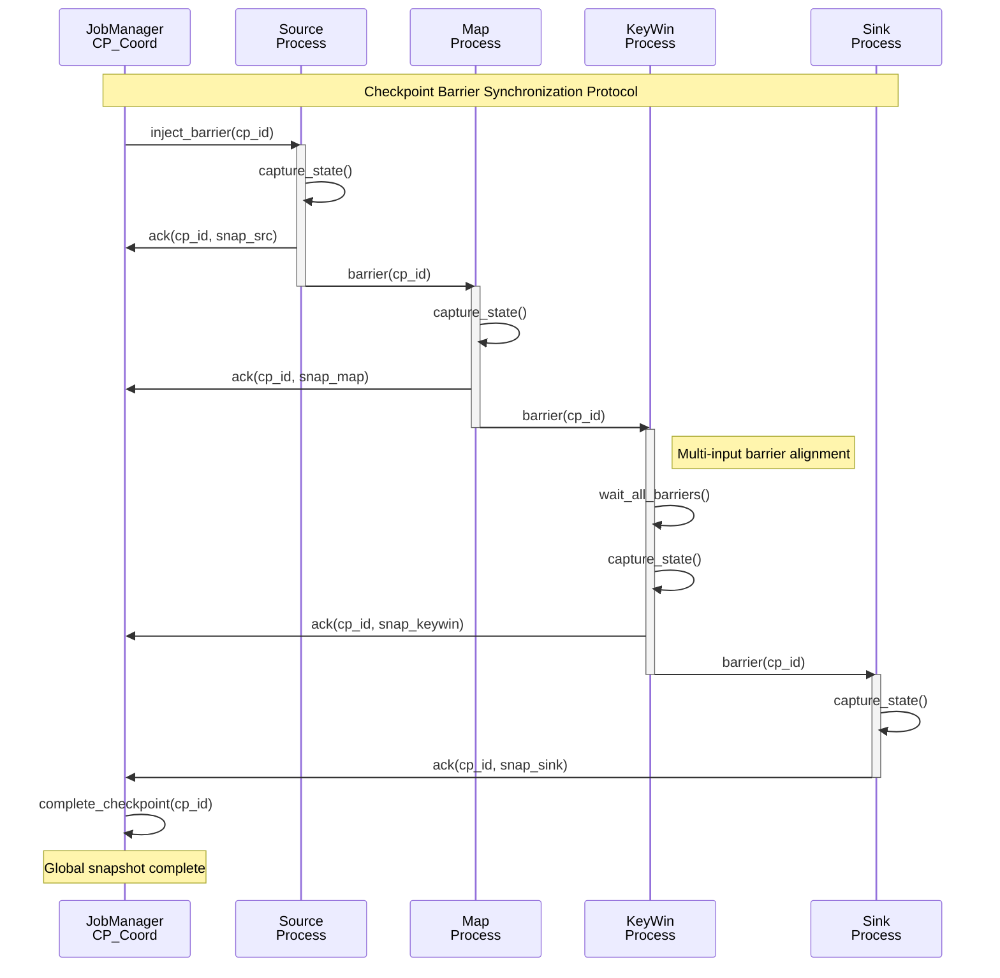
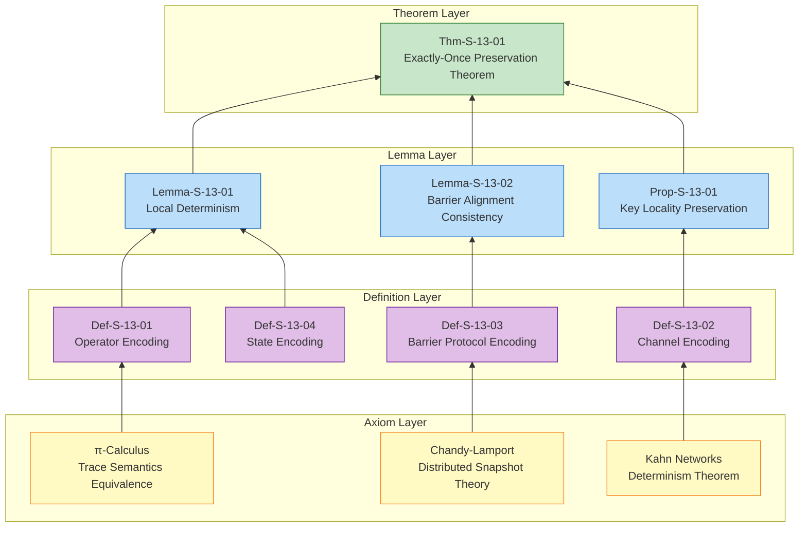

# Flink-to-Process Calculus Encoding

> Stage: Struct/03-relationships | Prerequisites: [01.04-dataflow-model-formalization.md](../01-foundation/01.04-dataflow-model-formalization.md), [01.02-process-calculus-primer.md](../01-foundation/01.02-process-calculus-primer.md) | Formalization Level: L5

---

## Table of Contents

- [Flink-to-Process Calculus Encoding](#flink-to-process-calculus-encoding)
  - [Table of Contents](#table-of-contents)
  - [1. Definitions](#1-definitions)
    - [Def-S-13-01 (Encoding of Flink Operators to π-Calculus Processes)](#def-s-13-01-encoding-of-flink-operators-to-pi-calculus-processes)
    - [Def-S-13-02 (Encoding of Dataflow Edges to π-Calculus Channels)](#def-s-13-02-encoding-of-dataflow-edges-to-pi-calculus-channels)
    - [Def-S-13-03 (Encoding of Checkpoint Mechanism to Barrier Synchronization Protocol)](#def-s-13-03-encoding-of-checkpoint-mechanism-to-barrier-synchronization-protocol)
    - [Def-S-13-04 (Encoding of Stateful Operators to Processes with State)](#def-s-13-04-encoding-of-stateful-operators-to-processes-with-state)
  - [2. Properties](#2-properties)
    - [Lemma-S-13-01 (Operator Encoding Preserves Local Determinism)](#lemma-s-13-01-operator-encoding-preserves-local-determinism)
    - [Lemma-S-13-02 (Barrier Alignment Guarantees Snapshot Consistency)](#lemma-s-13-02-barrier-alignment-guarantees-snapshot-consistency)
    - [Prop-S-13-01 (Partitioning Strategy Preserves Key Locality)](#prop-s-13-01-partitioning-strategy-preserves-key-locality)
  - [3. Relations](#3-relations)
    - [Relation 1: Flink Dataflow Graph `↦` π-Calculus Process Network](#relation-1-flink-dataflow-graph--pi-calculus-process-network)
    - [Relation 2: Checkpoint Barrier Protocol `≈` Chandy-Lamport Snapshot Algorithm](#relation-2-checkpoint-barrier-protocol--chandy-lamport-snapshot-algorithm)
    - [Relation 3: Flink Exactly-Once `↦` π-Calculus Idempotent Process Composition](#relation-3-flink-exactly-once--pi-calculus-idempotent-process-composition)
  - [4. Argumentation](#4-argumentation)
    - [4.1 Encoding Completeness Analysis](#41-encoding-completeness-analysis)
    - [4.2 Correctness Boundary of Exactly-Once Encoding](#42-correctness-boundary-of-exactly-once-encoding)
  - [5. Proofs](#5-proofs)
    - [Thm-S-13-01 (Exactly-Once Preservation Theorem for Flink Dataflow to π-Calculus)](#thm-s-13-01-exactly-once-preservation-theorem-for-flink-dataflow-to-pi-calculus)
  - [6. Examples](#6-examples)
    - [Example 6.1: π-Calculus Encoding of WordCount](#example-61-pi-calculus-encoding-of-wordcount)
    - [Counterexample 6.1: Non-Idempotent State Causes Exactly-Once Failure](#counterexample-61-non-idempotent-state-causes-exactly-once-failure)
    - [Counterexample 6.2: Barrier Alignment Timeout Causes Inconsistent Snapshot](#counterexample-62-barrier-alignment-timeout-causes-inconsistent-snapshot)
  - [7. Visualizations](#7-visualizations)
    - [7.1 Operator-to-Process Mapping Diagram](#71-operator-to-process-mapping-diagram)
    - [7.2 Checkpoint Barrier Protocol Flow Diagram](#72-checkpoint-barrier-protocol-flow-diagram)
    - [7.3 Exactly-Once Preservation Proof Tree](#73-exactly-once-preservation-proof-tree)
  - [8. References](#8-references)

## 1. Definitions

This section establishes a rigorous encoding framework from the Apache Flink Dataflow model to π-calculus. This encoding maps Flink's execution semantics to the formal domain of process calculus, providing a theoretical foundation for the formal verification of stream processing systems.

### Def-S-13-01 (Encoding of Flink Operators to π-Calculus Processes)

The encoding function $\mathcal{E}_{op}$ from **Flink operators** to **π-calculus processes** is defined as:

$$
\mathcal{E}_{op}: \text{FlinkOperator} \rightarrow \pi\text{-Process}
$$

The specific encoding rules are as follows:

| Flink Operator | π-Calculus Process Encoding | Semantic Description |
|-----------|---------------|---------|
| **Source**$(s)$ | $S_{src}(c_{out}) = \overline{s}\langle x \rangle.S_{src}(c_{out}) \mid c_{out}(x).S_{src}(c_{out})$ | Read from external source $s$ and output to channel $c_{out}$ |
| **Map**$(f)$ | $M_{f}(c_{in}, c_{out}) = c_{in}(x).\overline{c_{out}}\langle f(x) \rangle.M_{f}(c_{in}, c_{out})$ | Receive input, apply function $f$, output result |
| **Filter**$(p)$ | $F_{p}(c_{in}, c_{out}) = c_{in}(x).[p(x)]\overline{c_{out}}\langle x \rangle.F_{p}(c_{in}, c_{out})$ | Conditional guard: output only when $p(x)$ is true |
| **FlatMap**$(f)$ | $FM_{f}(c_{in}, c_{out}) = c_{in}(x).\prod_{y \in f(x)} \overline{c_{out}}\langle y \rangle.FM_{f}(c_{in}, c_{out})$ | One-to-many expansion, output all results in parallel |
| **Sink** | $S_{sink}(c_{in}) = c_{in}(x).\overline{sink}\langle x \rangle.S_{sink}(c_{in})$ | Consume input and persist to external storage |

Where:

- $c_{in}, c_{out}$ are channel names in π-calculus
- $f$ is a pure function satisfying $\forall x. f(x)$ deterministic computation
- $[p(x)]P$ denotes a guarded process: execute $P$ only when predicate $p(x)$ holds

**Intuitive Explanation**: Flink operators are the transformation units of data streams. When encoded as π-calculus processes, data streams become message passing over channels, operator state becomes recursive definitions of processes, and data dependencies between operators become communication topologies between processes.

**Motivation for Definition**: By mapping Flink operators to π-calculus processes, we can leverage mature theoretical tools from process calculus (such as bisimulation, type systems) to analyze properties of Flink programs, including deadlock freedom, determinism, and consistency.

---

### Def-S-13-02 (Encoding of Dataflow Edges to π-Calculus Channels)

The encoding function $\mathcal{E}_{edge}$ from **Flink Dataflow edges** to **π-calculus channels** is defined as:

$$
\mathcal{E}_{edge}: E \rightarrow (\nu \vec{c})\text{.ChannelSet}
$$

For edge $e = (u, v) \in E$, where the parallelism of $u$ is $p_u$ and the parallelism of $v$ is $p_v$, the channel encoding is:

$$
\mathcal{E}_{edge}(e) = (\nu c_{e,1})(\nu c_{e,2})\dots(\nu c_{e,k}).\{c_{e,1}, \dots, c_{e,k}\}
$$

Where the number of channels $k$ is determined by the partitioning strategy:

| Partitioning Strategy | Channel Structure | Formal Definition |
|---------|---------|-----------|
| **Forward** | $k = p_u = p_v$ | $c_{e,i}$ connects $u_i$ to $v_i$ (one-to-one) |
| **Shuffle** | $k = p_u$ | Each upstream instance randomly selects a downstream channel |
| **Hash**$(\kappa)$ | $k = p_u$ | $u_i$ selects output channel based on $hash(\kappa(x)) \bmod p_v$ |
| **Broadcast** | $k = p_u \times p_v$ | Each upstream instance broadcasts to all downstream instances |

**Channel Semantic Constraint**:

$$
\text{FIFO}(c) \triangleq \forall m_1, m_2. \text{send}(m_1) \prec \text{send}(m_2) \Rightarrow \text{recv}(m_1) \prec \text{recv}(m_2)
$$

**Intuitive Explanation**: Flink Dataflow edges are data channels between operators, encoded in π-calculus as named communication channels. The partitioning strategy determines the connection topology of the channels—Hash partitioning ensures that records with the same key are routed to the same channel, which is key to state consistency.

**Motivation for Definition**: Explicitly modeling channel structure enables formal analysis of data routing, load balancing, and state locality. The FIFO constraint is the foundation of Kahn network determinism and a necessary prerequisite for Flink's Exactly-Once semantics.

---

### Def-S-13-03 (Encoding of Checkpoint Mechanism to Barrier Synchronization Protocol)

The encoding from **Flink Checkpoint** to **π-calculus barrier synchronization protocol** is defined as:

$$
\mathcal{E}_{chkpt}: \text{Checkpoint} \rightarrow \pi\text{-BarrierProtocol}
$$

**Barrier Message Types**:

$$
\text{Msg} ::= \text{data}\langle v \rangle \mid \text{barrier}\langle cp\_id \rangle
$$

**Operator Process with Barrier** (single-input case):

$$
\begin{aligned}
Op_{barrier}(c_{in}, c_{out}, cp\_coord) = &\ c_{in}(m).\text{CASE } m \text{ OF} \\
&\ \text{data}\langle v \rangle \rightarrow \overline{c_{out}}\langle f(v) \rangle.Op_{barrier}(c_{in}, c_{out}, cp\_coord) \\
&\ \mid \text{barrier}\langle id \rangle \rightarrow (\nu snap)(\\
&\quad snap \leftarrow \text{CAPTURE\_STATE}(); \\
&\quad \overline{cp\_coord}\langle ack, id, snap \rangle; \\
&\quad \overline{c_{out}}\langle \text{barrier}\langle id \rangle \rangle; \\
&\quad Op_{barrier}(c_{in}, c_{out}, cp\_coord) \\
&\ )
\end{aligned}
$$

**Barrier Alignment for Multi-Input Operators** (two-input example):

$$
\begin{aligned}
AlignOp(c_1, c_2, c_{out}, cp\_coord) = &\ AlignLoop(\text{false}, \text{false}, \emptyset, \emptyset) \\
AlignLoop(b_1, b_2, buf_1, buf_2) = &\ [\neg b_1]c_1(m).\text{HANDLE}_1(m) \\
&\ + [\neg b_2]c_2(m).\text{HANDLE}_2(m) \\
&\ + [b_1 \land b_2]SnapAndResume() \\
\text{HANDLE}_1(\text{data}\langle v \rangle) = &\ AlignLoop(b_1, b_2, buf_1 \cup \{v\}, buf_2) \\
\text{HANDLE}_1(\text{barrier}\langle id \rangle) = &\ AlignLoop(\text{true}, b_2, buf_1, buf_2) \\
SnapAndResume() = &\ (\nu snap)(snap \leftarrow \text{CAPTURE\_STATE}(); \\
&\quad \overline{cp\_coord}\langle ack, snap \rangle; \\
&\quad \overline{c_{out}}\langle \text{barrier} \rangle; \\
&\quad \text{FLUSH}(buf_1, buf_2); \\
&\quad AlignLoop(\text{false}, \text{false}, \emptyset, \emptyset))
\end{aligned}
$$

**Intuitive Explanation**: Checkpoint Barrier is encoded as a special control message. When an operator receives a barrier, it suspends processing subsequent data (buffering it), captures the current state, acknowledges the checkpoint, and then broadcasts the barrier downstream. Multi-input operators must wait for barriers from all input streams to arrive before taking a snapshot—this is the core of barrier alignment.

**Motivation for Definition**: Encoding the Checkpoint mechanism as a barrier synchronization protocol allows analysis of fault-tolerance semantics using tools from process calculus. The encoding of barrier alignment directly corresponds to the implementation mechanism of the Chandy-Lamport distributed snapshot algorithm.

---

### Def-S-13-04 (Encoding of Stateful Operators to Processes with State)

The encoding from **Flink stateful operators** to **π-processes with persistent state** is defined as:

$$
\mathcal{E}_{state}: \text{StatefulOperator} \rightarrow \pi\text{-Process with State}
$$

**State Type Encoding**:

| Flink State Type | π-Calculus State Representation | Operational Semantics |
|--------------|---------------|---------|
| **ValueState**$\langle T \rangle$ | $\sigma: \text{Name} \rightarrow T$ | Atomic read/write: $\sigma(x) := v$ |
| **ListState**$\langle T \rangle$ | $\sigma: \text{Name} \rightarrow T^*$ | Append: $\sigma(x) := \sigma(x) \cdot [v]$ |
| **MapState**$\langle K, V \rangle$ | $\sigma: \text{Name} \rightarrow (K \rightarrow V)$ | Key-value update: $\sigma(x)[k] := v$ |

**Encoding of Stateful KeyedProcessFunction**:

$$
\begin{aligned}
KPF(c_{in}, c_{out}, \sigma, key\_ext) = &\ c_{in}(v). \\
&\ \text{LET } k = key\_ext(v) \text{ IN} \\
&\ \text{LET } s = \sigma(k) \text{ IN} \\
&\ \text{LET } (s', outs) = process(v, s) \text{ IN} \\
&\ \sigma(k) := s'; \\
&\ \prod_{o \in outs} \overline{c_{out}}\langle o \rangle; \\
&\ KPF(c_{in}, c_{out}, \sigma, key\_ext)
\end{aligned}
$$

**Intuitive Explanation**: Flink state is abstracted as a named state mapping in π-calculus. KeyedState routes records to specific state slots through a key function, with each key corresponding to an independent state value. State updates are atomic, consistent with Flink's single-threaded execution model.

**Motivation for Definition**: State is the essential feature that distinguishes stream computing from pure functional data processing. Explicitly modeling state as internal storage of processes enables formal analysis of state consistency, fault recovery, and checkpoint semantics.

---

## 2. Properties

### Lemma-S-13-01 (Operator Encoding Preserves Local Determinism)

**Statement**: If a Flink operator $op$'s computation function $f_{compute}$ is a pure function (no external side effects, no non-deterministic input), then its π-calculus encoding $\mathcal{E}_{op}(op)$ produces a deterministic output history for a given input history.

**Proof**:

1. By Def-S-13-01, the operator encoding takes the form of a recursive input-process-output loop;
2. For Source and Sink, their behavior is determined by the external source/sink; assuming the external system is deterministic, the output is deterministic;
3. For Map/Filter/FlatMap, each step's output depends only on the current input and the pure function $f$ or $p$;
4. The determinism of pure functions guarantees: for the same input, the output must be the same;
5. By the structural congruence and reduction semantics of π-calculus, the process trace is uniquely determined;
6. Therefore, the operator encoding preserves local determinism. ∎

> **Inference [Model→Theory]**: The local determinism of operator encoding implies that after mapping a Flink program to π-calculus, it still preserves the core property of Kahn networks—the output history is independent of scheduling order.

---

### Lemma-S-13-02 (Barrier Alignment Guarantees Snapshot Consistency)

**Statement**: For the barrier alignment encoding of multi-input operators (Def-S-13-03), when the operator process performs a state snapshot, the snapshot does not contain the effects of any post-barrier data records.

**Proof**:

1. Let the operator have $n$ input streams, each stream $i$ having a barrier state flag $b_i$ (initially false);
2. The process $AlignLoop$ only receives messages from channel $c_i$ when $b_i = \text{false}$;
3. When $\text{barrier}\langle id \rangle$ is received, $b_i$ is set to true, and subsequent data from that channel is buffered in $buf_i$;
4. $SnapAndResume()$ is only executed when $\bigwedge_{i=1}^n b_i = \text{true}$;
5. At this point, all processed data comes from the pre-barrier portion of each stream;
6. All post-barrier data is in the buffers $buf_i$ and has not entered the state;
7. Therefore, the snapshot state does not contain the effects of any post-barrier records. ∎

> **Inference [Control→Data]**: The process encoding of barrier alignment guarantees the data-layer consistency of Checkpoint—the snapshot captures the complete processing state of all records before the barrier.

---

### Prop-S-13-01 (Partitioning Strategy Preserves Key Locality)

**Statement**: If a Flink program uses Hash partitioning strategy, then all records with the same key are routed to the same parallel instance, and in its π-calculus encoding these records are all transmitted through the same channel subset.

**Derivation**:

1. By Def-S-13-02, under Hash partitioning strategy, the routing of record $r$ is determined by $hash(\kappa(r)) \bmod p_v$;
2. For the same key $k$, $\kappa(r) = k$ is constant, so $hash(k) \bmod p_v$ is constant;
3. Let this value be $j$, then all records with key $k$ are transmitted through channel $c_{e,j}$;
4. In the π-calculus encoding, this means they all reach the same downstream process instance;
5. Therefore, key locality is preserved in the encoding. ∎

> **Inference [Execution→State]**: The preservation of key locality is a prerequisite for the consistency of stateful operators. Only by ensuring that records with the same key arrive at the same instance can state updates be deterministic.

---

## 3. Relations

### Relation 1: Flink Dataflow Graph `↦` π-Calculus Process Network

**Argumentation**:

- **Encoding Existence**: By Def-S-13-01 and Def-S-13-02, each operator in a Flink Dataflow graph can be encoded as a π-process, and each edge can be encoded as a channel set. The complete Dataflow graph is encoded as a parallel composition of process networks:
  $$
  \mathcal{E}_{df}(G) = (\nu \vec{c})(\prod_{v \in V} \mathcal{E}_{op}(v) \mid \prod_{e \in E} \mathcal{E}_{edge}(e))
  $$

- **Semantics Preservation**: Flink's FIFO channel assumption corresponds to ordered message passing over channels in π-calculus; Flink's deterministic semantics (same input produces same output) corresponds to trace equivalence of π-processes.

- **Separation Result**: Flink's event time semantics (Watermark, window triggering) require additional time processes to model, which pure π-calculus cannot directly express. Flink's Checkpoint state persistence requires extending π-calculus with state capture primitives.

---

### Relation 2: Checkpoint Barrier Protocol `≈` Chandy-Lamport Snapshot Algorithm

**Argumentation**:

- **Encoding Equivalence**: Flink's Checkpoint Barrier mechanism is an engineering implementation of the Chandy-Lamport distributed snapshot algorithm [^6]. In the π-calculus encoding:
  - Checkpoint Barrier corresponds to the "marker" message in Chandy-Lamport
  - Barrier alignment corresponds to waiting for markers to arrive on all input channels
  - State snapshot corresponds to recording the local state of the process when the marker arrives

- **Consistency Guarantee**: Both guarantee that the captured global state is consistent—there is no situation where a record has been processed downstream but not acknowledged upstream.

- **Engineering Differences**: Chandy-Lamport assumes infinite buffers, while Flink's barrier alignment needs to block and buffer post-barrier records, which is an implementation detail introduced by the finite buffer constraint.

---

### Relation 3: Flink Exactly-Once `↦` π-Calculus Idempotent Process Composition

**Argumentation**:

- **Encoding Existence**: Flink's Exactly-Once semantics can be encoded through the following π-calculus constructs:
  1. **Replayable Source**: Encoded as a process that can repeatedly send the same sequence;
  2. **Idempotent State Update**: Encoded as a state transition satisfying $f(f(s, r), r) = f(s, r)$;
  3. **Sink Transactional Commit**: Encoded as a two-phase commit protocol process.

- **End-to-End Consistency**: If and only if Source, Operator, and Sink all satisfy idempotency conditions, the output of the composed system satisfies Exactly-Once semantics.

---

## 4. Argumentation

### 4.1 Encoding Completeness Analysis

**Question**: Can the Flink Dataflow model be completely encoded into π-calculus?

**Analysis**:

The following features of Flink require extension or approximation in pure π-calculus:

1. **Time Semantics**: Watermark and event time windows require introducing time processes or discrete time steps. This can be modeled by adding a dedicated $\text{Timer}$ process:
   $$
   Timer(tick, wm) = tick().\overline{wm}\langle t+\delta \rangle.Timer(tick, wm)
   $$

2. **Infinite Streams**: Recursive processes in π-calculus can express infinite behavior, corresponding to Flink's unbounded streams.

3. **State Persistence**: Pure π-calculus has no built-in persistence semantics; it needs to be simulated through external storage processes.

**Conclusion**: Flink's core computational semantics can be encoded into π-calculus, but time semantics and persistence require domain-specific extensions.

---

### 4.2 Correctness Boundary of Exactly-Once Encoding

**Boundary Condition Discussion**:

The encoding of Exactly-Once semantics depends on the following prerequisites:

| Prerequisite | Violation Consequence | π-Calculus Manifestation |
|-----|---------|-----------|
| Source Replayable | Data loss | Process cannot reproduce the same message sequence |
| State Transition Idempotent | State inconsistency | Repeated application of input causes state drift |
| Sink Transactional Commit | Duplicate output | Process sends the same result to the outside multiple times |
| Barrier Alignment | Inconsistent snapshot | Snapshot contains partially processed records |

When any prerequisite is violated, the encoded π-process may exhibit non-Exactly-Once behavior (data loss or duplication).

---

## 5. Proofs

### Thm-S-13-01 (Exactly-Once Preservation Theorem for Flink Dataflow to π-Calculus)

**Statement**: A Flink Dataflow graph with Checkpoint mechanism can be encoded into a π-calculus process network supporting barrier synchronization, and this encoding preserves Exactly-Once state consistency.

Formal statement:

Let $G$ be a Flink Dataflow graph, and $\mathcal{E}(G)$ be its π-calculus encoding. If $G$ satisfies:

1. All operators' state transition functions satisfy associativity;
2. Hash partitioning is used to guarantee key locality;
3. Checkpoint interval is greater than end-to-end processing latency;

Then for any fault and recovery sequence, the trace semantics of $\mathcal{E}(G)$ satisfy:

$$
\text{Output}(\mathcal{E}(G)_{\text{recovered}}) = \text{Output}(\mathcal{E}(G)_{\text{failure-free}})
$$

That is, the output after recovery is the same as the output of failure-free continuous processing (as a multiset).

**Proof**:

**Step 1: Establish Encoding Structure**

By Def-S-13-01 through Def-S-13-04, the Flink Dataflow graph is encoded as a π-process network:

$$
\mathcal{E}(G) = (\nu \vec{c})(Src \mid Op_1 \mid \dots \mid Op_n \mid Sink \mid CP\_Coord)
$$

Where $CP\_Coord$ is the Checkpoint coordinator process.

**Step 2: Prove Barrier Alignment Consistency**

By Lemma-S-13-02, barrier alignment guarantees that at the snapshot moment:

- All pre-barrier records have been processed and reflected in the state
- All post-barrier records are in buffers and have not affected the state

This corresponds to the consistency condition of the Chandy-Lamport algorithm [^6].

**Step 3: Prove Fault Recovery Idempotency**

Let the fault occur between Checkpoint $C_k$ and $C_{k+1}$:

1. The system recovers state $S_k$ from $C_k$;
2. Source replays record set $R$ from the replay point;
3. By the associativity assumption, state transition satisfies:
   $$
   fold(\delta, S_k, R) = fold(\delta, S_k, \text{shuffle}(R))
   $$
4. Therefore, even if replay changes record order, the final state is the same;
5. Sink ensures output is not duplicated through transactional commit.

**Step 4: Compositionality Argument**

Topological induction on the Dataflow graph:

- **Base Case (Source Layer)**: The Checkpoint marker of the Source process records the replay position, and replay after recovery guarantees no data loss.

- **Inductive Hypothesis**: Assume that the output of the first $k$ layers of operators remains consistent after fault recovery.

- **Inductive Step (Layer $k+1$)**:
  - The input of layer $k+1$ operators comes from layer $k$;
  - By the inductive hypothesis, layer $k$ output is consistent;
  - By operator local determinism (Lemma-S-13-01), layer $k+1$ output is consistent.

**Step 5: Conclusion**

By induction, the output of all layers after fault recovery is consistent with the failure-free case. Combined with the transactional guarantee of Sink, end-to-end output satisfies Exactly-Once semantics. ∎

> **Inference [Theory→Implementation]**: This theorem proves that Flink's Checkpoint mechanism correctly implements Exactly-Once semantics in theory. Engineering implementations must ensure: barrier alignment, state persistence, Source replayability, and Sink transactional commit.

---

## 6. Examples

### Example 6.1: π-Calculus Encoding of WordCount

**Flink Program**:

```java

// [Pseudo-code snippet - not directly runnable] For illustrative purposes only
import org.apache.flink.streaming.api.datastream.DataStream;
import org.apache.flink.streaming.api.windowing.time.Time;

DataStream<String> text = env.socketTextStream("localhost", 9999);

DataStream<Tuple2<String, Integer>> wordCounts = text
    .flatMap(new Tokenizer())
    .keyBy(value -> value.f0)
    .window(TumblingEventTimeWindows.of(Time.seconds(5)))
    .aggregate(new CountAggregate());
```

**π-Calculus Encoding**:

```
-- Channel declarations
(ν c_src_map)(ν c_map_keyby)(ν c_keyby_agg)(ν c_agg_sink)
(ν cp_coord)(ν tick)(ν wm)

-- Source process
Src(c_src_map, src) = src(x).c_src_map<x>.Src(c_src_map, src)

-- FlatMap process
FlatMap(c_in, c_out) = c_in(line).
    (ν tmp)(split(line, tmp) | Distribute(tmp, c_out)) |
    FlatMap(c_in, c_out)

Distribute(tmp, c_out) = tmp(w).[w≠⊥]
    c_out<(w, 1)>.Distribute(tmp, c_out)

-- KeyBy/Window process (with Checkpoint alignment)
KeyWin(c_in, c_out, σ, tick, cp_coord) =
    AlignProc(c_in, c_out, σ, tick, cp_coord, false, [], [])

AlignProc(c_in, c_out, σ, tick, cp_coord, barrier_seen, buf, acc) =
    c_in(m).CASE m OF
        data<(w, cnt)> ->
            [¬barrier_seen]
                LET k = hash(w) IN
                LET new_acc = update(acc, k, cnt) IN
                AlignProc(..., new_acc)
        barrier<id> ->
            LET snap = σ(acc) IN
            cp_coord<ack, id, snap>.
            c_out<barrier<id]>.
            AlignProc(..., false, [], [])

-- System composition
System = (ν src)(ν sink)(
    Src(c_src_map, src) |
    FlatMap(c_src_map, c_map_keyby) |
    KeyWin(c_map_keyby, c_keyby_agg, σ, tick, cp_coord) |
    Agg(c_keyby_agg, c_agg_sink) |
    Sink(c_agg_sink, sink) |
    CP_Coord(cp_coord)
)
```

**Verified Properties**:

1. **Local Determinism**: The output of FlatMap and KeyWin processes depends only on the input history;
2. **Key Locality**: Records with the same word are transmitted through the same KeyWin channel;
3. **Checkpoint Consistency**: Barrier alignment guarantees the completeness of window state snapshots.

---

### Counterexample 6.1: Non-Idempotent State Causes Exactly-Once Failure

**Scenario**: Counter state update is $s := s + 1$ (satisfies associativity), but the output to Sink operation is "append to file" (non-idempotent).

**Flink Code**:

```java
// [Pseudo-code snippet - not directly runnable] For illustrative purposes only
// State update (idempotent)
countState.update(countState.value() + 1);

// Sink output (non-idempotent)
fileWriter.append(result);  // No transaction protection
```

**Fault Sequence**:

1. Checkpoint $C_k$ completes and is acknowledged;
2. Process record $r$, counter $s = 5$, output to file;
3. Fault occurs, Sink output is visible but Checkpoint is not acknowledged;
4. Recover from $C_k$, reprocess $r$, counter $s = 5$ (idempotent update), output to file again;
5. Result: the count for $r$ appears twice in the file.

**π-Calculus Manifestation**:

```
-- Non-idempotent Sink process
BadSink(c_in, file) = c_in(v).file<v>.BadSink(c_in, file)

-- After fault recovery, v is sent twice
Recovery = BadSink(c_in, file)  -- Continues from before fault
        | BadSink(c_in, file)  -- New instance after recovery
```

**Analysis**:

- **Violated Prerequisite**: Thm-S-13-01 requires Sink to support transactional commit.
- **Resulting Anomaly**: Even though state update is idempotent, duplicate output causes end-to-end Exactly-Once failure.
- **Conclusion**: Exactly-Once is an end-to-end property that requires joint guarantees from Source, Operator, and Sink.

---

### Counterexample 6.2: Barrier Alignment Timeout Causes Inconsistent Snapshot

**Scenario**: Multi-input Join operator, one input stream delays causing barrier alignment timeout.

**Execution Sequence**:

```
Timeline:
T1: Checkpoint triggered, Barrier sent to all Sources
T2: Stream A's Barrier arrives at Join
T3: Stream B's data continues to arrive (Barrier delayed)
...
T10: Alignment timeout, Join takes snapshot without receiving Stream B's Barrier
T11: Stream B's Barrier arrives (late)
```

**Consequence**:

The snapshot contains some post-barrier records from Stream B, resulting in an inconsistent state—these records will be replayed after fault recovery, causing duplicate processing.

**π-Calculus Manifestation**:

```
-- Incorrect implementation (no alignment waiting)
BadAlign(c1, c2, c_out, cp_coord) =
    c1(barrier).SNAP(c2 buffer may contain post-barrier data)  -- Wrong!

-- Correct implementation (waits for alignment)
GoodAlign(c1, c2, c_out, cp_coord) =
    c1(barrier).WAIT_FOR_C2()  -- Blocks until c2's barrier arrives
```

---

## 7. Visualizations

### 7.1 Operator-to-Process Mapping Diagram



**Diagram Description**: This diagram illustrates the encoding mapping from Flink operators to π-calculus processes. Each operator is encoded as a recursive process, and data streams are encoded as message passing over channels. Yellow represents data sources, purple represents stateless transformations, green represents stateful windows, and cyan represents data sinks.

---

### 7.2 Checkpoint Barrier Protocol Flow Diagram



**Diagram Description**: This diagram illustrates the execution flow of the Flink Checkpoint barrier protocol in the π-calculus encoding. Each operator process captures state after receiving the barrier, acknowledges the checkpoint, and then broadcasts the barrier downstream. Multi-input operators (KeyWin) must wait for barriers from all input streams to arrive before taking a snapshot.

---

### 7.3 Exactly-Once Preservation Proof Tree



**Diagram Description**: This diagram illustrates the complete proof chain from axioms to theorems. The bottom yellow nodes are theoretical foundations (Chandy-Lamport, π-calculus, Kahn networks); the middle purple nodes are the formal definitions in this document; the blue nodes are auxiliary lemmas; the top green node is the Exactly-Once preservation theorem.

---

## 8. References

[^6]: K. M. Chandy and L. Lamport, "Distributed Snapshots: Determining Global States of Distributed Systems," *ACM Trans. Comput. Syst.*, 3(1), 1985.

---

*Document version: v1.0 | Translation date: 2026-04-24*
