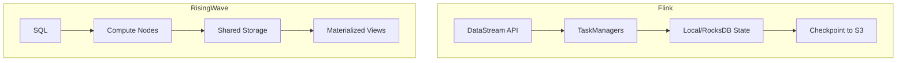

# Flink vs RisingWave Deep Comparison

> **Stage**: Knowledge/04-technology-selection | **Prerequisites**: [Engine Selection Guide](engine-selection-guide.md) | **Formal Level**: L4-L5
>
> **Version**: 2026.04
>
> Architecture, state management, performance benchmarks, and use case mapping.

---

## 1. Definitions

**Def-K-04-10: Stream Processing Engine Architecture Model**

**Def-K-04-11: State Storage Architecture Classification**

| Type | State Location | Examples |
|------|---------------|----------|
| Embedded | Task local | Flink RocksDB |
| Disaggregated | Remote storage | Flink ForSt |
| Shared | Centralized DB | RisingWave |

**Def-K-04-12: Streaming Database**

Database system with native stream processing capabilities, providing materialized views over streaming data.

---

## 2. Properties

**Lemma-K-04-03: Storage Separation and Recovery Time**

Disaggregated storage enables faster recovery because state does not need to be migrated.

**Lemma-K-04-04: State Location and Scalability Trade-off**

Local state scales with compute; shared state requires separate scaling strategy.

---

## 3. Relations

- **Architecture Paradigm**: Flink = compute-centric; RisingWave = storage-centric.
- **State Management**: Flink manages state explicitly; RisingWave uses shared relational state.

---

## 4. Argumentation

**Design Philosophy Comparison**:

| Aspect | Flink | RisingWave |
|--------|-------|------------|
| Primary API | DataStream / SQL | SQL-first |
| State | Explicit, managed by user | Implicit, managed by system |
| Deployment | Cluster-based | Cloud-native / serverless |
| Best for | Complex streaming logic | Real-time analytics, dashboards |

**Nexmark Benchmark**:

| Query | Flink | RisingWave |
|-------|-------|------------|
| Q0 (Passthrough) | High | High |
| Q5 (Windowed join) | High | Medium |
| Q8 (Complex join) | Medium | High |

---

## 5. Engineering Argument

**Thm-K-04-01 (Streaming DB vs Stream Engine Selection)**: Choose RisingWave when the primary need is real-time SQL analytics over streams; choose Flink when complex event processing, custom state logic, or end-to-end exactly-once guarantees are required.

---

## 6. Examples

**Real-Time Data Warehouse**:

```sql
-- RisingWave: create materialized view directly
CREATE MATERIALIZED VIEW mv_sales AS
SELECT product_id, SUM(amount) as total
FROM sales_stream
GROUP BY product_id;

-- Flink: explicit sink to serving layer
CREATE TABLE sales_summary (
  product_id INT,
  total_amount DECIMAL(10,2)
) WITH ('connector' = 'jdbc', ...);

INSERT INTO sales_summary
SELECT product_id, SUM(amount)
FROM sales
GROUP BY product_id;
```

---

## 7. Visualizations

**Architecture Comparison**:



---

## 8. References
