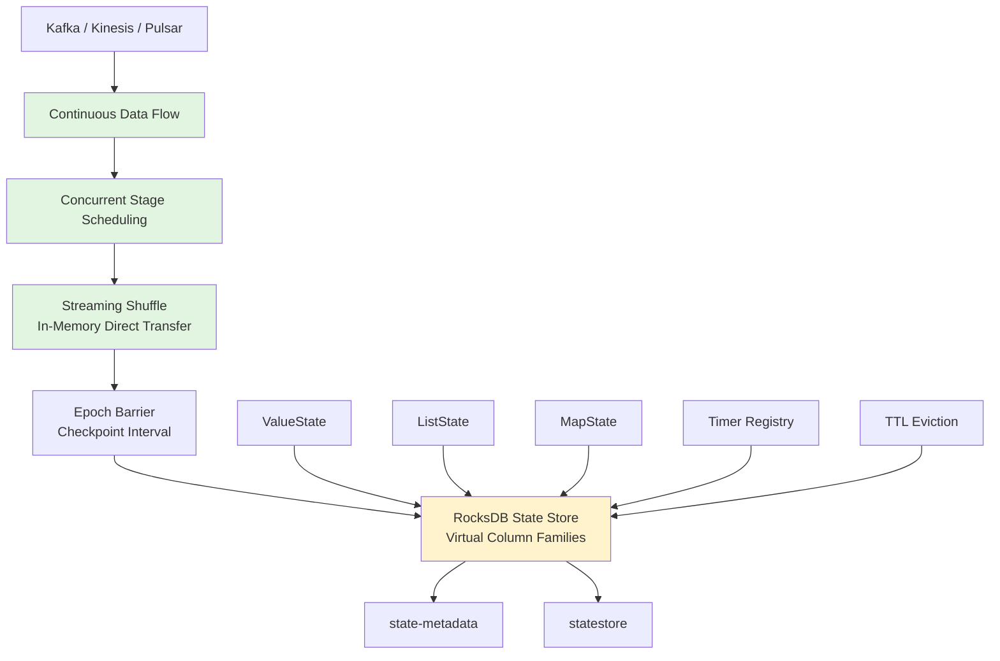
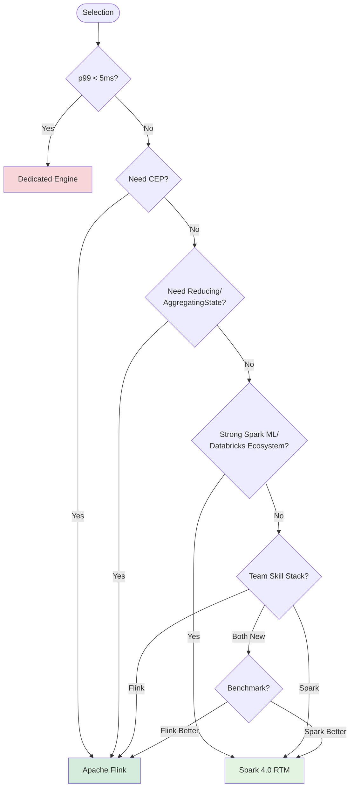
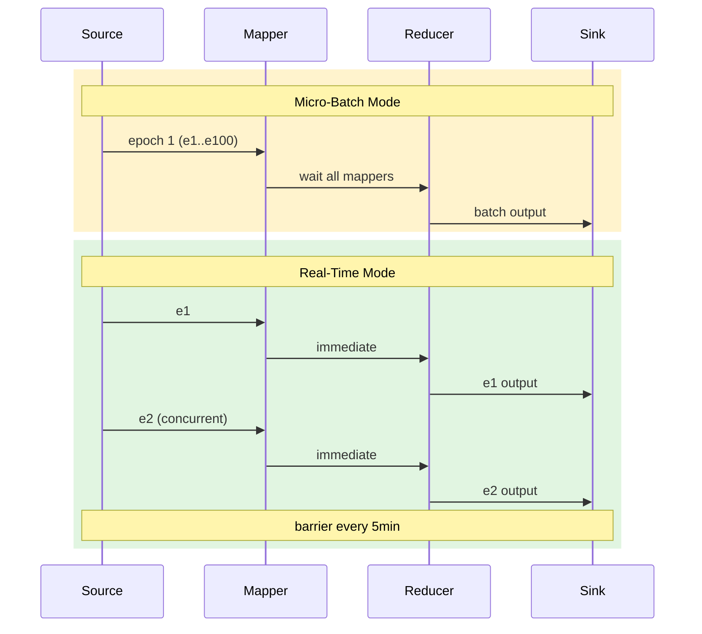

# Apache Spark 4.0 Real-Time Mode (RTM) Deep Dive

> Stage: Flink/07-roadmap | Prerequisites: [Flink/02-core/flink-exactly-once-semantics.md](../../Flink/02-core/), [Knowledge/05-mapping-guides/stream-processing-engine-comparison.md](../../Knowledge/05-mapping-guides/) | Formalization Level: L3-L4

## 1. Concept Definitions (Definitions)

### Def-F-RTM-01: Real-Time Mode (RTM) Execution Model

**Definition**: Apache Spark Real-Time Mode is a **hybrid execution model** (混合执行模型) that builds upon the fault-tolerance advantages of micro-batch architecture while enabling Spark Structured Streaming to process unbounded data streams at event-level granularity through three mechanisms: **continuous data flow** (连续数据流), **concurrent stage scheduling** (并发阶段调度), and **streaming shuffle** (流式 Shuffle).

Formally, let the input event stream be $E = \{e_1, e_2, \dots\}$, and RTM defines the processing function family $\mathcal{F} = \{f_1, \dots, f_k\}$. The execution semantics of RTM satisfy:

$$
\forall e_i \in E, \quad \text{latency}(e_i) = t_{\text{out}}(e_i) - t_{\text{in}}(e_i) \leq L_{\text{p99}}
$$

where $L_{\text{p99}}$ is the p99 latency upper bound, measured by Databricks benchmarks to range from **single-digit milliseconds to ~300ms**[^1]. The core difference from traditional micro-batch mode (MBM) is: MBM discretizes events into fixed-boundary epochs, where events must wait for upstream stages to fully complete before entering downstream stages; RTM allows events to flow continuously through operator stages in a pipeline manner within **longer-duration epochs**, without barrier synchronization between stages[^2].

### Def-F-RTM-02: Arbitrary Stateful Processing API v2 (transformWithState)

**Definition**: `transformWithState` is an arbitrary stateful processing operator introduced in Spark 4.0, which elevates state management to a "multi-variable state namespace" through the object-oriented `StatefulProcessor` interface.

Formally, let the grouping key space be $\mathcal{K}$; for each key $k \in \mathcal{K}$, the processor maintains a set of state variables $\mathcal{S}_k = \{s_{k,1}, \dots, s_{k,m}\}$, where each state variable can be instantiated as:

- **ValueState<T>**: single-value state, $|s_{k,j}| = 1$
- **ListState<T>**: append-only list, $s_{k,j} = [v_1, \dots, v_n]$
- **MapState<K, V>**: key-value mapping, $s_{k,j} \in \mathcal{K}' \times \mathcal{V}$

Each state variable can be independently configured with a TTL policy $\tau_j: \mathbb{R}^+ \to \{\text{alive}, \text{expired}\}$, triggering automatic cleanup based on processing time[^3].

### Def-F-RTM-03: State Data Source Observability Interface

**Definition**: State Data Source is an external query interface for streaming state provided by Spark 4.0, abstracting internal state storage as a readable DataFrame and exposing two levels of views:

- **state-metadata**: operator-level metadata, containing `operatorId`, `batchId`, `partitioning`, etc.
- **statestore**: key-value level state data, supporting reading of `ValueState`/`ListState`/`MapState` and change stream tracking

Formally, let the checkpoint directory be $C$; the state data source defines the query mapping $\mathcal{Q}: C \times \{\text{metadata}, \text{statestore}\} \times \{\text{operatorId}\} \to \text{DataFrame}$, satisfying the read-only constraint $\forall q \in \mathcal{Q}, \text{write}(q) = \emptyset$[^4].

---

## 2. Property Derivation (Properties)

### Prop-F-RTM-01: Correlation Between RTM Latency Upper Bound and Workload Complexity

**Proposition**: In RTM mode, end-to-end p99 latency exhibits a sub-linear growth relationship with operator chain length $n$.

**Derivation Basis**: RTM's three architectural innovations alter the latency composition: (1) **continuous data flow** eliminates epoch boundary waiting; (2) **concurrent stage scheduling** enables downstream operators to process ready data before upstream operators have completed all inputs, reducing pipeline depth overhead from $O(n)$ to $O(1)$; (3) **streaming shuffle** replaces disk-resident data with in-memory direct transfer, eliminating disk I/O latency. Databricks benchmarks show that for feature-engineering-class workloads, Spark RTM's p99 latency can be **up to 92% lower** than Apache Flink[^5]. However, this comparison targets specific low-state-complexity workloads and cannot be generalized.

### Prop-F-RTM-02: Semantic Equivalence Constraint Between RTM and MBM

**Proposition**: For stateless transformations (Projection, Filter) and monotonic aggregations, RTM and MBM are semantically equivalent in output; but for operators dependent on global ordering or barrier synchronization, the two may exhibit temporal differences.

**Note**: RTM maintains the checkpoint semantics of micro-batch architecture—barriers are still used for recovery bookkeeping at epoch boundaries. Exactly-Once guarantee remains valid (based on epoch-level checkpoint replay), output freshness is significantly improved (individual events no longer need to wait for the entire epoch), and state consistency depends on the RocksDB transaction isolation level.

### Lemma-F-RTM-01: transformWithState State Chaining Constraint

**Lemma**: `transformWithState` supports chaining with other stateful operators, but state Schema Evolution within the chain must be monotonically extending.

**Proof Sketch**: Spark supports state Schema evolution through State Schema V3 and Avro encoding. Let the state Schema sequence be $S_1, S_2, \dots$; since historical checkpoint state data may be encoded with old Schemas, the system must guarantee $\forall i < j, \text{dom}(S_i) \subseteq \text{dom}(S_j)$. Field deletion or type narrowing will cause state recovery failure[^3].

---

## 3. Relation Establishment (Relations)

### 3.1 Architecture Mapping with Flink

| Dimension | Spark 4.0 RTM | Apache Flink |
|-----------|---------------|--------------|
| **Execution Model** | Hybrid model: continuous flow + epoch barrier | Native event-driven |
| **Latency** | p99: ~5ms – ~300ms | p99: ~10ms – ~100ms |
| **State Backend** | RocksDB (currently only) | RocksDB / Heap / Custom |
| **State Types** | ValueState / ListState / MapState | Above + ReducingState / AggregatingState |
| **CEP** | No native library | FlinkCEP native support |
| **Exactly-Once** | Checkpoint replay (epoch-level) | Chandy-Lamport distributed snapshots |
| **Unified Batch-Streaming** | Unified DataFrame API (strong) | DataStream + Table API |
| **ML Integration** | MLlib / Spark Connect (strong) | FlinkML (weaker) |

Spark RTM evolves Spark from a "batch-primary, micro-batch-streaming-secondary" engine to a "truly unified batch-streaming" engine, pushing latency down into the range of dedicated stream processing engines while maintaining extremely high throughput advantages[^5][^6].

### 3.2 Association with the Dataflow Model

Spark RTM semantics can be mapped to the Dataflow model[^9]: the **What** dimension shares the same DataFrame semantics as MBM; the **Where** dimension window triggering changes from "batch-completion trigger" to "event-ready trigger"; the **When** dimension output time reduces from `max(batch_interval, processing_time)` to `processing_time + pipeline_overhead`; the **How** dimension Late Data processing still relies on the Watermark mechanism.

### 3.3 Continuity with Spark Historical Evolution

```
updateStateByKey (Spark 1.x) → mapWithState (Spark 2.x)
→ mapGroupsWithState / flatMapGroupsWithState (Spark 2.2+)
→ transformWithState API v2 (Spark 4.0) + Real-Time Mode (Spark 4.0/4.1)
```

`transformWithState` is thoroughly restructured based on SPIP, solving seven core problems of the old API: type limitations, inflexible expiration, no co-processing, no Schema evolution, difficult initialization, no side-effect output, and inability to chain stateful operators[^3].

---

## 4. Argumentation Process (Argumentation)

### 4.1 Engineering Argument for RTM's Three Technical Innovations

**Continuous Data Flow**: RTM evolves epoch boundaries into checkpoint intervals (default 5min); events flow continuously in a pipeline manner within epochs. Fixed overheads (scheduling, barriers, checkpoints) are amortized over a large number of events: $T_{\text{RTM}} \approx T_{\text{fixed}}/N_{\text{events}} + T_{\text{pipeline}}$. When $N_{\text{events}} \gg 1$, the amortized term approaches zero[^2].

**Concurrent Stage Scheduling**: In micro-batch mode, reducers must wait for all mappers to complete. RTM allows downstream stages to consume ready shuffle files without waiting for the entire stage to complete, eliminating head-of-line blocking[^2].

**Streaming Shuffle**: Traditional Spark Shuffle is based on disk-resident sort-merge. RTM switches to in-memory direct transfer: mapper outputs are pushed directly to reducers through memory buffers, eliminating disk write and remote pull latency. The cost is increased memory usage; if a task fails, the entire epoch must be replayed from checkpoint[^2].

### 4.2 Counterexample Analysis: Scenarios Where RTM Is Not Suitable

- **CEP Pattern Matching**: FlinkCEP supports NFA-based complex event sequence detection (e.g., `A → B+ → C within 5min`). Spark 4.0 has no native CEP library, creating a fundamental gap in semantic expressiveness.
- **Cross-Datacenter Stateful Jobs**: Flink supports incremental checkpoints and Savepoint-based precise state migration, with stronger cross-version compatibility. Spark RTM checkpoint constraints are stricter.
- **Sub-millisecond Latency (<5ms)**: Financial high-frequency trading and similar scenarios are constrained by JVM GC and serialization overhead; dedicated engines (Aeron, FPGA) are superior.

### 4.3 Boundary Discussion: State Scale and Memory Constraints

`transformWithState` mandates the RocksDB backend. RocksDB uses local disk for state storage, with memory serving only as cache: state scale upper limit reaches TB level; under high concurrency, LRU cache eviction may cause read amplification; GC pressure is significantly lower than Heap Backend, which is an important engineering decision for Spark abandoning in-memory state storage[^7].

---

## 5. Formal Proof / Engineering Argument (Proof / Engineering Argument)

### Thm-F-RTM-01: Sufficiency Criterion for Spark RTM Selection

**Theorem**: For a stream processing workload $W$, if the following conditions are satisfied, then Spark 4.0 RTM is a sufficient and preferred technical selection:

1. **Latency Constraint**: $L_{\text{p99}}^{\text{required}} \geq 5\text{ms}$
2. **State Complexity**: State operations can be expressed as combinations of ValueState / ListState / MapState, without requiring CEP
3. **Ecosystem Dependency**: The workload has synergy requirements with Spark MLlib, Delta Lake, or the Databricks platform
4. **Operational Constraint**: The team already possesses Spark Structured Streaming experience and cannot afford the cost of introducing Flink as a second technology stack

**Engineering Argument**: *Sufficiency* — Conditions (1)(2) ensure RTM's latency capability and semantic expressiveness cover the requirements; *Preference* — When condition (3) is strongly satisfied (e.g., the team already uses Spark for batch model training and needs to reuse feature engineering logic for online inference), the "logical consistency benefit" brought by Spark RTM may outweigh pure technical dimensional performance differences[^5]; *Proof by Contradiction* — If condition (2) is not satisfied, then regardless of other conditions, Spark RTM does not constitute a sufficient selection.

### Engineering Argument: Latency-Throughput Pareto Frontier

In traditional perception, Flink occupies the "low latency–medium throughput" region, while Spark MBM occupies the "high latency–high throughput" region. Spark RTM extends Spark's Pareto frontier toward the lower-left, covering part of the region originally belonging to Flink. Databricks benchmarks show that under feature engineering workloads, RTM latency is lower than Flink's with comparable throughput[^5][^6]. However, note the external validity limitation of this conclusion: the test dataset may favor Spark's optimization path, and Flink's tuning space may not have been fully explored. Engineering decisions should be based on **actual benchmarks of your own workload**.

---

## 6. Example Verification (Examples)

### 6.1 Enabling RTM

```python
from pyspark.sql.streaming import RealTimeTrigger

spark.readStream \
    .format("kafka") \
    .option("subscribe", "transactions") \
    .load() \
    .selectExpr("CAST(value AS STRING)") \
    .writeStream \
    .format("kafka") \
    .option("topic", "processed") \
    .trigger(RealTimeTrigger.apply()) \
    .start()
```

Key point: migrating to RTM **only requires modifying the trigger**, with no need to rewrite business logic[^1].

### 6.2 transformWithState Ad Attribution

```python
class AdAttributionProcessor(StatefulProcessor):
    def init(self, handle):
        self.request = handle.getValueState("req", Encoder,
                                           ttlConfig=TTLConfig("30m"))
        self.impressions = handle.getListState("imp", Encoder,
                                               ttlConfig=TTLConfig("24h"))

    def handleInputRows(self, key, rows, timerCtx):
        for row in rows:
            if row.type == "request":
                self.request.update(row)
                timerCtx.registerTimer(row.ts + 1800000)
            elif row.type == "impression":
                self.impressions.append(row)

    def handleExpiredTimer(self, key, ts):
        yield AttributionResult(self.request.get(),
                               list(self.impressions.get()))
        self.request.clear(); self.impressions.clear()
```

Demonstrates three patterns: **state variable separation**, **event-time timers**, and **TTL automatic cleanup**[^1][^3].

### 6.3 State Data Source Debugging

```python
# Operator-level metadata
spark.read.format("state-metadata").load("/checkpoints/job").show()

# Key-value level state
spark.read.format("statestore").option("operatorId", 0) \
    .load("/checkpoints/job") \
    .groupBy("key").count().orderBy("count", ascending=False).show(10)
```

State Data Source enables engineers to directly inspect the internal state of stateful operators without intrusive logging[^4].

### 6.4 Production Case: DraftKings Fraud Detection

> "Real-Time Mode together with transformWithState has been a game changer. We built unified feature pipelines for ML training and online inference, achieving ultra-low latencies that were simply not possible earlier."[^5]

This case validates the core value of RTM in **real-time feature engineering**: unifying the batch training and stream inference codebases, eliminating the risk of "logical drift."

---

## 7. Visualizations (Visualizations)

### Figure 1: Spark RTM Hybrid Execution Model Architecture Hierarchy Diagram



### Figure 2: Spark RTM vs Flink Selection Decision Tree



### Figure 3: MBM vs RTM Execution Timing Comparison



---

## 8. References (References)

[^1]: Databricks, "Why Apache Spark Real-Time Mode Is A Game Changer for Ad Attribution", 2026-02. <https://www.databricks.com/blog/why-apache-spark-real-time-mode-game-changer-ad-attribution>

[^2]: Databricks, "Breaking the Microbatch Barrier: The Architecture of Apache Spark Real-Time Mode", 2026-03. <https://www.databricks.com/blog/breaking-microbatch-barrier-architecture-apache-spark-real-time-mode>

[^3]: B. Konieczny, "What's new in Apache Spark 4.0.0 - Arbitrary state API v2 - internals", Waitingforcode, 2025-08. <https://www.waitingforcode.com/apache-spark-structured-streaming/whats-new-apache-spark-4-0-arbitrary-state-api-v2-internals/read>

[^4]: Apache Spark, "Spark Release 4.0.0", 2025-05. <https://spark.apache.org/releases/spark-release-4-0-0.html>

[^5]: Databricks, "Real-Time Mode: Ultra-low latency streaming on Spark APIs without a second engine", 2026-03. <https://www.databricks.com/blog/real-time-mode-ultra-low-latency-streaming-spark-apis-without-second-engine>

[^6]: Databricks, "Introducing Real-Time Mode in Apache Spark Structured Streaming", 2025-08. <https://www.databricks.com/blog/introducing-real-time-mode-apache-sparktm-structured-streaming>

[^7]: DataGalaxy, "Apache Spark 4.0 is here: Top features revolutionizing data engineering & analytics", 2025-06. <https://engineering.datagalaxy.com/apache-spark-4-0-is-here-top-features-revolutionizing-data-engineering-and-analytics-8d273d7c4621>


[^9]: T. Akidau et al., "The Dataflow Model", PVLDB, 8(12), 2015.
