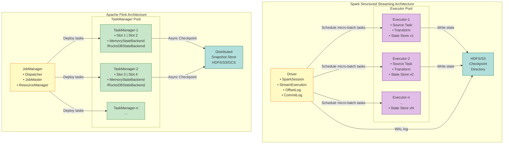
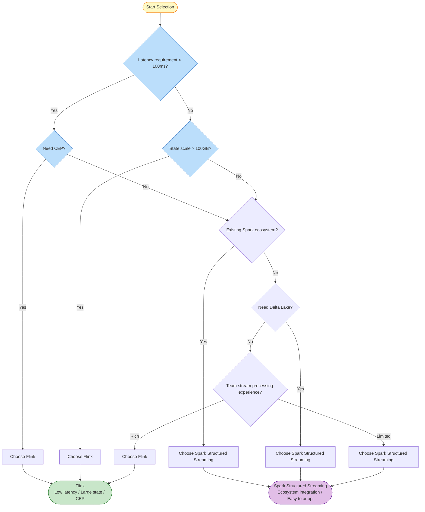

> **Status**: Stable Content | **Risk Level**: Low | **Last Updated**: 2026-04-20
>
> This document is organized based on released versions of Apache Flink. Content reflects the current stable release implementation.
>
# Flink vs Spark Streaming Comparison

> Stage: Flink/05-vs-competitors | Prerequisites: [Dataflow Model Formalization](../../../../Struct/01-foundation/01.04-dataflow-model-formalization.md) | Formalization Level: L4

---

## Table of Contents

- [Flink vs Spark Streaming Comparison](#flink-vs-spark-streaming-comparison)
  - [Table of Contents](#table-of-contents)
  - [1. Definitions](#1-definitions)
    - [Def-F-05-01 (Stream Processing Engine Execution Model)](#def-f-05-01-stream-processing-engine-execution-model)
    - [Def-F-05-02 (Latency-Throughput Trade-off Space)](#def-f-05-02-latency-throughput-trade-off-space)
  - [2. Properties](#2-properties)
    - [Lemma-F-05-01 (Micro-batch Model Latency Lower Bound)](#lemma-f-05-01-micro-batch-model-latency-lower-bound)
    - [Lemma-F-05-02 (Native Stream Processing Latency Upper Bound)](#lemma-f-05-02-native-stream-processing-latency-upper-bound)
    - [Prop-F-05-01 (Relationship Between State Size and Storage Architecture)](#prop-f-05-01-relationship-between-state-size-and-storage-architecture)
  - [3. Relations](#3-relations)
    - [Relation 1: Flink/Spark Implementation `↦` Dataflow Theoretical Model]()
    - [Relation 2: Spark DStream `⊂` Spark Structured Streaming `≈` Flink]()
    - [Relation 3: Execution Model and Latency-Throughput Trade-off](#relation-3-execution-model-and-latency-throughput-trade-off)
  - [4. Argumentation](#4-argumentation)
    - [4.1 Spark DStream vs Spark Structured Streaming vs Flink](#41-spark-dstream-vs-spark-structured-streaming-vs-flink)
    - [4.2 Counterexample Analysis: Limitations of Spark Continuous Processing](#42-counterexample-analysis-limitations-of-spark-continuous-processing)
    - [4.3 Boundary Discussion: When Can Spark Latency Approach Flink?](#43-boundary-discussion-when-can-spark-latency-approach-flink)
  - [5. Proof / Engineering Argument]()
    - [Thm-F-05-01 (Stream Processing Engine Selection Theorem)](#thm-f-05-01-stream-processing-engine-selection-theorem)
  - [6. Examples](#6-examples)
    - [Example 6.1: Real-time Risk Control Scenario Selection](#example-61-real-time-risk-control-scenario-selection)
    - [Example 6.2: Log Analysis Pipeline Selection](#example-62-log-analysis-pipeline-selection)
    - [Example 6.3: Hybrid Architecture Example](#example-63-hybrid-architecture-example)
  - [7. Visualizations](#7-visualizations)
    - [7.1 Architecture Comparison Diagram](#71-architecture-comparison-diagram)
    - [7.2 Latency-Throughput Trade-off Curve](#72-latency-throughput-trade-off-curve)
    - [7.3 Decision Tree](#73-decision-tree)
  - [8. Comprehensive Comparison Matrix](#8-comprehensive-comparison-matrix)
    - [8.1 Detailed Feature Comparison Table](#81-detailed-feature-comparison-table)
    - [8.2 Formal Comparison from Dataflow Model Perspective](#82-formal-comparison-from-dataflow-model-perspective)
    - [8.3 Performance Benchmark Data](#83-performance-benchmark-data)
  - [9. Production Practice Recommendations](#9-production-practice-recommendations)
    - [9.1 Technology Selection Checklist](#91-technology-selection-checklist)
    - [9.2 Migration Recommendations](#92-migration-recommendations)
    - [9.3 Hybrid Architecture Recommendations](#93-hybrid-architecture-recommendations)
  - [10. Conclusion](#10-conclusion)
    - [10.1 Summary of Core Arguments](#101-summary-of-core-arguments)
    - [10.2 Future Trends Outlook](#102-future-trends-outlook)
  - [References](#references)

## 1. Definitions

This section defines the core concepts required for the Flink vs Spark Streaming comparative analysis, establishing a rigorous terminological foundation.

### Def-F-05-01 (Stream Processing Engine Execution Model)

The **execution model** of a stream processing engine is defined as a triple:

$$
\mathcal{M} = (\mathcal{P}, \mathcal{T}, \mathcal{S})
$$

Where:

| Symbol | Semantics | Description |
|--------|-----------|-------------|
| $\mathcal{P}$ | Processing Paradigm | Native Streaming or Micro-batch |
| $\mathcal{T}$ | Time Semantics | Event Time, Processing Time, Ingestion Time |
| $\mathcal{S}$ | State Model | State storage location, consistency guarantee, access pattern |

**Processing Paradigm Classification**:

- **Native Streaming**: Record-by-record processing, no batch boundaries, latency $\mathcal{O}(ms)$
- **Micro-batch**: Stream sliced into finite batches for processing, latency $\mathcal{O}(batch\_interval)$
- **Continuous Processing**: Optimized variant of micro-batch, reducing batch interval to millisecond level

### Def-F-05-02 (Latency-Throughput Trade-off Space)

The performance characteristics of a stream processing system can be mapped to the **latency-throughput trade-off space**:

$$
\mathcal{T}_{tradeoff} = \{(L, T) \in \mathbb{R}^+ \times \mathbb{R}^+ \mid T \leq f_{max}(L)\}
$$

Where $L$ is end-to-end latency, $T$ is throughput, and $f_{max}$ is the maximum throughput function under a given latency constraint.

**Pareto Frontier**: In the trade-off space, if no other point $(L', T')$ exists such that $L' \leq L$ and $T' \geq T$ (with at least one strict inequality), then $(L, T)$ is said to lie on the Pareto frontier.

---

## 2. Properties

### Lemma-F-05-01 (Micro-batch Model Latency Lower Bound)

**Statement**: Spark Structured Streaming, based on the micro-batch model, has a theoretical lower bound on end-to-end latency:

$$
L_{spark} \geq \max(\delta_{trigger}, \delta_{processing}, \delta_{commit})
$$

Where:

- $\delta_{trigger}$: Trigger interval (configurable, typically 100ms–10s)
- $\delta_{processing}$: Single batch processing time
- $\delta_{commit}$: Transaction commit latency

**Derivation**:

1. The micro-batch model must wait for the batch trigger condition to be satisfied before processing begins;
2. Batch trigger conditions are typically time intervals or data volume thresholds;
3. Even if a single record arrives, it must wait until the next trigger point;
4. Therefore, the minimum latency is determined by the trigger interval and cannot be broken. ∎

### Lemma-F-05-02 (Native Stream Processing Latency Upper Bound)

**Statement**: The latency upper bound of Flink native stream processing depends only on:

$$
L_{flink} \leq \delta_{network} + \delta_{serialization} + \delta_{compute} + \delta_{state\_access}
$$

**Derivation**:

1. The native stream model has no batch waiting overhead;
2. Records are processed upon arrival, with latency being the sum of individual processing stages;
3. Network transmission and serialization are the main sources of latency;
4. No need to wait for batch boundaries, latency can reach the millisecond level. ∎

### Prop-F-05-01 (Relationship Between State Size and Storage Architecture)

**Statement**: The maximum state scale $S_{max}$ supported by a stream processing engine and its state backend architecture $Backend$ satisfy:

$$
S_{max} = \begin{cases}
S_{memory} & Backend = \text{In-Memory} \\
S_{local\_disk} & Backend = \text{Embedded\_DB} \\
S_{distributed} & Backend = \text{Remote\_Store}
\end{cases}
$$

**Derivation**:

- In-memory backend is limited by single-node heap memory, $S_{memory} \approx 10\text{–}100$ GB;
- Embedded database (e.g., RocksDB) can utilize local disk, $S_{local\_disk} \approx$ TB level;
- Remote storage (e.g., HDFS) theoretically has no upper limit, but introduces network latency. ∎

---

## 3. Relations

### Relation 1: Flink/Spark Implementation `↦` Dataflow Theoretical Model

According to Def-S-04-01 and Def-S-04-02 in [Dataflow Model Formalization](../../../../Struct/01-foundation/01.04-dataflow-model-formalization.md) [^1]:

| Formal Concept | Flink Implementation | Spark Structured Streaming Implementation |
|----------------|----------------------|-------------------------------------------|
| Dataflow Graph $\mathcal{G}$ | JobGraph → ExecutionGraph | Logical Plan → Physical Plan |
| Operator Semantics $Op$ | DataStream API operators | DataFrame/Dataset transformations |
| Time Domain $\mathbb{T}$ | Continuous $\mathbb{R}^+$ | Discrete batch time points |
| Window Trigger $T$ | Watermark-driven | Batch boundary-driven |
| State Space $\mathcal{S}$ | KeyedStateBackend | HDFSBackedStateStore |

### Relation 2: Spark DStream `⊂` Spark Structured Streaming `≈` Flink

**Argumentation**:

- **Spark DStream** (Discretized Streams) [^8] is an early API based on RDD micro-batch abstraction with limited expressiveness;
- **Spark Structured Streaming** introduces an incremental execution engine and structured API, with expressiveness approaching Flink;
- **Flink DataStream API** provides native stream semantics, but aligns with Spark at the SQL/Table API level.

### Relation 3: Execution Model and Latency-Throughput Trade-off

```
Execution Model → Latency Characteristic → Applicable Scenario
━━━━━━━━━━━━━━━━━━━━━━━━━━━━━━━━━━━━━━━━━━━━━━━━━━━━━━━━━━━━━━
Native Streaming  → Low latency (ms)      → Real-time risk control, CEP
Micro-batch       → Medium latency (s)    → Log processing, ETL
Continuous (Exp.) → Compromise (100ms)    → Latency-sensitive but high-throughput needed
```

---

## 4. Argumentation

### 4.1 Spark DStream vs Spark Structured Streaming vs Flink

**Spark DStream** (gradually deprecated):

- Low-level API based on RDD
- Supports only micro-batch model
- Lacks Event Time semantics
- Limited state management (updateStateByKey)

**Spark Structured Streaming** (currently recommended):

- High-level API based on DataFrame/Dataset
- Supports Event Time and Watermark (limited by micro-batch)
- Shares Catalyst optimizer with Spark SQL
- Unified batch and streaming API

**Flink**:

- DataStream API: low-level native stream control
- Table API/SQL: high-level declarative
- Complete Event Time semantics and flexible Watermark
- Native state management and Checkpoint

### 4.2 Counterexample Analysis: Limitations of Spark Continuous Processing

Spark 2.3 introduced Continuous Processing mode attempting to reduce latency:

**Claim**: Reduce latency to the 1ms level while maintaining Exactly-Once semantics.

**Limitations**:

1. Supports only projection and selection operations (Map-like), not aggregation or Join;
2. Supports only Kafka data source;
3. Still based on micro-batch thinking, just with extremely small batch intervals;
4. Low community maintenance, not recommended for production.

**Conclusion**: Continuous Processing is an experimental feature and cannot replace native stream engines.

### 4.3 Boundary Discussion: When Can Spark Latency Approach Flink?

**Scenario**: Data arrives in burst mode, with each batch containing a large volume of data.

**Analysis**:

- If trigger interval is set to 100ms and data arrives in bursts every 100ms;
- Batch processing time << trigger interval;
- Then end-to-end latency ≈ trigger interval = 100ms.

**Comparison with Flink**:

- Flink latency for the same load is about 10–20ms;
- Spark latency is still an order of magnitude higher;
- But throughput may be higher (batch processing optimization).

---

## 5. Proof / Engineering Argument

### Thm-F-05-01 (Stream Processing Engine Selection Theorem)

**Statement**: Given application scenario requirements $R = (L_{req}, S_{req}, E_{req})$, where:

- $L_{req}$: Latency requirement
- $S_{req}$: State scale requirement
- $E_{req}$: Ecosystem requirement

The optimal engine selection $\mathcal{E}^*$ satisfies:

$$
\mathcal{E}^* = \arg\max_{\mathcal{E} \in \{Flink, Spark\}} Score(R, \mathcal{E})
$$

Where the scoring function:

$$
Score(R, \mathcal{E}) = w_1 \cdot \mathbb{1}[L_{\mathcal{E}} \leq L_{req}] + w_2 \cdot \mathbb{1}[S_{\mathcal{E}} \geq S_{req}] + w_3 \cdot Match(E_{req}, E_{\mathcal{E}})
$$

**Proof** (Engineering Argument):

**Step 1: Latency Satisfiability Analysis**

According to Lemma-F-05-01 and Lemma-F-05-02:

| Engine | Minimum Latency | Typical Latency |
|--------|-----------------|-----------------|
| Flink | ~5ms | 10–100ms |
| Spark | ~100ms (micro-batch) / ~10ms (Continuous) | 1–10s |

If $L_{req} < 100ms$, then $Score(R, Spark) = 0$ (first term not satisfied), and Flink must be selected.

**Step 2: State Scale Satisfiability Analysis**

According to Prop-F-05-01:

| Engine | Maximum State | Recommended State |
|--------|---------------|-------------------|
| Flink | TB level (RocksDB) | < 10TB |
| Spark | Tens of GB (memory) | < 100GB |

If $S_{req} > 100GB$, Spark is difficult to satisfy, and Flink must be selected.

**Step 3: Ecosystem Match Analysis**

| Requirement Scenario | Flink Match | Spark Match |
|----------------------|-------------|-------------|
| Delta Lake integration | ⭐⭐ | ⭐⭐⭐⭐⭐ |
| MLlib integration | ⭐ | ⭐⭐⭐⭐⭐ |
| CDC data synchronization | ⭐⭐⭐⭐⭐ | ⭐⭐ |
| Complex SQL analytics | ⭐⭐⭐ | ⭐⭐⭐⭐⭐ |

**Step 4: Comprehensive Decision**

Based on weighted scoring, establish decision boundaries:

- **Boundary 1**: $L_{req} < 100ms$ → Choose Flink
- **Boundary 2**: $S_{req} > 100GB$ → Choose Flink
- **Boundary 3**: Strong Spark ecosystem dependency → Choose Spark
- **No boundary triggered**: Decide based on team familiarity and operational cost ∎

---

## 6. Examples

### Example 6.1: Real-time Risk Control Scenario Selection

**Scenario**: Financial transaction risk control, requiring latency < 100ms, state scale ~1TB, needing CEP rule engine.

**Evaluation**:

- $L_{req} = 100ms$ → Flink satisfies, Spark does not (Lemma-F-05-01)
- $S_{req} = 1TB$ → Flink RocksDB satisfies, Spark memory limited
- CEP requirement → Flink CEP library is mature, Spark has no native support

**Conclusion**: Choose Flink

### Example 6.2: Log Analysis Pipeline Selection

**Scenario**: Server log real-time analysis, latency requirement of 5s acceptable, needs integration with Delta Lake, reusing existing Spark cluster.

**Evaluation**:

- $L_{req} = 5000ms$ → Spark micro-batch 1s interval satisfies
- Delta Lake integration → Spark native support is best
- Existing infrastructure → Spark reuse cost is low

**Conclusion**: Choose Spark Structured Streaming

### Example 6.3: Hybrid Architecture Example

**Scenario**: E-commerce platform needs real-time recommendation (low latency) and offline user profile analysis.

**Architecture**:

```
User behavior data → Kafka
    ├──→ Flink (real-time recommendation, < 50ms) → Online service
    └──→ Spark (user profile, T+1) → Delta Lake
```

**Rationale**: Leverage respective strengths—Flink for the real-time pipeline, Spark for the analytics pipeline.

---

## 7. Visualizations

### 7.1 Architecture Comparison Diagram

The following diagram compares the core architectural differences between Flink and Spark Structured Streaming, showing the complete data flow from source to output.



**Figure Note**: Yellow nodes are control plane (Driver/JobManager), purple are Spark Executors, green are Flink TaskManagers, cyan are persistent storage. Spark adopts centralized micro-batch scheduling; Flink adopts distributed continuous execution.

### 7.2 Latency-Throughput Trade-off Curve

```mermaid
xychart-beta
    title "Latency vs Throughput Trade-off Curve (Conceptual)"
    x-axis "Throughput (K events/sec)"
    y-axis "Latency (ms)" 0 --> 1000

    line "Flink (Native Streaming)"
        [10, 50, 100, 200, 300, 400, 500]
        [5, 8, 15, 25, 40, 80, 150]

    line "Spark Streaming (Micro-batch, 1s)"
        [10, 50, 100, 200, 300, 400, 500]
        [1000, 1000, 1000, 1000, 1000, 1000, 1000]

    line "Spark Streaming (Micro-batch, 100ms)"
        [10, 50, 100, 200, 300, 400, 500]
        [100, 100, 100, 100, 100, 100, 100]

    line "Spark Continuous Processing (Experimental)"
        [10, 50, 100, 200, 300, 400, 500]
        [10, 15, 30, 60, 100, 180, 300]
```

**Figure Note**: Flink latency rises smoothly with throughput; Spark micro-batch latency is fixed at the batch interval; Continuous Processing latency approaches Flink but throughput is limited.

### 7.3 Decision Tree



---

## 8. Comprehensive Comparison Matrix

### 8.1 Detailed Feature Comparison Table

| Dimension | Sub-dimension | Flink | Spark Structured Streaming | Spark DStream | Winner |
|-----------|---------------|-------|---------------------------|---------------|--------|
| **Execution Model** | Processing mode | Native Streaming | Micro-batch | Micro-batch | Flink |
| | Batch support | ✅ via DataSet/Table API | ✅ Native unified | ⚠️ Requires Spark Core | Spark |
| | Continuous processing | ✅ Native | ⚠️ Experimental (Continuous Processing) | ❌ Not supported | Flink |
| **Performance Metrics** | Minimum latency | ~5ms [^3] | ~100ms (~10ms experimental) [^4] | ~1s | Flink |
| | Typical latency | 10–100ms | Seconds (1–10s) | Seconds | Flink |
| | Throughput | High (1M+/s/core) | Very high (10M+/s/core) | High | Spark |
| | Resource efficiency | Medium | High (batch optimization) | Medium | Spark |
| **State Management** | State size | TB level (RocksDB) | GB–tens of GB | MB–GB | Flink |
| | State backend options | Memory/FS/RocksDB | HDFSBackedStateStore | In-memory checkpoint | Flink |
| | Incremental Checkpoint | ✅ Native support | ✅ Supported | ❌ Not supported | Flink |
| | State query | ✅ Experimental | ❌ Not supported | ❌ Not supported | Flink |
| | Broadcast state | ✅ Supported | ✅ Supported | ✅ Supported | Tie |
| **Time Semantics** | Event Time | ✅ Full support | ✅ Full support | ❌ Not supported | Flink |
| | Processing Time | ✅ Supported | ✅ Supported | ✅ Supported | Tie |
| | Ingestion Time | ✅ Supported | ⚠️ Limited | ✅ Supported | Flink |
| | Watermark strategy | Flexible and diverse | Relatively simple | None | Flink |
| **Window Support** | Tumbling window | ✅ Native | ✅ Native | ⚠️ Limited | Tie |
| | Sliding window | ✅ Native | ✅ Native | ⚠️ Limited | Tie |
| | Session window | ✅ Native, optimized | ⚠️ Limited support | ❌ Not supported | Flink |
| | Global window | ✅ Supported | ✅ Supported | ✅ Supported | Tie |
| | Custom trigger | ✅ Flexible | ⚠️ Limited | ❌ Not supported | Flink |
| | Evictor | ✅ Supported | ❌ Not supported | ❌ Not supported | Flink |
| **CEP** | Complex Event Processing | ✅ Flink CEP library | ⚠️ Limited / Third-party | ❌ Not supported | Flink |
| **Fault Tolerance** | Checkpoint mechanism | Barrier-based | WAL + micro-batch replay | RDD checkpoint | Flink |
| | Recovery granularity | Task-level | Batch-level | Batch-level | Flink |
| | Recovery time | Seconds | Batch interval + scheduling | Minutes | Flink |
| | End-to-end Exactly-Once | ✅ Supported | ✅ Supported | ⚠️ At-least-once | Tie |
| **SQL Support** | SQL feature richness | Good | Excellent | No native support | Spark |
| | Optimizer | Based on Apache Calcite | Catalyst (more mature) | N/A | Spark |
| | UDF support | Good | Excellent | Good | Spark |
| **Ecosystem** | Connector count | Rich | Richer | Limited | Spark |
| | Cloud managed services | Growing | Mature (Databricks, etc.) | Limited | Spark |
| | ML integration | Limited | Excellent (MLlib) | Excellent (MLlib) | Spark |
| | Data lake integration | Good | Excellent (Delta Lake) | Good | Spark |
| | CDC support | Excellent (Flink CDC) | Limited | Limited | Flink |
| **Operations** | Web UI | Good | Excellent | Average | Spark |
| | Metrics system | Prometheus | Multiple options | Multiple options | Tie |
| | Auto-scaling | Limited | Good | Limited | Spark |
| **API Evolution** | Current status | Actively maintained | Actively maintained | Deprecated | - |
| | Recommendation | ⭐⭐⭐⭐⭐ | ⭐⭐⭐⭐⭐ | ⭐ | - |

### 8.2 Formal Comparison from Dataflow Model Perspective

According to the definitions in [Dataflow Model Formalization](../../../../Struct/01-foundation/01.04-dataflow-model-formalization.md) [^1]:

**Spark Structured Streaming Formal Characteristics**:

| Property | Formal Description | Engineering Implementation |
|----------|--------------------|---------------------------|
| **Time Domain** | $\mathbb{T}_{batch} = \{t_0, t_0+\delta, t_0+2\delta, ...\}$ | Discrete trigger time points |
| **Window Trigger** | $T(wid, w) = \text{FIRE} \iff \tau_{trigger} \in \mathbb{T}_{batch}$ | Triggered by batch interval |
| **Execution Semantics** | Batch operator $op_{batch}: \mathcal{D}^* \to \mathcal{D}^*$ | Batch processing within each batch |
| **State Update** | $\Delta s = f_{batch}(R_{batch}, s_{prev})$ | Batch-granularity state update |

**Flink Formal Characteristics**:

| Property | Formal Description | Engineering Implementation |
|----------|--------------------|---------------------------|
| **Time Domain** | $\mathbb{T}_{continuous} = \mathbb{R}^+$ | Continuous processing time |
| **Window Trigger** | $T(wid, w) = \text{FIRE} \iff w \geq t_{end} + F$ | Watermark-driven trigger |
| **Execution Semantics** | Stream operator $op_{stream}: \mathcal{D} \times \mathcal{S} \to \mathcal{D}^* \times \mathcal{S}$ | Record-by-record processing |
| **State Update** | $\delta: s \times r \to s'$ | Single-record granularity update |

### 8.3 Performance Benchmark Data

Based on Yahoo! Streaming Benchmark [^5] and community tests [^6]:

| Workload | Flink Throughput | Spark Throughput | Flink Latency | Spark Latency |
|----------|------------------|------------------|---------------|---------------|
| **Windowed Aggregation (1s)** | 1.2M events/s | 2.5M events/s | 45 ms | 1200 ms |
| **Stream-Stream Join** | 800K events/s | 1.5M events/s | 80 ms | 1500 ms |
| **CEP Pattern Matching** | 400K events/s | N/A | 60 ms | N/A |
| **Session Window** | 600K events/s | 900K events/s | 120 ms | 2000 ms |

---

## 9. Production Practice Recommendations

### 9.1 Technology Selection Checklist

```
┌─────────────────────────────────────────────────────────────────────────────┐
│                    Selection Checklist                                       │
├─────────────────────────────────────────────────────────────────────────────┤
│                                                                              │
│  Choose Flink if any of the following conditions are met:                    │
│  □ End-to-end latency requirement < 1 second                                │
│  □ Complex Event Processing (CEP) needed                                    │
│  □ Expected state size exceeds 100GB                                        │
│  □ Session windows or complex custom triggers needed                        │
│  □ Precise watermark control and out-of-order handling needed               │
│  □ Team has stream processing experience and is willing to invest           │
│  □ Primarily doing CDC data synchronization                                 │
│  □ Cross-datacenter replication needed (Flink CDC)                          │
│                                                                              │
│  Choose Spark Structured Streaming if any of the following are met:         │
│  □ Existing Spark batch/ML infrastructure                                   │
│  □ Latency requirement > 5 seconds acceptable                               │
│  □ Deep Delta Lake integration needed                                       │
│  □ Complex SQL analytics + simple stream processing needed                  │
│  □ Team familiar with Spark SQL/DataFrame API                               │
│  □ Unified batch-streaming codebase needed                                  │
│  □ Integration with MLlib/GraphX needed                                     │
│  □ Integration with BI tools needed (Spark SQL)                             │
│                                                                              │
│  Avoid choosing Spark DStream (deprecated):                                 │
│  □ DStream API should not be used in new projects                           │
│  □ Existing DStream projects should migrate to Structured Streaming         │
│                                                                              │
│  Consider hybrid architecture if:                                           │
│  □ Both high real-time requirements and complex analytics needs exist       │
│  □ Data volume is extremely large, requiring layered processing             │
│    (real-time layer + batch layer)                                          │
│  □ Team has sufficient resources to maintain two systems                    │
│                                                                              │
└─────────────────────────────────────────────────────────────────────────────┘
```

### 9.2 Migration Recommendations

| Scenario | Recommendation | Risk |
|----------|----------------|------|
| **Spark DStream → Flink** | Strongly recommended, significantly reduces latency | Large API differences, requires rewrite |
| **Spark DStream → Spark Structured Streaming** | Recommended, smooth migration path | Slightly different semantics, requires testing |
| **Spark Structured Streaming → Flink** | Evaluate latency gain vs migration cost | Complex state migration, requires redesign |
| **Flink → Spark** | Consider only when unified batch-streaming need is strong | Latency degradation risk |
| **Storm → Flink/Spark** | Recommend Flink, more mature | Storm ecosystem declining, must migrate |
| **Kafka Streams → Flink** | Consider only when complex state is needed | Kafka Streams simpler to maintain |

### 9.3 Hybrid Architecture Recommendations

```
┌─────────────────────────────────────────────────────────────────────────────┐
│                    Recommended Hybrid Architecture                           │
├─────────────────────────────────────────────────────────────────────────────┤
│                                                                              │
│   Real-time Data Sources (Kafka/Kinesis/Pulsar)                             │
│        │                                                                     │
│        ├──→ Flink (real-time ETL/CEP/low-latency agg) ──→ Kafka ──→ Online Service │
│        │                                                                     │
│        └──→ Spark Structured Streaming (windowed agg/analytics) ──→ Delta Lake │
│                              │                                               │
│                              └──→ Spark SQL/ML (offline analytics/ML)       │
│                                                                              │
│  Notes:                                                                      │
│  • Flink handles high real-time requirements (< 1s)                         │
│  • Spark handles complex analytics, machine learning, data lake integration │
│  • Kafka serves as real-time data bus connecting both engines               │
│  • Delta Lake/Paimon as unified storage layer                               │
│                                                                              │
└─────────────────────────────────────────────────────────────────────────────┘
```

---

## 10. Conclusion

### 10.1 Summary of Core Arguments

Apache Flink and Apache Spark Streaming represent two different philosophies in the stream processing domain:

1. **Flink is a "true stream processing engine"** — Its native stream architecture provides the optimal solution for low-latency scenarios (< 100ms), with irreplaceable advantages especially in complex event processing, large-scale state management, and precise time semantics.

2. **Spark is a "unified analytics engine"** — Its micro-batch model trades partial latency for higher throughput and seamless integration with the batch processing ecosystem, excelling in Lambda architecture simplification and data lakehouse integration scenarios.

3. **Spark DStream is gradually deprecated** — New projects should not use it; existing projects should migrate to Structured Streaming or Flink.

4. **Technology selection should be based on latency requirements, state scale, and ecosystem status** — There is no absolute superiority, only scenario fitness.

### 10.2 Future Trends Outlook

| Trend | Flink Direction | Spark Direction |
|-------|-----------------|-----------------|
| **Latency optimization** | Continuously reduce checkpoint overhead, improve throughput | Continuous Processing maturation |
| **Batch-stream unification** | Strengthen Batch mode performance (Flink 1.17+) | Optimize stream processing latency |
| **Cloud-native** | Flink Kubernetes Operator refinement | Databricks Serverless promotion |
| **AI integration** | Flink + ML inference optimization (Alink) | Spark + GenAI deep integration |
| **Data lake** | Paimon becomes mainstream lake format | Delta Lake 3.0 unified batch-stream |

---

## References

[^1]: T. Akidau et al., "The Dataflow Model: A Practical Approach to Balancing Correctness, Latency, and Cost in Massive-Scale, Unbounded, Out-of-Order Data Processing," *PVLDB*, 8(12), 2015.


[^3]: Apache Flink Documentation, "Latency and Throughput," 2025. <https://nightlies.apache.org/flink/flink-docs-stable/docs/learn-flink/overview/>

[^4]: Apache Spark Documentation, "Structured Streaming Programming Guide," 2024. <https://spark.apache.org/docs/latest/structured-streaming-programming-guide.html>

[^5]: Yahoo! Engineering, "Benchmarking Streaming Computation Engines at Yahoo!," 2016.

[^6]: S. K. et al., "Evaluating Stream Processing Engines: A Comprehensive Benchmark," *IEEE Big Data*, 2020.


[^8]: M. Zaharia et al., "Discretized Streams: Fault-Tolerant Streaming Computation at Scale," *SOSP*, 2013.


---

*Document version: v1.0 | Translation date: 2026-04-24*

**Related Documents**:

- [Dataflow Model Formalization](../../../../Struct/01-foundation/01.04-dataflow-model-formalization.md)
- Flink 1.x vs 2.0 Comparison: [../01-architecture/flink-1.x-vs-2.0-comparison.md](../../../01-concepts/flink-1.x-vs-2.0-comparison.md)
- Checkpoint Mechanism Deep Dive: [../02-core-mechanisms/checkpoint-mechanism-deep-dive.md](../../../02-core/checkpoint-mechanism-deep-dive.md)
