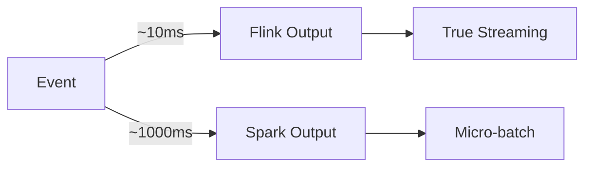

# Flink vs Spark Structured Streaming 2026 Deep Comparison

> **Stage**: Knowledge/04-technology-selection | **Prerequisites**: [Checkpoint Deep Dive](../../Flink/02-core/checkpoint-mechanism-deep-dive.md) | **Formal Level**: L3-L4
>
> **Updated**: 2026-04
>
> Latency, throughput, semantics, ecosystem, and operability comparison.

---

## 1. Definitions

**Def-K-04-13: Stream Processing Engine Evaluation Dimensions**

$$
\text{Engine} = \langle \text{Latency}, \text{Throughput}, \text{Semantics}, \text{Ecosystem}, \text{Operability} \rangle
$$

**Def-K-04-14: Apache Flink (2026)**

$$
\text{Flink}_{2026} = \langle \text{DataStream API}, \text{Table API / SQL}, \text{Checkpoint}, \text{Watermark}, \text{Disaggregated State} \rangle
$$

Key capabilities: Async State (2.0), ForSt Backend, Adaptive Execution, Streaming Warehouse Integration.

**Def-K-04-15: Spark Structured Streaming (2026)**

$$
\text{SparkSS}_{2026} = \langle \text{DataFrame API}, \text{Micro-batch Engine}, \text{Checkpoint v2}, \text{Continuous Processing}, \text{Delta Lake} \rangle
$$

Key capabilities: Micro-batch default, Continuous Processing (experimental), Delta Lake integration, Spark Connect.

---

## 2. Properties

**Lemma-K-04-05: Latency Lower Bound**

Spark Structured Streaming micro-batch latency is bounded by trigger interval (minimum 1s).

**Lemma-K-04-06: Throughput Comparison**

Flink and Spark achieve comparable throughput for stateless operations; Flink leads for stateful operations.

---

## 3. Relations

- **with Dataflow Model**: Flink implements native streaming; Spark uses micro-batch.
- **with SQL**: Both support streaming SQL with similar syntax.

---

## 4. Argumentation

**Dimension Comparison**:

| Dimension | Flink | Spark SS |
|-----------|-------|----------|
| Latency | < 100ms | 1s+ (micro-batch) |
| Throughput | Very high | Very high |
| State | Rich, explicit | Basic, implicit |
| Exactly-Once | Native | Via Delta Lake |
| SQL | Table API | Structured Streaming SQL |
| Ecosystem | Stream-focused | Unified batch/stream |

---

## 5. Engineering Argument

**Migration Considerations**:

| Factor | Flink Advantage | Spark Advantage |
|--------|----------------|-----------------|
| Existing batch jobs | — | Reuse Spark code |
| Low latency requirement | ✓ | — |
| Complex stateful logic | ✓ | — |
| Team Spark expertise | — | ✓ |

---

## 6. Examples

```java
// Flink: native streaming
stream.keyBy(Event::getUserId)
    .window(TumblingEventTimeWindows.of(Time.minutes(1)))
    .aggregate(new CountAggregate())
    .addSink(new KafkaSink<>());

// Spark: micro-batch
df.groupBy(window(col("eventTime"), "1 minute"), col("userId"))
  .count()
  .writeStream
  .format("kafka")
  .start();
```

---

## 7. Visualizations

**Latency Comparison**:



---

## 8. References
