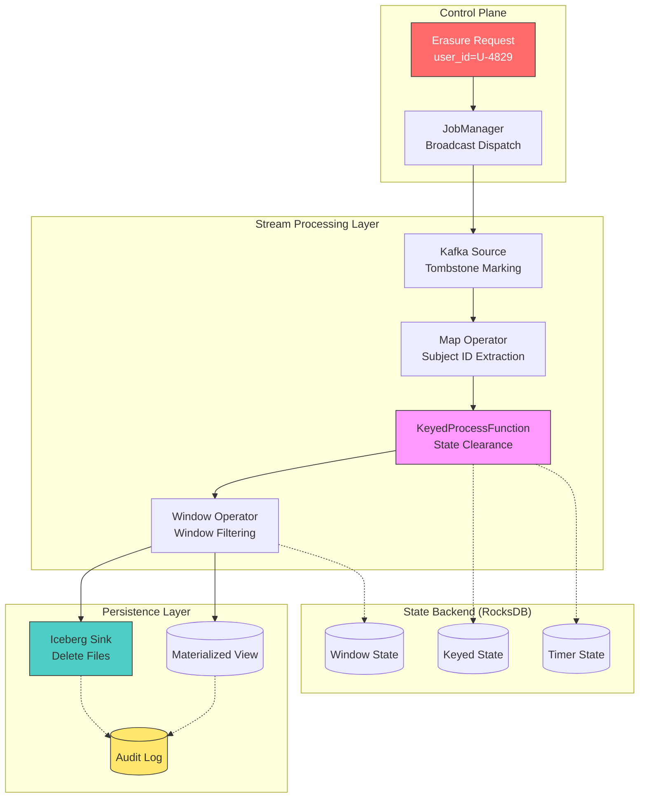
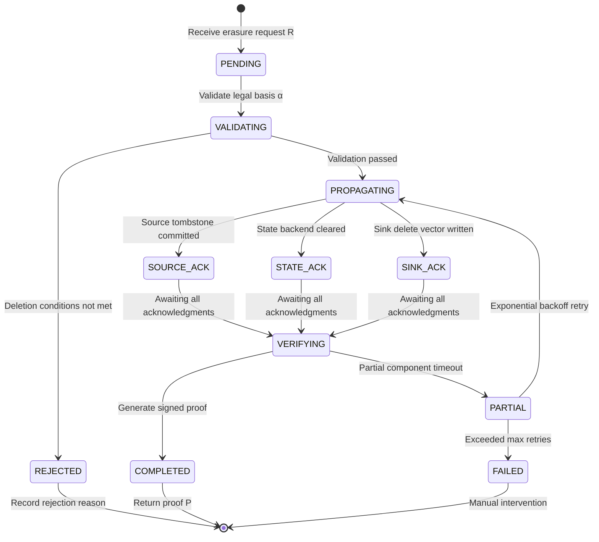

# RegTech: Formalization of GDPR Right to Erasure in Streaming Systems

> Stage: Struct/ | Prerequisites: [Struct/02-properties/streaming-consistency-model.md](../../Struct/02-properties/streaming-consistency-model.md), [Knowledge/08-standards/data-governance-framework.md](../../Knowledge/08-standards/data-governance-framework.md) | Formalization Level: L4

## 1. Definitions

**Def-S-08-01** (流数据主体身份标识, Streaming Data Subject Identity). Given a streaming system $\mathcal{S} = (V, E, \Sigma, \mathcal{T})$, where $V$ is the set of operators, $E \subseteq V \times V$ is the set of directed dataflow edges, $\Sigma$ is the set of state backends, and $\mathcal{T}$ is the time domain. Let the event universe be $\mathcal{E}$ and the subject identity domain be $\mathcal{I}$. The mapping $\phi: \mathcal{E} \rightarrow \mathcal{I} \cup \{\bot\}$ is called the **subject identity extraction function**. If $\phi(e) = i \in \mathcal{I}$, then $e$ belongs to subject $i$; if $\phi(e) = \bot$, then $e$ is an anonymous event and is not subject to erasure obligations.

**Def-S-08-02** (删除请求, Erasure Request). An erasure request is a quintuple $R = (i, t_{req}, \tau, \rho, \alpha)$, where:

- $i \in \mathcal{I}$: target subject identity;
- $t_{req} \in \mathcal{T}$: request timestamp;
- $\tau \in \{\text{HARD}, \text{SOFT}\}$: erasure mode (`HARD` for physical deletion, `SOFT` for logical deletion);
- $\rho \subseteq V \cup \Sigma \cup \{\text{Sink}\}$: scope of erasure;
- $\alpha \in \{\text{GDPR-Art17}, \text{CCPA-1798.105}, \text{Custom}\}$: legal basis.

**Def-S-08-03** (流删除完备性, Streaming Erasure Completeness). For an erasure request $R$, if streaming system $\mathcal{S}$ at time $t \geq t_{req} + \Delta_{max}$ satisfies:

1. **Operator Output Purge**: $\forall v \in \rho \cap V: \nexists e \in \text{Out}(v, t) : \phi(e) = i$;
2. **State Backend Purge**: $\forall \sigma \in \rho \cap \Sigma: \text{KeyState}(\sigma, i, t) = \emptyset$;
3. **Sink Persistence Purge**: $\forall s \in \rho \cap \{\text{Sink}\}: \text{Read}(s, t) \cap \{e \mid \phi(e) = i\} = \emptyset$;

then $\mathcal{S}$ is said to achieve **erasure completeness** for $R$, where $\Delta_{max}$ is the system's promised maximum erasure propagation latency.

**Def-S-08-04** (不可抵赖删除证明, Non-repudiable Erasure Proof). A non-repudiable erasure proof is a cryptographically signed tuple $P = (H(R), t_{complete}, \pi_{audit}, \text{Sig}_{system})$, where $H(R)$ is the request hash, $t_{complete}$ is the completion timestamp, $\pi_{audit}$ is the set of per-component deletion confirmation evidence, and $\text{Sig}_{system}$ is the signature using the system's private key.

## 2. Properties

**Lemma-S-08-01** (删除日志单调性, Erasure Log Monotonicity). Let $\mathcal{L}$ be the audit log. For a sequence of erasure requests $R_1, \ldots, R_n$ for the same subject $i$, if $t_{req}^{(1)} < \cdots < t_{req}^{(n)}$, then:

$$\mathcal{L}(i, t_{req}^{(k)}) \subseteq \mathcal{L}(i, t_{req}^{(k+1)}), \quad \forall k \in [1, n-1]$$

*Proof sketch.* The audit log is an append-only immutable structure; new requests only append entries, and historical entries are immutable. Hence monotonicity holds. $\square$

**Prop-S-08-01** (最终删除一致性, Eventual Erasure Consistency). In an acyclic streaming topology $G = (V, E)$, if every operator satisfies local deletion ACK semantics, and channels provide at-least-once delivery guarantees, then for any erasure request $R$, the system reaches erasure completeness within finite time with probability 1.

*Proof sketch.* Treat operator deletion acknowledgments as tokens propagated along DAG forward edges. The graph is finite and acyclic, so tokens must reach all reachable nodes within a finite number of steps. Under at-least-once semantics, the probability of a single delivery failure is $p < 1$, and the probability of infinite retry failure is $\lim_{n \to \infty} p^n = 0$. By the Borel-Cantelli lemma, the probability of completing all deliveries within finite time is 1. $\square$

## 3. Relations

### 3.1 Mapping to the Resettable Streaming Model

The Resettable Streaming Model abstracts a streaming system into three operations: $\text{snapshot}$, $\text{reset}$, and $\text{replay}$. An erasure request $R$ can be embedded as a **scoped partial reset** $\text{reset}_{|i}$, which only reverts state and output related to subject $i$, rather than a global reset. This mapping shows that right-to-erasure implementations can reuse existing checkpoint/restore infrastructure, but require introducing fine-grained subject-keyed indexing.

### 3.2 Alignment with GDPR Article 17 and CCPA §1798.105

GDPR Article 17 requires controllers to erase personal data "without undue delay"; the statutory deadline is typically **30 calendar days** (extendable to 60 days). CCPA §1798.105 requires businesses to complete erasure within **45 calendar days** (extendable once by 45 days). In the formal framework, the system-promised latency $\Delta_{max}$ must satisfy:

$$\Delta_{max} \leq \begin{cases} 30 \text{ days} & \alpha = \text{GDPR-Art17} \\ 45 \text{ days} & \alpha = \text{CCPA-1798.105} \end{cases}$$

In streaming processing scenarios, engineering practice typically compresses $\Delta_{max}$ to the minute-level or even second-level.

### 3.3 Relationship with Lakehouse Deletion Vectors

Apache Iceberg Delete Files and Delta Lake Deletion Vectors provide physical-layer implementations for SOFT deletion. In a delete vector $D = \{(p_k, i_k)\}$, $p_k$ is the data file path and $i_k$ is the subject identity to be deleted. During query execution, the scan operator applies $D$ as a filter, achieving unobservability on the read path, which directly corresponds to the Sink purge condition in Def-S-08-03.

## 4. Argumentation

### 4.1 Counterexample: Deletion Propagation in Cyclic Topologies

If a streaming system contains feedback loops (e.g., iterative stream processing), the convergence of Prop-S-08-01 no longer holds. Consider a two-operator loop $v_1 \leftrightarrow v_2$, where $v_2$ feeds aggregated results back to $v_1$. If subject $i$'s data has entered this loop, the deletion token may propagate infinitely because the fed-back results may "regenerate" new events related to $i$. **Conclusion**: erasure completeness is undecidable in general cyclic topologies; in practice, either $\rho$ must be restricted to exclude loop operators, or loop operators must support **reversible aggregation**.

### 4.2 Boundary Discussion: Derived Data and Anonymization

GDPR Article 17(1) requires erasure of "personal data", but Article 17(3)(b) exempts statistical data for which appropriate safeguards have been applied. If an operator $v$'s function $f: \mathcal{E}^* \rightarrow \mathcal{X}$ produces output that depends only on the existence/count of subjects rather than their specific content, then the output of $f$ is **anonymized** and falls outside the scope of the right to erasure.

### 4.3 Cross-Region Replication Latency Boundary

If the Sink is deployed across multiple regions, erasure propagation must cross network boundaries. Engineering practice adopts an **asynchronous replication + source-side tombstone** strategy: the source region writes a tombstone and returns an ACK to the regulator, while the delete vector is asynchronously replicated to other regions in the background. This strategy decouples statutory compliance latency from physical replication latency.

## 5. Proof / Engineering Argument

**Thm-S-08-01** (无环拓扑删除完备性, Erasure Completeness in Acyclic Topologies). Let the operator topology of streaming system $\mathcal{S}$ be a DAG $G = (V, E)$. If an erasure request $R = (i, t_{req}, \text{HARD}, \rho, \alpha)$ is accepted at a source operator $v_{src} \in \rho$, and the following hold:

1. Every operator $v \in V$ clears all state and output for subject $i$ within $\delta_v$ after receiving the deletion token;
2. Inter-operator channels satisfy FIFO ordered delivery;
3. The state backend supports atomic per-key $i$ clearance, taking time $\delta_\sigma$;

then the system reaches erasure completeness at time $t_{complete}$, where:

$$t_{complete} \leq t_{req} + \sum_{v \in \text{TopoSort}(G[\rho])} \delta_v + |E[\rho]| \cdot \delta_{net} + \max_{\sigma \in \rho \cap \Sigma} \delta_\sigma$$

where $G[\rho]$ is the induced subgraph restricted to $\rho$, and $\delta_{net}$ is the network transmission upper bound.

*Proof.* By induction over the topologically sorted operator sequence. **Base case**: the source operator $v_{src}$ accepts at $t_{req}$ and, by assumption 1, completes clearance by $t_{req} + \delta_{v_{src}}$. **Inductive step**: assume the first $k$ operators all complete on time. For the $(k+1)$-th operator $v_{k+1}$, all its predecessors have completed and emitted deletion tokens. By the DAG property, all incoming edges originate from the first $k$ operators; by assumption 2, tokens will not arrive later than subsequent data; by assumption 1, $v_{k+1}$ completes clearance within $\delta_{v_{k+1}}$ after receiving the token. State backend clearance executes in parallel with operators and is determined by the slowest backend. Combining these bounds yields the result. $\square$

### 5.1 Engineering Argument: Data Marking vs. Physical Deletion

| Dimension | Tombstone (SOFT) | Physical Deletion (HARD) |
|-----------|------------------|--------------------------|
| Compliance Evidence | Naturally retains audit records | Requires additional audit log writes |
| Read-path Overhead | Must apply delete vector | No additional filtering |
| Write-path Overhead | Low, only appends metadata | High, must rewrite data files |
| Recoverability | Can revoke mistaken deletions | Irreversible |
| Storage Growth | Accumulative, requires compaction | No growth |

**Engineering Recommendation**: use tombstone propagation at the streaming processing layer (Flink keyed state TTL + side-output), and select the Sink approach based on engine capabilities. For Iceberg/Delta, prefer SOFT deletion with periodic compaction; for traditional database Sinks, implement HARD deletion via DELETE SQL.

### 5.2 State Backend Erasure Propagation Mechanism

Taking the Flink RocksDB State Backend as an example, the erasure propagation flow is: (1) the control plane ingests request $R$; (2) JobManager broadcasts to TaskManagers; (3) each instance performs a RocksDB prefix scan to locate keys; (4) `DeleteRange` or single-key `delete` clears the data; (5) Checkpoint persists the clearance operation; (6) side-output synchronizes downstream Sinks. If an inverted index $I: \mathcal{I} \rightarrow 2^{\text{KeySpace}}$ is maintained, scan complexity can be reduced from $O(|\text{State}|)$ to $O(|\text{Keys}(i)|)$, significantly compressing $\delta_\sigma$.

## 6. Examples

### 6.1 GDPR Erasure in a Flink Job

Real-time user behavior analytics topology: `Kafka Source -> Map -> KeyedProcessFunction -> Window -> Iceberg Sink`. Upon receiving an erasure request for `user_id = U-4829`:

```java
DataStream<ErasureRequest> erasureStream = env
    .addSource(new ErasureRequestSource())
    .broadcast(ERASURE_STATE_DESCRIPTOR);

mainStream
    .keyBy(event -> event.userId)
    .connect(erasureStream)
    .process(new KeyedErasureCoProcessFunction() {
        @Override
        public void processElement2(ErasureRequest req, Context ctx, Collector<Aggregate> out) {
            if (req.getSubjectId().equals(ctx.getCurrentKey())) {
                valueState.clear();
                timerState.clear();
                out.collect(new TombstoneRecord(req.getSubjectId(), req.getTimestamp()));
                auditLog.append(AuditEntry.deleted(ctx.getCurrentKey()));
            }
        }
    })
    .addSink(new IcebergSink<>());
```

`KeyedErasureCoProcessFunction` ensures state clearance and tombstone emission within a single-key context. The Iceberg Sink converts `TombstoneRecord` into an equality delete entry.

### 6.2 Iceberg Delete Vector Compliance Read Path

The Iceberg table `user_events` contains data file `data-001.orc` and delete file `delete-001.avro` (recording `equality_deletes: user_id = 'U-4829'`). During a compliance query, Iceberg automatically applies the delete vector:

```sql
SELECT * FROM user_events WHERE event_time > '2026-01-01';
-- The result set does not contain records with user_id = 'U-4829'
```

At this point $\text{Read}(s, t)$ satisfies the Sink purge condition in Def-S-08-03. The query optimizer skips files marked for deletion through the metadata layer, balancing compliance and performance.

### 6.3 Non-repudiable Erasure Proof

After erasure is complete, the system generates an audit proof:

```json
{
  "proof_id": "erp-20260423-7a3f9e",
  "request_hash": "SHA256:9f86d08...",
  "completed_at": "2026-04-23T08:48:05Z",
  "components": [
    {"component": "kafka-source", "ack": "tombstone_committed"},
    {"component": "keyed-process", "ack": "state_cleared"},
    {"component": "rocksdb", "ack": "keys_deleted:47"},
    {"component": "iceberg-sink", "ack": "delete_file_written"}
  ],
  "signature": "RSA-SHA256:MEUCIQ..."
}
```

This proof allows auditors to verify the integrity of each component's state without exposing raw business data.

## 7. Visualizations

### Figure 1: GDPR Erasure Propagation Topology in Streaming Systems



### Figure 2: Erasure Request Lifecycle State Machine



## 8. References
