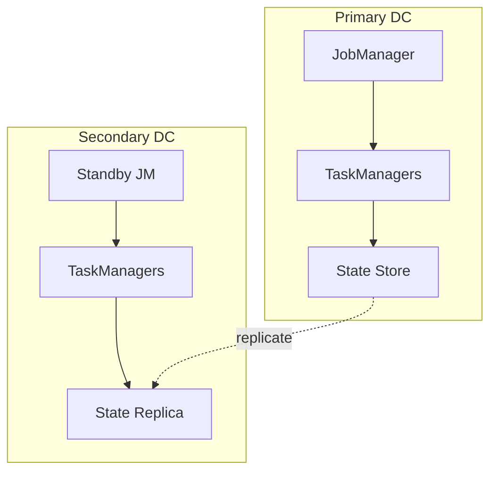

# High Availability Patterns

> **Stage**: Knowledge/07-best-practices | **Prerequisites**: [Checkpoint Recovery](../pattern-checkpoint-recovery.md) | **Formal Level**: L3
>
> High availability architecture patterns for stream processing: failover, multi-active, and disaster recovery.

---

## 1. Definitions

**Def-K-07-06: High Availability**

System's ability to maintain acceptable performance and continue service during component failures:

$$
Availability = \frac{MTTF}{MTTF + MTTR} \times 100\%
$$

| Level | Availability | Annual Downtime | Use Case |
|-------|-------------|-----------------|----------|
| 2 nines | 99% | 87.6 hours | Internal tools |
| 3 nines | 99.9% | 8.76 hours | General business |
| 4 nines | 99.99% | 52.6 minutes | Critical business |
| 5 nines | 99.999% | 5.26 minutes | Core business |

**Failure Types**:

- Task failure: Individual task crash
- TaskManager failure: Node loss
- JobManager failure: Control plane loss
- Network partition: Split-brain scenario

---

## 2. Properties

**Prop-K-07-05: Failover Time Bound**

With checkpoint interval $T_c$ and recovery time $T_r$, maximum data reprocessing = $T_c + T_r$.

**Prop-K-07-06: Multi-Active Consistency**

Multi-active deployments require conflict resolution for non-commutative operations.

---

## 3. Relations

- **with Checkpoint**: HA relies on checkpoint for state recovery.
- **with Exactly-Once**: End-to-end Exactly-Once requires transactional sinks in HA setup.

---

## 4. Argumentation

**Single Point of Failure Elimination**:

| Component | SPOF? | Mitigation |
|-----------|-------|------------|
| JobManager | Yes | HA mode with ZooKeeper/Kubernetes |
| TaskManager | No | Restart on other node |
| State Backend | Depends | Distributed storage (ForSt) |
| Source | Depends | Offset-based replay |

**Recovery Time Optimization**:

| Strategy | MTTR | Cost |
|----------|------|------|
| Restart from checkpoint | Minutes | Low |
| Warm standby | Seconds | Medium |
| Active-active | Near-zero | High |

---

## 5. Engineering Argument

**Disaster Recovery Patterns**:

1. **Backup-Restore**: Periodic snapshots to geo-redundant storage
2. **Warm Standby**: Secondary cluster with delayed replication
3. **Active-Active**: Dual-primary with conflict resolution

---

## 6. Examples

```yaml
# Flink HA configuration
high-availability: zookeeper
high-availability.zookeeper.quorum: zk1:2181,zk2:2181,zk3:2181
high-availability.storageDir: hdfs:///flink/ha
restart-strategy: fixed-delay
restart-strategy.fixed-delay.attempts: 10
```

---

## 7. Visualizations

**HA Architecture**:



---

## 8. References
