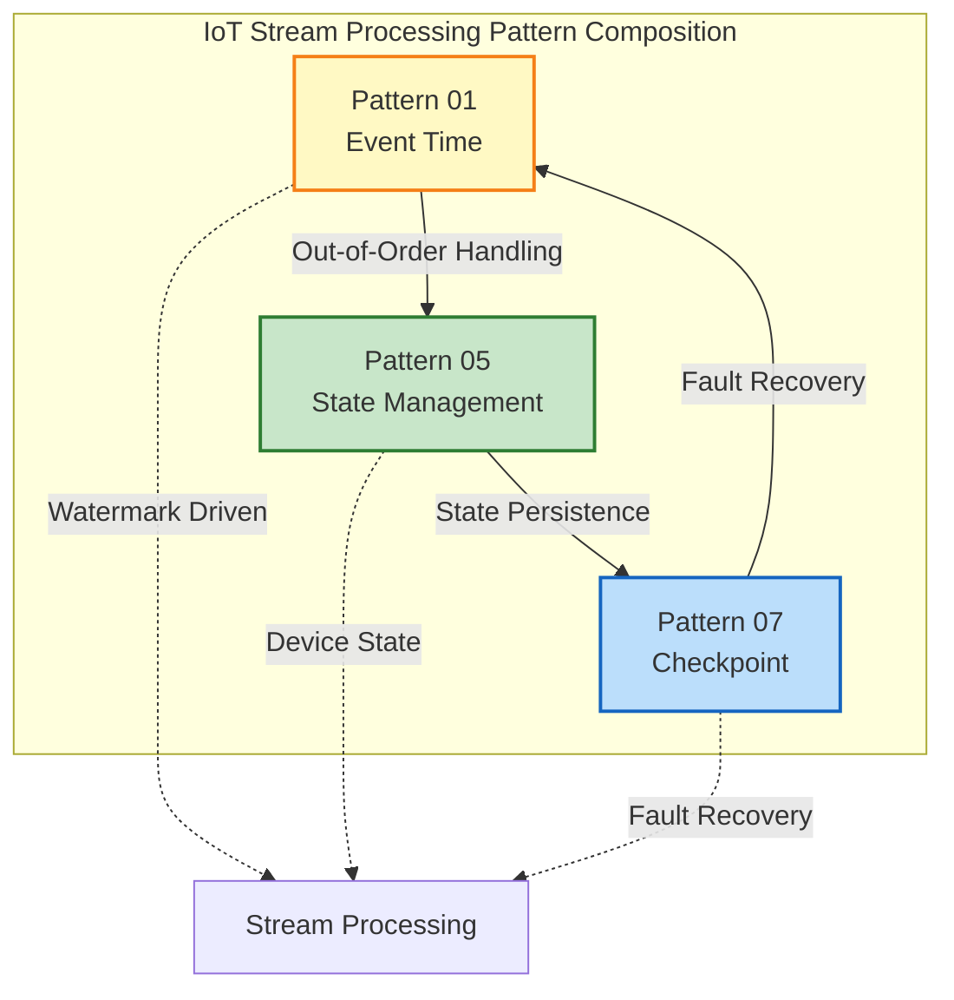
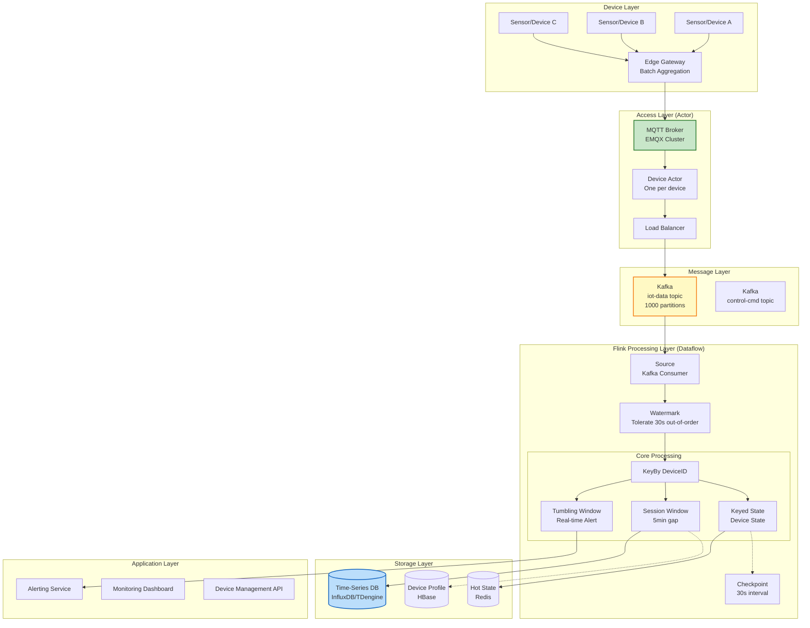
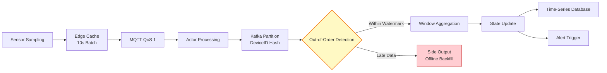
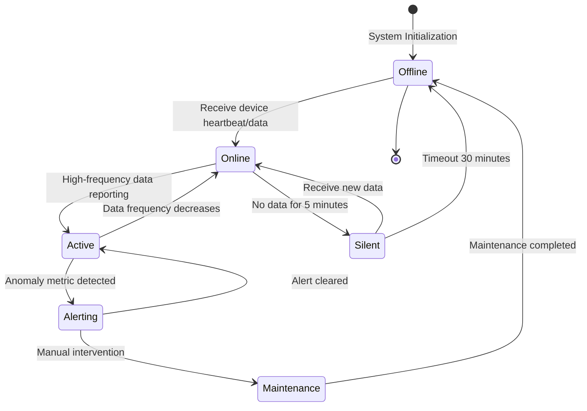

# Business Pattern: IoT Stream Processing

> **Business Domain**: Internet of Things (IoT) | **Complexity Level**: ★★★★☆ | **Latency Requirement**: < 2s | **Formalization Level**: L4-L5
>
> **Stage**: Knowledge/03-business-patterns | **Prerequisites**: [Pattern 01: Event Time Processing](../02-design-patterns/pattern-event-time-processing.md), [Pattern 05: State Management](../02-design-patterns/pattern-stateful-computation.md), [Pattern 07: Checkpoint Recovery](../02-design-patterns/pattern-checkpoint-recovery.md)
>
> This pattern addresses the core requirements of **million-scale device connectivity**, **out-of-order data processing**, **device state maintenance**, and **session window management** in IoT scenarios, providing a complete solution based on an Actor + Dataflow dual-layer architecture.

---

## Table of Contents

- [Business Pattern: IoT Stream Processing](#business-pattern-iot-stream-processing)
  - [Table of Contents](#table-of-contents)
  - [1. Definitions](#1-definitions)
    - [Def-K-03-01: IoT Data Stream](#def-k-03-01-iot-data-stream)
    - [Def-K-03-02: Device Session](#def-k-03-02-device-session)
    - [Def-K-03-03: Out-of-Order Tolerance](#def-k-03-03-out-of-order-tolerance)
    - [Def-K-03-04: Device Actor](#def-k-03-04-device-actor)
  - [2. Properties](#2-properties)
    - [Prop-K-03-01: Device State Consistency](#prop-k-03-01-device-state-consistency)
    - [Prop-K-03-02: Session Window Completeness](#prop-k-03-02-session-window-completeness)
    - [Prop-K-03-03: State Space Upper Bound](#prop-k-03-03-state-space-upper-bound)
    - [Prop-K-03-04: Out-of-Order Data Convergence](#prop-k-03-04-out-of-order-data-convergence)
  - [3. Relations](#3-relations)
    - [3.1 Relationship with Core Design Patterns](#31-relationship-with-core-design-patterns)
    - [3.2 Technology Stack Component Mapping](#32-technology-stack-component-mapping)
    - [3.3 Actor + Dataflow Dual-Layer Architecture](#33-actor--dataflow-dual-layer-architecture)
    - [3.4 Data Flow Temporal Relationship](#34-data-flow-temporal-relationship)
  - [4. Argumentation](#4-argumentation)
    - [4.1 Core Challenges in IoT Scenarios](#41-core-challenges-in-iot-scenarios)
    - [4.2 MQTT Message Reliability Level Selection](#42-mqtt-message-reliability-level-selection)
    - [4.3 Boundary Between Edge and Central Computing](#43-boundary-between-edge-and-central-computing)
    - [4.4 Partitioning Strategy for Million-Scale Devices](#44-partitioning-strategy-for-million-scale-devices)
  - [5. Engineering Argument](#5-engineering-argument)
    - [5.1 Architecture Design Decisions](#51-architecture-design-decisions)
    - [5.2 Key Challenge Solutions](#52-key-challenge-solutions)
    - [5.3 Performance Benchmarks](#53-performance-benchmarks)
  - [6. Examples](#6-examples)
    - [6.1 Complete Flink Job Code](#61-complete-flink-job-code)
    - [6.2 Device Temperature Monitoring and Alerting](#62-device-temperature-monitoring-and-alerting)
    - [6.3 Device Session Analysis](#63-device-session-analysis)
    - [6.4 Out-of-Order Data Processing](#64-out-of-order-data-processing)
    - [6.5 Device State Machine Management](#65-device-state-machine-management)
  - [7. Visualizations](#7-visualizations)
    - [7.1 IoT Overall Architecture Diagram](#71-iot-overall-architecture-diagram)
    - [7.2 Actor + Dataflow Dual-Layer Architecture](#72-actor--dataflow-dual-layer-architecture)
    - [7.3 Data Flow Processing Pipeline](#73-data-flow-processing-pipeline)
    - [7.4 Device State Machine](#74-device-state-machine)
  - [8. References](#8-references)

---

## 1. Definitions

### Def-K-03-01: IoT Data Stream

Let the set of devices be $D = \{d_1, d_2, \ldots, d_n\}$, where $n$ can reach millions. Each device $d_i$ generates an event sequence that constitutes a data stream:

$$
S_i = \{(e_{i1}, t_{i1}), (e_{i2}, t_{i2}), \ldots\}
$$

where $e_{ij}$ denotes the $j$-th event of the $i$-th device, and $t_{ij} \in \mathbb{T}$ is the event timestamp.

**IoT Data Stream** is defined as the union of all device streams:

$$
S_{\text{IoT}} = \bigcup_{i=1}^{n} S_i
$$

**Scenario Characteristics** [^1][^2]:

| Characteristic Dimension | Description | Typical Value |
|---------|------|---------|
| **Device Scale** | Concurrent connected devices | $10^5$ ~ $10^7$ |
| **Data Frequency** | Per-device sampling rate | 1Hz ~ 100Hz |
| **Out-of-Order Degree** | Event arrival latency | 1s ~ 60s |
| **Data Size** | Single message size | 100B ~ 10KB |
| **Temporal Feature** | Time-series data, strong temporal correlation | Timestamp as key dimension |

### Def-K-03-02: Device Session

A device session is the set of events produced by a single device during its active period, defined as:

$$
\text{Session}(d_i) = \{ (e, t) \in S_i \mid t_{\text{start}} \leq t \leq t_{\text{end}} \}
$$

where the session boundaries satisfy the **Session Gap Condition**:

$$
\text{gap}(t_{\text{end}}, t_{\text{next}}) > \theta_{\text{session}}
$$

$\theta_{\text{session}}$ is the session timeout threshold. Typical configurations:

- Mobile devices: 5 minutes
- Industrial sensors: 30 minutes
- Vehicle-mounted devices: 2 minutes

### Def-K-03-03: Out-of-Order Tolerance

Let the event time of event $e$ be $t_e$ and its arrival time be $t_a$. The **out-of-order delay** is defined as:

$$
\delta(e) = t_a - t_e
$$

The system's **out-of-order tolerance** $\delta_{\max}$ satisfies:

$$
\forall e \in S_{\text{IoT}}: \delta(e) \leq \delta_{\max} \Rightarrow e \text{ is correctly processed}
$$

In typical IoT scenarios, $\delta_{\max} \in [10s, 60s]$, determined by the edge gateway batch reporting strategy.

### Def-K-03-04: Device Actor

At the access layer, each active device corresponds to a **Device Actor**, defined as a triple:

$$
\text{Actor}(d_i) = \langle Q_i, \sigma_i, \mathcal{B}_i \rangle
$$

where:

- $Q_i$: Message queue, buffering pending messages for this device
- $\sigma_i$: Device state (online/offline/alerting, etc.)
- $\mathcal{B}_i$: Set of behavior processing functions

Actor model characteristics:

1. **Isolation**: Each device is processed independently, with no shared state
2. **Asynchronicity**: Message-driven, non-blocking processing
3. **Fault Tolerance**: Actor failure does not affect other devices

---

## 2. Properties

### Prop-K-03-01: Device State Consistency

**Proposition**: Under the Checkpoint mechanism, device state remains consistent after fault recovery.

**Proof Sketch** [^3][^4]:

1. Let the Checkpoint period be $\tau_c$, and the state snapshot be $\Sigma_k$ at time $t_k$
2. A fault occurs at $t_f \in (t_k, t_{k+1})$
3. After recovery from $\Sigma_k$, the Source replays from Offset $o_k$
4. Due to Exactly-Once semantics, the side effects of each event $e$ are applied only once
5. Therefore, the device state $\sigma(d_i)$ after recovery is consistent with that before the fault

$$
\sigma_{\text{recovered}}(d_i) = \sigma_{\text{before-fault}}(d_i)
$$

### Prop-K-03-02: Session Window Completeness

**Proposition**: When using Event Time session windows, out-of-order events do not cause session splitting.

**Proof Sketch** [^5]:

Let events $e_1, e_2$ belong to the same device, with event times satisfying $t_1 < t_2$ and $t_2 - t_1 < \theta_{\text{session}}$.

Even if the arrival order is $e_2$ before $e_1$, as long as:

$$
t_1 > w_{\text{current}} - \delta_{\max}
$$

where $w_{\text{current}}$ is the current Watermark, then $e_1$ is still included in the session window, ensuring session completeness.

### Prop-K-03-03: State Space Upper Bound

**Proposition**: For Keyed State managed with TTL, the state space complexity is $O(|D_{\text{active}}| \cdot s_{\max})$.

where $|D_{\text{active}}|$ is the number of active devices, and $s_{\max}$ is the maximum state size per device.

**Proof**:

- Each device's state is automatically cleaned up after TTL expiration
- Therefore, state is proportional only to the current number of active devices, not the historical cumulative device count
- Space complexity is independent of the total device count $n$, depending only on the concurrent active device count

$$
\text{Space} = |D_{\text{active}}| \times s_{\max} \ll n \times s_{\max}
$$

### Prop-K-03-04: Out-of-Order Data Convergence

**Proposition**: Let the Watermark advancement strategy be $w(t) = \max(t_{\text{event}}) - \delta_{\max}$. Then all out-of-order events within the tolerance are eventually processed.

**Proof** [^5]:

- For any event $e$, if $\delta(e) \leq \delta_{\max}$
- Then $t_e \geq t_a - \delta_{\max} = w(t_a)$
- Therefore, when $e$ arrives, the Watermark has not yet passed its event time
- $e$ is included in the correct window for processing

---

## 3. Relations

### 3.1 Relationship with Core Design Patterns

| Pattern | Relationship Type | Description |
|------|----------|------|
| **[Pattern 01: Event Time Processing](../02-design-patterns/pattern-event-time-processing.md)** | **Strong Dependency** | IoT scenarios must use Event Time to handle out-of-order data caused by edge gateway batch reporting [^5] |
| **[Pattern 05: State Management](../02-design-patterns/pattern-stateful-computation.md)** | **Strong Dependency** | Device state maintenance depends on Keyed State and TTL management [^3] |
| **[Pattern 07: Checkpoint Recovery](../02-design-patterns/pattern-checkpoint-recovery.md)** | **Strong Dependency** | Device state persistence depends on the Checkpoint mechanism for fault tolerance [^4] |
| **[Pattern 02: Windowed Aggregation](../02-design-patterns/pattern-windowed-aggregation.md)** | Complementary | Session windows are used for device activity period analysis |
| **[Pattern 06: Side Output](../02-design-patterns/pattern-side-output.md)** | Complementary | Late data is sent through side output for offline backfill |

**Pattern Composition Architecture** (P01 + P05 + P07):



### 3.2 Technology Stack Component Mapping

```
┌─────────────────────────────────────────────────────────────────┐
│                 IoT Stream Processing Technology Stack Mapping   │
├─────────────────────────────────────────────────────────────────┤
│                                                                 │
│  Data Collection Layer                                          │
│  ├── MQTT Broker (EMQX/Mosquitto): Million-scale device conn   │
│  ├── MQTT Protocol: QoS 0/1/2 tiered reliability               │
│  └── Edge Gateway: Local aggregation, protocol conversion,     │
│      offline caching                                            │
│                                                                 │
│  Message Buffering Layer                                        │
│  ├── Kafka: High-throughput event stream buffering,            │
│  │    supports million partitions                               │
│  ├── Partition Strategy: Device-ID hash ensures per-device     │
│  │    ordering                                                  │
│  └── Retention Policy: 7 days for fault recovery               │
│                                                                 │
│  Stream Processing Layer (Flink)                                │
│  ├── Event Time Processing: Out-of-order data reordering       │
│  ├── Keyed State: Device-level state maintenance               │
│  ├── Session Windows: Device session analysis                  │
│  └── Checkpoint: State persistence and fault tolerance         │
│                                                                 │
│  Storage Layer                                                  │
│  ├── Time-Series DB (InfluxDB/TDengine): Metric storage        │
│  ├── HBase/Cassandra: Device profile and metadata              │
│  └── Redis: Hot state cache                                    │
│                                                                 │
└─────────────────────────────────────────────────────────────────┘
```

### 3.3 Actor + Dataflow Dual-Layer Architecture

IoT scenarios adopt a **dual-layer concurrency architecture** [^6][^7]:

| Layer | Concurrency Model | Responsibility | Technical Implementation |
|------|---------|------|---------|
| **Access Layer** | Actor Model | Device connection management, protocol parsing, local aggregation | EMQX / Pekko / Custom Gateway |
| **Processing Layer** | Dataflow Model | Global analysis, window aggregation, complex event processing | Flink |

**Architecture Mapping Relationship**:

```
Device Layer              Access Layer (Actor)            Processing Layer (Dataflow)
┌─────────┐              ┌──────────────────┐            ┌──────────────────┐
│ Device d1│─────────────►│ Actor(d1)        │───────────►│ Kafka Partition  │
│ Device d2│─────────────►│ Actor(d2)        │───────────►│ (Keyed Stream)   │
│   ...   │              │   ...            │            │                  │
│ Device dn│─────────────►│ Actor(dn)        │───────────►│ Flink KeyBy      │
└─────────┘              └──────────────────┘            └──────────────────┘
                              MQTT/QoS 1                       Checkpoint
```

**Collaboration between Actor and Dataflow**:

1. **Actor Layer**: Maintains device-level state (online/offline), handles high-frequency small-data aggregation
2. **Dataflow Layer**: Processes cross-device analysis, historical trends, complex pattern matching
3. **Boundary**: Kafka serves as the buffering layer, decoupling the two concurrency models

### 3.4 Data Flow Temporal Relationship

Special temporal characteristics of IoT data flows [^1]:

$$
t_{\text{event}} < t_{\text{gateway}} < t_{\text{ingestion}} < t_{\text{processing}}
$$

where:

- $t_{\text{event}}$: Sensor sampling time
- $t_{\text{gateway}}$: Edge gateway aggregation time
- $t_{\text{ingestion}}$: Time of entering Kafka
- $t_{\text{processing}}$: Flink processing time

**Out-of-Order Source Analysis**:

| Out-of-Order Source | Latency Range | Handling Method |
|---------|---------|---------|
| Network jitter | 10ms ~ 1s | Natural Watermark tolerance |
| Edge gateway batch reporting | 1s ~ 30s | Configure Watermark delay |
| Device clock drift | Variable | NTP synchronization + server-side correction |
| Partition rebalance | Seconds-level | Configure Allowed Lateness |

---

## 4. Argumentation

### 4.1 Core Challenges in IoT Scenarios

**Challenge 1: Million-Scale Device Connectivity**

```
Problem: 1M+ devices with concurrent connections, complex connection management
├── Connection overhead: Each TCP connection consumes memory
├── Connection churn: Devices frequently go online/offline
└── Load balancing: Connections distributed across gateways

Solution:
├── Gateway cluster: EMQX cluster horizontal scaling
├── Connection multiplexing: MQTT keep-alive mechanism optimization
└── Layered architecture: Actor layer isolates device state
```

**Challenge 2: Out-of-Order Data Processing**

| Out-of-Order Scenario | Cause | Impact | Solution |
|---------|------|------|---------|
| Gateway batch reporting | Aggregates multi-device data before batch sending | Intra-gateway device out-of-order | Partition by device ID |
| Network path differences | Multi-path routing causes latency differences | Same-device event out-of-order | Event Time + Watermark |
| Clock desynchronization | Device local clock drift | Inaccurate timestamps | NTP + server-side correction |

**Challenge 3: Device State Maintenance**

```
State Management Challenges:
├── State scale: Millions of devices × multi-dimensional states
├── State consistency: State correctness after fault recovery
├── State expiration: Offline device state cleanup
└── State access: Millisecond-level response

Solutions:
├── Flink Keyed State: Device-level partitioned state
├── TTL automatic cleanup: Expired state automatically reclaimed
├── RocksDB backend: Large-state disk storage
└── Checkpoint: Periodic snapshot persistence
```

**Challenge 4: Massive Partition Management**

Kafka partitioning strategy decision:

| Strategy | Partitions | Advantages | Disadvantages |
|------|-------|------|------|
| One device per partition | $10^6$ | Strict ordering | Too many partitions, ZK pressure |
| Hash modulo | 1000 | Balanced load | Out-of-order during device migration |
| **Recommended: Consistent Hashing** | 10000 | Balanced + reduced redistribution | Requires pre-sharding |

### 4.2 MQTT Message Reliability Level Selection

**QoS 0 (At Most Once)** [^8]:

- **Applicable**: High-frequency sensor data (temperature, humidity), loss tolerable
- **Latency**: Lowest (1 RTT)
- **Bandwidth**: Minimal (no acknowledgment)
- **Scenario**: Periodic telemetry data

**QoS 1 (At Least Once)** [^8]:

- **Applicable**: Device state changes, alert events
- **Latency**: Medium (2 RTT)
- **Note**: Flink requires idempotent processing of duplicate messages
- **Scenario**: Device online/offline notifications, alert triggers

**QoS 2 (Exactly Once)** [^8]:

- **Applicable**: Control commands, firmware upgrade commands
- **Latency**: Highest (4 RTT)
- **Cost**: 4-way handshake
- **Scenario**: Critical control commands, no loss or duplication allowed

### 4.3 Boundary Between Edge and Central Computing

```
Edge Layer (Edge Gateway)              Central Layer (Flink Cluster)
┌─────────────────┐           ┌─────────────────┐
│ Data Preprocessing│           │ Complex Event Processing│
│ - Data cleaning │           │ - Cross-device correlation│
│ - Unit conversion│──────────►│ - Historical trend analysis│
│ - Simple aggregation│           │ - Machine learning inference│
│ - Local caching │           │ - Global state management│
│ - Offline storage│           │ - Real-time alert decisions│
└─────────────────┘           └─────────────────┘
      10s-60s batch reporting

Boundary Principles:
├── Latency-sensitive → Edge processing
├── Global perspective → Central processing
├── Resource-constrained → Edge lightweight
└── Complex computation → Central concentration
```

### 4.4 Partitioning Strategy for Million-Scale Devices

**Kafka Partition Design** [^9]:

```
Partitions = max(expected throughput / per-partition throughput, consumer count)

IoT Scenario Example:
├── 1M devices, 1 msg/s per device
├── Total throughput: 1M msg/s
├── Per-partition throughput: 10K msg/s (conservative estimate)
└── Minimum partitions: 100

Actual configuration: 1000 partitions (10x headroom for scaling)
```

**Partition Key Selection**:

| Partition Key | Ordering | Load Balancing | Applicable Scenario |
|--------|-------|---------|---------|
| Device-ID | ✓ Strong | Uniform | **Recommended**: Device-level analysis |
| Gateway-ID | ✗ Weak | Uniform | Gateway-level analysis |
| Timestamp | ✗ None | Non-uniform | Not recommended |
| Geographic location | ✗ Weak | Potentially uneven | Geo-partitioning |

---

## 5. Engineering Argument

### 5.1 Architecture Design Decisions

**Decision 1: Event Time vs Processing Time**

| Dimension | Event Time | Processing Time |
|------|------------|-----------------|
| Correctness | High (reproducible results) | Low (depends on arrival order) |
| Latency | Medium (+Watermark delay) | Low |
| State Complexity | High (requires out-of-order management) | Low |
| IoT Applicability | **Recommended** | Only for approximate monitoring |

**Conclusion**: IoT scenarios require accurate device session analysis and alerting, and must guarantee result determinism. Therefore, **Event Time** is selected.

**Decision 2: RocksDB vs Heap State Backend**

| Dimension | RocksDB | Heap |
|------|---------|------|
| State Size | Large (TB-level) | Small (memory-limited) |
| Performance | Medium (disk IO) | High |
| Recovery Speed | Slow (needs SST loading) | Fast |
| Memory Usage | Low (disk-based) | High (all in memory) |
| IoT Recommendation | **Recommended** (many devices) | Small-scale deployment |

**Conclusion**: Million-scale device scenarios involve large state volume. **RocksDB State Backend** is selected.

**Decision 3: Window Type Selection**

| Scenario | Window Type | Configuration | Purpose |
|------|----------|------|------|
| Real-time alerting | Tumbling Window | 10s | Rapid anomaly response |
| Device session analysis | Session Window | 5min gap | Analyze device active periods |
| Trend analysis | Sliding Window | 1h window / 1min slide | Real-time metrics dashboard |
| Daily statistics | Tumbling Window | 1d | Daily summary reports |

### 5.2 Key Challenge Solutions

**Out-of-Order Processing Solution** [^5]:

```
Watermark Strategy:
├── Fixed delay: forBoundedOutOfOrderness(30s)
├── Idle detection: withIdleness(2min) prevents idle partitions from blocking
└── Late handling: allowedLateness(60s) + SideOutput

Processing Flow:
Event arrives → Watermark check → Within tolerance → Included in window
                     ↓
              Beyond tolerance → Side output → Offline backfill
```

**Device State Maintenance Solution** [^3]:

```
Keyed State Design:
├── ValueState: Current device state (online/offline/alerting)
├── ListState: Most recent N events (for anomaly detection)
├── MapState: Device configuration cache
└── TTL configuration: Automatic cleanup after 30min without updates

Consistency Guarantees:
├── Checkpoint period: 30s
├── Exactly-Once Sink: Two-phase commit to time-series database
└── Fault recovery: Reconstruct state from Checkpoint
```

**Massive Partition Management Solution** [^9]:

```
Kafka Optimized Configuration:
├── Partitions: 1000 (supports 1000 concurrent consumers)
├── Replication factor: 3 (ensures availability)
├── Minimum ISR: 2 (data safety)
└── Retention policy: 7 days / 100GB

Flink Parallelism:
├── Source parallelism: 1000 (matches Kafka partitions)
├── KeyBy partitioning: Device-ID hash
└── Sink parallelism: 100 (batch write optimization)
```

### 5.3 Performance Benchmarks

**Latency Metrics** [^1][^10]:

| Metric | P50 | P99 | P99.9 | Description |
|------|-----|-----|-------|------|
| **End-to-end Latency** | 500ms | 2s | 5s | Device to database |
| **Flink Processing Latency** | 50ms | 200ms | 500ms | Pure computation time |
| **Watermark Delay** | 30s | 30s | 30s | Configured value |
| **Checkpoint Duration** | 10s | 30s | 60s | 100GB state |

**Throughput Metrics**:

| Metric | Target Value | Test Conditions |
|------|--------|----------|
| **Peak Throughput** | 1M TPS | 100-byte messages, 1000 partitions |
| **Single-task Throughput** | 100K TPS | 12 parallelism |
| **State Recovery Time** | < 2min | 100GB state |
| **Checkpoint Interval** | 30s | Balance between performance and recovery |

**Resource Consumption Reference** (1M device scenario):

| Component | Configuration | Quantity | Purpose |
|------|------|------|------|
| MQTT Broker | 16C 64G | 5 nodes | Device access |
| Kafka | 32C 128G | 6 nodes | Message buffering |
| Flink TaskManager | 16C 64G | 20 nodes | Stream processing |
| JobManager | 8C 16G | 3 nodes (HA) | Cluster management |
| Time-Series Database | 32C 256G | 3 nodes | Data storage |

---

## 6. Examples

### 6.1 Complete Flink Job Code

**Complete IoT Stream Processing Flink Job** [^10][^11]:

```scala
import org.apache.flink.streaming.api.scala._
import org.apache.flink.streaming.api.environment.StreamExecutionEnvironment
import org.apache.flink.connector.kafka.source.KafkaSource
import org.apache.flink.connector.kafka.sink.KafkaSink
import org.apache.flink.api.common.eventtime.WatermarkStrategy
import org.apache.flink.contrib.streaming.state.EmbeddedRocksDBStateBackend
import org.apache.flink.streaming.api.windowing.assigners._
import org.apache.flink.streaming.api.windowing.time.Time
import org.apache.flink.streaming.api.CheckpointingMode
import java.time.Duration

/**
 * IoT device data stream processing job
 * Functionality: Device status monitoring + session analysis + anomaly alerting
 */
object IoTStreamProcessingJob {

  def main(args: Array[String]): Unit = {
    val env = StreamExecutionEnvironment.getExecutionEnvironment

    // ============ Checkpoint Configuration ============
    env.enableCheckpointing(30000) // 30s interval
    env.getCheckpointConfig.setCheckpointingMode(CheckpointingMode.EXACTLY_ONCE)
    env.getCheckpointConfig.setCheckpointTimeout(120000)
    env.getCheckpointConfig.setMinPauseBetweenCheckpoints(1000)
    env.getCheckpointConfig.setMaxConcurrentCheckpoints(1)
    env.getCheckpointConfig.enableUnalignedCheckpoints()

    // ============ State Backend Configuration ============
    val rocksDbBackend = new EmbeddedRocksDBStateBackend(true)
    env.setStateBackend(rocksDbBackend)
    env.getCheckpointConfig.setCheckpointStorage("hdfs:///flink/iot-checkpoints")

    // ============ Restart Strategy ============
    env.setRestartStrategy(RestartStrategies.exponentialDelayRestart(
      Time.milliseconds(100),
      Time.milliseconds(1000),
      0.1,
      Time.of(10, TimeUnit.MINUTES),
      Time.of(5, TimeUnit.MINUTES)
    ))

    // ============ Source Configuration ============
    val kafkaSource = KafkaSource.builder[SensorEvent]()
      .setBootstrapServers("kafka:9092")
      .setTopics("iot-sensor-data")
      .setGroupId("iot-processor-flink")
      .setStartingOffsets(OffsetsInitializer.latest())
      .setValueDeserializer(new SensorEventDeserializer())
      .build()

    // Watermark: Tolerate 30s out-of-order, 2min idle detection
    val watermarkStrategy = WatermarkStrategy
      .forBoundedOutOfOrderness[SensorEvent](Duration.ofSeconds(30))
      .withTimestampAssigner((event, _) => event.timestamp)
      .withIdleness(Duration.ofMinutes(2))

    val sensorStream = env
      .fromSource(kafkaSource, watermarkStrategy, "Sensor Source")
      .uid("sensor-source")
      .setParallelism(100)

    // ============ Main Processing Pipeline ============

    // 1. Data cleansing and validation
    val validStream = sensorStream
      .filter(new SensorDataValidator())
      .name("Data Validation")
      .uid("data-validation")

    // 2. Device state management (KeyedProcessFunction)
    val deviceStateStream = validStream
      .keyBy(_.deviceId)
      .process(new DeviceStateFunction())
      .name("Device State Management")
      .uid("device-state")
      .setParallelism(100)

    // 3. Real-time alerting (Tumbling Window)
    val alertStream = validStream
      .keyBy(_.deviceId)
      .window(TumblingEventTimeWindows.of(Time.seconds(10)))
      .aggregate(new TemperatureAlertAggregate(100.0))
      .filter(_.isAlert)
      .name("Temperature Alert")
      .uid("temp-alert")
      .setParallelism(100)

    // 4. Session analysis (Session Window)
    val sessionStream = validStream
      .keyBy(_.deviceId)
      .window(EventTimeSessionWindows.withGap(Time.minutes(5)))
      .allowedLateness(Time.seconds(30))
      .sideOutputLateData(new OutputTag[SensorEvent]("late-data"))
      .process(new DeviceSessionAnalyzer())
      .name("Session Analysis")
      .uid("session-analyzer")
      .setParallelism(100)

    // ============ Sink Configuration ============

    // Device state written to Redis
    deviceStateStream
      .addSink(new RedisStateSink())
      .name("Redis State Sink")
      .uid("redis-sink")
      .setParallelism(20)

    // Alerts written to Kafka
    alertStream
      .sinkTo(KafkaSink.builder[AlertEvent]()
        .setBootstrapServers("kafka:9092")
        .setRecordSerializer(new AlertSerializer("iot-alerts"))
        .setDeliveryGuarantee(DeliveryGuarantee.AT_LEAST_ONCE)
        .build())
      .name("Alert Sink")
      .uid("alert-sink")
      .setParallelism(20)

    // Session results written to time-series database
    sessionStream
      .addSink(new InfluxDBSessionSink())
      .name("InfluxDB Session Sink")
      .uid("influxdb-sink")
      .setParallelism(20)

    // Late data side output
    val lateDataTag = new OutputTag[SensorEvent]("late-data")
    sessionStream
      .getSideOutput(lateDataTag)
      .addSink(new LateDataAuditSink())
      .name("Late Data Sink")
      .uid("late-sink")
      .setParallelism(5)

    env.execute("IoT Stream Processing")
  }
}

// ============ Data Models ============
case class SensorEvent(
  deviceId: String,
  deviceType: String,
  temperature: Double,
  humidity: Double,
  timestamp: Long
)

case class DeviceStatus(
  deviceId: String,
  status: String, // online, offline, alerting
  lastActivity: Long,
  sessionStart: Option[Long]
)

case class AlertEvent(
  deviceId: String,
  alertType: String,
  value: Double,
  threshold: Double,
  timestamp: Long
)

case class DeviceSession(
  deviceId: String,
  sessionStart: Long,
  sessionEnd: Long,
  eventCount: Int,
  avgTemperature: Double,
  maxTemperature: Double
)
```

### 6.2 Device Temperature Monitoring and Alerting

**Scenario**: Industrial boiler temperature sensor monitoring, triggering alerts when threshold is exceeded.

```scala
import org.apache.flink.streaming.api.scala._
import org.apache.flink.api.common.eventtime.WatermarkStrategy
import org.apache.flink.streaming.api.windowing.assigners.TumblingEventTimeWindows
import org.apache.flink.streaming.api.windowing.time.Time

// Define temperature event
case class TemperatureEvent(deviceId: String, temperature: Double, timestamp: Long)

// Watermark strategy: Tolerate 15 seconds out-of-order
val watermarkStrategy = WatermarkStrategy
  .forBoundedOutOfOrderness[TemperatureEvent](Duration.ofSeconds(15))
  .withTimestampAssigner((event, _) => event.timestamp)
  .withIdleness(Duration.ofMinutes(2))

// Temperature alert stream
val alertStream = env
  .fromSource(mqttSource, watermarkStrategy, "MQTT Sensor Source")
  .keyBy(_.deviceId)
  .window(TumblingEventTimeWindows.of(Time.seconds(10)))
  .aggregate(new TemperatureAlertAggregate())
  .filter(_.maxTemperature > 100.0)  // Threshold alerting

// Aggregate function implementation
class TemperatureAlertAggregate
  extends AggregateFunction[TemperatureEvent, TempAcc, TempAlert] {

  override def createAccumulator(): TempAcc = TempAcc(0.0, 0.0, 0, Long.MaxValue, 0L)

  override def add(event: TemperatureEvent, acc: TempAcc): TempAcc = {
    TempAcc(
      min = math.min(acc.min, event.temperature),
      max = math.max(acc.max, event.temperature),
      count = acc.count + 1,
      sum = acc.sum + event.temperature,
      firstTimestamp = math.min(acc.firstTimestamp, event.timestamp)
    )
  }

  override def getResult(acc: TempAcc): TempAlert = TempAlert(
    minTemp = acc.min,
    maxTemp = acc.max,
    avgTemp = acc.sum / acc.count,
    isAlert = acc.max > 100.0,
    timestamp = acc.firstTimestamp
  )

  override def merge(a: TempAcc, b: TempAcc): TempAcc = TempAcc(
    min = math.min(a.min, b.min),
    max = math.max(a.max, b.max),
    count = a.count + b.count,
    sum = a.sum + b.sum,
    firstTimestamp = math.min(a.firstTimestamp, b.firstTimestamp)
  )
}
```

### 6.3 Device Session Analysis

**Scenario**: Analyze device active sessions, counting events within each session.

```scala
// Session window: 5 minutes without data marks session end
val sessionStream = sensorEvents
  .keyBy(_.deviceId)
  .window(EventTimeSessionWindows.withDynamicGap((event: SensorEvent) => {
    // Dynamically adjust session timeout based on device type
    event.deviceType match {
      case "mobile" => Time.minutes(5)
      case "industrial" => Time.minutes(30)
      case "vehicle" => Time.minutes(2)
      case _ => Time.minutes(10)
    }
  }))
  .allowedLateness(Time.seconds(30))
  .process(new DeviceSessionHandler())

// Session processing function
class DeviceSessionHandler
  extends ProcessWindowFunction[SensorEvent, DeviceSession, String, TimeWindow] {

  override def process(
    deviceId: String,
    context: Context,
    events: Iterable[SensorEvent],
    out: Collector[DeviceSession]
  ): Unit = {
    val eventList = events.toList.sortBy(_.timestamp)
    val startTime = eventList.head.timestamp
    val endTime = eventList.last.timestamp
    val eventCount = eventList.size
    val temps = eventList.map(_.temperature)

    out.collect(DeviceSession(
      deviceId = deviceId,
      sessionStart = startTime,
      sessionEnd = endTime,
      eventCount = eventCount,
      avgTemperature = temps.sum / eventCount,
      maxTemperature = temps.max
    ))
  }
}
```

### 6.4 Out-of-Order Data Processing

**Scenario**: Out-of-order data caused by edge gateway batch reporting.

```scala
// Side output tag defines late data
val lateDataTag = OutputTag[SensorEvent]("late-data")

// Window aggregation with side output
val aggregated = sensorEvents
  .assignTimestampsAndWatermarks(
    WatermarkStrategy
      .forBoundedOutOfOrderness[SensorEvent](Duration.ofSeconds(30))
      .withTimestampAssigner((event, _) => event.timestamp)
  )
  .keyBy(_.deviceId)
  .window(TumblingEventTimeWindows.of(Time.minutes(1)))
  .allowedLateness(Time.seconds(60))  // Allow 60 seconds lateness
  .sideOutputLateData(lateDataTag)
  .aggregate(new SensorMetricsAggregate())

// Process late data
val lateData: DataStream[SensorEvent] = aggregated.getSideOutput(lateDataTag)
lateData.addSink(new LateDataAuditSink())

// Late data processing strategy
class LateDataAuditSink extends RichSinkFunction[SensorEvent] {
  override def invoke(event: SensorEvent, context: Context): Unit = {
    // 1. Log to audit log
    auditLogger.warn(s"Late data: device=${event.deviceId}, " +
      s"eventTime=${event.timestamp}, currentTime=${System.currentTimeMillis()}")

    // 2. Write to backfill queue for offline compensation
    lateDataQueue.put(event)

    // 3. Update monitoring metrics
    lateDataCounter.inc()
  }
}
```

### 6.5 Device State Machine Management

**Scenario**: Maintain device online/offline/alerting state.

```scala
class DeviceStateFunction
  extends KeyedProcessFunction[String, SensorEvent, DeviceStatus] {

  // State declarations
  private var lastActivityState: ValueState[Long] = _
  private var onlineState: ValueState[Boolean] = _
  private var timerState: ValueState[Long] = _
  private var alertState: ValueState[Boolean] = _

  override def open(parameters: Configuration): Unit = {
    val ttlConfig = StateTtlConfig
      .newBuilder(Time.hours(24))
      .setUpdateType(StateTtlConfig.UpdateType.OnCreateAndWrite)
      .setStateVisibility(StateTtlConfig.StateVisibility.NeverReturnExpired)
      .cleanupIncrementally(10, true)
      .build()

    lastActivityState = getRuntimeContext.getState(
      new ValueStateDescriptor[Long]("last-activity", classOf[Long])
        .enableTimeToLive(ttlConfig)
    )

    onlineState = getRuntimeContext.getState(
      new ValueStateDescriptor[Boolean]("online", classOf[Boolean])
    )

    timerState = getRuntimeContext.getState(
      new ValueStateDescriptor[Long]("timer", classOf[Long])
    )

    alertState = getRuntimeContext.getState(
      new ValueStateDescriptor[Boolean]("alerting", classOf[Boolean])
    )
  }

  override def processElement(
    event: SensorEvent,
    ctx: Context,
    out: Collector[DeviceStatus]
  ): Unit = {
    val currentTime = ctx.timestamp()
    val wasOnline = Option(onlineState.value()).getOrElse(false)
    val wasAlerting = Option(alertState.value()).getOrElse(false)

    // Update activity time
    lastActivityState.update(currentTime)

    // Detect temperature alert
    val isAlerting = event.temperature > 100.0
    if (isAlerting != wasAlerting) {
      alertState.update(isAlerting)
      out.collect(DeviceStatus(
        deviceId = event.deviceId,
        status = if (isAlerting) "alerting" else "online",
        lastActivity = currentTime,
        sessionStart = None
      ))
    }

    // If previously offline, transition to online
    if (!wasOnline) {
      onlineState.update(true)
      out.collect(DeviceStatus(
        deviceId = event.deviceId,
        status = "online",
        lastActivity = currentTime,
        sessionStart = Some(currentTime)
      ))
    }

    // Cancel old timer, register new timer (check after 5 minutes)
    Option(timerState.value()).foreach(ctx.timerService().deleteEventTimeTimer)
    val timeoutTime = currentTime + Time.minutes(5).toMilliseconds
    ctx.timerService().registerEventTimeTimer(timeoutTime)
    timerState.update(timeoutTime)
  }

  override def onTimer(
    timestamp: Long,
    ctx: OnTimerContext,
    out: Collector[DeviceStatus]
  ): Unit = {
    // Timer triggered: device has no activity for 5 minutes, mark as offline
    onlineState.update(false)
    alertState.update(false)
    out.collect(DeviceStatus(
      deviceId = ctx.getCurrentKey,
      status = "offline",
      lastActivity = timestamp,
      sessionStart = None
    ))
  }
}
```

---

## 5. Proof / Engineering Argument

The proofs and engineering arguments for this document have been completed in the main text. Please refer to the relevant sections for details.

## 7. Visualizations

### 7.1 IoT Overall Architecture Diagram



### 7.2 Actor + Dataflow Dual-Layer Architecture

```mermaid
graph TB
    subgraph "Actor Layer (Access/Connection Management)"
        A1[Actor(d1)<br/>Device 1 State]
        A2[Actor(d2)<br/>Device 2 State]
        A3[Actor(d3)<br/>Device 3 State]
        AN[Actor(dn)<br/>Device n State]

        AM[Actor Manager<br/>Supervision/Scheduling]
    end

    subgraph "Message Bus"
        K[Kafka<br/>Partition = DeviceID % N]
    end

    subgraph "Dataflow Layer (Stream Processing)"
        S1[Flink Source]
        WM[Watermark Generation]
        KB[KeyBy DeviceID]

        subgraph "Window Computation"
            W1[Tumbling<br/>Real-time Alert]
            W2[Session<br/>Session Analysis]
            W3[Sliding<br/>Trend Statistics]
        end

        ST[Keyed State<br/>TTL Management]
        CK[Checkpoint<br/>30s]
    end

    A1 -->|Publish| K
    A2 -->|Publish| K
    A3 -->|Publish| K
    AN -->|Publish| K

    AM -.->|Supervise| A1
    AM -.->|Supervise| A2
    AM -.->|Supervise| A3
    AM -.->|Supervise| AN

    K --> S1 --> WM --> KB
    KB --> W1
    KB --> W2
    KB --> W3
    KB --> ST

    ST -.-> CK

    style AM fill:#ffcdd2,stroke:#c62828,stroke-width:2px
    style CK fill:#c8e6c9,stroke:#2e7d32,stroke-width:2px
```

### 7.3 Data Flow Processing Pipeline



### 7.4 Device State Machine



---

## 8. References

[^1]: T. Akidau et al., "The Dataflow Model: A Practical Approach to Balancing Correctness, Latency, and Cost in Massive-Scale, Unbounded, Out-of-Order Data Processing," *PVLDB*, 8(12), 2015. <https://doi.org/10.14778/2824032.2824076>

[^2]: G. Cugola and A. Margara, "Processing Flows of Information: From Data Stream to Complex Event Processing," *ACM Computing Surveys*, 44(3), 2012. <https://doi.org/10.1145/2187671.2187677>

[^3]: Apache Flink Documentation, "State Backends," 2025. <https://nightlies.apache.org/flink/flink-docs-stable/docs/ops/state/state_backends/>

[^4]: Apache Flink Documentation, "Checkpointing," 2025. <https://nightlies.apache.org/flink/flink-docs-stable/docs/dev/datastream/fault-tolerance/checkpointing/>

[^5]: Apache Flink Documentation, "Event Time and Watermarks," 2025. <https://nightlies.apache.org/flink/flink-docs-stable/docs/concepts/time/>

[^6]: G. Agha, "Actors: A Model of Concurrent Computation in Distributed Systems," *MIT Press*, 1986.

[^7]: E. Brewer, "CAP Twelve Years Later: How the 'Rules' Have Changed," *Computer*, 45(2), 2012. <https://doi.org/10.1109/MC.2012.37>

[^8]: MQTT Specification Version 5.0, "Quality of Service Levels," OASIS Standard, 2019. <https://docs.oasis-open.org/mqtt/mqtt/v5.0/os/mqtt-v5.0-os.html>

[^9]: Apache Kafka Documentation, "Partitioning Strategy," 2025. <https://kafka.apache.org/documentation/>

[^10]: Apache Flink Documentation, "Streaming Analytics," 2025. <https://nightlies.apache.org/flink/flink-docs-stable/docs/learn-flink/streaming_analytics/>

[^11]: P. Carbone et al., "Apache Flink: Stream and Batch Processing in a Single Engine," *IEEE Data Engineering Bulletin*, 38(4), 2015.

---

*Document version: v1.0 | Translation date: 2026-04-24*
