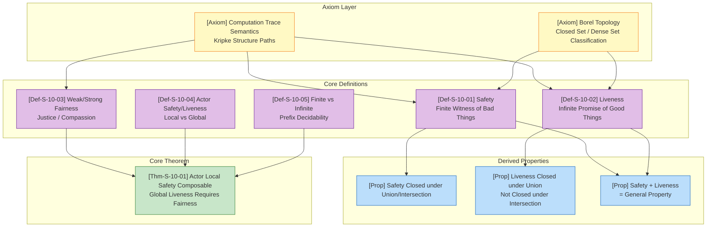
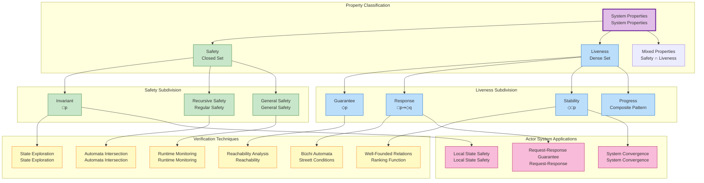
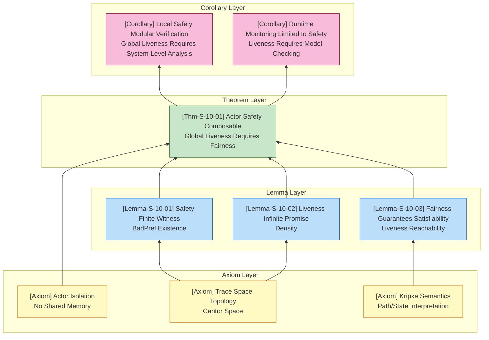

# Liveness and Safety Properties

> **Stage**: Struct | **Prerequisites**: [Related Documents] | **Formalization Level**: L3
>
> **Theoretical Positioning**: L4-L5 Core of Formal Verification | **Related**: [01.03-actor-model-formalization](../01-foundation/01.03-actor-model-formalization.md) | **Complexity**: PSPACE-complete (LTL), Polynomial Time (CTL)

---

## Table of Contents

- [Liveness and Safety Properties](#liveness-and-safety-properties)
  - [Table of Contents](#table-of-contents)
  - [1. Definitions](#1-definitions)
    - [1.1 Mathematical Foundations of Traces and Properties](#11-mathematical-foundations-of-traces-and-properties)
    - [1.2 Formal Classification System](#12-formal-classification-system)
    - [1.3 Concept Dependency Graph](#13-concept-dependency-graph)
  - [2. Properties](#2-properties)
    - [Property 2.1 (Algebraic Closure of Safety)](#property-21-algebraic-closure-of-safety)
    - [Property 2.2 (Liveness Closed under Union but Not Intersection)](#property-22-liveness-closed-under-union-but-not-intersection)
    - [Property 2.3 (Application of Alpern-Schneider Decomposition Theorem)](#property-23-application-of-alpern-schneider-decomposition-theorem)
    - [Property 2.4 (Hierarchy of Fairness Assumptions)](#property-24-hierarchy-of-fairness-assumptions)
    - [Property 2.5 (Compositional Local Safety in Actor Systems)](#property-25-compositional-local-safety-in-actor-systems)
  - [3. Relations](#3-relations)
    - [Relation 1: Safety `⊂` Closed Set (Borel Topology)](#relation-1-safety--closed-set-borel-topology)
    - [Relation 2: Liveness `≈` Dense Set](#relation-2-liveness--dense-set)
    - [Relation 3: Actor Model `⊆` Liveness Verification Requires Fairness](#relation-3-actor-model--liveness-verification-requires-fairness)
    - [Relation 4: Safety `↦` Runtime Monitoring, Liveness `↦` Model Checking](#relation-4-safety--runtime-monitoring-liveness--model-checking)
  - [4. Argumentation](#4-argumentation)
    - [Lemma 4.1 (Finiteness of Safety Determination) \[^5\]](#lemma-41-finiteness-of-safety-determination-5)
    - [Lemma 4.2 (Infiniteness of Liveness Determination) \[^5\]](#lemma-42-infiniteness-of-liveness-determination-5)
    - [Lemma 4.3 (Fairness Guarantees Liveness Satisfiability)](#lemma-43-fairness-guarantees-liveness-satisfiability)
  - [5. Proofs](#5-proofs)
    - [Theorem 5.1 (Compositionality Theorem for Safety and Liveness in Actor Systems)](#theorem-51-compositionality-theorem-for-safety-and-liveness-in-actor-systems)
  - [6. Examples](#6-examples)
    - [6.1 Example: Safety and Liveness of Mutual Exclusion Protocol](#61-example-safety-and-liveness-of-mutual-exclusion-protocol)
    - [6.2 Counterexample: Liveness Cannot Be Runtime Monitored](#62-counterexample-liveness-cannot-be-runtime-monitored)
    - [6.3 Counterexample: Insufficient Fairness Leads to Liveness Failure](#63-counterexample-insufficient-fairness-leads-to-liveness-failure)
    - [6.4 Counterexample: Actor Message Accumulation Causing Liveness Violation](#64-counterexample-actor-message-accumulation-causing-liveness-violation)
  - [7. Visualizations](#7-visualizations)
    - [Figure 7.1 Safety and Liveness Classification Tree](#figure-71-safety-and-liveness-classification-tree)
    - [Figure 7.2 Axiom-Theorem Inference Tree](#figure-72-axiom-theorem-inference-tree)
    - [Figure 7.3 Safety-Liveness Decomposition and Verification Method Mapping](#figure-73-safety-liveness-decomposition-and-verification-method-mapping)
  - [8. References](#8-references)
  - [Related Documents](#related-documents)

---

## 1. Definitions

### 1.1 Mathematical Foundations of Traces and Properties

**Definition 1 (Computation Trace)** [^1].

Let $\Sigma = 2^{AP}$ be the alphabet consisting of the power set of atomic propositions, where $AP$ is the set of atomic propositions describing system states.

**Finite Trace**: $\Sigma^* = \bigcup_{n \geq 0} \Sigma^n$ denotes the set of all finite state sequences.

**Infinite Trace**: $\Sigma^\omega$ denotes the set of all infinite state sequences ($\omega$-sequences).

**Mixed Trace Space**: $\Sigma^\infty = \Sigma^* \cup \Sigma^\omega$ contains both finite and infinite traces.

For trace $\pi = s_0 s_1 s_2 \dots \in \Sigma^\infty$, let $pref(\pi)$ denote the set of all its finite prefixes:

$$
pref(\pi) = \{s_0 s_1 \dots s_k \mid k \geq 0\} \cap \Sigma^*
$$

**Intuitive Explanation**: A trace is the historical record of a system execution. Finite traces correspond to terminating or truncated executions, while infinite traces correspond to continuously running systems (e.g., servers, Actor systems).

**Motivation for Definition**: Without distinguishing between finite and infinite traces, it is impossible to formally define properties involving infinite futures, such as "will eventually happen."

---

**Definition 2 (Safety Property)** [^2].

A property $P \subseteq \Sigma^\omega$ is a **safety property** if and only if:

$$
\forall w \in \Sigma^\omega: w \notin P \implies \exists u \in pref(w): \forall v \in \Sigma^\omega: uv \notin P
$$

Equivalent formulation (topological closure): $P = closure(P)$, where $closure(P) = \{w \mid \forall u \in pref(w): \exists v: uv \in P\}$.

**Intuitive Explanation**: "Nothing bad ever happens." Any infinite trace violating safety has a **finite prefix** that witnesses the violation — once this prefix appears, no matter how the system evolves afterward, the property can no longer be satisfied.

**Motivation for Definition**: Safety corresponds to the "error avoidance" requirements of a system (e.g., no null pointer access, no deadlock, no mutual exclusion violation). Its detectability characteristic provides clear decision criteria for runtime monitoring and model checking.

---

**Definition 3 (Liveness Property)** [^2].

A property $P \subseteq \Sigma^\omega$ is a **liveness property** if and only if:

$$
\forall u \in \Sigma^*: \exists w \in \Sigma^\omega: uw \in P
$$

**Intuitive Explanation**: "Something good eventually happens." Any finite execution prefix can be extended by appropriate continuation into an infinite trace satisfying the property — no finite prefix can "permanently exclude" the possibility of the property being satisfied.

**Motivation for Definition**: Liveness corresponds to the "progress guarantee" requirements of a system (e.g., requests will eventually be responded to, processes will eventually acquire resources, the system will eventually converge). Unlike safety, violations of liveness can only be observed and confirmed over infinite time, which makes its verification require well-founded relations or fairness assumptions.

---

**Definition 4 (Fairness)** [^3].

Let $M = (S, S_0, R, L)$ be a Kripke structure, and $enabled(s) \subseteq R$ denote the set of transitions executable in state $s$.

**Weak Fairness (Justice)**: For transition set $T \subseteq R$, path $\pi = s_0 s_1 \dots$ satisfies weak fairness if and only if:

$$
(\forall i: \exists j \geq i: (s_j, s_{j+1}) \in T) \implies (\exists^\infty k: (s_k, s_{k+1}) \in T)
$$

That is: if transition $T$ is infinitely often enabled, then it must be infinitely often selected for execution.

**Strong Fairness (Compassion)**: For transition set $T \subseteq R$, path $\pi$ satisfies strong fairness if and only if:

$$
(\exists^\infty i: (s_i, s_{i+1}) \in enabled(T)) \implies (\exists^\infty k: (s_k, s_{k+1}) \in T)
$$

That is: if transition $T$ is infinitely often enabled (even if intermittently disabled), then it must be infinitely often selected for execution.

**Intuitive Explanation**: Fairness constraints exclude the possibility of a "malicious scheduler" infinitely delaying certain enabled transitions. Weak fairness guarantees that a continuously enabled transition will eventually execute; strong fairness guarantees that a repeatedly enabled transition will eventually execute.

**Motivation for Definition**: Without fairness assumptions, liveness properties cannot be proven — the system could simply violate any progress guarantee by never scheduling a critical transition. Fairness is the bridge connecting "theoretically possible" to "practically inevitable."

---

### 1.2 Formal Classification System

**Definition 5 (Finite-Trace Safety vs Infinite-Trace Liveness)** [^4].

| Dimension | Safety | Liveness |
|-----------|--------|----------|
| **Decision Timing** | Decidable in finite time | Requires observing infinite execution |
| **Violation Characteristic** | Finite witnessing prefix exists | No finite witnessing prefix |
| **Verification Methods** | Invariants, induction, state exploration | Well-founded relations, Büchi conditions, ranking functions |
| **Runtime Monitoring** | Detectable (prefix-based decision) | Not detectable (requires oracle) |
| **Temporal Logic** | $\Box p$ (always) | $\Diamond p$ (eventually) |
| **Topological Property** | Closed set | Dense set |

**Safety Hierarchy**:

- **Invariant**: $\Box p$ — atomic proposition always holds
- **Recursive Safety**: Error patterns recognizable by finite state machines
- **General Safety**: Arbitrary prefix-decidable properties

**Liveness Hierarchy**:

- **Guarantee**: $\Diamond p$ — eventually reaching some state
- **Response**: $\Box(p \Rightarrow \Diamond q)$ — request-response pattern
- **Stability**: $\Diamond\Box p$ — eventually holding forever
- **Progress**: Composite liveness patterns

---

**Definition 6 (Safety and Liveness in Actor Systems)**.

Given Actor system $\mathcal{A} = (\alpha, b, m, \sigma)$ (see [01.03-actor-model-formalization](../01-foundation/01.03-actor-model-formalization.md)):

**Local Safety**: Property $S_{local}(\alpha)$ concerning a single Actor's internal state:

$$
\forall t: state_\alpha(t) \notin BadState
$$

**Global Safety**: Property $S_{global}(\mathcal{A})$ concerning interactions among a set of Actors:

$$
\forall t: \forall \alpha_i, \alpha_j \in \mathcal{A}: \neg Conflicting(\alpha_i, \alpha_j, t)
$$

**Local Liveness**: Message processing guarantee for a single Actor $L_{local}(\alpha)$:

$$
\forall msg \in mailbox_\alpha: \Diamond processed(msg)
$$

**Global Liveness**: Overall system progress guarantee $L_{global}(\mathcal{A})$:

$$
\Diamond\Box SystemConverged
$$

---

### 1.3 Concept Dependency Graph



---

## 2. Properties

### Property 2.1 (Algebraic Closure of Safety)

**Statement**: Safety properties are closed under **finite intersection** and **arbitrary union** (under appropriate conditions).

**Derivation**:

1. Let $S_1, S_2$ be safety properties. We prove $S_1 \cap S_2$ is also safety:
   - If $w \notin S_1 \cap S_2$, then $w \notin S_1$ or $w \notin S_2$
   - If $w \notin S_1$, by the safety definition, there exists a finite prefix $u_1$ witnessing the violation
   - This prefix also witnesses $w \notin S_1 \cap S_2$
   - Therefore $S_1 \cap S_2$ is safety

2. For arbitrary union: Let $\{S_i\}_{i \in I}$ be a family of safety properties. $S = \bigcap_{i \in I} S_i$ (intersection) preserves safety.

**Conclusion**: Safety properties form a family of closed sets in the topological space.

---

### Property 2.2 (Liveness Closed under Union but Not Intersection)

**Statement**: Liveness properties are closed under **finite union**, but not under **intersection**.

**Derivation**:

1. **Closure under Union**: Let $L_1, L_2$ be liveness properties. We prove $L_1 \cup L_2$ is also liveness:
   - For any finite prefix $u$, there exists $w_1$ such that $uw_1 \in L_1$ (by liveness of $L_1$)
   - Therefore $uw_1 \in L_1 \cup L_2$
   - Hence $L_1 \cup L_2$ satisfies the liveness definition

2. **Not Closed under Intersection** (Counterexample):
   - Let $L_1 = \{w \mid w \text{ contains infinitely many } a\}$
   - Let $L_2 = \{w \mid w \text{ contains infinitely many } b\}$
   - Both are liveness (any prefix can be extended to contain more $a$ or $b$)
   - But $L_1 \cap L_2 = \{w \mid w \text{ contains infinitely many } a \text{ and } b\}$
   - Consider prefix $u = a^n$; if only $a$ follows, then $L_2$ cannot be entered
   - A strict proof requires constructing a concrete system

**Conclusion**: Liveness properties form a family of dense sets in the topological space, but not a filter.

---

### Property 2.3 (Application of Alpern-Schneider Decomposition Theorem)

**Statement** [^2]: Any $\omega$-regular property (and thus any LTL-definable property) can be uniquely decomposed into the intersection of a safety property and a liveness property:

$$
P = P_{safe} \cap P_{live}
$$

Where $P_{safe} = closure(P)$ and $P_{live} = P \cup (\Sigma^\omega \setminus closure(P))$.

**Derivation**:

1. **Existence**: For any property $P$, construct:
   - $P_{safe} = \{w \mid \forall u \in pref(w): \exists v: uv \in P\}$
   - $P_{live} = P \cup (\Sigma^\omega \setminus P_{safe})$

2. **Verify $P_{safe}$ is safety**:
   - If $w \notin P_{safe}$, then there exists $u \in pref(w)$ such that $\forall v: uv \notin P$
   - This $u$ is also a witness for $w \notin P_{safe}$

3. **Verify $P_{live}$ is liveness**:
   - For any finite $u$, either:
     - $\exists v: uv \in P$, then $uv \in P_{live}$
     - Or $\forall v: uv \notin P$, then $u$ cannot be extended into $P_{safe}$, so any extension of $u$ lies in $\Sigma^\omega \setminus P_{safe} \subseteq P_{live}$

4. **Verify $P = P_{safe} \cap P_{live}$**:
   - $P \subseteq P_{safe} \cap P_{live}$: obvious
   - $P_{safe} \cap P_{live} \subseteq P$: If $w \in P_{safe} \cap P_{live}$ but $w \notin P$, then $w \in \Sigma^\omega \setminus P_{safe}$, contradiction

**Conclusion**: Any system property can be decomposed into the conjunction of "not making errors" and "making progress," providing a theoretical foundation for phased verification.

---

### Property 2.4 (Hierarchy of Fairness Assumptions)

**Statement**: Strong fairness implies weak fairness, but not vice versa:

$$
StrongFairness \implies WeakFairness
$$

**Derivation**:

1. If transition $T$ is continuously enabled (weak fairness premise), then it is certainly infinitely often enabled (strong fairness premise)
2. The strong fairness conclusion (infinitely often executed) is exactly the weak fairness conclusion
3. Counterexample for the reverse:
   - Construct a system where transition $T$ is enabled at odd steps and disabled at even steps
   - $T$ is not continuously enabled (violating weak fairness premise)
   - But $T$ is infinitely often enabled (satisfying strong fairness premise)
   - If $T$ is never executed, strong fairness is violated but weak fairness is not

**Conclusion**: Strong fairness is a stronger constraint that can prove more liveness properties, but with higher verification complexity.

---

### Property 2.5 (Compositional Local Safety in Actor Systems)

**Statement**: If Actor $\alpha_1$ satisfies local safety $S_1$ and $\alpha_2$ satisfies $S_2$, and $S_1, S_2$ only involve their respective internal states, then the parallel composition $\alpha_1 \parallel \alpha_2$ satisfies $S_1 \land S_2$.

**Derivation**:

1. Core feature of the Actor model: local state isolation (no shared memory)
2. From [01.03-actor-model-formalization](../01-foundation/01.03-actor-model-formalization.md), Actors can only influence each other through message passing
3. If $S_1$ only involves $\alpha_1$'s internal state, external Actors cannot directly modify that state
4. Therefore the presence of $\alpha_2$ does not break $S_1$
5. Symmetric argument applies to $S_2$

**Conclusion**: Local safety in Actor systems is **compositional**, supporting modular verification.

---

## 3. Relations

### Relation 1: Safety `⊂` Closed Set (Borel Topology)

**Argument**:

- In the Cantor space $\Sigma^\omega$, safety properties exactly correspond to topological closed sets
- The complement of a closed set is an open set, corresponding to the set of "possible violations"
- Safety $P = \{w \mid pref(w) \subseteq GoodPref\}$, where $GoodPref$ is the set of "good prefixes"
- This is the standard definition of a topological closed set

---

### Relation 2: Liveness `≈` Dense Set

**Argument**:

- Property $L$ is liveness $\iff$ it intersects every non-empty open set
- This is exactly the definition of a topological dense set
- The intersection of dense sets may be empty (corresponding to liveness not being closed under intersection)
- The union of dense sets and intersection with closed sets have good properties

---

### Relation 3: Actor Model `⊆` Liveness Verification Requires Fairness

**Argument**:

- Message delivery in Actor systems is asynchronous with no guaranteed timing
- Without fairness assumptions, messages may be infinitely delayed (though not lost)
- Therefore the liveness property "messages are eventually processed" requires weak fairness assumptions
- Global liveness (e.g., consensus achievement) usually requires strong fairness

---

### Relation 4: Safety `↦` Runtime Monitoring, Liveness `↦` Model Checking

**Argument**:

| Property Type | Verification Technique | Basis of Applicability |
|---------------|------------------------|------------------------|
| Safety | Runtime monitoring | Finite prefix decidable, online detection |
| Safety | Model checking | State exploration, invariant checking |
| Liveness | Model checking | Büchi automata, Streett conditions |
| Liveness | Theorem proving | Well-founded relations, temporal induction |
| Liveness | Runtime monitoring | **Infeasible** (requires infinite observation) |

---

## 4. Argumentation

### Lemma 4.1 (Finiteness of Safety Determination) [^5]

**Statement (Lemma-S-10-01)**: Property $P$ is safety if and only if there exists a finite prefix set $BadPref \subseteq \Sigma^*$ such that:

$$
w \in P \iff pref(w) \cap BadPref = \emptyset
$$

**Proof**:

**($\Rightarrow$)**: Let $P$ be safety. Define:

$$
BadPref = \{u \in \Sigma^* \mid \forall v \in \Sigma^\omega: uv \notin P\}
$$

- If $pref(w) \cap BadPref \neq \emptyset$, let $u \in pref(w) \cap BadPref$
- Then $w = uv$ for some $v$, but $uv \notin P$ (by definition of $BadPref$)
- Therefore $w \notin P$

- Conversely, if $w \notin P$, by the safety definition, there exists $u \in pref(w)$ such that $\forall v: uv \notin P$
- This $u \in BadPref$ and $u \in pref(w)$, hence $pref(w) \cap BadPref \neq \emptyset$

**($\Leftarrow$)**: Let there exist $BadPref$ satisfying the condition. If $w \notin P$, then $pref(w) \cap BadPref \neq \emptyset$.
Take $u \in pref(w) \cap BadPref$, then for any $v$, $uv$ has $u$ as prefix, hence $uv \notin P$.
Therefore $P$ satisfies the safety definition.

∎

---

### Lemma 4.2 (Infiniteness of Liveness Determination) [^5]

**Statement (Lemma-S-10-02)**: If $P$ is a non-trivial liveness property ($P \neq \Sigma^\omega$), then for any finite prefix $u$, there exist infinite traces $w_1, w_2$ such that $uw_1 \in P$ and $uw_2 \notin P$.

**Proof**:

1. By the liveness definition, for any $u$, there exists $w_1$ such that $uw_1 \in P$
2. Since $P \neq \Sigma^\omega$, there exists some $w' \notin P$
3. If $w'$ has $u$ as prefix (i.e., $w' = uv$), take $w_2 = v$ and we are done
4. If $w'$ does not have $u$ as prefix, construct:
   - By liveness, there exists $w''$ such that $uw'' \in P$
   - Consider a variant of $w''' = uw''$ that is not in $P$ (using non-triviality of $P$)

A strict proof requires utilizing the density and topological properties of $P$.

∎

---

### Lemma 4.3 (Fairness Guarantees Liveness Satisfiability)

**Statement (Lemma-S-10-03)**: Let $\phi = \Diamond p$ be a basic liveness property and $M$ a finite Kripke structure. Then $M \vDash_{WF} \Diamond p$ (satisfied under weak fairness assumption) if and only if from every reachable state there exists a **fair path** reaching a $p$-state.

**Proof Sketch**:

1. **($\Rightarrow$)**: If $M \vDash_{WF} \Diamond p$, assume there exists some state $s$ whose all fair paths do not reach $p$
2. Then these paths form a non-empty fair path set, contradicting the semantics
3. **($\Leftarrow$)**: If from every state there exists a fair path reaching $p$, consider any fair path
4. If this path never reaches $p$, it violates the assumption that "from every state there exists a fair path reaching $p$"
5. By finiteness, the path must eventually reach $p$

∎

---

## 5. Proofs

### Theorem 5.1 (Compositionality Theorem for Safety and Liveness in Actor Systems)

**Theorem Statement (Thm-S-10-01)**: In Actor systems, local safety properties are **compositional** — parallel composition preserves each component's local safety properties; but global liveness properties are **not compositional** — proving global liveness usually requires fairness assumptions.

**Formalization**:

Let $\mathcal{A}_1, \mathcal{A}_2$ be two Actors, and $\mathcal{A} = \mathcal{A}_1 \parallel \mathcal{A}_2$ their parallel composition:

1. **Local Safety Compositionality**:
   $$
   \forall i \in \{1, 2\}: \mathcal{A}_i \vDash S_{local}(\alpha_i) \implies \mathcal{A} \vDash S_{local}(\alpha_1) \land S_{local}(\alpha_2)
   $$

2. **Global Liveness Non-Compositionality**:
   $$
   \exists L_{global}: \mathcal{A}_1 \vDash L_{local} \land \mathcal{A}_2 \vDash L_{local} \land \mathcal{A} \not\vDash L_{global}
   $$
   Unless fairness assumptions are introduced: $WF(\mathcal{A}_1) \land WF(\mathcal{A}_2) \implies \mathcal{A} \vDash L_{global}$

**Proof**:

**Part 1: Local Safety Compositionality**

Let $S_{local}(\alpha_1)$ be a safety property involving only $\mathcal{A}_1$'s internal state:

1. By Actor model axioms ([01.03-actor-model-formalization](../01-foundation/01.03-actor-model-formalization.md)), Actors have:
   - State isolation: $state_{\alpha_1}$ cannot be directly accessed by $\mathcal{A}_2$
   - Asynchronous communication: influence can only occur through message passing

2. Assume $\mathcal{A} \not\vDash S_{local}(\alpha_1)$
3. By the safety definition, there exists a finite execution prefix $\pi = s_0 \dots s_k$ witnessing the violation
4. The state changes in this prefix can only be:
   - Local transitions of $\mathcal{A}_1$, or
   - Receiving messages from $\mathcal{A}_2$

5. Construct the projection execution $\pi|_{\mathcal{A}_1}$ containing only $\mathcal{A}_1$
6. Since message reception in Actor semantics is deterministic (messages arrive in the mailbox), the same violation would appear in isolated $\mathcal{A}_1$
7. Therefore $\mathcal{A}_1 \not\vDash S_{local}(\alpha_1)$, contradicting the premise
8. Hence $\mathcal{A} \vDash S_{local}(\alpha_1)$

Symmetric argument applies to $\mathcal{A}_2$.

**Part 2: Global Liveness Non-Compositionality**

Construct a counterexample to illustrate why fairness is needed:

**Counterexample Construction**:

- $\mathcal{A}_1$: Client Actor, repeatedly sending requests
- $\mathcal{A}_2$: Server Actor, processing requests and responding

**Local Liveness**:

- $\mathcal{A}_1 \vDash \Diamond\Box(\text{request sent})$ (eventually continuously sending)
- $\mathcal{A}_2 \vDash \Diamond\Box(\text{ready to receive})$ (eventually continuously ready)

**Global Liveness (Desired)**: $L_{global} = \Diamond\Box(\text{request processed})$

**Violation Scenario (No Fairness)**:

1. The scheduler always chooses to execute $\mathcal{A}_1$, never scheduling $\mathcal{A}_2$
2. Although both are "ready," $\mathcal{A}_2$ never executes
3. Requests accumulate in $\mathcal{A}_2$'s mailbox but are never processed
4. Global liveness $L_{global}$ is violated

**Fairness Fix**:
Introduce **weak fairness assumption** $WF(\mathcal{A}_2)$:

- If $\mathcal{A}_2$ is continuously enabled (has messages pending), it must execute infinitely often
- Under this assumption, $\mathcal{A}_2$ must eventually process requests
- Therefore $\mathcal{A} \vDash_{WF} L_{global}$

**Key Case Analysis**:

| Case | Condition | Conclusion |
|------|-----------|------------|
| Case 1 | Strongly isolated Actors, no message dependency | Local safety fully independent, global liveness requires weak fairness |
| Case 2 | Supervision tree dependency (Erlang style) | Failure propagation affects safety, restart strategy affects liveness |
| Case 3 | Distributed Actors, network partition | Fairness assumptions may fail, additional consensus mechanism required |

**Boundary Conditions**:

- Fairness assumptions in **finite Actor systems** can be implemented via round-robin scheduling
- In systems with **dynamic Actor creation**, fairness needs to extend to infinite sets, making implementation more complex
- **Priority scheduling** may violate fairness, requiring explicit priority escalation mechanisms

∎

---

## 6. Examples

### 6.1 Example: Safety and Liveness of Mutual Exclusion Protocol

**Scenario**: A mutual exclusion protocol where two processes compete for a critical section.

**Safety Property**:

```
S_mutex = □¬(in_crit₁ ∧ in_crit₂)
```

"Two processes will not be in the critical section simultaneously."

**Verification Methods**:

- Invariant checking: Check whether the state space contains forbidden states
- Runtime monitoring: Detect prefixes where both enter the critical section simultaneously

**Liveness Property**:

```
L_no_starvation = □(request₁ ⇒ ◇enter₁)
```

"If process 1 requests, it will eventually enter."

**Verification Methods**:

- Requires weak fairness: if process 1 continuously requests, the scheduler cannot ignore it forever
- Well-founded relation: prove that waiting time has an upper bound

---

### 6.2 Counterexample: Liveness Cannot Be Runtime Monitored

**Counterexample Statement**: No runtime monitor can determine in finite time that property $\Diamond p$ (eventually $p$) is violated.

**Step-by-Step Derivation**:

1. Assume there exists a monitor $Mon$ that determines $\Diamond p$ is violated after observing a finite prefix
2. Let $Mon$ output "violated" after observing prefix $u = s_0 \dots s_k$
3. By the liveness definition, for any finite $u$, there exists $w$ such that $uw \vDash \Diamond p$
4. Construct $w = s_{k+1} s_{k+2} \dots$ such that $p$ holds at some $s_{k+n}$
5. Then $uw \vDash \Diamond p$, but $Mon$ has already determined "violated"
6. Contradiction!

**Conclusion**: Runtime monitoring can only detect safety violations, not liveness violations.

---

### 6.3 Counterexample: Insufficient Fairness Leads to Liveness Failure

**Scenario**: Dining Philosophers problem, 5 philosophers, 5 forks.

**Liveness Goal**: Each philosopher eventually gets to eat ($\Diamond eat_i$)

**Violation without Fairness**:

- The scheduler always chooses philosophers 1 and 3 to pick up forks simultaneously
- Philosophers 2, 4, 5 wait forever (forks are occupied)
- Although each philosopher "eventually" puts down forks (weak fairness satisfied)
- Philosopher 2 may never get both forks

**Strong Fairness Requirement**:

- Strong fairness is needed to guarantee: if philosopher 2 is infinitely often "able to eat" (both forks available), he must be allowed to eat
- Or introduce priority / randomization to break symmetry

---

### 6.4 Counterexample: Actor Message Accumulation Causing Liveness Violation

**Scenario**: Erlang-style Actor system

```erlang
% Producer Actor
producer() ->
    receive
        {produce, N} ->
            consumer ! {data, N},
            producer()
    end.

% Consumer Actor
consumer() ->
    receive
        {data, N} ->
            process(N),  % Time-consuming operation
            consumer()
    end.
```

**Violation Scenario**:

1. Producer speed >> Consumer speed
2. Consumer mailbox accumulates infinitely
3. Although messages will "eventually" be processed (no loss)
4. But delay for new messages grows unboundedly
5. From the producer's perspective, the liveness "messages are processed in time" is violated

**Solutions**:

- Backpressure mechanism
- Flow control (Actor count limitation)
- Priority queue

---

## 7. Visualizations

### Figure 7.1 Safety and Liveness Classification Tree



**Figure Explanation**:

- Purple root node: The two main categories of system properties
- Green branch: Safety properties and their verification techniques
- Blue branch: Liveness properties and their verification techniques
- Yellow nodes: Verification methods
- Pink nodes: Specific applications in Actor systems

---

### Figure 7.2 Axiom-Theorem Inference Tree



---

### Figure 7.3 Safety-Liveness Decomposition and Verification Method Mapping

| Property Category | Formal Definition | Verification Technique | Complexity | Actor System Example |
|-------------------|-------------------|------------------------|------------|----------------------|
| **Invariant** | $\Box p$ | State exploration, invariant checking | PTIME | Mailbox size does not exceed limit |
| **Recursive Safety** | Regular BadPref | Automata intersection | PSPACE | Message format correctness |
| **General Safety** | Closed set | Runtime monitoring | O(1) space | No duplicate processing |
| **Guarantee** | $\Diamond p$ | Reachability | PTIME | Message eventually sent |
| **Response** | $\Box(p\Rightarrow\Diamond q)$ | Büchi automata | PSPACE | Request-response |
| **Stability** | $\Diamond\Box p$ | Streett, ranking function | EXPTIME | System convergence |
| **With Fairness** | $\phi$ under $WF$ | Fair model checking | PSPACE | Fair scheduling guarantee |

---

## 8. References

[^1]: Lamport, L. (1977). "Proving the Correctness of Multiprocess Programs". *IEEE Transactions on Software Engineering*.

[^2]: Alpern, B., & Schneider, F. B. (1985). "Defining Liveness". *Information Processing Letters*, 21(4), 181-185.

[^3]: Manna, Z., & Pnueli, A. (1992). *The Temporal Logic of Reactive and Concurrent Systems*. Springer-Verlag.

[^4]: Alpern, B., & Schneider, F. B. (1987). "Recognizing Safety and Liveness". *Distributed Computing*, 2(3), 117-126.

[^5]: Baier, C., & Katoen, J. P. (2008). *Principles of Model Checking*. MIT Press.

---

## Related Documents

- [01.03-actor-model-formalization](../01-foundation/01.03-actor-model-formalization.md) — Actor Model Formalization
- [00-INDEX.md](../00-INDEX.md) — Concurrent Composition Theory
- [00-INDEX.md](../00-INDEX.md) — Temporal Logic Analysis

---

*Document version: v1.0 | Translation date: 2026-04-24*
