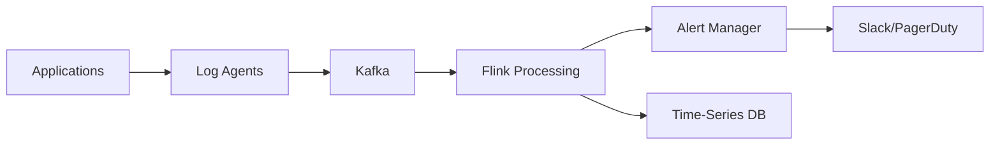

# Business Pattern: Log Analysis & Monitoring

> **Stage**: Knowledge/03-business-patterns | **Prerequisites**: [Streaming ETL](streaming-etl.md) | **Formalization Level**: L3-L4
> **Translation Date**: 2026-04-21

## Abstract

This pattern addresses large-scale distributed system log collection, real-time analysis, anomaly detection, and alerting using Flink-based high-throughput, Schema-on-Read solutions.

---

## 1. Definitions

### Def-K-03-04 (Log Monitoring Scenario)

$$\mathcal{L} = (S, P, A, T, \Omega)$$

where:

- $S$: log sources (semi-structured log streams)
- $P$: parsing functions (Schema-on-Read)
- $A$: alerting rules
- $T$: time windows for aggregation
- $\Omega$: notification channels

### Def-K-03-05 (Schema-on-Read Parsing)

**Schema-on-Read** defers schema enforcement to query time, allowing flexible log formats:

```java
// Parse JSON log with dynamic fields
DataStream<LogEvent> logs = rawLogs
    .map(json -> new ObjectMapper().readValue(json, LogEvent.class));
```

### Def-K-03-06 (Alert Storm Suppression)

**Alert storm suppression** prevents notification floods during incidents:

- Deduplication: same alert within window → single notification
- Grouping: related alerts → grouped incident
- Rate limiting: max N alerts per minute

---

## 2. Architecture



---

## 3. Key Metrics

| Metric | Target | Measurement |
|--------|--------|-------------|
| Ingestion throughput | > 1M logs/s | Records/sec |
| Alert latency | < 5s | End-to-end |
| Parse success rate | > 99.9% | Percentage |
| False positive rate | < 1% | Percentage |

---

## 4. References
