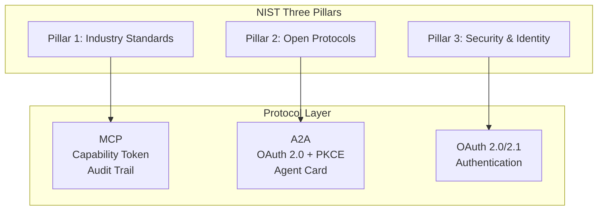

# MCP/A2A Security Governance and NIST AI Agent Standards (2026)

> **Stage**: Flink/06-ai-ml | **Prerequisites**: [Flink MCP Protocol Integration](flink-mcp-protocol-integration.md) | **Formalization Level**: L3-L4
> **Translation Date**: 2026-04-21

## Abstract

NIST's three-pillar framework for AI Agent standardization establishes interoperability, security, and identity standards. This document maps MCP and A2A security mechanisms to enterprise compliance frameworks.

---

## 1. Definitions

### Def-F-06-12-01 (NIST AI Agent Standards Initiative)

NIST's three-pillar framework launched January 2026:

1. **Industry standards development**: ISO/IEC/ITU specifications
2. **Community-driven open protocols**: MCP, A2A, OAuth
3. **AI Agent security and identity**: SPIFFE/SPIRE reference implementations

### Def-F-06-12-02 (MCP Security Compliance)

Model Context Protocol security requirements:

- Capability-based token access control
- Audit trails
- Least privilege principle
- Input validation

NIST designated MCP as "leading open standard" in February 2026.

### Def-F-06-12-03 (A2A Security Profile)

Agent-to-Agent Protocol security mechanisms:

- OAuth 2.0 + PKCE for authentication
- Agent Card security claims for capability exposure

### Def-F-06-12-04 (Agent Identity Protocol — AIP)

Defines AI Agent identity, authentication, and authorization in distributed environments. SPIFFE/SPIRE is the reference implementation.

---

## 2. Properties

### Lemma-F-06-12-01 (MCP and A2A Security Complementarity)

- **MCP**: Vertical security (Agent-to-Tool, single-agent multi-tool permission control)
- **A2A**: Horizontal security (Agent-to-Agent, cross-agent identity and task authorization)

Combined coverage: complete enterprise Agent system attack surface.

### Lemma-F-06-12-02 (Capability Token Transitive Closure Security)

If MCP Server uses Capability-based Tokens, an Agent's permission set equals the union of its held tokens. Task delegation via A2A requires explicit authorization.

---

## 3. NIST Three-Pillar Mapping

---

## 4. References
