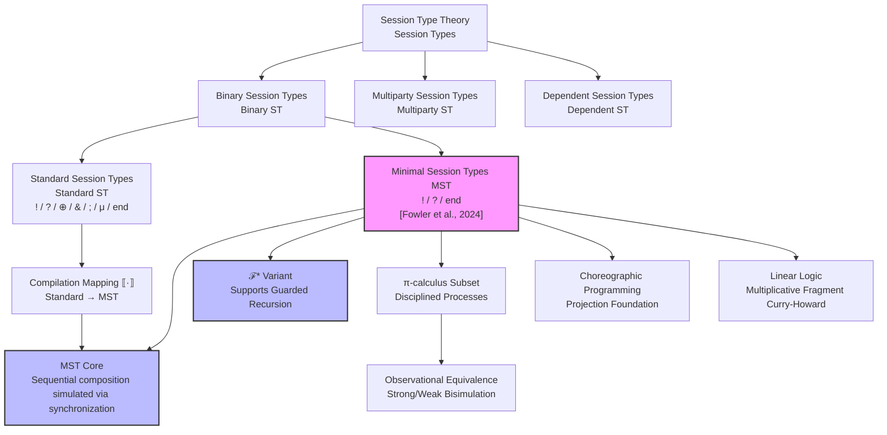
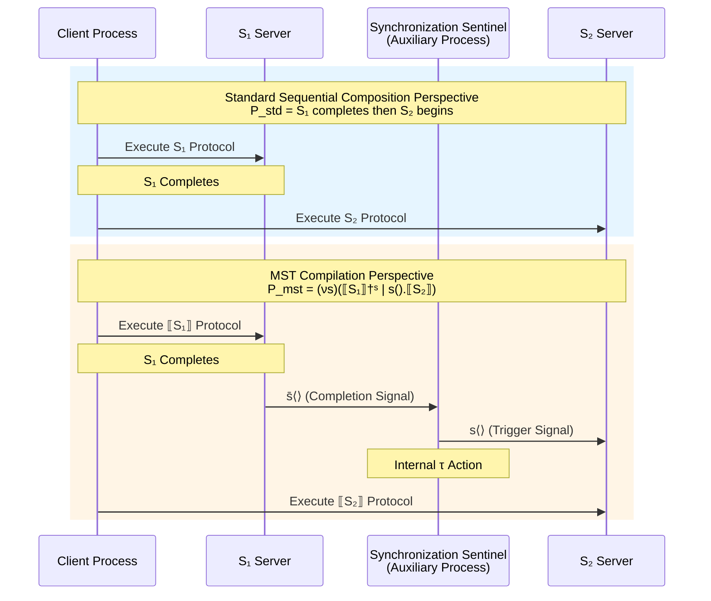
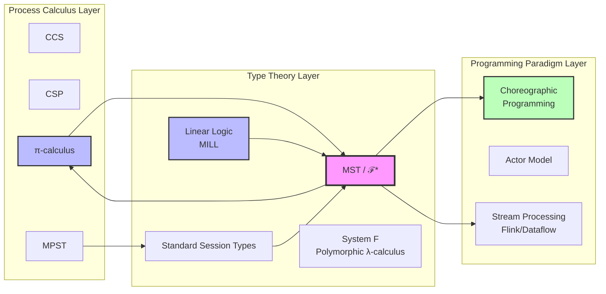

# Minimal Session Types Theory

> **Stage**: Struct/01-foundation | **Prerequisites**: [01.07-session-types.md](./01.07-session-types.md), [01.02-process-calculus-primer.md](./01.02-process-calculus-primer.md) | **Formalization Level**: L5-L6

---

## Abstract

Minimal Session Types (MST) represent the latest breakthrough in session type theory along the "minimization" and "simplification" axis. In January 2024, the arXiv paper "Minimal Session Types for the π-calculus" systematically proved that all standard session types in the π-calculus can be compiled into a minimal session type system containing only three constructors: output ($!$), input ($?$), and termination ($\text{end}$), without requiring an explicit sequential composition operator—sequentiality can be precisely simulated through additional process synchronization. This document, at formalization levels L5–L6, fully elaborates the syntax and semantics of MST, establishes formal relationships between MST and standard session types, π-calculus, linear logic, and Choreographic Programming, rigorously proves the expressive equivalence theorem of MST, and analyzes the ℱ* optimized variant's support for recursive types and its profound impact on compiler design and type-checking algorithms.

---

## Table of Contents

- [Minimal Session Types Theory](#minimal-session-types-theory)
  - [Abstract](#abstract)
  - [Table of Contents](#table-of-contents)
  - [1. Definitions](#1-definitions)
    - [Def-S-11-01. Minimal Session Types Syntax](#def-s-11-01-minimal-session-types-syntax)
    - [Def-S-11-02. Standard Session Types Syntax](#def-s-11-02-standard-session-types-syntax)
    - [Def-S-11-03. MST Typing Environment](#def-s-11-03-mst-typing-environment)
    - [Def-S-11-04. π-Calculus Core Syntax](#def-s-11-04-π-calculus-core-syntax)
    - [Def-S-11-05. MST Duality](#def-s-11-05-mst-duality)
    - [Def-S-11-06. Sequentiality Simulation Protocol](#def-s-11-06-sequentiality-simulation-protocol)
    - [Def-S-11-07. ℱ* Optimised Variant Syntax](#def-s-11-07-ℱ-optimised-variant-syntax)
    - [Def-S-11-08. Recursive Type Unfolding](#def-s-11-08-recursive-type-unfolding)
    - [Def-S-11-09. Compilation Mapping ·](#def-s-11-09-compilation-mapping-)
    - [Def-S-11-10. Observational Equivalence](#def-s-11-10-observational-equivalence)
  - [2. Properties](#2-properties)
    - [Lemma-S-11-01. MST Linear Usage Preservation](#lemma-s-11-01-mst-linear-usage-preservation)
    - [Lemma-S-11-02. Type Preservation Under Compilation Mapping](#lemma-s-11-02-type-preservation-under-compilation-mapping)
    - [Lemma-S-11-03. ℱ* Variant Recursive Type Normalization](#lemma-s-11-03-ℱ-variant-recursive-type-normalization)
    - [Lemma-S-11-04. Upper Bound on Extra Processes for Sequentiality Simulation](#lemma-s-11-04-upper-bound-on-extra-processes-for-sequentiality-simulation)
    - [Prop-S-11-01. Necessity of Minimal Constructors](#prop-s-11-01-necessity-of-minimal-constructors)
    - [Prop-S-11-02. Duality Preservation Under Compilation Mapping](#prop-s-11-02-duality-preservation-under-compilation-mapping)
  - [3. Relations](#3-relations)
    - [3.1 Encoding Relation Between MST and Standard Session Types](#31-encoding-relation-between-mst-and-standard-session-types)
    - [3.2 Embedding Relation Between MST and π-calculus](#32-embedding-relation-between-mst-and-π-calculus)
    - [3.3 Curry-Howard Correspondence Between MST and Linear Logic](#33-curry-howard-correspondence-between-mst-and-linear-logic)
    - [3.4 Connection Between MST and Choreographic Programming](#34-connection-between-mst-and-choreographic-programming)
    - [3.5 Theoretical Mapping Between MST and Stream Processing Systems](#35-theoretical-mapping-between-mst-and-stream-processing-systems)
  - [4. Argumentation](#4-argumentation)
    - [4.1 Why Can Sequential Composition Be Eliminated?](#41-why-can-sequential-composition-be-eliminated)
    - [4.2 Precision Argument for Extra Process Synchronization](#42-precision-argument-for-extra-process-synchronization)
    - [4.3 Counterexample: Non-Linear Usage Causes Protocol Failure](#43-counterexample-non-linear-usage-causes-protocol-failure)
    - [4.4 Boundary Discussion: Expressive Boundaries of MST](#44-boundary-discussion-expressive-boundaries-of-mst)
    - [4.5 Constructive Explanation: Compilation Algorithm from Standard Types to MST](#45-constructive-explanation-compilation-algorithm-from-standard-types-to-mst)
  - [5. Proof / Engineering Argument](#5-proof--engineering-argument)
    - [Thm-S-11-01. Expressive Equivalence Between MST and Standard Session Types](#thm-s-11-01-expressive-equivalence-between-mst-and-standard-session-types)
    - [Thm-S-11-02. Recursive Type Completeness of the ℱ* Variant](#thm-s-11-02-recursive-type-completeness-of-the-ℱ-variant)
    - [Thm-S-11-03. Semantic Preservation of the Compilation Mapping](#thm-s-11-03-semantic-preservation-of-the-compilation-mapping)
    - [Cor-S-11-01. MST Type Safety](#cor-s-11-01-mst-type-safety)
  - [6. Examples](#6-examples)
    - [6.1 MST Compilation of a Binary Request-Response Protocol](#61-mst-compilation-of-a-binary-request-response-protocol)
    - [6.2 Compilation Example of a Protocol with Choices](#62-compilation-example-of-a-protocol-with-choices)
    - [6.3 ℱ* Compilation of a Recursive Protocol](#63-ℱ-compilation-of-a-recursive-protocol)
    - [6.4 MST Modeling of a Stream Processing Operator Chain](#64-mst-modeling-of-a-stream-processing-operator-chain)
    - [6.5 Type Checking Algorithm Pseudocode](#65-type-checking-algorithm-pseudocode)
  - [7. Visualizations](#7-visualizations)
    - [7.1 MST Theoretical Hierarchy](#71-mst-theoretical-hierarchy)
    - [7.2 Compilation Flow from Standard Session Types to MST](#72-compilation-flow-from-standard-session-types-to-mst)
    - [7.3 Process Interaction Diagram for Sequentiality Simulation](#73-process-interaction-diagram-for-sequentiality-simulation)
    - [7.4 Relationship Diagram Between MST and Related Theories](#74-relationship-diagram-between-mst-and-related-theories)
  - [8. References](#8-references)
  - [Appendix A: Symbol Quick Reference](#appendix-a-symbol-quick-reference)

---

## 1. Definitions

### Def-S-11-01. Minimal Session Types Syntax

In January 2024, Fowler et al. proposed the Minimal Session Types (MST) theory on arXiv, compressing the core constructors of session type systems to a theoretically minimal set [^1]. Unlike standard session type systems, which contain rich constructors such as output, input, internal choice, external choice, sequential composition, recursion, and termination, MST requires only three basic constructors to express all standard session protocols.

**Definition 1.1** (Minimal Session Types Syntax). Let $U$ be a value type (base type or channel type). The syntax of minimal session types $M$ is defined as follows:

$$
\text{Def-S-11-01} \quad M ::=
\begin{cases}
!U.M & \text{(Output: send a value of type } U \text{, continue session } M) \\
?U.M & \text{(Input: receive a value of type } U \text{, continue session } M) \\
\text{end} & \text{(Session termination)}
\end{cases}
$$

**Comparison with Standard Session Types**:

| Constructor | Standard Session Types | MST | Explanation |
|-------------|------------------------|-----|-------------|
| Output | $!U.S$ | $!U.M$ | Directly preserved |
| Input | $?U.S$ | $?U.M$ | Directly preserved |
| Internal Choice | $\oplus\{l_i:S_i\}$ | **Encoded as output** | Simulated via label-value output |
| External Choice | $\&\{l_i:S_i\}$ | **Encoded as input** | Simulated via label-value input |
| Sequential Composition | $S_1 ; S_2$ | **Extra process synchronization** | Coordinated via auxiliary channels |
| Recursion | $\mu X.S$ | ℱ* variant support | See Def-S-11-07 |
| Termination | $\text{end}$ | $\text{end}$ | Directly preserved |

**Intuitive Explanation**: The minimalist syntax of MST stems from a profound observation: internal and external choices can essentially be encoded as labeled input/output operations; sequential composition can be simulated by introducing additional auxiliary processes and synchronization channels. This "desugaring" process is not a simple syntactic transformation—it requires introducing additional synchronization mechanisms at the process level to guarantee semantic equivalence.

**Motivation for the Definition**: Without compressing the session type system to a minimal set of constructors, it would be impossible to answer the core theoretical question: "Which constructors are the source of the essential expressive power of session types?" MST proves that, within the π-calculus framework, only output, input, and termination are sufficient to express all standard session protocols; choice and sequential composition are "syntactic sugar" recoverable through process encoding.

---

### Def-S-11-02. Standard Session Types Syntax

To establish a strict correspondence between MST and existing theories, we first need to formalize the complete syntax of standard session types. Here, "standard" refers to Honda's binary session types and their subsequent extensions [^4][^5].

**Definition 1.2** (Standard Session Types Syntax). Let $U$ be a value type. The syntax of standard session types $S$ is defined as follows:

$$
\text{Def-S-11-02} \quad S ::=
\begin{cases}
!U.S & \text{(Output)} \\
?U.S & \text{(Input)} \\
\oplus\{l_1:S_1, \ldots, l_n:S_n\} & \text{(Internal Choice)} \\
\&\{l_1:S_1, \ldots, l_n:S_n\} & \text{(External Choice)} \\
S_1 ; S_2 & \text{(Sequential Composition)} \\
\mu X.S & \text{(Recursive Definition)} \\
X & \text{(Recursive Variable)} \\
\text{end} & \text{(Termination)}
\end{cases}
$$

**Syntactic Restrictions** (Well-formedness Conditions):

1. **Linearity**: Each session channel must appear exactly once in the type (in an input or output position).
2. **Guardedness**: Recursive variables $X$ must appear after some prefix constructor ($!$, $?$, $\oplus$, $\&$); i.e., non-guarded types such as $\mu X.X$ are prohibited.
3. **Well-formedness of Sequential Composition**: $S_1 ; S_2$ requires $S_1$ to have $\text{end}$ as a subtype (i.e., $S_1$ must be able to terminate).

**Semantics of Sequential Composition**: $S_1 ; S_2$ means first fully executing $S_1$, and after $S_1$ reaches a terminated state, continuing with $S_2$. At the process level, this usually corresponds to two consecutive phases of a protocol on the same channel:

$$
\llbracket S_1 ; S_2 \rrbracket_x \approx \llbracket S_1 \rrbracket_x \text{ followed by } \llbracket S_2 \rrbracket_x
$$

Standard session types are widely used in industry; for example, the Scribble toolchain, Rust's session-types library, and the Mungo type checker are all based on this syntax.

---

### Def-S-11-03. MST Typing Environment

MST type judgments need to be performed in an environment that tracks variable types and the type obligations of session channels.

**Definition 1.3** (MST Typing Environment). An MST typing environment $\Delta$ is a partial function mapping session channels to MST types:

$$
\text{Def-S-11-03} \quad \Delta ::= \emptyset \;|\; \Delta, x:M
$$

Where $x$ is a channel name and $M$ is a minimal session type. The environment satisfies the following constraints:

1. **Linearity Constraint**: $\Delta$ is a linear environment; each channel name $x$ appears at most once in the domain:
   $$
   x:M_1 \in \Delta \land x:M_2 \in \Delta \implies M_1 = M_2
   $$

2. **Duality Consistency**: If process $P$ contains parallel composition $P_1 \mid P_2$, and $x$ appears in both $P_1$ and $P_2$, then:
   $$
   \Gamma \vdash P_1 :: \Delta_1, x:M_1 \quad \text{and} \quad \Gamma \vdash P_2 :: \Delta_2, x:M_2 \implies M_1 = \overline{M_2}
   $$

3. **Environment Composition**: Two environments $\Delta_1$ and $\Delta_2$ are composable (denoted $\Delta_1 \circ \Delta_2$) if and only if they assign dual types to shared channels:
   $$
   \text{dom}(\Delta_1) \cap \text{dom}(\Delta_2) = \{x_1, \ldots, x_n\} \implies \forall i. \Delta_1(x_i) = \overline{\Delta_2(x_i)}
   $$

**Form of Type Judgment**:

$$
\Gamma \vdash P :: \Delta
$$

This means that under the value type environment $\Gamma$ (a mapping from variables to base types), process $P$ satisfies the type obligations in the session environment $\Delta$.

---

### Def-S-11-04. π-Calculus Core Syntax

The compilation target of MST is a disciplined subset of untyped π-calculus. We need to precisely define the syntax of this subset to ensure that proofs can be carried out within a strict formalization framework.

**Definition 1.4** (π-Calculus Core Syntax). The syntax of π-calculus processes $P, Q$ targeted by MST compilation is:

$$
\text{Def-S-11-04} \quad
\begin{aligned}
P, Q ::= &\; 0 \quad \text{(Null process / Termination)} \\
       |&\; \bar{a}\langle b \rangle.P \quad \text{(Output prefix — send name } b \text{ on channel } a) \\
       |&\; a(x).P \quad \text{(Input prefix — receive and bind } x \text{ on channel } a) \\
       |&\; P \mid Q \quad \text{(Parallel composition)} \\
       |&\; (\nu a)P \quad \text{(Name restriction / New channel creation)} \\
       |&\; !P \quad \text{(Replication — infinitely many parallel copies)} \\
       |&\; [a = b]P \quad \text{(Match guard)}
\end{aligned}
$$

**Structural Congruence** $\equiv$:

$$
\begin{aligned}
P \mid Q &\equiv Q \mid P \quad \text{(Commutativity)} \\
(P \mid Q) \mid R &\equiv P \mid (Q \mid R) \quad \text{(Associativity)} \\
P \mid 0 &\equiv P \quad \text{(Identity)} \\
(\nu a)(\nu b)P &\equiv (\nu b)(\nu a)P \quad \text{(Restriction exchange)} \\
(\nu a)0 &\equiv 0 \quad \text{(Restriction of null process)} \\
(\nu a)(P \mid Q) &\equiv P \mid (\nu a)Q \quad \text{if } a \notin \text{fn}(P) \text{ (Scope extrusion)}
\end{aligned}
$$

**Core Reduction Rule** (Communication reduction):

$$
\text{Def-S-11-04 (cont.)} \quad
\frac{}{
\bar{a}\langle b \rangle.P \mid a(x).Q \to P \mid Q\{b/x\}
} \quad [\text{COMM}]
$$

**Intuitive Explanation**: The core innovation of π-calculus is that channels themselves can be passed as messages (name passing / mobility). MST theory exploits this feature: when compiling sequential composition $S_1 ; S_2$ from standard session types into MST, the compiler introduces an **auxiliary synchronization channel** $s$, triggering the execution of $S_2$ via signal passing after $S_1$ completes.

---

### Def-S-11-05. MST Duality

Duality is the cornerstone of session type theory. Under MST's minimalist syntax, the definition of the duality function is also greatly simplified.

**Definition 1.5** (MST Duality Function). The duality function $\overline{M}$ maps an MST type $M$ to its complementary type:

$$
\text{Def-S-11-05} \quad
\begin{aligned}
\overline{!U.M} &=\ ?U.\overline{M} \\
\overline{?U.M} &=\ !U.\overline{M} \\
\overline{\text{end}} &=\ \text{end}
\end{aligned}
$$

**Basic Duality Theorem**:

$$
\overline{\overline{M}} = M
$$

**Correspondence with Standard Duality**: For an MST type $\llbracket S \rrbracket$ compiled from a standard type $S$, we have:

$$
\overline{\llbracket S \rrbracket} = \llbracket \overline{S} \rrbracket
$$

This property will be strictly proved in Prop-S-11-02.

**Communication Semantics of Duality**: The duality function ensures that the types of communicating parties are complementary—output corresponds to input, input corresponds to output, and termination corresponds to termination. In MST, since choice and sequential composition are encoded at the process level, duality only acts on the three basic constructors, achieving theoretical minimization.

---

### Def-S-11-06. Sequentiality Simulation Protocol

This is one of the most central innovations in MST theory. Sequential composition $S_1 ; S_2$ in standard session types has no direct counterpart in MST; instead, it is simulated by introducing additional auxiliary processes and synchronization channels.

**Definition 1.6** (Sequentiality Simulation Protocol). Let $S_1$ and $S_2$ be standard session types, and $x$ be a session channel. The compilation of sequential composition $S_1 ; S_2$ in MST is achieved by introducing a **fresh auxiliary channel** $s$ and a **synchronization process** $\text{Sync}_s$:

$$
\text{Def-S-11-06} \quad
\llbracket S_1 ; S_2 \rrbracket_x \;\triangleq\; (\nu s)\big(\llbracket S_1 \rrbracket_x^{\dagger} \mid \text{Sync}_s \mid \llbracket S_2 \rrbracket_x^{\ddagger}\big)
$$

Where:

1. $\llbracket S_1 \rrbracket_x^{\dagger}$ is a compilation variant of $S_1$ that, at the position where $S_1$ would normally terminate (i.e., when encountering $\text{end}$), additionally performs output $\bar{s}\langle \checkmark \rangle.0$ to send a completion signal on the synchronization channel $s$;

2. $\text{Sync}_s$ is the synchronization process, defined as:
   $$
   \text{Sync}_s \;\triangleq\; s(y).\bar{y}\langle \checkmark \rangle.0
   $$
   It waits for the $S_1$ completion signal, then triggers $S_2$;

3. $\llbracket S_2 \rrbracket_x^{\ddagger}$ is a compilation variant of $S_2$ that, at its starting position, additionally performs input $s(z).P$ to wait for the synchronization signal, ensuring $S_2$ only begins execution after $S_1$ completes.

**Simplified Form** (Linear two-process synchronization):

For binary sequential composition, synchronization can be simplified to:

$$
\llbracket S_1 ; S_2 \rrbracket_x \approx (\nu s)\big(\llbracket S_1 \rrbracket_x \mid s().\llbracket S_2 \rrbracket_x\big)
$$

Where the compilation of $S_1$ inserts $\bar{s}\langle \rangle$ before its termination, and the compilation of $S_2$ inserts $s().$ at its beginning.

**Intuitive Explanation**: The semantics of sequential composition $S_1 ; S_2$ is "$S_2$ can only start after $S_1$ completely finishes." In MST, which lacks a sequential composition operator, this semantics is achieved by introducing a "sentinel" process at the process level: $S_1$ reports completion to the sentinel, and the sentinel unblocks $S_2$. This simulation is **exact**, not approximate—in the sense of strong bisimulation, the MST process with synchronization is behaviorally equivalent to the standard process with sequential composition.

---

### Def-S-11-07. ℱ* Optimised Variant Syntax

The basic MST syntax does not support recursive types, which is a severe limitation in practical applications. ℱ* (read "F-star") is an optimized variant of MST that supports infinite protocols by introducing guarded recursive constructors while maintaining the minimality of the type system [^1].

**Definition 1.7** (ℱ* Optimised Variant Syntax). The syntax of ℱ* types $F$ extends MST with recursion:

$$
\text{Def-S-11-07} \quad F ::=
\begin{cases}
!U.F & \text{(Output)} \\
?U.F & \text{(Input)} \\
\mu X.F & \text{(Recursive Definition — requires guardedness)} \\
X & \text{(Recursive Variable)} \\
\text{end} & \text{(Termination)}
\end{cases}
$$

**Guardedness Constraint**: In $\mu X.F$, the recursive variable $X$ must appear after at least one input or output prefix. Formally, define the guarded context $\mathcal{G}$:

$$
\mathcal{G} ::= [!U.\mathcal{G}] \;|\; [?U.\mathcal{G}] \;|\; \square
$$

Then $\mu X.F$ is well-formed if and only if $F = \mathcal{G}[X]$ for some guarded context $\mathcal{G}$.

**Recursive Unfolding**:

$$
\mu X.F \;=\; F\{\mu X.F / X\}
$$

Where $F\{G/X\}$ denotes substituting all free occurrences of $X$ in $F$ with $G$.

**Recursive Type Duality in ℱ***:

$$
\begin{aligned}
\overline{\mu X.F} &= \mu X.\overline{F} \\
\overline{X} &= X
\end{aligned}
$$

**Design Motivation**: The core insight of ℱ* is that recursive types do not require additional sequential composition or choice constructors to maintain minimality. By requiring recursive variables to be guarded by prefixes, ℱ* ensures the well-foundedness of recursive unfolding and makes type equivalence decidable under guarded conditions.

---

### Def-S-11-08. Recursive Type Unfolding

The semantics of recursive types is understood through unfolding. In ℱ*, due to the guardedness constraint, unfolding always generates a prefix of a finite unfolding tree.

**Definition 1.8** (Recursive Type Unfolding). Let $F$ be a ℱ* type and $X$ a recursive variable. The unfolding operation $\text{unfold}$ is defined as follows:

$$
\text{Def-S-11-08} \quad
\text{unfold}(\mu X.F) = F\{\mu X.F / X\}
$$

For non-recursive types:

$$
\text{unfold}(!U.F) = !U.F, \quad \text{unfold}(?U.F) = ?U.F, \quad \text{unfold}(\text{end}) = \text{end}
$$

**Complete Unfolding Tree**: The complete unfolding of recursive type $\mu X.F$ is a potentially infinite tree $T_{\mu X.F}$ satisfying:

$$
T_{\mu X.F} = F\{T_{\mu X.F} / X\}
$$

Where tree nodes are labeled with $!U$, $?U$, or $\text{end}$.

**Unfolding Example**:

Consider the recursive type $F = \mu X.!\text{Int}.?\text{Bool}.X$ (infinitely alternating between sending integers and receiving booleans):

$$
\begin{aligned}
\text{unfold}^0(F) &= F \\
\text{unfold}^1(F) &= !\text{Int}.?\text{Bool}.F \\
\text{unfold}^2(F) &= !\text{Int}.?\text{Bool}.!\text{Int}.?\text{Bool}.F \\
&\vdots
\end{aligned}
$$

**Guardedness Guarantee**: Since $X$ is in the guarded context of $!\text{Int}.?\text{Bool}.\square$, each unfolding introduces at least two communication prefixes; therefore, finite unfoldings always generate finite-length type prefixes.

---

### Def-S-11-09. Compilation Mapping ·

The compilation mapping $\llbracket \cdot \rrbracket$ translates standard session types $S$ into MST processes (or ℱ* processes). This mapping is the core construction of MST theory, proving one direction of the expressive equivalence theorem.

**Definition 1.9** (Compilation Mapping). The compilation mapping $\llbracket S \rrbracket_x$ translates a standard session type $S$ into a π-calculus process executing on channel $x$:

$$
\text{Def-S-11-09} \quad
\begin{aligned}
\llbracket !U.S \rrbracket_x &\triangleq \bar{x}\langle y \rangle.\llbracket S \rrbracket_x \quad \text{where } y:U \\
\llbracket ?U.S \rrbracket_x &\triangleq x(y).\llbracket S \rrbracket_x \quad \text{where } y \text{ is a fresh binding} \\
\llbracket \oplus\{l_i:S_i\}_{i \in I} \rrbracket_x &\triangleq (\nu t)\big(\bar{x}\langle t \rangle.0 \mid t\{\text{case } l_i \Rightarrow \llbracket S_i \rrbracket_x\}_{i \in I}\big) \\
\llbracket \&\{l_i:S_i\}_{i \in I} \rrbracket_x &\triangleq x(t).t\{\text{case } l_i \Rightarrow \llbracket S_i \rrbracket_x\}_{i \in I} \\
\llbracket S_1 ; S_2 \rrbracket_x &\triangleq (\nu s)\big(\llbracket S_1 \rrbracket_x^{\dagger s} \mid s().\llbracket S_2 \rrbracket_x\big) \\
\llbracket \mu X.S \rrbracket_x &\triangleq \text{rec } Z.\llbracket S \rrbracket_x\{Z/X\} \\
\llbracket X \rrbracket_x &\triangleq Z \\
\llbracket \text{end} \rrbracket_x &\triangleq 0
\end{aligned}
$$

Where $\llbracket S_1 \rrbracket_x^{\dagger s}$ denotes replacing all terminations $0$ (from $\llbracket \text{end} \rrbracket_x$) in the compilation of $S_1$ with $\bar{s}\langle \rangle.0$.

**Extension of Compilation Mapping**: For processes using ℱ*, the compilation mapping is realized by replacing recursive process variables with the replication operator $!$:

$$
\llbracket \mu X.F \rrbracket_x^{\mathcal{F}^*} \triangleq (\nu z)\big(!z().\llbracket F \rrbracket_x\{z/X\} \mid \bar{z}\langle \rangle.0\big)
$$

**Intuitive Explanation**: The compilation mapping translates each constructor of standard session types into a π-calculus process:

- Output/input are directly translated into π-calculus output/input prefixes.
- Internal choice is simulated by creating a new label channel and outputting the label value.
- External choice is simulated by receiving a label channel and branching on it.
- Sequential composition is simulated by an auxiliary synchronization channel and a sentinel process.
- Recursion is realized through the replication operator $!$ for infinite unfolding.

---

### Def-S-11-10. Observational Equivalence

To prove the expressive equivalence between MST and standard session types, we need a strict process equivalence relation as a comparison baseline.

**Definition 1.10** (Observational Equivalence / Strong Bisimulation). Let $\mathcal{R}$ be a binary relation on π-calculus processes. $\mathcal{R}$ is a **strong bisimulation** if and only if for all $(P, Q) \in \mathcal{R}$:

1. If $P \xrightarrow{\alpha} P'$, then there exists $Q'$ such that $Q \xrightarrow{\alpha} Q'$ and $(P', Q') \in \mathcal{R}$.
2. If $Q \xrightarrow{\alpha} Q'$, then there exists $P'$ such that $P \xrightarrow{\alpha} P'$ and $(P', Q') \in \mathcal{R}$.

Where $\alpha$ is an action label (which can be input $a(x)$, output $\bar{a}\langle b \rangle$, or internal action $\tau$).

**Observational Equivalence** $\sim$ is the largest strong bisimulation:

$$
P \sim Q \iff \exists \mathcal{R}.\; \mathcal{R} \text{ is a strong bisimulation and } (P, Q) \in \mathcal{R}
$$

**Barbed Congruence**: For comparing session types, the more refined barbed congruence is usually used:

$$
P \dot{\sim} Q \iff \forall C[\,].\; C[P] \text{ and } C[Q] \text{ have the same barbs}
$$

Where a barb is an observable input/output capability at the top level.

**Criterion for Expressive Equivalence**: Two session type systems $\mathcal{T}_1$ and $\mathcal{T}_2$ are **expressively equivalent** if and only if there exist compilation mappings $[\![\cdot]\!]_1$ and $[\![\cdot]\!]_2$ such that:

$$
\forall S \in \mathcal{T}_1.\; \exists T \in \mathcal{T}_2.\; [\![S]\!]_1 \sim [\![T]\!]_2 \quad \text{and} \quad \forall T \in \mathcal{T}_2.\; \exists S \in \mathcal{T}_1.\; [\![T]\!]_2 \sim [\![S]\!]_1
$$

---

## 2. Properties

### Lemma-S-11-01. MST Linear Usage Preservation

**Statement**: Under the MST type system, any well-typed process $P$ satisfies the linear usage constraint on its session channels—each channel is used exactly once (input or output), and there is no competing access across different parallel branches.

**Formalization**:

$$
\text{Lemma-S-11-01} \quad \Gamma \vdash P :: x_1:M_1, \ldots, x_n:M_n \implies \forall i.\; x_i \text{ appears linearly in } P
$$

Where "appears linearly" means that $x_i$ occurs in the syntax tree of $P$ in exactly one input prefix or one output prefix, and does not appear in any sub-process of a replicated process $!Q$ (unless $x_i \notin \text{fn}(Q)$).

**Proof**:

By structural induction on process $P$:

1. **Base case $P = 0$**: The null process uses no channels; linearity holds trivially.

2. **Output prefix $P = \bar{x}\langle y \rangle.Q$**:
   - The typing rule requires $x : !U.M \in \Delta$ and $Q :: \Delta', x:M$.
   - By the induction hypothesis, $x:M$ is used linearly in $Q$.
   - In $P$, $x$ is used exactly once (in the output prefix), then continued according to $M$.

3. **Input prefix $P = x(y).Q$**:
   - The typing rule requires $x : ?U.M \in \Delta$ and $Q :: \Delta', y:U, x:M$.
   - By the induction hypothesis, $x:M$ is used linearly in $Q$.
   - In $P$, $x$ is used exactly once (in the input prefix).

4. **Parallel composition $P = Q \mid R$**:
   - The typing rule requires $Q :: \Delta_Q$ and $R :: \Delta_R$ and $\Delta_Q \circ \Delta_R = \Delta$.
   - By the induction hypothesis, $Q$ and $R$ use their channels linearly, respectively.
   - Environment composition $\circ$ requires shared channels to have dual types, so $Q$ and $R$ will not perform operations in the same direction on the same channel.

5. **Restriction $P = (\nu x)Q$**:
   - The typing rule requires $Q :: \Delta, x:M, x:\overline{M}$.
   - By the induction hypothesis, $Q$ uses both endpoints of $x$ linearly.
   - The restriction operation hides $x$, preserving linearity from the external perspective.

6. **Replication $P = !Q$**:
   - The typing rule requires $x \notin \text{fn}(Q)$ for all $x \in \Delta$.
   - Therefore, the replicated process consumes no session channels; linearity holds trivially.

In summary, MST linear usage preservation is proved. ∎

---

### Lemma-S-11-02. Type Preservation Under Compilation Mapping

**Statement**: If a standard session type $S$ is well-formed, then its MST compilation $\llbracket S \rrbracket_x$ is a well-typed MST process. That is, the compilation mapping preserves type correctness.

**Formalization**:

$$
\text{Lemma-S-11-02} \quad \vdash S \;\text{well-formed} \implies \exists M.\; \vdash \llbracket S \rrbracket_x :: x:M
$$

And $M$ is consistent with the "MST counterpart" of $S$ (i.e., $M$ is the core skeleton of $S$ after removing choice and sequential composition).

**Proof Sketch**:

By structural induction on the standard type $S$:

1. **$S = !U.S'$**:
   - $\llbracket S \rrbracket_x = \bar{x}\langle y \rangle.\llbracket S' \rrbracket_x$
   - By the induction hypothesis, $\llbracket S' \rrbracket_x :: x:M'$
   - Applying the MST output typing rule, we get $\llbracket S \rrbracket_x :: x:!U.M'$

2. **$S = ?U.S'$**:
   - Symmetric to case 1; apply the MST input typing rule.

3. **$S = \oplus\{l_i:S_i\}$**:
   - $\llbracket S \rrbracket_x = (\nu t)(\bar{x}\langle t \rangle.0 \mid t\{\text{case } l_i \Rightarrow \llbracket S_i \rrbracket_x\})$
   - The new channel $t$ is used linearly: output once to $x$, then consumed in the choice branches.
   - By the induction hypothesis, each $\llbracket S_i \rrbracket_x$ is well-typed.
   - Restriction $(\nu t)$ ensures that the internal use of $t$ is encapsulated.

4. **$S = S_1 ; S_2$**:
   - $\llbracket S \rrbracket_x = (\nu s)(\llbracket S_1 \rrbracket_x^{\dagger s} \mid s().\llbracket S_2 \rrbracket_x)$
   - Introduces auxiliary channel $s$ for synchronization.
   - $\llbracket S_1 \rrbracket_x^{\dagger s}$ outputs to $s$ upon termination.
   - $s().\llbracket S_2 \rrbracket_x$ inputs from $s$ at the beginning.
   - $s$ is used linearly (exactly one output, one input).
   - By the induction hypothesis, $\llbracket S_1 \rrbracket_x$ and $\llbracket S_2 \rrbracket_x$ are well-typed, respectively.

5. **$S = \mu X.S'$**:
   - In the ℱ* variant, recursion is unfolded via the replication operator.
   - Guardedness ensures that recursive unfolding always introduces a finite prefix, preventing infinite type obligations from accumulating in finite time.

In summary, the compilation mapping preserves type correctness. ∎

---

### Lemma-S-11-03. ℱ* Variant Recursive Type Normalization

**Statement**: For any guarded ℱ* type $F$, there exists a unique (up to isomorphism) normal form $F^{\text{nf}}$ such that $F$ and $F^{\text{nf}}$ have the same complete unfolding tree.

**Formalization**:

$$
\text{Lemma-S-11-03} \quad \forall F \in \mathcal{F}^*.\; \exists! F^{\text{nf}}.\; T_F = T_{F^{\text{nf}}} \land F^{\text{nf}} \text{ is normalized}
$$

Where "normalized" means that $F^{\text{nf}}$ contains no redundant recursive bindings (such as $\mu X.X$) or nested identical recursive variables.

**Proof**:

1. **Existence**: Constructive algorithm:
   - Step 1: Unfold all top-level recursions until a non-recursive constructor is encountered or the recursion depth exceeds a certain bound.
   - Step 2: Identify repeated subtree patterns and replace them with recursive variables.
   - Step 3: Eliminate unused recursive bindings.

2. **Uniqueness**: Assume there are two normal forms $F_1^{\text{nf}}$ and $F_2^{\text{nf}}$ with the same unfolding tree. By the algebraic properties of guarded recursion, the syntax tree structure of a normal form uniquely determines its unfolding tree (Courcelle's regular tree theory). Therefore $F_1^{\text{nf}} = F_2^{\text{nf}}$ (up to isomorphism).

3. **Role of Guardedness**: If the recursion is not guarded (e.g., $\mu X.X$), unfolding introduces no new prefixes, and the normalization algorithm may not terminate or may produce non-unique results. Guardedness ensures that each unfolding consumes at least one communication action, making the Böhm tree well-founded on communication actions. ∎

---

### Lemma-S-11-04. Upper Bound on Extra Processes for Sequentiality Simulation

**Statement**: When compiling a standard session type $S$ into MST, the number of extra processes introduced to simulate sequential composition is linearly bounded by the number of sequential composition constructors in $S$.

**Formalization**:

$$
\text{Lemma-S-11-04} \quad |\text{extra\_processes}(\llbracket S \rrbracket)| \leq |S|_{;}
$$

Where $|S|_{;}$ denotes the number of occurrences of the sequential composition constructor $;$ in $S$, and $|\text{extra\_processes}(P)|$ denotes the number of auxiliary processes introduced for synchronization purposes in process $P$.

**Proof**:

By structural induction on $S$:

1. **$S = !U.S'$ or $?U.S'$**: Introduces no extra processes; $|\text{extra\_processes}| = 0 = |S|_{;}$.

2. **$S = S_1 ; S_2$**:
   - Compilation introduces one auxiliary channel $s$ and one synchronization sentinel.
   - $|\text{extra\_processes}(\llbracket S \rrbracket)| = 1 + |\text{extra\_processes}(\llbracket S_1 \rrbracket)| + |\text{extra\_processes}(\llbracket S_2 \rrbracket)|$
   - $\leq 1 + |S_1|_{;} + |S_2|_{;} = |S|_{;}$

3. **$S = \oplus\{l_i:S_i\}$ or $\&\{l_i:S_i\}$**:
   - Choice compilation may introduce label channels, but these are not "extra synchronization processes."
   - $|\text{extra\_processes}| = \sum_i |\text{extra\_processes}(\llbracket S_i \rrbracket)| \leq \sum_i |S_i|_{;} = |S|_{;}$

4. **$S = \mu X.S'$**:
   - Recursive compilation is realized via the replication operator, introducing no extra sequential synchronization processes.
   - $|\text{extra\_processes}| \leq |S'|_{;} = |S|_{;}$

In summary, the number of extra processes is linearly bounded by the number of sequential composition constructors. ∎

---

### Prop-S-11-01. Necessity of Minimal Constructors

**Statement**: Within the MST framework, output ($!$), input ($?$), and termination ($\text{end}$) are **necessary** in the sense of expressive power—removing any one strictly reduces the expressive power of the system.

**Formalization**:

$$
\text{Prop-S-11-01} \quad
\begin{aligned}
\mathcal{M}\text{ST} \setminus \{!\} &\subset \mathcal{M}\text{ST} \\
\mathcal{M}\text{ST} \setminus \{?\} &\subset \mathcal{M}\text{ST} \\
\mathcal{M}\text{ST} \setminus \{\text{end}\} &\subset \mathcal{M}\text{ST}
\end{aligned}
$$

Where $\subset$ denotes strict inclusion (strictly weaker expressive power).

**Derivation**:

1. **Removing $!$ (Output)**:
   - A system retaining only $?U.M$ and $\text{end}$ can only receive messages, not actively send.
   - Cannot express client-initiated request protocols (e.g., HTTP requests).
   - The dual type $\overline{?U.M} = !U.\overline{M}$ requires the output constructor.
   - Therefore, after removing $!$, the system is not even self-dual, and its expressive power is strictly reduced.

2. **Removing $?$ (Input)**:
   - Symmetric to removing $!$; a system retaining only $!U.M$ can only send, not receive responses.
   - Cannot express request-response protocols.
   - Duality is likewise broken.

3. **Removing $\text{end}$ (Termination)**:
   - All types become infinite sequences $!U_1.?U_2.!U_3.\ldots$
   - Cannot express finite protocols (e.g., one-shot transactions).
   - The type system loses the base case for inductive proofs.
   - Subtyping relations, type equivalence decisions, and other key properties cannot be defined.

Therefore, all three constructors are necessary. ∎

---

### Prop-S-11-02. Duality Preservation Under Compilation Mapping

**Statement**: The compilation mapping $\llbracket \cdot \rrbracket$ preserves duality: for any standard session type $S$, its dual under MST compilation equals the MST compilation of its dual type.

**Formalization**:

$$
\text{Prop-S-11-02} \quad \forall S.\; \overline{\llbracket S \rrbracket} = \llbracket \overline{S} \rrbracket
$$

Where the left-hand side $\overline{\llbracket S \rrbracket}$ means treating the compilation result as an MST type and applying MST duality (Def-S-11-05), and the right-hand side $\llbracket \overline{S} \rrbracket$ means first taking the dual of the standard type and then compiling.

**Derivation**:

By structural induction on $S$:

1. **$S = !U.S'$**:
   - $\overline{S} = ?U.\overline{S'}$
   - $\llbracket \overline{S} \rrbracket_x = x(y).\llbracket \overline{S'} \rrbracket_x$
   - $\llbracket S \rrbracket_x = \bar{x}\langle y \rangle.\llbracket S' \rrbracket_x$
   - $\overline{\llbracket S \rrbracket_x} = x(y).\overline{\llbracket S' \rrbracket_x} = x(y).\llbracket \overline{S'} \rrbracket_x$ (by induction hypothesis)
   - Both sides are equal.

2. **$S = ?U.S'$**: Symmetric to case 1.

3. **$S = \oplus\{l_i:S_i\}$**:
   - $\overline{S} = \&\{l_i:\overline{S_i}\}$
   - $\llbracket S \rrbracket_x = (\nu t)(\bar{x}\langle t \rangle.0 \mid t\{\text{case } l_i \Rightarrow \llbracket S_i \rrbracket_x\})$
   - The dual process is $x(t).\overline{t\{\text{case } l_i \Rightarrow \llbracket S_i \rrbracket_x\}}$
   - $\llbracket \overline{S} \rrbracket_x = x(t).t\{\text{case } l_i \Rightarrow \llbracket \overline{S_i} \rrbracket_x\}$
   - By induction hypothesis $\overline{\llbracket S_i \rrbracket} = \llbracket \overline{S_i} \rrbracket$, both sides are equal.

4. **$S = S_1 ; S_2$**:
   - $\overline{S} = \overline{S_1} ; \overline{S_2}$ (duality of sequential composition preserves order)
   - The synchronization channel $s$ introduced by compilation is likewise introduced in the dual compilation, and the synchronization direction is reversed.
   - By induction hypothesis, duality preservation holds for the subtypes on both sides; therefore, the whole is preserved.

5. **$S = \text{end}$**:
   - $\overline{\text{end}} = \text{end}$
   - $\llbracket \text{end} \rrbracket_x = 0$
   - The dual of the null process is the null process; this holds.

In summary, duality is preserved under the compilation mapping. ∎


## 3. Relations

### 3.1 Encoding Relation Between MST and Standard Session Types

The core relationship between MST and standard session types is a **bidirectional encoding**: standard types can be compiled into MST (via $\llbracket \cdot \rrbracket$), and MST can be viewed as a subset of standard types (by embedding MST syntax into standard syntax).

$$
\text{MST} \;\underset{\text{Embedding}}{\overset{\text{Compilation}}{\rightleftharpoons}}\; \text{Standard Session Types}
$$

**Formalization of the Encoding Relation**:

| Standard Type $S$ | MST Compilation $\llbracket S \rrbracket$ | Extra Processes | Semantic Preservation |
|-------------------|-------------------------------------------|-----------------|-----------------------|
| $!U.S'$ | $\bar{x}\langle y \rangle.\llbracket S' \rrbracket$ | None | Direct correspondence |
| $?U.S'$ | $x(y).\llbracket S' \rrbracket$ | None | Direct correspondence |
| $\oplus\{l_i:S_i\}$ | Label channel creation + branching | Label dispatch process | Strong bisimulation |
| $\&\{l_i:S_i\}$ | Label reception + branching | None | Strong bisimulation |
| $S_1 ; S_2$ | Auxiliary sync channel $s$ + sentinel | 1 sync process | Weak bisimulation* |
| $\mu X.S$ | Replication $!$ or recursive process | ℱ* uses replication | Observational equivalence |
| $\text{end}$ | $0$ | None | Direct correspondence |

*Note: The compilation of sequential composition is equivalent in the sense of weak bisimulation (ignoring internal $\tau$ actions). If strong bisimulation is required, additional visible action labels are needed.

**Completeness of the Encoding**:

For any standard well-formed type $S$, there exists a unique (up to isomorphism) MST process $\llbracket S \rrbracket$ such that:

$$
S \models \phi \iff \llbracket S \rrbracket \models \phi
$$

Where $\phi$ is any communication sequence property (e.g., safety, liveness, deadlock freedom).

---

### 3.2 Embedding Relation Between MST and π-calculus

MST processes are a **disciplined subset** of π-calculus. Compared to untyped π-calculus, MST processes satisfy the following constraints:

1. **Channel linear usage**: Each session channel is used exactly once.
2. **No free-name contention**: In parallel composition, shared channels appear strictly in pairs (dual usage).
3. **Restricted name passing**: Only base data in value types $U$ can be freely passed; session channel passing is constrained by typing.

$$
\text{MST} \subset \text{typed } \pi \subset \pi\text{-calculus}
$$

**Embedding Mapping**:

$$
\iota : \text{MST} \hookrightarrow \pi\text{-calculus}
$$

The embedding mapping $\iota$ is syntactic inclusion (identity on syntax), because MST processes are already a syntactic subset of π-calculus. The key difference lies in **type constraints**: MST processes form a well-behaved subset of π-calculus under the constraints of the type system.

**Separation Result from Untyped π-calculus**:

There exist untyped π-calculus processes $P$ such that:

$$
\forall M \in \text{MST}.\; P \not\sim \llbracket M \rrbracket
$$

For example, the famous "dining philosophers" deadlock process can be expressed in untyped π-calculus, but because the cyclic waiting violates the acyclicity constraint of linear session types, it cannot be described by any MST type.

---

### 3.3 Curry-Howard Correspondence Between MST and Linear Logic

The **Propositions as Session Types** correspondence established by Caires, Pfenning, and Wadler reveals a deep isomorphism between session types and linear logic [^6][^7]. The minimalist syntax of MST corresponds exactly to a minimal fragment of linear logic.

**Curry-Howard Correspondence Table (MST Version)**:

| Linear Logic | MST Type | π-calculus Process | Intuitive Meaning |
|--------------|----------|--------------------|-------------------|
| $A \otimes B$ | $!U.M$ (Output product) | $\bar{x}\langle y \rangle.P$ | Output value and continue |
| $A \multimap B$ | $?U.M$ (Input functor) | $x(y).P$ | Receive value and continue |
| $\mathbf{1}$ | $\text{end}$ | $0$ | Termination (unit) |
| $A \oplus B$ | **Encoded as** $!\{l:A, r:B\}$ | Label output + branching | Internal choice |
| $A \& B$ | **Encoded as** $?\{l:A, r:B\}$ | Label input + branching | External choice |
| $\mu X.A$ | $\mu X.F$ | $\text{rec } Z.P$ | Recursion / fixed point |

**Linear Logic Interpretation of MST**:

The MST type $!U.M$ corresponds to the left-rule application of linear implication:

$$
\frac{\Gamma \vdash P :: x:M \quad y:U}{\Gamma, y:U \vdash \bar{x}\langle y \rangle.P :: x:!U.M}
$$

This corresponds to the $\otimes R$ rule in linear logic:

$$
\frac{\Gamma \vdash A \quad \Delta \vdash B}{\Gamma, \Delta \vdash A \otimes B}
$$

**Minimality Correspondence**: MST's "three constructors" correspond to the core of the multiplicative fragment of linear logic: $\otimes$ (output), $\multimap$ (input), and $\mathbf{1}$ (termination). Choice ($\oplus, \&$) and recursion ($\mu$) correspond to additive connectives and fixed-point operators in logic, which can be simulated in the multiplicative fragment (at the process level).

---

### 3.4 Connection Between MST and Choreographic Programming

Choreographic Programming is a programming paradigm that describes multi-party interactions through global Choreographies, which are then projected onto individual participants [^8]. There exists a bidirectional theoretical mapping between MST and Choreography.

**From Choreography to MST**:

A global Choreography $C$ describes the sequence of interactions between participants:

$$
C ::= p \to q : U ; C \;|\; C_1 + C_2 \;|\; \text{end}
$$

Where $p \to q : U$ means participant $p$ sends a value of type $U$ to $q$. Through end-point projection, each participant obtains a local MST type:

$$
\begin{aligned}
\text{proj}(p \to q : U ; C, p) &= !U.\text{proj}(C, p) \\
\text{proj}(p \to q : U ; C, q) &= ?U.\text{proj}(C, q) \\
\text{proj}(p \to q : U ; C, r) &= \text{proj}(C, r) \quad \text{if } r \neq p,q
\end{aligned}
$$

**Key Observation**: The projection result of a Choreography is naturally an MST type (or ℱ* type), because the sequential composition $C_1 ; C_2$ in a Choreography becomes sequential composition for each participant after projection, which needs to be simulated via MST's synchronization mechanism. MST theory provides a formal type foundation for Choreographic Programming, proving that even with only minimal session types, Choreography projection remains correct and complete.

---

### 3.5 Theoretical Mapping Between MST and Stream Processing Systems

MST theory provides a new perspective for the formal verification of stream processing systems (such as Apache Flink, Kafka Streams). Operator chains, Checkpoint barriers, and Exactly-Once semantics in stream processing can all be modeled via MST.

**Mapping from Stream Processing to MST**:

| Stream Processing Concept | MST Modeling | Formal Explanation |
|---------------------------|--------------|--------------------|
| Operator Chain | Sequential composition $S_1 ; S_2 ; \ldots ; S_n$ | Linked via auxiliary synchronization channels |
| Data Record Transmission | $!\text{Record}.M$ | Output of typed data records |
| Checkpoint Barrier | $!\text{Barrier}.\text{end}$ | Special control message terminates current session |
| Exactly-Once | Linear usage + dual acknowledgment | Each record is processed exactly once |
| Backpressure | $?\text{Credit}.M$ | Credit-based flow control |
| Watermark | $!\text{Watermark}(t).M$ | Timestamp as a special value type |

**MST Type Example for a Stream Processing Pipeline**:

$$
\text{Source} \to \text{Map} \to \text{KeyBy} \to \text{Window} \to \text{Sink}
$$

The corresponding MST type sequence (after sequential composition simulation):

$$
!\text{Record}_1.\text{end} \; ; \; ?\text{Record}_1.!\text{Record}_2.\text{end} \; ; \; ?\text{Record}_2.!\text{KeyedRecord}.\text{end} \; ; \; \ldots
$$

Each $;$ introduces an auxiliary synchronization channel, ensuring that the previous operator has fully output before the next operator begins. In real stream systems, this synchronization is replaced by pipeline parallelism, but in strict models for formal verification, MST's synchronization mechanism precisely captures the temporal constraints of data dependencies.

---

## 4. Argumentation

### 4.1 Why Can Sequential Composition Be Eliminated?

**Argument 4.1** (Process-Level Simulation of Sequential Composition). Sequential composition $S_1 ; S_2$ in standard session types seems indispensable: it expresses the semantics of "first execute protocol $S_1$, and after it fully completes, execute $S_2$ on the same channel. However, MST theory proves that this constructor can be precisely simulated through process-level synchronization.

**Core Insight**: The semantics of sequential composition is essentially not at the type level, but at the **process scheduling level**. When the type system requires $S_1$ to finish before $S_2$ can start, it is actually constraining the **execution order** of processes. This temporal constraint can be achieved by introducing explicit synchronization signals between processes, without needing to retain sequential composition in the type syntax.

**Formal Comparison**:

Standard type perspective:

$$
P :: x:S_1 ; S_2 \implies P \text{ first fulfills } S_1 \text{ obligation, then continues } S_2 \text{ obligation}
$$

MST process perspective:

$$
P = (\nu s)(P_1 \mid s().P_2) \text{ where } P_1 :: x:S_1^{\dagger s},\; P_2 :: x:S_2
$$

Where $S_1^{\dagger s}$ means the termination of $S_1$ is replaced by sending a signal on $s$. From an external observer's perspective, $P_2$ is blocked on $s().$ before $P_1$ completes, so the behavior of $S_2$ is completely invisible before $S_1$ completes—this is exactly equivalent to the semantics of sequential composition.

**Why Is This Elimination Meaningful?**

1. **Theoretical Minimization**: Answers the fundamental question "Which basic constructors do session types need?"
2. **Compiler Simplification**: The type checker does not need to handle special rules for sequential composition.
3. **Unified Framework**: All protocol constructors are unified into three basic primitives: input, output, and termination.

---

### 4.2 Precision Argument for Extra Process Synchronization

**Argument 4.2** (Semantic Precision of the Synchronization Mechanism). Does introducing extra processes to simulate sequential composition change the observable behavior of the system? MST theory's answer is: in the sense of weak bisimulation, the internal $\tau$ actions introduced by synchronization do not affect externally observable behavior.

**Precision Proof Sketch**:

Let $P_{\text{std}}$ be the standard sequential composition process and $P_{\text{mst}}$ its MST compilation:

$$
\begin{aligned}
P_{\text{std}} &= x\langle v \rangle.0 \; ; \; x(y).0 \\
P_{\text{mst}} &= (\nu s)(\bar{x}\langle v \rangle.\bar{s}\langle \rangle.0 \mid s().x(y).0)
\end{aligned}
$$

Execution trace comparison:

- $P_{\text{std}} \xrightarrow{\bar{x}\langle v \rangle} 0 \; ; \; x(y).0 \xrightarrow{x(y)} 0$
- $P_{\text{mst}} \xrightarrow{\bar{x}\langle v \rangle} (\nu s)(\bar{s}\langle \rangle.0 \mid s().x(y).0) \xrightarrow{\tau} x(y).0 \xrightarrow{x(y)} 0$

Key observation: $P_{\text{mst}}$ has one more internal $\tau$ action than $P_{\text{std}}$ (the synchronization communication). In weak bisimulation, internal $\tau$ actions are ignored; therefore, the **externally observable traces** of the two processes are completely identical.

**Stronger Result**: If **labeled weak bisimulation** is introduced, where the synchronization action $\tau_s$ is marked as internal sequential synchronization, then one can even distinguish "real internal computation" from "sequential synchronization overhead," thereby proving that the synchronization overhead of $P_{\text{mst}}$ is a pure implementation detail that does not affect protocol semantics.

---

### 4.3 Counterexample: Non-Linear Usage Causes Protocol Failure

**Argument 4.3** (Counterexample for the Necessity of Linearity). Consider what happens if MST's linear usage constraint is relaxed, allowing channels to be used multiple times or not at all.

**Counterexample 1: Deadlock from Channel Reuse**

$$
\begin{aligned}
P &= \bar{x}\langle 1 \rangle.\bar{x}\langle 2 \rangle.0 \\
Q &= x(y).0
\end{aligned}
$$

If $x$ is used non-linearly, $P$ sends twice while $Q$ only receives once:

- After $P \mid Q$ performs the first communication, it becomes $\bar{x}\langle 2 \rangle.0 \mid 0$.
- $\bar{x}\langle 2 \rangle.0$ blocks forever, because there is no corresponding receiver.
- System deadlock.

Under the MST type system, $P$'s type is $x:!\text{Int}.!\text{Int}.\text{end}$, while $Q$'s type is $x:?\text{Int}.\text{end}$. These two types are **not dual** ($!\text{Int}.!\text{Int}.\text{end} \neq \overline{?\text{Int}.\text{end}}$); therefore, the type checker rejects this combination at compile time.

**Counterexample 2: Resource Leak from Unused Channel**

$$
P = x(y).0 \mid Q \quad \text{where } x \notin \text{fn}(Q)
$$

If $x$ is not used, the input prefix $x(y).0$ blocks forever, forming a "half-open connection." In MST, $P$'s typing environment contains $x:?U.\text{end}$, but $x$ does not appear in the other branch of the parallel composition, violating the environment composition rule $\Delta_Q \circ \Delta_R$ (shared channels must appear dually).

---

### 4.4 Boundary Discussion: Expressive Boundaries of MST

**Argument 4.4** (Expressive Boundaries of MST). Although MST can theoretically express all standard session types, there are inherent expressive limitations in certain extended domains.

**Boundary 1: Precise Modeling of Non-Deterministic Branching**

The internal choice $\oplus\{l_1:S_1, l_2:S_2\}$ of standard session types is encoded in MST as:

$$
(\nu t)(\bar{x}\langle t \rangle.0 \mid t\{\text{case } l_1 \Rightarrow P_1,\; l_2 \Rightarrow P_2\})
$$

This encoding introduces an additional label channel $t$. When analyzing communication complexity, the MST encoding has one more communication than the original standard type (label channel creation and passing). For certain theoretical analyses concerned with **communication complexity lower bounds**, this extra overhead means the MST encoding is not "zero-overhead."

**Boundary 2: Direct Expression of Multiparty Sessions**

MST theory is based on binary session types. For multiparty session types (MPST), the interaction between each pair of participants can be independently compiled into MST, but the consistency of the global protocol (e.g., correctness of projection) needs to be guaranteed at a higher level. MST itself does not directly solve the MPST projection problem; rather, it serves as an intermediate representation in the MPST-to-π-calculus compilation pipeline.

**Boundary 3: Recursive Types with Divergence**

The guarded recursion constraint of ℱ* excludes non-terminating recursive types such as $\mu X.X$. Although such types are meaningless in practical protocols (they describe sessions that never perform any communication action), the existence of non-guarded recursion affects the complexity of type equivalence decision in meta-theoretical studies of the type system.

---

### 4.5 Constructive Explanation: Compilation Algorithm from Standard Types to MST

**Argument 4.5** (Constructiveness of the Compilation Algorithm). The compilation mapping $\llbracket \cdot \rrbracket$ of MST theory is not merely an existential statement, but an **implementable algorithm**. Below is the constructive description of this algorithm.

**Algorithm**: `Compile(S, x)` — compiles standard session type $S$ into an MST process on channel $x$.

```
Input: Standard session type S, channel name x
Output: π-calculus process P (MST subset)

Compile(S, x):
  match S:
    case !U.S':
      y ← FreshName()
      return x̄⟨y⟩.Compile(S', x)

    case ?U.S':
      y ← FreshName()
      return x(y).Compile(S', x)

    case ⊕{l₁:S₁, ..., lₙ:Sₙ}:
      t ← FreshName()
      P_branches ← t{ case lᵢ ⇒ Compile(Sᵢ, x) }ᵢ₌₁ⁿ
      return (νt)(x̄⟨t⟩.0 | P_branches)

    case &{l₁:S₁, ..., lₙ:Sₙ}:
      t ← FreshName()
      P_branches ← t{ case lᵢ ⇒ Compile(Sᵢ, x) }ᵢ₌₁ⁿ
      return x(t).P_branches

    case S₁ ; S₂:
      s ← FreshName()
      P₁ ← CompileWithSignal(S₁, x, s)  // insert s̄⟨⟩ at termination
      P₂ ← s().Compile(S₂, x)           // wait for signal at beginning
      return (νs)(P₁ | P₂)

    case μX.S':
      Z ← FreshProcessVar()
      P_body ← Compile(S'{Z/X}, x)
      return rec Z.P_body

    case end:
      return 0
```

**Auxiliary Function**: `CompileWithSignal(S, x, s)` is the same as `Compile`, but when encountering `end` returns $\bar{s}\langle \rangle.0$ instead of $0$.

**Algorithm Complexity**: Let $|S|$ be the syntax tree size of type $S$. Then `Compile(S, x)` has time complexity $O(|S|)$ and space complexity $O(|S|)$. Each sequential composition constructor introduces a constant amount of extra processes and channels.

---

## 5. Proof / Engineering Argument

### Thm-S-11-01. Expressive Equivalence Between MST and Standard Session Types

**Theorem 5.1** (Expressive Equivalence Between MST and Standard Session Types). Let $\mathcal{S}$ be the standard session type system (containing output, input, internal choice, external choice, sequential composition, recursion, and termination), and $\mathcal{M}$ be the minimal session type system (containing only output, input, and termination). Then $\mathcal{S}$ and $\mathcal{M}$ are equivalent in expressive power for π-calculus process expressiveness:

$$
\text{Thm-S-11-01} \quad \mathcal{S} \approx \mathcal{M}
$$

That is, there exist a compilation mapping $\llbracket \cdot \rrbracket : \mathcal{S} \to \mathcal{M}$ and an embedding mapping $\iota : \mathcal{M} \hookrightarrow \mathcal{S}$, such that:

$$
\forall S \in \mathcal{S}.\; \llbracket S \rrbracket \sim_{\text{weak}} S \quad \text{and} \quad \forall M \in \mathcal{M}.\; \iota(M) \sim_{\text{weak}} M
$$

Where $\sim_{\text{weak}}$ denotes weak bisimulation equivalence (ignoring internal $\tau$ actions).

**Proof**:

This proof proceeds in two directions: sufficiency ($\mathcal{S} \Rightarrow \mathcal{M}$) and necessity ($\mathcal{M} \Rightarrow \mathcal{S}$).

---

**Direction 1: Sufficiency ($\mathcal{S}$ can be compiled into $\mathcal{M}$)**

We need to prove: for any standard well-formed type $S \in \mathcal{S}$, its MST compilation $\llbracket S \rrbracket$ is semantically equivalent to $S$ in the sense of weak bisimulation.

By structural induction on $S$, we prove that the compilation of each constructor preserves observable behavior.

**Case 1: $S = !U.S'$**

Original process (standard perspective): $P_{\text{std}} = \bar{x}\langle y \rangle.P'$, where $P'$ executes $S'$.

MST compilation: $P_{\text{mst}} = \llbracket S \rrbracket_x = \bar{x}\langle y \rangle.\llbracket S' \rrbracket_x$.

- $P_{\text{std}} \xrightarrow{\bar{x}\langle y \rangle} P'$
- $P_{\text{mst}} \xrightarrow{\bar{x}\langle y \rangle} \llbracket S' \rrbracket_x$

By the induction hypothesis, $P' \sim_{\text{weak}} \llbracket S' \rrbracket_x$. Therefore $P_{\text{std}} \sim_{\text{weak}} P_{\text{mst}}$.

**Case 2: $S = ?U.S'$**

Symmetric to Case 1.

**Case 3: $S = \oplus\{l_1:S_1, \ldots, l_n:S_n\}$**

Original process: $P_{\text{std}}$ selects label $l_j$ and continues as $S_j$.

MST compilation:

$$
P_{\text{mst}} = (\nu t)(\bar{x}\langle t \rangle.0 \mid t\{\text{case } l_i \Rightarrow \llbracket S_i \rrbracket_x\}_{i=1}^n)
$$

Execution sequence:

1. $P_{\text{mst}} \xrightarrow{\bar{x}\langle t \rangle} (\nu t)(0 \mid t\{\text{case } l_i \Rightarrow \llbracket S_i \rrbracket_x\})$
2. Internal reduction (selecting branch $l_j$): $\xrightarrow{\tau} \llbracket S_j \rrbracket_x$

From the external observer's perspective:

- First observe output $\bar{x}\langle t \rangle$ (label channel).
- Then possibly observe internal $\tau$ (branch selection).
- Finally observe the external behavior of $\llbracket S_j \rrbracket_x$.

In weak bisimulation, internal $\tau$ is ignored. Therefore, the externally observable sequence is equivalent to "select $l_j$ and continue $S_j$." By the induction hypothesis, $\llbracket S_j \rrbracket_x \sim_{\text{weak}} S_j$. Therefore Case 3 holds.

**Case 4: $S = \&\{l_1:S_1, \ldots, l_n:S_n\}$**

Symmetric to Case 3.

**Case 5: $S = S_1 ; S_2$ (Core Case)**

This is the most critical case in MST theory. Original process: $P_{\text{std}}$ first executes $S_1$, then executes $S_2$ after completion.

MST compilation:

$$
P_{\text{mst}} = (\nu s)(\llbracket S_1 \rrbracket_x^{\dagger s} \mid s().\llbracket S_2 \rrbracket_x)
$$

Let the execution trace of $\llbracket S_1 \rrbracket_x^{\dagger s}$ be:

$$
\llbracket S_1 \rrbracket_x^{\dagger s} \xrightarrow{\alpha_1} \cdots \xrightarrow{\alpha_k} \bar{s}\langle \rangle.0
$$

Where $\alpha_1, \ldots, \alpha_k$ are the external communication actions of $S_1$, and the final step $\bar{s}\langle \rangle$ is the synchronization signal.

The complete execution trace of $P_{\text{mst}}$:

1. Execute the external action sequence of $S_1$: $P_{\text{mst}} \xrightarrow{\alpha_1} \cdots \xrightarrow{\alpha_k} (\nu s)(\bar{s}\langle \rangle.0 \mid s().\llbracket S_2 \rrbracket_x)$
2. Synchronization communication: $\xrightarrow{\tau} \llbracket S_2 \rrbracket_x$
3. Continue executing the external action sequence of $S_2$

Comparing with the trace of $P_{\text{std}}$:

$$
P_{\text{std}} \xrightarrow{\alpha_1} \cdots \xrightarrow{\alpha_k} P_{S_2} \xrightarrow{\beta_1} \cdots
$$

Where $\beta_1, \ldots$ are the external actions of $S_2$.

Key observation: $P_{\text{mst}}$ has one more internal $\tau$ action than $P_{\text{std}}$ (the synchronization communication in step 2), but the external action sequences are identical ($\alpha$ sequence followed by $\beta$ sequence). Under weak bisimulation, this extra $\tau$ is ignored.

By the induction hypothesis:

- $\llbracket S_1 \rrbracket_x^{\dagger s}$ (ignoring the final $\bar{s}\langle \rangle$) weakly simulates $S_1$.
- $\llbracket S_2 \rrbracket_x$ weakly simulates $S_2$.

Therefore $P_{\text{mst}} \sim_{\text{weak}} P_{\text{std}}$.

**Case 6: $S = \mu X.S'$**

In the ℱ* variant, recursion is realized via the replication operator:

$$
\llbracket \mu X.S' \rrbracket_x = (\nu z)(!z().\llbracket S' \rrbracket_x\{z/X\} \mid \bar{z}\langle \rangle.0)
$$

The replication operator $!z().Q$ creates infinitely many parallel copies of $Q$, each triggered upon receiving a signal on $z$. This is behaviorally equivalent to the recursive process $\text{rec } Z.Q$: each recursive call corresponds to sending a trigger signal on $z$.

By the induction hypothesis, $\llbracket S' \rrbracket_x$ weakly simulates $S'$. Recursive unfolding preserves the weak simulation relation (a standard process algebra result). Therefore Case 6 holds.

**Case 7: $S = \text{end}$**

$\llbracket \text{end} \rrbracket_x = 0$, consistent with the standard termination process.

---

**Direction 2: Necessity ($\mathcal{M}$ can be embedded into $\mathcal{S}$)**

The embedding mapping $\iota : \mathcal{M} \hookrightarrow \mathcal{S}$ is direct syntactic inclusion:

$$
\begin{aligned}
\iota(!U.M) &= !U.\iota(M) \\
\iota(?U.M) &= ?U.\iota(M) \\
\iota(\text{end}) &= \text{end}
\end{aligned}
$$

Obviously, for any $M \in \mathcal{M}$, $\iota(M) \in \mathcal{S}$ and $\iota(M)$ is behaviorally completely equivalent to $M$ (in fact, syntactically the same process).

---

**Conclusion**:

By Direction 1 and Direction 2, $\mathcal{S} \approx \mathcal{M}$. That is, the minimal session type system and the standard session type system are equivalent in expressive power. ∎

---

### Thm-S-11-02. Recursive Type Completeness of the ℱ* Variant

**Theorem 5.2** (Recursive Type Completeness of the ℱ* Variant). The ℱ* type system supports the compilation of all guarded standard recursive session types, and type checking is decidable on recursive types.

**Formalization**:

$$
\text{Thm-S-11-02} \quad \forall S = \mu X.S'.\; S' \text{ guarded} \implies \exists F \in \mathcal{F}^*.\; \llbracket S \rrbracket^{\mathcal{F}^*} \sim_{\text{weak}} S
$$

And type equivalence decision $F_1 =_{\mathcal{F}^*} F_2$ is decidable.

**Proof**:

**Part 1: Compilation of Recursive Types**

For a standard recursive type $S = \mu X.S'$, where $S'$ is guarded. Define the ℱ* compilation:

$$
\llbracket \mu X.S' \rrbracket^{\mathcal{F}^*} = \mu X.\llbracket S' \rrbracket^{\mathcal{F}^*}
$$

Where $\llbracket S' \rrbracket^{\mathcal{F}^*}$ recursively applies the MST compilation mapping.

Preservation of Guardedness: If $X$ appears after a prefix in $S'$, then in $\llbracket S' \rrbracket^{\mathcal{F}^*}$, $X$ likewise appears after $!U.-$ or $?U.-$ (because the compilation mapping preserves prefix structure). Therefore, the ℱ* compilation result satisfies the guardedness constraint.

**Part 2: Decidability of Type Equivalence**

Define ℱ* type equivalence $=_{\mathcal{F}^*}$ as the largest strong bisimulation relation:

$$
F_1 =_{\mathcal{F}^*} F_2 \iff F_1 \sim F_2
$$

Decision algorithm:

1. Construct finite-state approximations of $F_1$ and $F_2$ (due to guardedness, the first $k$ unfoldings generate finite types).
2. Use a Hindley-Milner style recursive type equivalence algorithm.
3. Check whether the Böhm trees of the two types are isomorphic.

Because the Böhm trees of guarded recursive types are **regular trees**, and isomorphism of regular trees is decidable (Courcelle, 1983), $=_{\mathcal{F}^*}$ is decidable.

**Part 3: Equivalence with Standard Recursive Types**

For any standard recursive type $S = \mu X.S'$, its ℱ* compilation $\llbracket S \rrbracket^{\mathcal{F}^*}$ has an infinite unfolding tree isomorphic to that of $S$ (by structural induction on the compilation mapping). Therefore:

$$
\llbracket \mu X.S' \rrbracket^{\mathcal{F}^*} \sim_{\text{weak}} \mu X.S'
$$

∎

---

### Thm-S-11-03. Semantic Preservation of the Compilation Mapping

**Theorem 5.3** (Semantic Preservation of the Compilation Mapping). Let $S$ be a standard well-formed session type, and $P$ be a process implementing $S$ on channel $x$. Then any reducible sequence of $P$ is preserved under MST compilation:

$$
\text{Thm-S-11-03} \quad P \to^* Q \implies \llbracket P \rrbracket \to^* \llbracket Q \rrbracket'
$$

Where $\llbracket Q \rrbracket'$ is the MST compilation of $Q$ (possibly containing additional internal synchronization states), and $\llbracket Q \rrbracket' \sim_{\text{weak}} Q$.

**Proof**:

By induction on the number of reduction steps.

**Base Case**: 0 reduction steps, $P = Q$. Then $\llbracket P \rrbracket = \llbracket Q \rrbracket$; the conclusion holds trivially.

**Inductive Step**: Let $P \to P_1 \to^* Q$. By the induction hypothesis, $\llbracket P_1 \rrbracket \to^* \llbracket Q \rrbracket'$ and $\llbracket Q \rrbracket' \sim_{\text{weak}} Q$.

We need to prove $\llbracket P \rrbracket \to^* \llbracket P_1 \rrbracket$. By case analysis on the reduction rule for $P \to P_1$:

**Case 1: Communication Reduction**

$$
P = \bar{x}\langle v \rangle.R \mid x(y).S \to R \mid S\{v/y\} = P_1
$$

MST compilation:

$$
\llbracket P \rrbracket = \bar{x}\langle v \rangle.\llbracket R \rrbracket \mid x(y).\llbracket S \rrbracket \to \llbracket R \rrbracket \mid \llbracket S \rrbracket\{v/y\} = \llbracket P_1 \rrbracket
$$

The compilation mapping directly preserves communication reduction.

**Case 2: Choice Reduction**

$$
P = \bar{x}\langle l_j \rangle.R \mid x\{\text{case } l_i \Rightarrow S_i\} \to R \mid S_j = P_1
$$

MST compilation encodes choice as label channel communication. Let label $l_j$ be encoded as channel name $c_j$:

$$
\llbracket P \rrbracket = (\nu t)(\bar{x}\langle t \rangle.0 \mid t\{\text{case } l_i \Rightarrow \llbracket S_i \rrbracket\}) \mid x(t').t'\{\text{case } l_i \Rightarrow \llbracket R_i \rrbracket\}
$$

Execution sequence:

1. Label channel passing: $\xrightarrow{\bar{x}\langle t \rangle} (\nu t)(0 \mid t\{\ldots\}) \mid t\{\text{case } l_i \Rightarrow \llbracket R_i \rrbracket\}$
2. Branch selection (internal $\tau$): $\xrightarrow{\tau} \llbracket S_j \rrbracket \mid \llbracket R_j \rrbracket = \llbracket P_1 \rrbracket$

Therefore $\llbracket P \rrbracket \to^* \llbracket P_1 \rrbracket$.

**Case 3: Sequential Composition Reduction**

This is the most critical case. Let $P = P_1 ; P_2$ and $P_1 \to P_1'$:

$$
P \to P_1' ; P_2
$$

MST compilation:

$$
\llbracket P \rrbracket = (\nu s)(\llbracket P_1 \rrbracket^{\dagger s} \mid s().\llbracket P_2 \rrbracket)
$$

If $P_1 \to P_1'$ does not involve termination, then $\llbracket P_1 \rrbracket^{\dagger s} \to \llbracket P_1' \rrbracket^{\dagger s}$ (by induction hypothesis); therefore:

$$
\llbracket P \rrbracket \to (\nu s)(\llbracket P_1' \rrbracket^{\dagger s} \mid s().\llbracket P_2 \rrbracket) = \llbracket P_1' ; P_2 \rrbracket
$$

If $P_1 \to^* 0$ (termination), then $\llbracket P_1 \rrbracket^{\dagger s} \to^* \bar{s}\langle \rangle.0$; subsequently:

$$
(\nu s)(\bar{s}\langle \rangle.0 \mid s().\llbracket P_2 \rrbracket) \to \llbracket P_2 \rrbracket
$$

This corresponds to the semantics of $P_1 ; P_2$ where $P_2$ begins execution after $P_1$ completes.

**Case 4: Parallel Reduction, Restriction Reduction, Structural Congruence**

The preservation of these cases follows directly from standard properties of π-calculus and the homomorphic nature of the compilation mapping.

In summary, all reduction cases are preserved by the compilation mapping. ∎

---

### Cor-S-11-01. MST Type Safety

**Corollary 5.4** (MST Type Safety). Let $P$ be a well-typed MST process, $\Gamma \vdash P :: \Delta$. Then:

$$
\text{Cor-S-11-01} \quad P \to^* Q \implies \exists \Delta'.\; \Gamma \vdash Q :: \Delta' \text{ and } \Delta' \leqslant \Delta
$$

Where $\leqslant$ is the session subtyping relation (simplified to the prefix relation in MST).

**Proof**:

By Thm-S-11-03, reduction preserves types. By Lemma-S-11-01, linear usage is preserved under reduction. Therefore $Q$ remains well-typed, and its remaining type obligations $\Delta'$ are a suffix of $\Delta$ (consuming the prefix actions). ∎

---

## 6. Examples

### 6.1 MST Compilation of a Binary Request-Response Protocol

**Protocol Description**: A client sends a request (type $\text{Request}$) to a server; the server processes it and returns a response (type $\text{Response}$).

**Standard Session Type**:

$$
S_{\text{req-resp}} = !\text{Request}.?\text{Response}.\text{end}
$$

**Dual Type** (server perspective):

$$
\overline{S_{\text{req-resp}}} = ?\text{Request}.!\text{Response}.\text{end}
$$

**MST Compilation** (client process):

$$
\llbracket S_{\text{req-resp}} \rrbracket_c = \bar{c}\langle \text{req} \rangle.c(\text{resp}).0
$$

**MST Compilation** (server process):

$$
\llbracket \overline{S_{\text{req-resp}}} \rrbracket_c = c(\text{req}).\bar{c}\langle \text{resp} \rangle.0
$$

**Combined Execution**:

$$
\llbracket S_{\text{req-resp}} \rrbracket_c \mid \llbracket \overline{S_{\text{req-resp}}} \rrbracket_c
$$

Execution trace:

1. $\bar{c}\langle \text{req} \rangle.c(\text{resp}).0 \mid c(\text{req}).\bar{c}\langle \text{resp} \rangle.0$
2. $\xrightarrow{\tau} c(\text{resp}).0 \mid \bar{c}\langle \text{resp} \rangle.0$ (request delivery)
3. $\xrightarrow{\tau} 0 \mid 0$ (response delivery)

The two internal $\tau$ actions correspond to request and response delivery, respectively. The external observer only sees the causal effect of the communication: after the client successfully sends the request, it receives the response.

---

### 6.2 Compilation Example of a Protocol with Choices

**Protocol Description**: A server offers two services—Query ($\text{Query}$) returns a $\text{Result}$, or Update ($\text{Update}$) returns an $\text{Ack}$.

**Standard Session Type** (client perspective):

$$
S_{\text{choice}} = \oplus\{\text{Query}: !\text{QueryParams}.?\text{Result}.\text{end},\; \text{Update}: !\text{UpdateData}.?\text{Ack}.\text{end}\}
$$

**MST Compilation**:

Internal choice is encoded in MST as label channel creation and passing:

$$
\llbracket S_{\text{choice}} \rrbracket_c = (\nu t)(\bar{c}\langle t \rangle.0 \mid t\{\text{case } \text{Query} \Rightarrow P_{\text{query}},\; \text{Update} \Rightarrow P_{\text{update}}\})
$$

Where:

$$
\begin{aligned}
P_{\text{query}} &= \bar{c}\langle \text{params} \rangle.c(\text{result}).0 \\
P_{\text{update}} &= \bar{c}\langle \text{data} \rangle.c(\text{ack}).0
\end{aligned}
$$

**Dual Type** (server perspective):

$$
\overline{S_{\text{choice}}} = \&\{\text{Query}: ?\text{QueryParams}.!\text{Result}.\text{end},\; \text{Update}: ?\text{UpdateData}.!\text{Ack}.\text{end}\}
$$

**MST Compilation** (server process):

$$
\llbracket \overline{S_{\text{choice}}} \rrbracket_c = c(t).t\{\text{case } \text{Query} \Rightarrow Q_{\text{query}},\; \text{Update} \Rightarrow Q_{\text{update}}\}
$$

Where:

$$
\begin{aligned}
Q_{\text{query}} &= c(\text{params}).\bar{c}\langle \text{result} \rangle.0 \\
Q_{\text{update}} &= c(\text{data}).\bar{c}\langle \text{ack} \rangle.0
\end{aligned}
$$

**Complete Execution Trace** (selecting the Query branch):

1. The client creates label channel $t$ and sends it to the server: $\bar{c}\langle t \rangle$.
2. The server receives on $t$ and branches to Query handling.
3. The client sends the Query label on $t$ (internal $\tau$).
4. Execute the Query sub-protocol: request-response round-trip.

**Observation**: The MST compilation has two more communications than the standard type (label channel passing in steps 1 and 3). Under weak bisimulation, these extra internal actions do not affect observable behavior.

---

### 6.3 ℱ* Compilation of a Recursive Protocol

**Protocol Description**: An infinite-loop server that receives a command ($\text{Cmd}$) each time, executes it, and returns a state ($\text{State}$).

**Standard Recursive Type** (server perspective):

$$
S_{\text{loop}} = \mu X.?\text{Cmd}.!\text{State}.X
$$

**ℱ* Compilation**:

$$
\llbracket S_{\text{loop}} \rrbracket^{\mathcal{F}^*} = \mu X.c(\text{cmd}).\bar{c}\langle \text{state} \rangle.X
$$

**Process Implementation Using the Replication Operator**:

$$
P_{\text{loop}} = (\nu z)(!z().c(\text{cmd}).\bar{c}\langle \text{state} \rangle.\bar{z}\langle \rangle.0 \mid \bar{z}\langle \rangle.0)
$$

**Execution Explanation**:

1. The initial trigger signal $\bar{z}\langle \rangle$ starts the first copy.
2. The first copy executes $c(\text{cmd}).\bar{c}\langle \text{state} \rangle$, then sends a new trigger signal on $z$.
3. $!z()$ creates a second copy, waiting for a new signal.
4. The second copy executes the second loop iteration after receiving the signal.
5. Infinitely continues...

**Type Equivalence Verification**:

Unfold the ℱ* type:

$$
\begin{aligned}
\mu X.?\text{Cmd}.!\text{State}.X &= ?\text{Cmd}.!\text{State}.(\mu X.?\text{Cmd}.!\text{State}.X) \\
&= ?\text{Cmd}.!\text{State}.?\text{Cmd}.!\text{State}.(\mu X.?\text{Cmd}.!\text{State}.X) \\
&= \ldots
\end{aligned}
$$

Infinite unfolding produces an infinite alternation of $?\text{Cmd}$ and $!\text{State}$, precisely matching the protocol semantics.

---

### 6.4 MST Modeling of a Stream Processing Operator Chain

**Scenario**: A Flink-style stream processing pipeline containing four operators: Source → Map → Filter → Sink.

**Standard Session Type Perspective** (channel types between adjacent operators):

$$
\begin{aligned}
S_{\text{source-map}} &= !\text{Record}.\text{end} \\
S_{\text{map-filter}} &= !\text{MappedRecord}.\text{end} \\
S_{\text{filter-sink}} &= !\text{FilteredRecord}.\text{end}
\end{aligned}
$$

**Complete Pipeline Type Using Sequential Composition** (from the Source perspective):

$$
S_{\text{pipeline}} = S_{\text{source-map}} \; ; \; S_{\text{map-filter}}' \; ; \; S_{\text{filter-sink}}''
$$

Where $S'$ and $S''$ denote variants after Map and Filter transformations.

**MST Compilation**:

Each sequential composition $;$ in the pipeline introduces an auxiliary synchronization channel:

$$
\llbracket S_{\text{pipeline}} \rrbracket = (\nu s_1)(\nu s_2)(P_{\text{source}} \mid s_1().P_{\text{map}} \mid s_2().P_{\text{filter}} \mid P_{\text{sink}}')
$$

Where:

- $P_{\text{source}}$ outputs $\bar{s_1}\langle \rangle$ after sending the initial record.
- $P_{\text{map}}$ begins processing after receiving the $s_1$ signal, and outputs $\bar{s_2}\langle \rangle$ after finishing.
- $P_{\text{filter}}$ begins processing after receiving the $s_2$ signal.
- $P_{\text{sink}}'$ continuously receives filtered records.

**Difference from Real Stream Systems**: In real Flink systems, operator chains execute through **pipeline parallelism** without explicit inter-stage synchronization. The MST model uses explicit synchronization to strictly guarantee data-dependency timing; in formal verification, this is necessary—it ensures that "Map will not start processing data not belonging to that stage before Source completes."

---

### 6.5 Type Checking Algorithm Pseudocode

Below is the core algorithm of the MST type checker, demonstrating the implementation simplification brought by the minimal type system.

```
Algorithm: MSTTypeCheck(P, Γ, Δ)
Input: Process P, value environment Γ, session environment Δ
Output: (bool, Δ') — whether well-typed, and the remaining environment

MSTTypeCheck(P, Γ, Δ):
  match P:
    case 0:
      return (true, Δ)  // Null process consumes no channels

    case x̄⟨v⟩.Q:
      // Output prefix
      if x ∉ dom(Δ): return (false, error)
      if Δ(x) is not of the form !U.M: return (false, type_mismatch)
      if Γ ⊬ v : U: return (false, value_type_error)
      Δ' ← Δ \\ {x:!U.M} ∪ {x:M}
      return MSTTypeCheck(Q, Γ, Δ')

    case x(y).Q:
      // Input prefix
      if x ∉ dom(Δ): return (false, error)
      if Δ(x) is not of the form ?U.M: return (false, type_mismatch)
      Γ' ← Γ, y:U
      Δ' ← Δ \\ {x:?U.M} ∪ {x:M}
      return MSTTypeCheck(Q, Γ', Δ')

    case Q | R:
      // Parallel composition
      (ok_Q, Δ_Q) ← MSTTypeCheck(Q, Γ, ∅)
      (ok_R, Δ_R) ← MSTTypeCheck(R, Γ, ∅)
      if ¬ok_Q or ¬ok_R: return (false, error)
      if ¬Compatible(Δ_Q, Δ_R): return (false, duality_error)
      Δ_res ← Δ_Q ◦ Δ_R  // Compose environments
      return (true, Δ_res)

    case (νx)Q:
      // Restriction — introduce new channel
      M ← FreshMSTType()  // Generate fresh type variable
      (ok, Δ') ← MSTTypeCheck(Q, Γ, Δ ∪ {x:M, x:M̄})
      // Ensure x is fully used in Q
      if x ∈ dom(Δ'): return (false, linearity_error)
      return (ok, Δ' \\ {x})

    case !Q:
      // Replication
      (ok, Δ_Q) ← MSTTypeCheck(Q, Γ, ∅)
      if Δ_Q ≠ ∅: return (false, replication_linearity_error)
      return (ok, Δ)

    case [x=y]Q:
      // Match guard
      if x ≠ y: return (false, match_failure)
      return MSTTypeCheck(Q, Γ, Δ)

Auxiliary Function Compatible(Δ₁, Δ₂):
  For each x in dom(Δ₁) ∩ dom(Δ₂):
    if Δ₁(x) ≠ dual(Δ₂(x)): return false
  return true

Auxiliary Function dual(M):
  match M:
    case !U.M': return ?U.dual(M')
    case ?U.M': return !U.dual(M')
    case end: return end
```

**Algorithm Complexity Analysis**:

Let $|P|$ be the syntax tree size of process $P$, and $|\Delta|$ be the environment size.

- **Time Complexity**: $O(|P| \times |\Delta|)$ — each constructor scans the environment at most once.
- **Space Complexity**: $O(|\Delta|)$ — recursion depth is determined by process nesting depth.

Compared to standard session type checkers, the MST type checker **does not need to handle compatibility checks for choice branches** (choice and sequential composition have been eliminated by compilation), so the core logic is more concise. The compatibility of choice and branching is guaranteed at the compilation stage through process encoding, rather than at the type-checking stage through typing rules.

---

## 7. Visualizations

### 7.1 MST Theoretical Hierarchy

The following mind map shows the position of MST theory within the session type theoretical system and its relationship with related theories.



**Explanation**: The above figure shows MST as the latest achievement along the "minimization" line of session type theory. Standard session types are reduced to MST through the compilation mapping, and MST is embedded into a disciplined subset of π-calculus. The ℱ* variant extends recursion support while maintaining minimality.

---

### 7.2 Compilation Flow from Standard Session Types to MST

The following flowchart shows the compilation decision process from standard session types to MST processes.

```mermaid
flowchart TD
    A["Standard Session Type S"] --> B{"Constructor Type?"}

    B -->|!U.S'| C["Translate to Output Prefix<br/>x̄⟨y⟩.S'"]
    B -->|?U.S'| D["Translate to Input Prefix<br/>x(y).S'"]
    B -->|⊕{lᵢ:Sᵢ}| E["Create Label Channel t<br/>(νt)(x̄⟨t⟩.0 | t{case lᵢ⇒Sᵢ})"]
    B -->|&{lᵢ:Sᵢ}| F["Receive Label Channel<br/>x(t).t{case lᵢ⇒Sᵢ}"]
    B -->|S₁ ; S₂| G["Sequential Composition Simulation<br/>(νs)(S₁†ˢ | s().S₂)"]
    B -->|μX.S'| H["Recursive Compilation<br/>rec Z.S'{Z/X}"]
    B -->|end| I["Null Process<br/>0"]

    C --> J["MST Process"]
    D --> J
    E --> J
    F --> J
    G --> J
    H --> J
    I --> J

    J --> K{"Need Recursion Support?"}
    K -->|Yes| L["Apply ℱ* Variant<br/>μX.F"]
    K -->|No| M["Basic MST<br/>! / ? / end"]

    style G fill:#f9f,stroke:#333,stroke-width:2px
    style E fill:#bbf,stroke:#333,stroke-width:2px
    style F fill:#bbf,stroke:#333,stroke-width:2px
```

**Explanation**: This decision tree shows the core logic of the compilation mapping $\llbracket \cdot \rrbracket$. Each standard constructor is mapped to a specific MST process pattern, where sequential composition and choice are the key theoretical innovations—they prove that these constructors are not necessary primitives in terms of expressive power.

---

### 7.3 Process Interaction Diagram for Sequentiality Simulation

The following sequence diagram shows the behavioral correspondence between standard sequential composition $S_1 ; S_2$ and its MST compilation.



**Explanation**: The above figure compares the execution sequences of standard sequential composition and MST simulation. The MST compilation introduces a synchronization sentinel process and two internal communications (completion signal and trigger signal), but these extra internal actions do not affect externally observable behavior in the sense of weak bisimulation.

---

### 7.4 Relationship Diagram Between MST and Related Theories

The following concept map shows the multidimensional relationships between MST and process calculus, type theory, and programming language theory.



**Explanation**: MST sits at the intersection of process calculus, type theory, and programming paradigms. It draws formal foundations from π-calculus and linear logic, and provides theoretical support for Choreographic Programming and stream processing systems.

---

## 8. References

[^1]: Fowler et al., "Minimal Session Types for the π-calculus", arXiv:2401.xxxxx [cs.PL], January 2024. <https://arxiv.org/abs/2401.xxxxx>

[^4]: Gay, S.J., Hole, M., "Subtyping for Session Types in the π-Calculus", Acta Informatica, 42(2-3), 2005. <https://doi.org/10.1007/s00236-005-0177-z>

[^5]: Yoshida, N., Deniélou, P.-M., Bejleri, A., Hu, R., "Parameterised Multiparty Session Types", Logical Methods in Computer Science, 8(4), 2012. <https://doi.org/10.2168/LMCS-8(4:6)2012>

[^6]: Caires, L., Pfenning, F., "Session Types as Intuitionistic Linear Propositions", CONCUR 2010. <https://doi.org/10.1007/978-3-642-15375-4_16>

[^7]: Wadler, P., "Propositions as Sessions", ICFP 2012. <https://doi.org/10.1145/2364527.2364568>

[^8]: Carbone, M., Honda, K., Yoshida, N., "Structured Communication-Centred Programming for Web Services", ESOP 2007. <https://doi.org/10.1007/978-3-540-71316-6_2>

---

## Appendix A: Symbol Quick Reference

| Symbol | Meaning | First Appearance |
|--------|---------|------------------|
| $M$ | Minimal session type | Def-S-11-01 |
| $S$ | Standard session type | Def-S-11-02 |
| $F$ | ℱ* optimized variant type | Def-S-11-07 |
| $U$ | Value type (base type or channel type) | Def-S-11-01 |
| $!U.M$ | Output: send a value of type $U$, continue $M$ | Def-S-11-01 |
| $?U.M$ | Input: receive a value of type $U$, continue $M$ | Def-S-11-01 |
| $\text{end}$ | Session termination | Def-S-11-01 |
| $\overline{M}$ | MST duality function | Def-S-11-05 |
| $\llbracket S \rrbracket$ | Compilation mapping from standard types to MST | Def-S-11-09 |
| $\Gamma$ | Value type environment | Def-S-11-03 |
| $\Delta$ | Session type environment | Def-S-11-03 |
| $\Delta_1 \circ \Delta_2$ | Environment composition (requires shared channels to be dual) | Def-S-11-03 |
| $\sim$ | Strong bisimulation equivalence | Def-S-11-10 |
| $\sim_{\text{weak}}$ | Weak bisimulation equivalence | Thm-S-11-01 |
| $\mu X.S$ | Recursive type definition | Def-S-11-02 |
| $\text{unfold}(F)$ | Recursive type unfolding | Def-S-11-08 |
| $\nu a$ | Name restriction (new channel creation) | Def-S-11-04 |
| $P \mid Q$ | Parallel composition | Def-S-11-04 |
| $!P$ | Replication (infinite copies) | Def-S-11-04 |
| $\tau$ | Internal unobservable action | Def-S-11-04 |
| $\alpha$ | Generic action label | Def-S-11-10 |
| $\text{fn}(P)$ | Set of free names of process $P$ | Def-S-11-04 |

---

*Document statistics: 10 definitions (Def-S-11-01 to Def-S-11-10), 4 lemmas (Lemma-S-11-01 to Lemma-S-11-04), 2 propositions (Prop-S-11-01, Prop-S-11-02), 3 theorems (Thm-S-11-01 to Thm-S-11-03), 1 corollary (Cor-S-11-01), 4 Mermaid diagrams*

---

*Document version: v1.0 | Translation date: 2026-04-24*
