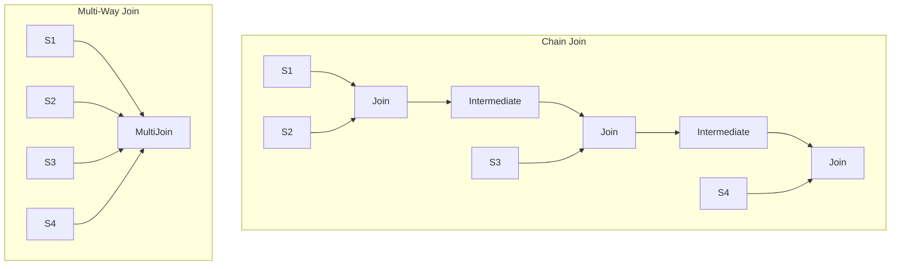

# Flink Multi-Way Join Optimization

> **Stage**: Flink Core | **Prerequisites**: [Delta Join](delta-join.md), [State Management](flink-state-management-complete-guide.md) | **Formal Level**: L4
>
> Optimizing multi-way stream joins to avoid state explosion from chained binary joins.

---

## 1. Definitions

**Def-F-02-67: Multi-Way Join**

$$
\text{MultiJoin}_{\theta}(S_1, S_2, \ldots, S_n) = \{(k, (v_1, v_2, \ldots, v_n), t_{max}) \mid \forall i: (k, v_i, t_i) \in S_i \land \theta(k, t_1, \ldots, t_n)\}
$$

**Def-F-02-68: Join Chain**

$$
\text{JoinChain} = S_1 \bowtie_{\theta_1} S_2 \bowtie_{\theta_2} \ldots \bowtie_{\theta_{n-1}} S_n
$$

**Def-F-02-69: State Inflation Factor**

$$
\eta = \frac{\sum_{i=1}^{n-1} |M_i|}{|\text{MultiJoin}_{\theta}(S_1, \ldots, S_n)|}
$$

---

## 2. Properties

**Lemma-F-02-33: State Complexity Reduction**

Chain join state: $\mathcal{O}_{chain} = \sum_{i=1}^{n-1} \mathcal{O}(|S_i| \times |S_{i+1}'|)$

Multi-way join state: $\mathcal{O}_{multi} = \mathcal{O}\left(\sum_{i=1}^{n} |S_i|\right)$

**Lemma-F-02-34: Latency Reduction**

Multi-way join eliminates intermediate serialization, reducing latency from $O(n)$ to $O(1)$ hops.

---

## 3. Relations

- **with StreamingMultiJoinOperator**: Flink 2.1+ native multi-way join operator.
- **with Query Optimizer**: Optimizer rewrites join orders to minimize state.

---

## 4. Argumentation

**Join Chain Problems**:

| Problem | Cause | Impact |
|---------|-------|--------|
| State inflation | Independent state per binary join | Exponential growth |
| Intermediate materialization | Join results written to downstream state | Redundant storage |
| Serialization overhead | Ser/de between operators | CPU-intensive |
| Latency accumulation | Multi-hop processing | Linear growth |

**Optimization Objective**:

$$
\min_{\mathcal{M}} \left( \alpha \cdot \text{Memory}(\mathcal{M}) + \beta \cdot \text{Latency}(\mathcal{M}) + \gamma \cdot \text{CPU}(\mathcal{M}) \right)
$$

---

## 5. Engineering Argument

**State Reduction Example**: For 4-way join with 1GB per stream:

- Chain join: $3 \times 1GB + 3 \times \text{intermediate} \approx 10$GB
- Multi-way join: $4 \times 1GB = 4$GB
- Reduction: 60%

---

## 6. Examples

```sql
-- Multi-way join in Flink SQL
SELECT
  o.order_id,
  c.customer_name,
  p.product_name,
  s.shipment_status
FROM orders o
JOIN customers c ON o.customer_id = c.id
JOIN products p ON o.product_id = p.id
JOIN shipments s ON o.order_id = s.order_id;
```

---

## 7. Visualizations

**Join Optimization Comparison**:



---

## 8. References
